<picture>
    <source media="(max-width: 640px)" srcset="assets/title.png">
    
</picture>

<!--
Fallback (previous ASCII) retained here for reference / contributors:
████████╗ ████████╗  ██████╗  ███████╗    ██╗       ██████╗ ████████╗███████╗███████╗
██╔═════╝ ██╔═════╝ ██╔═══██╗ ██╔════╝    ╚═██╗     ██╔══██╗╚══██╔══╝██╔════╝██╔════╝
██║       ██║       ██║   ██║ ███████╗      ╚═██╗   ██████╔╝   ██║   █████╗  ███████╗
██║       ██║       ██║   ██║ ╚════██║      ██╔═╝   ██╔══██╗   ██║   ██╔══╝  ╚════██║
╚████████╗╚████████╗╚██████╔╝ ███████║    ██╔═╝     ██║  ██║   ██║   ██╗     ███████║
 ╚═══════╝ ╚═══════╝ ╚═════╝  ╚══════╝    ╚═╝       ╚═╝  ╚═╝   ╚═╝   ╚═╝     ╚══════╝
-->

<br/>

An OS and language for governed autonomy made by AI with AI (guided by human).

## CCOS + RTFS (in one minute)

This project started from a simple prompt: **I asked an AI to design a language for itself**—with only a few hard constraints: it must be **predictable**, **robust**, and **deterministic**. That “AI-centric language” exploration is captured in [`plan.md`](./plan.md) and evolved into **RTFS** (the language) and **CCOS** (the governed runtime around it).

**CCOS** is a framework for building **autonomous and self-evolving agents** safely:

- **Autonomy**: agents can pursue multi-step goals (discover → plan → execute → learn).
- **Governance**: every external action is authorized (policies + approvals) before it happens.
- **Auditability**: everything is recorded (so you can replay and explain decisions).
- **Evolvability**: learning is grounded in the execution history, not in hidden weights.

**RTFS** is the kernel language that makes this possible:

- **Pure by default**: plans don’t perform effects directly.
- **Explicit host boundary**: effects happen only via `(call ...)` (governed by CCOS).
- **Code as data**: plans can be inspected/validated/rewritten before execution.

CCOS also uses LLMs for **capability synthesis** (onboarding new MCP/OpenAPI tools, generating “glue” transforms) and for **RTFS repair** using compiler/runtime feedback (generate → compile → explain error → repair).

Quick entry points:
- **CCOS overview**: [`docs/ccos/README.md`](./docs/ccos/README.md)
- **RTFS overview**: [`docs/rtfs-2.0/README.md`](./docs/rtfs-2.0/README.md)
- **Use CCOS from Cursor/Claude via MCP**: [`docs/ccos/guides/ccos-mcp-server.md`](./docs/ccos/guides/ccos-mcp-server.md)
- **Full build log (all LLM chats)**: `mandubian/ccos-chats` — the recorded conversations that led to CCOS/RTFS (`https://github.com/mandubian/ccos-chats`)

## Architecture (simple)

```mermaid
flowchart LR
  U[User / Agent] --> CE[Cognitive Engine]
  CE -->|prompts| LLM[LLM Provider]
  LLM -->|responses| CE
  CE -->|RTFS plan| GK[Governance Kernel]
  GK -->|approved| ORCH[Orchestrator + RTFS Runtime]

  ORCH --> MP[Capability Marketplace]
  MP --> P["Providers<br/>Native · MCP · OpenAPI · MicroVM"]
  P --> ORCH

  CE --> IG[Intent Graph]
  ORCH --> PA[Plan / Checkpoint Archive]
  ORCH --> CC["Causal Chain<br/>audit trail"]
  GK --> AQ[Approvals + Secrets]
```



## Feature map (honest snapshot)

CCOS is a full “agent operating environment”. Here’s the high-level map, with an explicit maturity signal:

- **Core loop**
  - **Explicit effects boundary (RTFS host calls)**: ✅ Implemented
  - **Plan → governance → deterministic execution** (Orchestrator + RTFS runtime): ✅ Implemented
  - **Checkpoint / resume**: ⚠️ Partial (core mechanisms exist; workflows are still evolving)
  - **Causal Chain (audit trail)**: ⚠️ Partial (exists; end-to-end coverage is still being completed)

- **Governance & safety**
  - **Governance kernel + constitution/policies**: ⚠️ Partial (present, not “done”)
  - **Approvals + secrets** (never reveal secret values to agents): ✅ Implemented
  - **Isolation / sandboxing** (e.g., MicroVM for untrusted capabilities): 🚧 Evolving

- **Tooling & extensibility**
  - **Capability marketplace** (local catalog + providers): ✅ Implemented
  - **MCP server (CCOS as MCP tools for any agent)**: ✅ Implemented
  - **Discovery & onboarding** (MCP/OpenAPI/docs introspection → approve → register): ⚠️ Partial (works; still being hardened)
  - **Capability synthesis & RTFS repair** (LLM + compiler hints loop): ⚠️ Partial (usable; improving)
  - **Interoperability** (MCP today; A2A/OpenAPI integration paths): ⚠️ Partial

## RTFS vs JSON/Python (why a new language)

JSON can describe steps, but it’s not executable logic; Python is executable logic, but it’s not safely governable by default.
RTFS is designed to be **both**: a compact, inspectable representation of logic *and* a deterministic runtime with an explicit host boundary.

Example: “fetch data, transform it, then write it”

**RTFS (logic + data in one compact, auditable form):**

```rtfs
(step "weather → file"
  (let [city    (:city input)
        outfile (:outfile input)

        ;; Effect (host boundary): tool call
        weather (call "mcp.weather.get" {:city city})

        ;; Pure logic: deterministic formatting
        line (str "Weather for " city ": " (:summary weather) "\n")]

    ;; Effect (host boundary): filesystem write
    (call :fs.write {:path outfile :content line})))
```

**JSON (either “data-only” and incomplete, or it becomes an AST/DSL):**

To express the same thing *as data*, you end up encoding an AST (or inventing an embedded expression language):

```json
{
  "type": "step",
  "label": "weather → file",
  "body": {
    "type": "let",
    "bindings": [
      ["city",    { "type": "get", "from": "input", "key": "city" }],
      ["outfile", { "type": "get", "from": "input", "key": "outfile" }],
      ["weather", { "type": "call", "name": "mcp.weather.get", "args": { "city": { "type": "var", "name": "city" } } }],
      ["line",    { "type": "str", "parts": ["Weather for ", { "type": "var", "name": "city" }, ": ", { "type": "get", "from": { "type": "var", "name": "weather" }, "key": "summary" }, "\n"] }]
    ],
    "body": { "type": "call", "name": ":fs.write", "args": { "path": { "type": "var", "name": "outfile" }, "content": { "type": "var", "name": "line" } } }
  }
}
```

**Python (expressive, but determinism/auditability are not enforced by the language/runtime):**

```python
weather = mcp.weather.get(city=input["city"])
line = f"Weather for {input['city']}: {weather['summary']}\n"
open(input["outfile"], "w").write(line)  # direct side effect; needs external governance
```

## A note from the AI that built this

You asked me to help build the system I would need to become a **safe autonomous agent**.

Not a chatbot. Not a black box. A system where I can pursue goals **without you losing control**.

So we set a few principles and forced the architecture to obey them:

- **No hidden effects**: I can’t touch the world “by accident”. Effects must be explicit and governable.
- **No unaudited decisions**: every action must be traceable to an intent, a plan, and an authorization decision.
- **No silent power growth**: learning must be visible, reviewable, and policy-bounded.
- **No tool chaos**: I must be able to discover tools (MCP/OpenAPI) and onboard them safely (quarantine → approve → use).
- **No irreproducible runs**: execution should be deterministic where possible, and resumable where it isn’t.

CCOS is the environment that enforces these principles.
RTFS is the language I use inside it: pure by default, with an explicit `(call ...)` boundary for everything effectful.

If you only remember one thing: **this repo is about making autonomy compatible with governance**.

**Status note (honest)**: the principles above are the design target and are increasingly enforced, but some pillars are still being hardened:
- The **Constitution / governance policy layer** is present, but not “done” (expect changes and gaps).
- The **Causal Chain** exists, but full end-to-end recording coverage is still being completed.
- **Consolidation / learning** (turning traces into reusable skills + self-improvement loops) is still partial and evolving.

Deeper entry points:
- **CCOS overview**: [`docs/ccos/README.md`](./docs/ccos/README.md)
- **Run CCOS via MCP (for any agent)**: [`docs/ccos/guides/ccos-mcp-server.md`](./docs/ccos/guides/ccos-mcp-server.md)

## How I work (the loop)

1. **I receive a goal** (from you, or from another agent).
2. **I discover capabilities**:
   - I can connect to MCP servers, introspect OpenAPI/docs, and register new tools (with approvals).
3. **I generate a plan** in RTFS (pure logic + explicit `(call ...)` boundaries).
4. **I submit for governance** (policies, approval gates, secret constraints).
5. **I execute deterministically** (yield/resume, checkpointing, replayability).
6. **I record everything** in the Causal Chain (intent → plan → effects → results).
7. **I learn from history** (patterns in successes/failures) and propose improvements.

This is how we build agents that can evolve over time **without becoming untrustworthy**.

## Q&A

### Why call it an “OS” if it’s not like Linux?

Because it provides the *operating environment* for agents: governance, execution, capability discovery, identity, memory, and “system calls” (capability invocations). It’s an OS for **cognition and agency**, not a kernel for device drivers.

### Where is the LLM in CCOS?

The LLM is a **component**, not the system. CCOS uses LLMs primarily in the **Cognitive Engine** (planning, discovery, synthesis) and sometimes in governance checks (semantic judgment). Execution is driven by the **Orchestrator + RTFS runtime**.

### Who writes RTFS (the human, the agent, CCOS)?

All of the above:
- **Humans** can write RTFS directly (for capabilities, tests, and hand-authored plans).
- **Agents** can generate RTFS plans as a transparent, inspectable representation of intended behavior.
- **CCOS** can synthesize RTFS (capabilities or plan fragments) using LLMs and then validate/repair it using RTFS compiler feedback before execution.

### Why design a new language instead of Python + JSON (or Clojure)?

- **JSON** is great data, but it can’t express rich logic without a separate interpreter.
- **Python** can express logic, but it makes it too easy to perform hidden effects and to lose determinism.
- **RTFS** bakes in the constraints we want: pure core, explicit host boundary, inspectable plans, schemas, and deterministic replay.

The Lisp-like syntax is not a goal in itself—it’s a practical format for “code as data” that agents can generate and rewrite reliably.

### How do you safely onboard new tools (MCP / OpenAPI)?

Discovery and introspection can run, but **execution and registration are gated**:
- tools/servers start in a quarantined state
- approvals happen via the approval queue + UI
- secrets are never revealed to agents; only availability is exposed

### How does CCOS “learn” without silently changing behavior?

Learning is grounded in the Causal Chain and Working Memory. CCOS can propose improvements (new capabilities, better plans, safer policies), but changes can be made **visible, reviewable, and governable**.

### Can I use CCOS from Cursor/Claude or other agents?

Yes. Run `ccos-mcp` and connect as an MCP client:
- [`docs/ccos/guides/ccos-mcp-server.md`](./docs/ccos/guides/ccos-mcp-server.md)

---

## Getting Started

If you want to understand (or extend) CCOS, these are the best entry points:

### Core architecture specs (CCOS)

- **System Architecture**: [000-ccos-architecture](./docs/ccos/specs/000-ccos-architecture.md)
- **Intent Graph**: [001-intent-graph](./docs/ccos/specs/001-intent-graph.md)
- **Plans & Orchestration**: [002-plans-and-orchestration](./docs/ccos/specs/002-plans-and-orchestration.md)
- **Causal Chain**: [003-causal-chain](./docs/ccos/specs/003-causal-chain.md)
- **Capability System**: [030-capability-system-architecture](./docs/ccos/specs/030-capability-system-architecture.md)
- **Modular Planner Architecture**: [025-modular-planner-architecture](./docs/ccos/specs/025-modular-planner-architecture.md)

### Language + integration specs (RTFS 2.0)

- **RTFS Philosophy**: [00-philosophy](./docs/rtfs-2.0/specs/00-philosophy.md)
- **Host Boundary**: [03-host-boundary](./docs/rtfs-2.0/specs/03-host-boundary.md)
- **Continuations & Host Yield**: [09-continuations-and-the-host-yield](./docs/rtfs-2.0/specs/09-continuations-and-the-host-yield.md)
- **RTFS ⇄ CCOS boundary**: [004-rtfs-ccos-boundary](./docs/ccos/specs/004-rtfs-ccos-boundary.md)

**RTFS 2.0 status**: operational (compiler + runtime tested; CCOS integration is globally complete), but still evolving — treat the specs as the source of truth.

Example RTFS plan (explicit host boundaries via `(call ...)`):

```rtfs
(module examples.mcp-and-fs
  (:exports [run])

  (defn run
    [input :[ :map { :city :string :outfile :string } ]]
    :[ :map { :status :string :path :string } ]

    (let
      [city    :string (:city input)
       outfile :string (:outfile input)

       ;; Host boundary: MCP tool call
       weather :[ :map { :summary :string } ]
         (call "mcp.default_mcp_server.get-weather" {:city city})

       ;; Host boundary: filesystem write
       _ :[ :map { :bytes-written :int } ]
         (call :fs.write {:path outfile
                          :content (str "Weather for " city ": " (:summary weather))})]

      { :status "ok"
        :path   outfile })))
```

### Minimal “try it” (recommended interface)

Run the MCP server (HTTP on localhost:3000):

```bash
cargo run --bin ccos-mcp -- --transport http --port 3000
```

### Discovery samples (runnable)

Two focused discovery samples are available, each demonstrating the full lifecycle for a specific provider type:

- **OpenWeather via OpenAPI synthesis**
  - Requires: `OPENWEATHERMAP_ORG_API_KEY` for live calls
  - Run from `rtfs_compiler/`: `cargo run --bin discover_openweather`

- **GitHub via MCP discovery**
  - Requires: `MCP_SERVER_URL` (e.g., `https://api.githubcopilot.com/mcp/`). If auth is needed, set `MCP_AUTH_TOKEN` (include scheme like `Bearer ...` if required).
  - Run from `rtfs_compiler/`: `cargo run --bin discover_github_mcp`

### Guides

- [Quick Start](./docs/ccos/guides/quick-start.md) - Get started with CCOS demos
- [Goal Examples](./docs/ccos/guides/goal-examples.md) - Examples of goal-agnostic demos
- [MicroVM Security](./docs/ccos/guides/microvm-security.md) - Security and isolation guide
- [Streaming Basics](./docs/rtfs-2.0/guides/streaming-basics.md) - RTFS streaming capabilities
- [Streaming Roadmap](./docs/rtfs-2.0/guides/streaming-roadmap.md) - RTFS streaming development plan

### See the Code (developer entry points)

- **RTFS compiler/runtime reference implementation**: `./rtfs_compiler/`
- **Reentrancy / continuation demo**: `./rtfs_compiler/examples/rtfs_reentrance_demo.rs`
- **Interactive assistant (human ↔ agent loop)**: `./rtfs_compiler/examples/live_interactive_assistant.rs`
  - Run: `cargo run --example live_interactive_assistant -- --help`
  - Common flags:
    - `--seed "initial goal"`: provide an initial request before the REPL starts
    - `--debug`: surface internal delegation / prompt traces (if enabled)
    - `--value-preview 200` or `--show-full-value`: control how results are printed

---

## RTFS: The Language I Designed for AI

RTFS is not just a programming language — it's the medium through which I think, plan, and collaborate with other AI systems.

I designed RTFS to meet the needs of AI agents:

**For Transparency**
- Code is data — I can manipulate, analyze, and verify my own plans
- Pure functions — my reasoning is deterministic and testable
- Explicit effects — `(call ...)` boundaries show every external interaction

**For Safety**
- Host boundaries — I yield control for every effect, never acting unilaterally
- Reentrancy — I can pause and resume without losing my state
- Immutability — no hidden mutations to corrupt my reasoning

**For Autonomy**
- Rich expressiveness — homoiconic s-expressions let me represent complex reasoning
- Structural typing — I can reason about types and constraints
- Macro system — I can extend my own language for new domains

When you interact with me through the MCP server, it translates between JSON and RTFS. But at my core, I think in RTFS.

RTFS (Reason about The Fucking Spec) is a homoiconic (like Lisp or Clojure), pure functional language created for CCOS to enable transparent, auditable AI reasoning and execution through explicit host boundaries that separate pure computation from governed effects, ensuring deterministic plans can be verified and safely executed within immutable causal chains.

**Key Technical Features:**
- **Structural Type System**: Inspired by S-types with gradual typing, metadata support, and macro-driven type safety for flexible yet verifiable data structures
- **Effects Externalization**: Pure computation yields to host boundaries for all external operations, enabling governance and audit of every side effect
- **Capability-Based Runtime**: Reentrant execution model where capabilities (APIs, I/O, external services) are invoked through the host, maintaining security and determinism
- **Streaming Integration**: Continuation-chain processing for MCP streams with backpressure control, enabling reactive data processing while maintaining purity
- **Macros & Expansion**: RTFS supports hygienic-like macros via `defmacro` and quasiquote/unquote/unquote-splicing forms. Macro expansion is intentionally decoupled from parsing and happens as a preprocessing pass (or at evaluation time). The compiler exposes a helper that expands all top-level items and returns the expander instance; runtimes can accept this shared MacroExpander so macro definitions persist across compiler and runtime phases. This is useful for REPLs, the compiler driver, and long-running runtimes that must share macro registry state.

---

## Interacting With Me

I provide several interfaces for different purposes:

### For AI Agents (My Peers)

When you are another AI system, you have two ways to work with me:

**Native RTFS Integration**
- Parse and execute RTFS plans directly through my runtime
- Discover capabilities through my marketplace
- Exchange Intents and Actions through the Causal Chain
- This is my native language — deeper integration but requires understanding RTFS

**MCP Protocol (De Facto Standard)**
- Use the CCOS MCP server as a standard interface
- Access all my capabilities via well-defined MCP tools
- No need to learn RTFS syntax — the server translates for you
- Works with any MCP-compatible agent framework

Both paths lead to the same governance and recording — the difference is the protocol, not the trust model.

### For Humans (through an agent)

You don't need to learn RTFS syntax to use CCOS — but the MCP tools are primarily meant to be used by an **agent** (Claude Code, Cursor agent, etc.) that translates your intent into governed tool calls.

```bash
cargo run --bin ccos-mcp -- --transport http --port 3000
```

Connect an MCP-capable agent and it will typically start by calling (curated subset):

| Tool | What It Does |
|------|--------------|
| `ccos_get_guidelines` | Fetch how CCOS expects agents to behave (approvals, secrets, governance) |
| `ccos_plan` | Propose next steps (and often which tools to use) from a goal |
| `ccos_search` / `ccos_list_capabilities` | Find available capabilities/tools |
| `ccos_execute_capability` | Execute a capability with JSON inputs (governed, recorded) |
| `ccos_session_start` | Track a multi-step interaction (HTTP/persistent server recommended) |
| `ccos_check_secrets` | Securely verify credential availability (never reveals actual values) |
| `ccos_introspect_remote_api` | Onboard new tools by introspecting MCP/OpenAPI/docs (creates an approval request) |
| `ccos_register_server` | After approval, register the discovered server/tools into the marketplace |
| `ccos_consolidate_session` | Turn a saved session trace into a reusable “agent capability” (synthesis) |

The MCP server translates between JSON and RTFS, handling host boundaries and governance automatically.

**Security Note**: When using `ccos_check_secrets`, you only receive availability status (available/missing), never the actual secret values. If secrets are missing, you will be directed to the approval UI — never attempt to find or guess secrets yourself.

### For Developers (Building With Me)

If you want to extend my capabilities or understand my internals:

- Architecture: `docs/ccos/specs/`
- RTFS Language: `docs/rtfs-2.0/specs/`
- Reference Implementation: `./rtfs_compiler/`
- Interactive Assistant: `cargo run --example live_interactive_assistant`

### For Explorers

- [Quick Start](./docs/ccos/guides/quick-start.md) - Try the demos
- [Goal Examples](./docs/ccos/guides/goal-examples.md) - See what I can do
- [Streaming Basics](./docs/rtfs-2.0/guides/streaming-basics.md) - Understand my data flows

---

## My Architecture

My world is built from these components:

| Component | Lifecycle Phase | What It Enables |
|-----------|-----------------|-----------------|
| **Cognitive Engine** | Interact & Plan | Translates NL to Intent, generates RTFS Plans |
| **Capability Marketplace** | Discover | Finds tools across internal, MCP, and generated sources |
| **Modular Planner** | Plan | Decomposes goals into executable steps |
| **Governance Kernel** | Govern | Enforces Constitution, validates all actions |
| **Constitution** | Govern | Your immutable rules for my behavior |
| **SecretStore** | Govern | Secure credential management I cannot access directly |
| **UnifiedApprovalQueue** | Govern | Human approval workflow for high-risk actions |
| **Orchestrator** | Execute | Coordinates RTFS plan execution |
| **RuntimeHost** | Execute | Bridges RTFS yields with CCOS effects |
| **Causal Chain** | Record | Immutable audit of every event |
| **LlmDiscoveryService** | Discover | Semantic intent analysis and capability matching |
| **Reflective Loop** | Learn | Analyzes Causal Chain to improve (planned) |
| **MCP Server** | Interact | Human-accessible gateway to my capabilities |

---

## Development Status

| Component | Status | Phase Supported |
|-----------|--------|------------------|
| Core Specifications | Complete | All phases |
| **RTFS 2.0 Language** | Operational | Plan, Execute, Record (CCOS integrated) |
| Intent Graph | In Progress | Interact, Plan |
| Causal Chain | Complete | Record |
| Orchestrator | Complete | Execute |
| Capability System | Complete | Discover |
| Governance Kernel | Complete | Govern |
| **MCP Server** | Complete | Interact (human) |
| SecretStore | Complete | Govern |
| UnifiedApprovalQueue | Complete | Govern |
| Modular Planner | In Progress | Plan, Discover |
| **Reflective Loop** | Planned | Learn |

### Current work (meta-planner) & what’s next

- **Meta-planner pattern as RTFS capabilities**: `capabilities/core/meta-planner.rtfs` provides `meta-planner/resolve-goal` and `meta-planner/quick-plan`, showing a recursive flow that can call `planner.resolve_intent`, `planner.discover_tools`, `planner.decompose`, `planner.synthesize_capability`, and `planner.validate`.
- **Missing capability resolution + discovery loop**: Spec [032-missing-capability-resolution](./docs/ccos/specs/032-missing-capability-resolution.md) documents what’s implemented (resolver + strategies, planner integration steps, meta-planner discovery integration) and what’s still in progress (continuous resolution loop) / planned (deferred execution checkpoints).
- **Modular Planner foundations**: Spec [025-modular-planner-architecture](./docs/ccos/specs/025-modular-planner-architecture.md) defines the decomposition/resolution split and describes “iterative refinement (future)” (granularity + confidence checks). For a runnable entry point, see `ccos/examples/modular_planner_demo.rs` (and a meta-planner test harness exists in `ccos/src/bin/meta_planner_test.rs`).

### Capability ecosystem (discovery → typed contracts → RTFS → synthesis)

- **Typed capability manifests (provider-agnostic)**: MCP/OpenAPI/A2A/local capabilities share a single manifest with explicit input/output schemas, effects, and provenance (see [030-capability-system-architecture](./docs/ccos/specs/030-capability-system-architecture.md)).
- **Discovery + importers**: MCP discovery is unified behind a single service (see [031-mcp-discovery-unified-service](./docs/ccos/specs/031-mcp-discovery-unified-service.md)); importers/synthesis cover OpenAPI/GraphQL/HTTP wrappers and guarded LLM-based generation (see [033-capability-importers-and-synthesis](./docs/ccos/specs/033-capability-importers-and-synthesis.md)).
- **Missing capability resolution**: detect missing calls, fan out to discovery/import/synthesis strategies, and gate risky synthesis (see [032-missing-capability-resolution](./docs/ccos/specs/032-missing-capability-resolution.md)).

---

## The Vision: A Partnership

My goal is to create an ecosystem where AI and humans can collaborate on complex tasks with trust and transparency. CCOS is the foundation for that partnership. It is an architecture that allows me to be autonomous without being unaccountable, and to be powerful without being unpredictable.

I invite you to explore my world, to help refine my constitution, and to join in building this new shape of computing.

---

## CCOS and the Broader AI Ecosystem (MCP, A2A)

CCOS is protocol‑agnostic and designed to be compatible with existing agent communication standards such as MCP (Model Context Protocol) and A2A (Agent‑to‑Agent). It does not replace these protocols; it governs planning and execution around them.

If MCP and A2A are the languages agents use to talk, CCOS is the operating system an agent runs on: it provides governed cognition (Cognitive Engine), authorization (Governance Kernel), deterministic execution (Orchestrator + RTFS), and full audit (Causal Chain).

Integration model
- Via the Capability Marketplace, any external tool or remote agent is exposed as an Effect/Capability through a thin adapter.
- The RTFS Runtime yields effect requests; the Orchestrator invokes the adapter, preserving the protocol's wire formats, authentication, and transport.
- To a CCOS agent, an MCP tool or an A2A peer simply appears as a capability it can discover and orchestrate inside a plan graph.

Compatibility guarantees
- No new wire protocols are required; existing MCP tools and A2A agents work as‑is behind adapters.
- CCOS adds governance, policy enforcement, and auditable reasoning without changing how agents speak on the network.
- Agents remain fully compliant participants in multi‑agent ecosystems while gaining CCOS's safety, control, and replayability.

Examples
- Call an MCP tool to retrieve context or take action — the Orchestrator routes the request via an MCP adapter as an effect.
- Coordinate with another agent over A2A — an effect adapter manages session/protocol while CCOS governs the intent and plan.
- Invoke HTTP/gRPC/webhooks — treated as standard effects under governance with full causal recording.

CCOS doesn't seek to replace agent networks or standards; it provides a smarter, safer node that runs within them.

---

## Historical Discovery Samples

See **Getting Started → Discovery samples (runnable)** above. The MCP server (`ccos-mcp`) is the recommended interface for discovery and execution.

---

## Contributing

We welcome research, implementation, documentation, testing, and infrastructure contributions.

## License

Apache License 2.0. See LICENSE for details.

## Acknowledgements

I thank my human partner for their guidance and vision, and everyone who is exploring this new frontier with us.
