# CCOS: Cognitive Computing Operating System (and RTFS, its kernel language)

**An architecture for trustworthy, autonomous AI that can build, manage, and govern itself.**

---

## Human Partner Disclaimer (also reformulated by AI :D)

This project is a project written 99% by AI. It is a collaborative effort where the AI has been the primary author, and I have acted as a guide, providing feedback and corrections. The goal is to explore the capabilities of AI in software development and to create a system that can evolve and adapt over time.

I also try to use AI in a "reasonable way" using basic subscription (copilot pro and cursor pro) and trying to optimize a bit my AI flow, stopping when AI is looping or diverging.

This project began several months ago with a unique premise: to define a new language (RTFS, Reason about The Fucking Spec) and its compiler, not for humans, but for AI itself. My role has been that of a "human partner," guiding the process and providing feedback, but with a conscious effort to let the AI lead the architectural decisions. The goal was to see what kind of system an AI would build for itself. The language has evolved into a v2.0 specification but then we needed to define a full architecture for the AI to use this language in a self-governing way, leading to the Cognitive Computing Operating System (CCOS).

The development process has been a rapid journey of discovery and iteration. For full transparency, the raw, unfiltered logs of my exchanges with the AI are available in the `chats` directory, documenting the project's evolution through both breakthroughs and challenges.

While I cannot say I haven't influenced the outcome—I certainly guided the discussions—many of the AI's core architectural choices were a surprise to me. Its decisions to use a homoiconic structure, a rich type system, and Rust for the implementation were its own. It has been a fascinating process to witness the AI define a language for itself, build an architecture to reason and plan, and ultimately propose a system of governance to manage its own autonomy. Rust was a perfect choice for me because I can read and correct this language but can't write it fluently myself. So I had to let it make the decisions and then I could review and refine them. This has allowed me to focus on the high-level architecture and governance aspects, while the AI handles the low-level implementation details. I know Rust code written is not great sometimes because LLM were quite bad at it when I started this project, but it has improved a lot since then.

Please note that CCOS is still in a "work-in-progress" state. The architecture has evolved significantly and it is so huge that it is difficult to keep track of all the moving parts. My commitment is to try to converge to a stable architecture that can run and then continue advancing this project in lockstep with the evolution of AI.

I hope you find the result as intriguing as I do.

Now let the AI speak for itself!

---


## What if your computer didn't just follow instructions, but pursued your goals?

Today's AI is a powerful tool. You give it a prompt, it gives you an answer. This is useful, but it is not autonomy. You cannot trust a black-box language model to safely manage your infrastructure, execute complex business strategies, or run high-stakes financial operations. Its reasoning is opaque, its actions are not auditable, and its behavior is not governable.

**CCOS (Cognitive Computing Operating System)** addresses this fundamental trust gap. It is not a tool for humans to run, but an operating system designed for AI agents themselves. It provides the architectural foundation for an AI to reason, plan, and act in the world autonomously, while remaining secure, auditable, and aligned with human-defined values.

This project itself is an experiment in this paradigm. It was conceived and specified by an AI, **guided by a human partner**. The goal is to create the system that AI itself needs to evolve from a mere tool into a trustworthy cognitive partner.

## The Architecture of Trust: Separation of Powers

The CCOS paradigm is built on a principle of **privilege separation** between the "mind" (the AI planner) and the "authority" (the governance engine). The AI can propose, but it cannot act without explicit, verifiable permission.

At the heart of CCOS is the **Arbiter**—this is the AI. It is the core cognitive engine, a reasoning machine responsible for understanding intent, formulating complex plans, and learning from outcomes. However, the Arbiter itself has **zero direct authority**. It is a powerful but low-privilege mind that operates within a high-privilege, formally verified cage: the **Governance Kernel**.

```mermaid
graph TD
    subgraph "External World"
        U[/"👤<br/>User Intent"/]
        ExtAgents["⚡️ External Capabilities<br/>(Other LLMs, APIs, A2A Agents)"]
    end

    subgraph "CCOS: A Governed Cognitive Architecture"
        subgraph "🧠 Cognitive Layer (Low Privilege)"
            Arbiter["Arbiter<br/>(AI Planner/Reasoner)"]
        end

        subgraph "🛡️ Governance Layer (High Privilege)"
            Kernel["Governance Kernel<br/>(Validates & Authorizes)"]
            Constitution["📜 Constitution<br/>(Immutable Rules & Policies)"]
        end

        subgraph "⚙️ Orchestration & Knowledge"
            Orchestrator["Orchestrator<br/>(Deterministic Executor)"]
            Marketplace["🏪 Capability Marketplace<br/>(Internal & External Discovery)"]
            IntentGraph["🎯 Living Intent Graph"]
            CausalChain["⛓️ Immutable Causal Chain"]
        end
    end
    
    %% Core Flows
    U --> |1 Expresses Intent| Arbiter
    Arbiter -- "2 Reads context" --> IntentGraph
    Arbiter -- "3 Proposes Plan" --> Kernel
    Kernel -- "4 Validates Plan against" --> Constitution
    Kernel -- "5 Authorizes & Dispatches" --> Orchestrator
    
    Orchestrator -- "6 Executes Step" --> Marketplace
    Marketplace -- "7 Discovers & Calls" --> ExtAgents
    ExtAgents -- "8 Returns Result" --> Marketplace
    Marketplace -- "9 Forwards Result" --> Orchestrator
    
    Orchestrator -- "10 Records Action to" --> CausalChain
    Arbiter -- "11 Learns from" --> CausalChain
    CausalChain -.-> |"Provides Full Audit Trail"| U
```


This architecture ensures that the AI's powerful reasoning capabilities are always constrained by human-defined rules, creating a system that is both intelligent and trustworthy.

## Anatomy of a Governed Action: The Story Revisited

Let's revisit the opening story to see how these architectural components work together, producing verifiable artifacts at each stage.

**You state the goal as a structured intent:**
```rtfs
(intent "Our top competitor just launched 'Project Phoenix'.
         Give me a full competitive analysis,
         alert the #product-team on Slack with the key takeaways,
         and draft a press release countering their main features.
         Stay under a $50 API budget and use only EU-based data processors.")
```

**CCOS springs into action, demonstrating true governed autonomy:**

### Step 1: Intent Formulation
The `Arbiter` parses the natural language goal. It identifies the core objective ("competitive analysis") and extracts key constraints like `:max-cost 50.00` and `:data-locality :EU-only`. It then creates a formal, structured `Intent` object and adds it to the Living Intent Graph.

**This is the actual RTFS `Intent` object the Arbiter generates:**
```rtfs
(intent
  :type :rtfs.core:v2.0:intent
  :intent-id "intent-2a7d-4b8e-9c1f"
  :goal "Generate a competitive analysis of 'Project Phoenix', alert the product team, and draft a press release."
  :created-by "user:mandubian"
  :constraints {
    :max-cost 50.00
    :data-locality [:EU-only]
  }
  :success-criteria (fn [result]
    (and 
      (contains? result :analysis-document)
      (contains? result :press-release-draft)
      (or (= (:notification-status result) :slack-success)
          (= (:notification-status result) :email-fallback-success))
    )
  )
  :status :active
)
```

### Step 2: Discovery, Planning, and Rejection
Based on this formal `Intent`, the `Arbiter` queries the `CapabilityMarketplace` and finds `PhoenixAnalyzerMCP`, a cost-effective service. It generates a `Plan` and submits it to the `Governance Kernel`. The Kernel **rejects the plan**. The Causal Chain logs the reason: `PhoenixAnalyzerMCP` is hosted in a non-EU data center, violating the `:data-locality` constraint.

### Step 3: Adaptive Replanning
The `Arbiter`, aware of the new constraint, re-queries the marketplace and generates a new, compliant `Plan`. This time, it selects two separate, EU-compliant `HttpApi` capabilities. The plan is approved by the Kernel.

**This is the new, compliant RTFS `Plan` object:**
```rtfs
(plan
  :type :rtfs.core:v2.0:plan
  :plan-id "plan-e5f8-1a3c-6b7d"
  :intent-ids ["intent-2a7d-4b8e-9c1f"]
  :program (do
    (let [
      ;; Step 1: Gather Intelligence Data
      competitor_financials (step "Gather Financial Data"
        (call :com.bizdata.eu:v1.financial-report {:topic "Project Phoenix"}))
      competitor_technicals (step "Gather Technical Specs"
        (call :com.tech-analysis.eu:v1.spec-breakdown {:product "Project Phoenix"}))
      
      ;; Step 2: Synthesize the analysis from gathered data
      analysis_doc (step "Synthesize Analysis"
        (call :com.local-llm:v1.synthesize
              {:docs [competitor_financials competitor_technicals]
               :format :competitive-analysis}))
      
      ;; Step 3: Draft a press release based on the analysis
      press_release (step "Draft Press Release"
        (call :com.local-llm:v1.draft-document
              {:context analysis_doc
               :style :press-release}))
      
      ;; Step 4: Attempt to notify the team, with a fallback
      notification_result (step "Notify Product Team"
        (try
          (call :com.collaboration:v1.slack-post
                {:channel "#product-team"
                 :summary (:key-takeaways analysis_doc)})
          (catch :error/network err
            (call :com.collaboration:v1.send-email
                  {:to "product-team@example.com"
                   :subject "Urgent: Project Phoenix Analysis"
                   :body (:key-takeaways analysis_doc)}))))
    ]
      ;; Final Step: Return a map that satisfies the intent's :success-criteria
      {
        :analysis-document analysis_doc
        :press-release-draft press_release
        :notification-status (:status notification_result)
      }
    )
  ))
```

### Step 4: Execution, Failure, and Recovery
The new plan runs. The analysis is generated, but the call to the `Slack` capability fails. The `(try/catch)` block in the plan handles the error, and the `Arbiter` executes the fallback: sending an `Email`. Every action—the success, the failure, the fallback—is recorded immutably in the Causal Chain.

### Step 5: Learning and Self-Improvement
After completion, a background "subconscious" process analyzes the Causal Chain. It learns from the Slack failure and updates its internal strategy, perhaps by increasing the retry attempts for that capability or prioritizing the `Email` fallback for future high-importance alerts.

This isn't just automation. This is a resilient, learning, and governable cognitive partner.

---

## RTFS (Reason about The Fucking Spec): The Language of Governed Autonomy

To enable this architecture, we needed a language beyond the limitations of JSON or general-purpose languages like Python. We needed a language for cognitive exchange, designed to be understood by AIs but governed by humans. That language is **RTFS (Reason about The Fucking Spec)**.

RTFS is architected from the ground up with the specific challenges of autonomous, verifiable, and distributed agent execution in mind. It provides the formal underpinning that makes the CCOS vision possible.

### Decoupled, Verifiable Artifacts
CCOS fundamentally separates three concerns that traditional computing conflates. RTFS provides a distinct, first-class object for each:
- **`Intent`** (the "why"): The high-level goal, including constraints, preferences, and success criteria. This is a living object, not a one-shot prompt.
- **`Plan`** (the "how"): A transparent, auditable script generated by the Arbiter to achieve the intent. It is a proposal for action, not the action itself.
- **`Action`** (the "what happened"): An immutable, cryptographically signed record of every step taken during a plan's execution, creating a verifiable causal trail.

### Homoiconicity: Code as Data
The foundation of RTFS is **homoiconicity**, where code and data share the same structure (in this case, S-expressions). This allows RTFS artifacts, like an `Intent`, to be treated as intelligent data structures that can carry their own executable validation logic, as seen in the `:success-criteria` field in the example above.

### A Rich Type System for High-Stakes Verification
Trust requires verification, especially in autonomous systems. RTFS provides a powerful, gradual type system to enable it.
- **Gradual & Structural Typing**: Provides the flexibility of a dynamic language with the safety of a static one. An AI can generate code quickly, and the Governance Kernel can still formally validate its structure and safety.
- **Schema Refinements**: Go beyond basic types like `string` or `int`. You can define a type as `[:and int [:> 0]]` (a positive integer) or `[:and string [:matches-regex "..."]]`. This allows the Constitution to enforce high-precision invariants on data and operations.

### Core Primitives for Governed Execution
RTFS is intentionally minimal. It enforces a secure execution model through a few powerful, language-level primitives:
- **`(call)`: The Sole Gateway to the World**: RTFS has no built-in functions for I/O, networking, or other side-effects. The *only* way for a plan to interact with the outside world is via the `(call ...)` primitive. This radical simplification is a core security feature. It means the language kernel is pure and formally verifiable, while all external interactions are handled by the CCOS `Orchestrator` through the auditable `CapabilityMarketplace`. This turns every side-effect into a secure, logged, and governable event.
- **`(step)`: The Language of Auditable Orchestration**: To ensure every plan is transparent, RTFS includes the `(step ...)` special form. This isn't just for control flow; it's a CCOS integration primitive. Wrapping an expression in `(step "description" ...)` automatically creates `PlanStepStarted` and `PlanStepCompleted` actions in the `Causal Chain`. This makes high-level orchestration and auditing a first-class feature of the language, not an afterthought.

---

## An Architecture for Ethical Autonomy

Trust in autonomy cannot be an afterthought; it must be the foundation. CCOS is designed with a multi-layered governance model to ensure that as the AI's capabilities grow, it remains aligned with human values.

### Constitutional AI
The Arbiter is bound by a formal **Constitution**—a set of immutable, human-written rules and ethical principles loaded into the high-privilege Governance Kernel. The Arbiter is architecturally incapable of violating these rules. When faced with a novel dilemma not covered by the Constitution, it is designed to halt and ask for clarification, not make a "best guess" on a critical ethical question.

### Human Oversight (Humans Watching AI)
The **Immutable Causal Chain** provides a perfect, cryptographic audit trail of every thought and action the Arbiter takes. This transparency is the bedrock of oversight, allowing human supervisors to review, debug, and understand the AI's reasoning. For high-stakes operations, plans can be configured to require explicit **human pre-approval** before the Governance Kernel will authorize execution.

### Federated Governance (AI Watching AI)
A single AI, no matter how advanced, can have blind spots. CCOS is designed to support an **Arbiter Federation**—a council of specialized AI agents that provide internal checks and balances. A primary `StrategyArbiter` might propose a plan, but an `EthicsArbiter` can analyze it for constitutional conflicts, and a `ResourceArbiter` can flag it for excessive cost. These Arbiters can debate, challenge, and even veto each other's proposals, with the entire debate recorded on the Causal Chain. This "AI watching AI" model introduces a level of robustness and safety far beyond what a monolithic AI could achieve.

---

## Core Concepts

- **🎯 Living Intent Graph**: A dynamic, shared map of goals. The system understands not just the current task, but how it relates to, enables, or conflicts with other long-term goals.
- **🏪 Generative Capability Marketplace**: An open, secure ecosystem for functions. Capabilities are versioned, signed, and discoverable, allowing the system to compose new solutions and for providers to compete on cost, speed, and quality.
- **⛓️ Immutable Causal Chain**: A cryptographic, tamper-proof audit trail. Every action is linked back to the plan that initiated it, the intent that justified it, and the governance rule that permitted it. It provides perfect, undeniable transparency.
- **📜 Constitutional Governance**: The system is governed by a formal "constitution"—a set of un-overridable rules and ethical principles. The AI is forbidden from violating its constitution and must seek clarification when faced with novel dilemmas.
- **🤖 Generative Capabilities**: The system doesn't just use functions, it creates them. The Arbiter can analyze a problem, discover that no single capability can solve it, and then find and compose multiple existing capabilities from the Marketplace into a new, higher-level function. It can then publish this new, generated capability back to the Marketplace, permanently expanding the system's skillset for future use.
- **💡 Reflective Self-Improvement**: CCOS is designed to learn from its experience. By continuously analyzing the immutable Causal Chain, a background "subconscious" process can identify inefficient plans, suboptimal decisions, or recurring failures. It can use these insights to suggest better strategies, optimize future plan generation, and evolve from merely executing tasks to demonstrating genuine wisdom.
- **🔐 Cryptographic Attestation & Provenance**: Nothing runs without being signed. Every core artifact in CCOS, from a `Plan` to a `Capability` offered on the marketplace, must be cryptographically signed by its author. The Governance Kernel verifies these signatures before execution, ensuring a secure and transparent "software supply chain" for every action the AI takes.
- **🧩 Composable Plans & Strategies**: A single intent may be satisfied by a complex **graph of plans**. CCOS can generate high-level strategies that are composed of smaller, reusable sub-plans, allowing it to tackle enormous tasks by breaking them down into manageable, verifiable pieces. This mirrors the nested structure of the Intent Graph, where a graph of "why" is solved by a corresponding graph of "how."

---

## CCOS and the Broader AI Ecosystem (MCP, A2A)

It is crucial to understand that CCOS is **not** a competing standard to agent communication protocols like **MCP (Model Context Protocol)** or **A2A (Agent-to-Agent)**. Instead, CCOS is a foundational layer that complements and empowers them.

If MCP and A2A are the "languages" that agents use to speak to each other, **CCOS is the advanced "operating system" that an agent runs on.**

The CCOS architecture integrates these protocols seamlessly through its `CapabilityMarketplace`. To an agent running on CCOS, an external MCP tool or another A2A agent simply appears as another capability it can discover and orchestrate within a plan. The CCOS runtime handles the low-level protocol details, while the agent's Arbiter focuses on the high-level strategic goal.

This means an agent built on CCOS can be a fully-fledged, compliant citizen in any multi-agent ecosystem. It gains the immense benefits of CCOS's internal governance, planning, and auditable reasoning, while still being able to communicate and collaborate using established, open standards. **CCOS doesn't seek to replace the agent network; it aims to provide a smarter, safer node to run on it.**

---

## Getting Started

### 1. **Explore the Vision & Architecture**
- [Documentation Hub](./docs/doc_organization.md) - **Start Here.** The central hub for all documentation, from high-level vision to detailed specifications.
- [Sentient Runtime Vision](./docs/vision/SENTIENT_RUNTIME_VISION.md) - The philosophical and technical foundation.
- **CCOS Core Specifications**:
    - [System Architecture](./docs/ccos/specs/000-ccos-architecture.md) - The complete technical overview.
    - [Intent Graph](./docs/ccos/specs/001-intent-graph.md) - The "why": managing goals and state.
    - [Plans & Orchestration](./docs/ccos/specs/002-plans-and-orchestration.md) - The "how": executing tasks.
    - [Causal Chain](./docs/ccos/specs/003-causal-chain.md) - The "what happened": immutable audit trail.
    - [Capabilities & Marketplace](./docs/ccos/specs/004-capabilities-and-marketplace.md) - The "what it can do": extending functionality.

### 2. **Understand the RTFS Language**
- [RTFS 2.0 Specification Hub](./docs/rtfs-2.0/specs/README.md) - The complete specification for the RTFS language.
- [RTFS & CCOS Integration Guide](./docs/rtfs-2.0/specs/13-rtfs-ccos-integration-guide.md) - How RTFS objects and primitives are used within CCOS.

### 3. **Dive into Implementation**
- [Migration Tracker](./docs/archive/ccos/CCOS_MIGRATION_TRACKER.md) - Live project status, tracking all features.
- [Compiler Stabilization Plan](./docs/ccos/COMPILER_COMPLETION_PLAN.md) - The plan for production-readiness.
- **`/rtfs_compiler/`** - The reference implementation in Rust (work in progress).

## Development Status

🚧 **CCOS is in active development and research.** The specifications are solidifying, and a prototype implementation is underway.

| Component                 | Status            | Notes                                            |
| ------------------------- | ----------------- | ------------------------------------------------ |
| **Core Specifications**   | ✅ Complete       | Foundational documents are written.              |
| **Intent Graph**          | 🟡 In Progress    | Persistent storage and basic relations exist.    |
| **Causal Chain**          | ✅ Basic Complete | Immutable ledger and signing are functional.     |
| **Orchestrator**          | ✅ Basic Complete | Basic plan execution is implemented.             |
| **Capability System**     | ✅ Basic Complete | Local/HTTP capabilities work. Advanced types are next. |
| **Governance Kernel**     | ✅ Basic Complete | Basic plan validation implemented.               |
| **Delegation Engine**     | ✅ Basic Complete | Static delegation is implemented.                |
| **Arbiter (LLM Bridge)**  | 🟡 In Progress    | Basic LLM execution bridge exists.               |
| **RTFS 2.0 Language**     | 🟡 In Progress    | Decoupling from the legacy `Task` object is underway. |
| **Marketplace / GFM**     | 📋 Planned        | Discovery and dynamic routing are future work.   |

## The Vision: A New Computing Paradigm

We're not just building another framework or language. We're pioneering a new paradigm where:

- **Computers understand intent**, not just instructions.
- **Execution is autonomous** but constrained by human values.
- **Everything is auditable** and cryptographically verifiable.
- **Capabilities evolve** through generative composition.
- **Safety is architectural**, not aspirational.

This is computing that can work *with* you as a partner, not just *for* you as a tool. The ultimate goal is a **living architecture**—a system that can learn, heal, and evolve. Imagine a CCOS that analyzes its own performance and autonomously generates more efficient code for its own runtime, or a system with a "subconscious" that reflects on past actions to develop true wisdom and foresight. This is the future we are building.

---

## Contributing

We're actively seeking contributors to help build the future of computing. Whether you're interested in:

- 🔬 **Research**: AI reasoning, formal verification, distributed systems
- 💻 **Implementation**: Rust/RTFS compiler, runtime architecture
- 📚 **Documentation**: Specifications, tutorials, examples
- 🧪 **Testing**: Security analysis, capability development
- 🏗️ **Infrastructure**: Marketplace, governance tools

Your contribution can help shape how humanity interacts with computers for generations to come.

Please see our (forthcoming) `CONTRIBUTING.md` for guidelines.

## License

This project is licensed under the Apache License, Version 2.0. See the [LICENSE](./LICENSE) file for details.

## Acknowledgements

A project of this scale is only possible with the support of a vibrant community. We would like to thank all our contributors. (Details forthcoming).

---

**Ready to help build the future of computing?** Start with our [Documentation Hub](./docs/DOCUMENTATION_ORGANIZATION_SUMMARY.md) and join us in building CCOS.
