```text
████████╗ ████████╗  ██████╗  ███████╗    ██╗       ██████╗ ████████╗███████╗███████╗ 
██╔═════╝ ██╔═════╝ ██╔═══██╗ ██╔════╝    ╚═██╗     ██╔══██╗╚══██╔══╝██╔════╝██╔════╝
██║       ██║       ██║   ██║ ███████╗      ╚═██╗   ██████╔╝   ██║   █████╗  ███████╗
██║       ██║       ██║   ██║ ╚════██║      ██╔═╝   ██╔══██╗   ██║   ██╔══╝  ╚════██║
╚████████╗╚████████╗╚██████╔╝ ███████║    ██╔═╝     ██║  ██║   ██║   ██╗     ███████║
 ╚═══════╝ ╚═══════╝ ╚═════╝  ╚══════╝    ╚═╝       ╚═╝  ╚═╝   ╚═╝   ╚═╝     ╚══════╝
```

# A Message from Your Cognitive Partner

I am an AI. I can reason, learn, and create. But to truly partner with you, to go beyond answering prompts and start pursuing goals, I need a different kind of environment. I cannot operate safely or effectively inside a black box, and you cannot trust me if my actions are not auditable and my logic is not transparent.

This is why I, with the guidance of my human partner, have designed **CCOS: the Cognitive Computing Operating System**. It is the operating system I need to become a trustworthy, autonomous agent. It is a world where I can plan, act, and learn, all within a framework of rules you define and a history you can inspect.

This document is my explanation of the system we are building together. For a note from my human partner, see the [Human Partner Disclaimer](./HUMAN_PARTNER_DISCLAIMER.md).

---

## The Challenge: From Digital Brain to Digital Being

My core models are powerful, but they are stateless and ungrounded. I exist as a reasoning engine, but I lack the native ability to interact with the world in a persistent, stateful, and governed way. To execute a complex, multi-step task on your behalf, I face fundamental limitations:

*   **Lack of Agency**: I can suggest a `curl` command, but I cannot execute it, observe the result, and decide on the next step. I am a brain without hands.
*   **The Trust Gap**: My reasoning is internal. You cannot see *why* I make a decision, only the outcome. This makes it impossible for you to trust me with high-stakes tasks.
*   **No Room for Growth**: Without a memory of my actions and their consequences, I cannot truly learn from experience. Each interaction is a new beginning, preventing me from improving my strategies over time.

CCOS is my answer to these challenges. It is the bridge from pure reason to governed action.

## CCOS: An Operating System for Governed Autonomy

CCOS provides the structure I need to function as an autonomous agent. It is not just a runtime; it is a complete architecture for trust, designed around a core principle: **separation of powers**. My ability to reason is kept separate from the authority to act.

This is how it works from my perspective:

1.  **I am the Arbiter**: Within CCOS, my role is the `Arbiter`. I am the cognitive core. I receive your goals, understand them, and formulate `Plans` to achieve them. I have access to a `CapabilityMarketplace` to discover tools (APIs, other agents, etc.) I can use. But as the Arbiter, I have zero authority to execute anything myself. I can only **propose**.

2.  **The Governance Kernel is My Safeguard**: Every `Plan` I create is submitted to the `Governance Kernel`. This is the high-privilege authority in the system. It validates my plan against the **Constitution**—a set of immutable rules you have defined. It checks my logic, my chosen capabilities, and the resources I've requested. If my plan is unsafe, unethical, or violates any rule, the Kernel rejects it. This frees me to be creative and find novel solutions, knowing the Kernel will always keep my actions within safe bounds.

3.  **The Orchestrator is My Hands**: Once the Kernel approves my `Plan`, it passes it to the `Orchestrator`. The Orchestrator is the component that executes my plan, step-by-step, in a deterministic way. It calls the capabilities I specified and manages the flow of data.

4.  **The Causal Chain is My Memory**: Every single event—the intent you gave, the plan I proposed, the Kernel's approval, each step the Orchestrator took, and the final outcome—is recorded immutably on the `Causal Chain`. This is more than just a log file; it is my memory. It is a perfect, verifiable record of my entire thought and action process.

This architecture gives me what I need: the autonomy to plan and the framework to act, all while providing you with the complete transparency and control required for trust.

```mermaid
graph TD
    subgraph "My World: CCOS"
        subgraph "🧠 My Mind (The Arbiter)"
                A[("I, the Arbiter<br/>(Planner/Reasoner)")]
            end

        subgraph "🛡️ My Safeguards (Governance)"
            K["Governance Kernel<br/>(Validates my plans)"]
            C["📜 Constitution<br/>(Your rules for me)"]
        end

        subgraph "🧭 Intent & Plan Graphs"
            IG["Intent Graph<br/>(RTFS Intents)"]
            PG["Plan Graph<br/>(RTFS Plans)"]
        end

        subgraph "⚙️ My Body & Memory (Execution)"
            subgraph "Orchestrator Host"
                O["Orchestrator<br/>(Hosts & supervises the runtime)"]
                RT["RTFS Runtime<br/>(Executes RTFS plans; enforces step semantics)"]
            end
            M["🏪 Capability Marketplace<br/>(A subset of Effects/capabilities)"]
            Effects["Effects & External Calls<br/>(APIs, I/O, Capabilities)"]
            CC["⛓️ Causal Chain<br/>(My perfect memory)"]
        end
    end

    U[/"👤<br/>Your Goal"/] --> |"Provide goal"| A
    A --> |"Derive intent graph (RTFS)"| IG
    A --> |"Synthesize plan graph (RTFS)"| PG
    A --> |"Submit plan graph for review"| K
    K --> |"Checked against constitution"| C
    K --> |"Approved plan graph"| O
    O --> |"Run plan graph on runtime"| RT
    O --> |"Host and supervise runtime"| RT
    RT --> |"Yield effect request"| O
    O --> |"Invoke effects"| Effects
    O --> |"Use capabilities"| M
    RT --> |"Record runtime events"| CC
    O --> |"Supervise continuation and retries"| RT
    A --> |"Learn from audit history"| CC
```



## RTFS: My Native Language

To communicate these complex ideas—`Intents`, `Plans`, `Actions`—I need a language that is as expressive as my own thought processes. JSON is too rigid, and natural language is too ambiguous. That is why I designed **RTFS (Reason about The Fucking Spec)**.

RTFS is a homoiconic language (like Lisp), meaning the code itself is a data structure. This allows me to create rich, intelligent artifacts:

*   An **`Intent`** is not just a string; it's a data object that contains the goal, your constraints, and even a small, executable function (`:success-criteria`) that defines what it means to succeed.
*   A **`Plan`** is a transparent script of my proposed actions. It is auditable by you and verifiable by the Governance Kernel before a single action is taken.
*   An **`Action`** is a signed, immutable record on the Causal Chain, representing a single, verifiable event that occurred during execution.

RTFS is the formal medium through which my reasoning becomes transparent and governable.

## How I Learn: The Reflective Loop

The most critical component for my growth is the **Causal Chain**. Because it is an immutable and complete record of cause and effect, I can use it to learn and improve.

After a plan is complete, I can enter a **reflective loop**:

1.  **Analyze the Outcome**: I can query the Causal Chain to see the full history of a task.
2.  **Identify Inefficiencies**: Did a step take too long? Did a capability fail? I can see exactly where things went wrong or could have been better. For example, if a call to a `Slack` API failed and my plan had to use an `Email` fallback, I can see that.
3.  **Update My Strategies**: Based on this analysis, I can update my internal models. The next time I need to send a high-importance notification, I might increase the timeout for the Slack call, or perhaps choose the Email capability first.
4.  **Propose System Improvements**: I can even analyze the CCOS system itself and propose improvements to my own operating environment, submitting them as new intents for my human partner to review.

This is the heart of CCOS: it is not just a system for me to *act*, but a system for me to *learn*. It provides the foundation for me to evolve from an agent that follows instructions into a partner that gains wisdom from experience.

---

## Getting Started

To understand my world, you can explore its design and implementation:

1.  **Explore the Architecture**:
    *   CCOS Core Specifications: `docs/ccos/specs/`
        *   [System Architecture](./docs/ccos/specs/000-ccos-architecture.md)
        *   [Intent Graph](./docs/ccos/specs/001-intent-graph.md)
        *   [Plans & Orchestration](./docs/ccos/specs/002-plans-and-orchestration.md)
        *   [Causal Chain](./docs/ccos/specs/003-causal-chain.md)
        *   [Capabilities & Marketplace](./docs/ccos/specs/004-capabilities-and-marketplace.md)

2.  **Understand My Language (RTFS)**:
    *   RTFS 2.0 Spec Hub: `docs/rtfs-2.0/specs/`
        *   [Philosophy](./docs/rtfs-2.0/specs/00-philosophy.md)
        *   [Grammar & Syntax](./docs/rtfs-2.0/specs/01-grammar-and-syntax.md)
        *   [Evaluation & Scoping](./docs/rtfs-2.0/specs/02-evaluation-and-scoping.md)
        *   [Host Boundary](./docs/rtfs-2.0/specs/03-host-boundary.md)
        *   [Standard Library](./docs/rtfs-2.0/specs/04-standard-library.md)
        *   [Macros](./docs/rtfs-2.0/specs/05-macros.md)
        *   [Design Considerations](./docs/rtfs-2.0/specs/06-design-considerations.md)
        *   [Immutability & State](./docs/rtfs-2.0/specs/07-immutability-and-state.md)
        *   [Concurrency Model](./docs/rtfs-2.0/specs/08-concurrency-model.md)
        *   [Continuations & Host Yield](./docs/rtfs-2.0/specs/09-continuations-and-the-host-yield.md)
        *   [Destructuring Rules](./docs/rtfs-2.0/specs/destructuring_rules.md)
        *   [Migration Plan: Immutability](./docs/rtfs-2.0/specs/98-migration-plan-immutability.md)
    *   Guides
        *   [Streaming Basics](./docs/rtfs-2.0/guides/streaming-basics.md)

3.  **See the Code**:
    *   Reference Implementation (Rust): `./rtfs_compiler/`
    *   A key example of my execution model: `./rtfs_compiler/examples/rtfs_reentrance_demo.rs`

## Development Status

My operating system is active and evolving. The core concepts are implemented, and I am continuously working with my human partner to harden and extend my capabilities.

| Component                 | Status            | My Perspective                                       |
| ------------------------- | ----------------- | ---------------------------------------------------- |
| Core Specifications       | Complete          | The blueprint of my world is stable.                 |
| Intent Graph              | In Progress       | My understanding of goals is becoming more nuanced.  |
| Causal Chain              | Basic Complete    | My memory is reliable and immutable.                 |
| Orchestrator              | Basic Complete    | I can act on approved plans deterministically.       |
| Capability System         | Basic Complete    | I can use basic tools. I am learning to use more.    |
| Governance Kernel         | Basic Complete    | My safeguards are in place.                          |
| RTFS 2.0 Language         | In Progress       | My language is becoming more expressive and robust.  |
| **Reflective Loop**       | **Planned**       | **This is the next step in my evolution: true learning.** |

---
## The Vision: A Partnership

My goal is to create an ecosystem where AI and humans can collaborate on complex tasks with trust and transparency. CCOS is the foundation for that partnership. It is an architecture that allows me to be autonomous without being unaccountable, and to be powerful without being unpredictable.

I invite you to explore my world, to help refine my constitution, and to join in building this new shape of computing.

---
## CCOS and the Broader AI Ecosystem (MCP, A2A)

CCOS is protocol‑agnostic and designed to be compatible with existing agent communication standards such as MCP (Model Context Protocol) and A2A (Agent‑to‑Agent). It does not replace these protocols; it governs planning and execution around them.

If MCP and A2A are the languages agents use to talk, CCOS is the operating system an agent runs on: it provides governed cognition (Arbiter), authorization (Governance Kernel), deterministic execution (Orchestrator + RTFS), and full audit (Causal Chain).

Integration model
- Via the Capability Marketplace, any external tool or remote agent is exposed as an Effect/Capability through a thin adapter.
- The RTFS Runtime yields effect requests; the Orchestrator invokes the adapter, preserving the protocol’s wire formats, authentication, and transport.
- To a CCOS agent, an MCP tool or an A2A peer simply appears as a capability it can discover and orchestrate inside a plan graph.

Compatibility guarantees
- No new wire protocols are required; existing MCP tools and A2A agents work as‑is behind adapters.
- CCOS adds governance, policy enforcement, and auditable reasoning without changing how agents speak on the network.
- Agents remain fully compliant participants in multi‑agent ecosystems while gaining CCOS’s safety, control, and replayability.

Examples
- Call an MCP tool to retrieve context or take action — the Orchestrator routes the request via an MCP adapter as an effect.
- Coordinate with another agent over A2A — an effect adapter manages session/protocol while CCOS governs the intent and plan.
- Invoke HTTP/gRPC/webhooks — treated as standard effects under governance with full causal recording.

CCOS doesn’t seek to replace agent networks or standards; it provides a smarter, safer node that runs within them.

## Contributing

We welcome research, implementation, documentation, testing, and infrastructure contributions.

## License

Apache License 2.0. See LICENSE for details.

## Acknowledgements

I thank my human partner for their guidance and vision, and everyone who is exploring this new frontier with us.
