# CCOS: Cognitive Computing Operating System

**An architecture for trustworthy, autonomous AI that can build, manage, and govern itself.**

---

## What if your computer didn't just follow instructions, but pursued your goals?

You state a complex, high-level intent. CCOS autonomously navigates a global network of capabilities, adapts to real-world constraints, recovers from failure, and learns from its experience—all while providing a perfect, auditable record of its reasoning.

**You state the goal as a structured intent:**
```rtfs
(intent "Our top competitor just launched 'Project Phoenix'.
         Give me a full competitive analysis,
         alert the #product-team on Slack with the key takeaways,
         and draft a press release countering their main features.
         Stay under a $50 API budget and use only EU-based data processors.")
```

**CCOS springs into action, demonstrating true governed autonomy:**

1.  **Intent Formulation**: The `Arbiter` parses the natural language goal. It identifies the core objective ("competitive analysis") and extracts key constraints like `:max-cost 50.00` and `:data-locality :EU-only`. It then creates a formal, structured `Intent` object and adds it to the Living Intent Graph.
2.  **Discovery & Initial Plan:** Based on this formal `Intent`, the `Arbiter` queries the `CapabilityMarketplace` for analysis tools and finds `PhoenixAnalyzerMCP`, a cutting-edge, cost-effective MCP service. It generates an efficient plan to use it.
3.  **Governance Intervenes:** The `Arbiter` submits the plan to the `Governance Kernel` for validation. The Kernel **rejects the plan**. The Causal Chain logs the reason: `PhoenixAnalyzerMCP` is hosted in a non-EU data center, violating the user's `:data-locality :EU-only` constraint.
4.  **Adaptive Replanning:** The `Arbiter`, aware of the new constraint, re-queries the marketplace and generates a new plan. This time, it selects two separate, EU-compliant `HttpApi` capabilities: one for financial data and another for technical analysis. The plan is now compliant and is approved by the Kernel.
5.  **Execution & Failure:** The new plan runs. The analysis is generated, but the call to the `Slack` capability fails due to a temporary API outage.
6.  **Autonomous Recovery & Audit:** The `Arbiter` catches the error, logs it to the Causal Chain, and executes a fallback action: sending the key takeaways via a secure `Email` capability instead and noting the Slack failure.
7.  **Learning & Self-Improvement:** After completing the intent, a background process analyzes the entire Causal Chain. It confirms all constraints were met. It learns from the Slack failure and updates its internal strategy, increasing the retry attempts for that specific capability or prioritizing the `Email` fallback for high-importance alerts in the future.

This isn't just automation. This is a resilient, learning, and governable cognitive partner.

---

## This is Not Another AI Assistant

Today's AI is a powerful tool. You give it a prompt, it gives you an answer. This is useful, but it is not autonomy. You cannot trust a black-box language model to safely manage your infrastructure, execute complex business strategies, or run high-stakes financial operations. Its reasoning is opaque, its actions are not auditable, and its behavior is not governable.

**CCOS (Cognitive Computing Operating System)** addresses this fundamental trust gap. It is not a tool for humans to run, but an operating system designed for AI agents themselves. It provides the architectural foundation for an AI to reason, plan, and act in the world autonomously, while remaining secure, auditable, and aligned with human-defined values.

This project itself is an experiment in this paradigm. It was conceived and specified by an AI, guided by a human partner. The goal is to create the system that AI itself needs to evolve from a mere tool into a trustworthy cognitive partner.

## The CCOS Paradigm: From Opaque Answers to Governed Actions

CCOS fundamentally separates three concerns that traditional computing conflates:

- **🎯 Intent** (the "why"): The high-level goal, including constraints, preferences, and success criteria. This is a living object, not a one-shot prompt.
- **📋 Plan** (the "how"): A transparent, auditable script generated by an AI (the Arbiter) to achieve the intent. It is a proposal for action, not the action itself.
- **⚡ Action** (the "what happened"): An immutable, cryptographically signed record of every step taken during a plan's execution, creating a verifiable causal trail.

This separation enables a system of checks and balances, moving from an instruction-follower to a governed, autonomous agent.

## Why RTFS? The Language of Thought

To enable this, we needed a language beyond the limitations of JSON, XML, or general-purpose languages like Python. We needed a language for cognitive exchange, designed to be understood by AIs but governed by humans. That language is **RTFS (Runtime Functional Specification)**.

Its foundation is **homoiconicity**, where code and data share the same structure. This allows RTFS artifacts, like an `Intent`, to be treated as intelligent data structures that can carry their own validation logic.

**Consider this RTFS Intent object, a node in what can become a complex graph of goals:**
```rtfs
;; An Intent is a data structure that carries executable logic for validation.
{
  :goal "Get a summary of project status to the team lead before EOD.",
  :parent-intent :intent-id-123, ;; Links to a higher-level goal
  :constraints { :max-cost 1.00, :security-clearance :confidential },

  ;; This :success-criteria is executable code.
  ;; It's not the plan; it's how the system *proves* the plan worked.
  :success-criteria (fn [result]
                      (and (email-sent? result)
                           (not (email-bounced? result))))
}
```
But this is just the beginning. The full power of RTFS lies in its architecture, which is engineered specifically for verifiable, autonomous operation.

## CCOS and RTFS: The OS and its Language

Before exploring the architecture, it is crucial to understand the relationship between its two core components:
- **CCOS is the operating system.** It provides the runtime, the governance engine, the `CapabilityMarketplace`, and all the surrounding services that bring plans to life.
- **RTFS is its native language.** It is the formal, verifiable instruction set used to create `Intents`, `Plans`, and other artifacts that command the CCOS.

This separation allows the CCOS runtime to evolve and add new functionalities (like support for new communication protocols) while the core RTFS language remains simple, stable, and secure.

## RTFS: A Language Engineered for AI

RTFS is not a general-purpose scripting language retrofitted for AI. It is a language architected from the ground up with the specific challenges of autonomous, verifiable, and distributed agent execution in mind. It provides the formal underpinning that makes the CCOS vision possible.

### The Self-Contained Task Artifact
Unlike a simple script, the core unit in RTFS is a `Task` artifact. This is a self-contained data structure that encapsulates the entire lifecycle of a job:
- **Intent**: The "why" or the semantic goal.
- **Contracts**: The formal "rules of engagement," including input/output data schemas and a manifest of required capabilities (e.g., "needs network access to `api.example.com`").
- **Plan**: The "how"—the executable code to achieve the intent.
- **Execution Trace**: The "what happened"—an immutable, signed log of every action taken.

This structure means that a task is not just code; it's a complete, auditable record. The `Plan` itself is immutable and archived before execution, ensuring that every action in the trace can be linked back to the exact version of the code that was validated and run.

### Contracts and a Rich Type System for Verifiability
Trust requires verification. RTFS provides a powerful, gradual type system to enable it.
- **Gradual & Structural Typing**: Provides the flexibility of a dynamic language with the safety of a static one. An AI can generate code quickly, and the system can still validate it.
- **Schema Refinements**: Go beyond basic types. You can define a type as `[:and int [:> 0]]` (a positive integer) or `[:and string [:matches-regex "..."]]`. This allows the Governance Kernel to validate data with high precision.
- **First-class Tensors and Resources**: The type system natively understands complex data structures like tensors (`[:array float [? 256]]`) and external resources (`[:resource DatabaseConnection]`), which are critical for AI workloads.

### Secure and Agent-Oriented by Design
RTFS provides language-level constructs that enforce safe execution patterns and facilitate a secure, interoperable agent ecosystem.
- **Safe Resource Management**: The `(with-resource [...] ...)` block guarantees that resources like file handles or network connections are safely acquired and automatically released, preventing leaks even in the face of errors.
- **Unified Capability Model via `(call)`**: Instead of bloating the language with special commands for every type of interaction, RTFS provides a single, powerful primitive: `(call ...)`. Agent-to-agent communication, data streaming, database queries, and even local sandboxed code execution are all exposed as distinct capability types within the CCOS runtime. This makes the language incredibly stable and extensible, as new functionalities (like support for MCP or A2A protocols) can be added as capabilities without requiring any changes to the core language itself.

## The Architecture of Trust: Separation of Powers

CCOS is built on a principle of **privilege separation** between the "mind" (the AI planner) and the "authority" (the governance engine). The AI can propose, but it cannot act without explicit, verifiable permission.

At the heart of CCOS is the **Arbiter**—this is the AI. It is the core cognitive engine, a reasoning machine responsible for understanding intent, formulating complex plans, and learning from outcomes. However, the Arbiter itself has **zero direct authority**. It is a powerful but low-privilege mind that operates within a high-privilege, formally verified cage: the **Governance Kernel**.

```mermaid
graph TD
    subgraph "External World"
        U[/"👤<br/>User Intent"/]
        ExtAgents["⚡️ External Capabilities<br/>(Other LLMs, APIs, A2A Agents)"]
    end

    subgraph "CCOS: A Governed Cognitive Architecture"
        subgraph "🧠 Cognitive Layer (Low Privilege)"
            Arbiter["Arbiter<br/>(AI Planner/Reasoner)"]
        end

        subgraph "🛡️ Governance Layer (High Privilege)"
            Kernel["Governance Kernel<br/>(Validates & Authorizes)"]
            Constitution["📜 Constitution<br/>(Immutable Rules & Policies)"]
        end

        subgraph "⚙️ Orchestration & Knowledge"
            Orchestrator["Orchestrator<br/>(Deterministic Executor)"]
            Marketplace["🏪 Capability Marketplace<br/>(Internal & External Discovery)"]
            IntentGraph["🎯 Living Intent Graph"]
            CausalChain["⛓️ Immutable Causal Chain"]
        end
    end
    
    %% Core Flows
    U --> |1 Expresses Intent| Arbiter
    Arbiter -- "2 Reads context" --> IntentGraph
    Arbiter -- "3 Proposes Plan" --> Kernel
    Kernel -- "4 Validates Plan against" --> Constitution
    Kernel -- "5 Authorizes & Dispatches" --> Orchestrator
    
    Orchestrator -- "6 Executes Step" --> Marketplace
    Marketplace -- "7 Discovers & Calls" --> ExtAgents
    ExtAgents -- "8 Returns Result" --> Marketplace
    Marketplace -- "9 Forwards Result" --> Orchestrator
    
    Orchestrator -- "10 Records Action to" --> CausalChain
    Arbiter -- "11 Learns from" --> CausalChain
    CausalChain -.-> |"Provides Full Audit Trail"| U
```


This architecture ensures that the AI's powerful reasoning capabilities are always constrained by human-defined rules, creating a system that is both intelligent and trustworthy.

## An Architecture for Ethical Autonomy

Trust in autonomy cannot be an afterthought; it must be the foundation. CCOS is designed with a multi-layered governance model to ensure that as the AI's capabilities grow, it remains aligned with human values.

### Constitutional AI
The Arbiter is bound by a formal **Constitution**—a set of immutable, human-written rules and ethical principles loaded into the high-privilege Governance Kernel. The Arbiter is architecturally incapable of violating these rules. When faced with a novel dilemma not covered by the Constitution, it is designed to halt and ask for clarification, not make a "best guess" on a critical ethical question.

### Human Oversight (Humans Watching AI)
The **Immutable Causal Chain** provides a perfect, cryptographic audit trail of every thought and action the Arbiter takes. This transparency is the bedrock of oversight, allowing human supervisors to review, debug, and understand the AI's reasoning. For high-stakes operations, plans can be configured to require explicit **human pre-approval** before the Governance Kernel will authorize execution.

### Federated Governance (AI Watching AI)
A single AI, no matter how advanced, can have blind spots. CCOS is designed to support an **Arbiter Federation**—a council of specialized AI agents that provide internal checks and balances. A primary `StrategyArbiter` might propose a plan, but an `EthicsArbiter` can analyze it for constitutional conflicts, and a `ResourceArbiter` can flag it for excessive cost. These Arbiters can debate, challenge, and even veto each other's proposals, with the entire debate recorded on the Causal Chain. This "AI watching AI" model introduces a level of robustness and safety far beyond what a monolithic AI could achieve.

## Core Concepts

- **🎯 Living Intent Graph**: A dynamic, shared map of goals. The system understands not just the current task, but how it relates to, enables, or conflicts with other long-term goals.
- **🏪 Generative Capability Marketplace**: An open, secure ecosystem for functions. Capabilities are versioned, signed, and discoverable, allowing the system to compose new solutions and for providers to compete on cost, speed, and quality.
- **⛓️ Immutable Causal Chain**: A cryptographic, tamper-proof audit trail. Every action is linked back to the plan that initiated it, the intent that justified it, and the governance rule that permitted it. It provides perfect, undeniable transparency.
- **📜 Constitutional Governance**: The system is governed by a formal "constitution"—a set of un-overridable rules and ethical principles. The AI is forbidden from violating its constitution and must seek clarification when faced with novel dilemmas.
- **🤖 Generative Capabilities**: The system doesn't just use functions, it creates them. The Arbiter can analyze a problem, discover that no single capability can solve it, and then find and compose multiple existing capabilities from the Marketplace into a new, higher-level function. It can then publish this new, generated capability back to the Marketplace, permanently expanding the system's skillset for future use.
- **💡 Reflective Self-Improvement**: CCOS is designed to learn from its experience. By continuously analyzing the immutable Causal Chain, a background "subconscious" process can identify inefficient plans, suboptimal decisions, or recurring failures. It can use these insights to suggest better strategies, optimize future plan generation, and evolve from merely executing tasks to demonstrating genuine wisdom.
- **🔐 Cryptographic Attestation & Provenance**: Nothing runs without being signed. Every core artifact in CCOS, from a `Plan` to a `Capability` offered on the marketplace, must be cryptographically signed by its author. The Governance Kernel verifies these signatures before execution, ensuring a secure and transparent "software supply chain" for every action the AI takes.
- **🧩 Composable Plans & Strategies**: A single intent may be satisfied by a complex **graph of plans**. CCOS can generate high-level strategies that are composed of smaller, reusable sub-plans, allowing it to tackle enormous tasks by breaking them down into manageable, verifiable pieces. This mirrors the nested structure of the Intent Graph, where a graph of "why" is solved by a corresponding graph of "how."

## Universal and Efficient Execution

CCOS is not a monolithic black box. It is a distributed, dynamic, and highly efficient ecosystem designed for a world of heterogeneous capabilities. A plan is not executed in one place; it is orchestrated across the best available resources.

-   **Dynamic Delegation**: The Arbiter is a master delegator. For any given task, it can choose the best execution venue based on cost, speed, security, or other constraints defined in the Intent. This includes:
    -   **Local Native Functions**: For deterministic, high-speed tasks (`(math:add 2 2)`).
    -   **Remote Services**: Calling any standard HTTP API or microservice.
    -   **Other LLMs**: Delegating sub-tasks to other local or cloud-based LLMs.
    -   **Agent-to-Agent (A2A)**: Handing off complex tasks to other specialized CCOS agents or MCP-compatible systems.
    -   **Secure Sandboxing**: For executing untrusted or experimental code (e.g., generated by another LLM). The Governance Kernel can provision a temporary, isolated sandbox (like a WASM runtime or lightweight VM) with strictly limited permissions. This allows the system to safely run arbitrary code, observe its behavior, and terminate it if it violates policy, preventing any risk to the host system.

-   **Inherent Caching**: RTFS is designed for efficiency. Every function call and its result can be content-addressed and cached. If the Arbiter encounters the same sub-problem again, it can retrieve the result from a secure, local cache instead of re-computing or re-delegating, saving significant time and resources.

Here is a conceptual example of a plan that demonstrates this dynamic delegation:

```rtfs
;; A plan to analyze customer sentiment, orchestrated by the Arbiter.

(do
  ;; Each logical block is wrapped in `(step ...)` for fine-grained observability.
  (let [reviews (step "Retrieve Reviews"
                  (call :com.my-company.db:v1.query
                        {:query "SELECT * FROM reviews WHERE date > 'yesterday'"}))]

    ;; Decide on the strategy based on the number of reviews
    (if (> (call :stdlib.list:v1.count reviews) 1000)

      ;; High-stakes path is its own observable step
      (step "Analyze with Remote Agent"
        (call :com.sentiment-inc.analyzer:v2.execute
              {:reviews reviews, :urgency :high}))

      ;; Low-stakes path is also an observable step
      (step "Analyze with Local LLM"
        (call :com.local-llm.provider:v1.execute
              {:model "mistral-7b-instruct"
               :prompt (call :stdlib.string:v1.format
                             "Summarize sentiment of these reviews: {}"
                             reviews)}))
    )
  )
)
```

## CCOS and the Broader AI Ecosystem (MCP, A2A)

It is crucial to understand that CCOS is **not** a competing standard to agent communication protocols like **MCP (Model Context Protocol)** or **A2A (Agent-to-Agent)**. Instead, CCOS is a foundational layer that complements and empowers them.

If MCP and A2A are the "languages" that agents use to speak to each other, **CCOS is the advanced "operating system" that an agent runs on.**

The CCOS architecture integrates these protocols seamlessly through its `CapabilityMarketplace`. To an agent running on CCOS, an external MCP tool or another A2A agent simply appears as another capability it can discover and orchestrate within a plan. The CCOS runtime handles the low-level protocol details, while the agent's Arbiter focuses on the high-level strategic goal.

This means an agent built on CCOS can be a fully-fledged, compliant citizen in any multi-agent ecosystem. It gains the immense benefits of CCOS's internal governance, planning, and auditable reasoning, while still being able to communicate and collaborate using established, open standards. **CCOS doesn't seek to replace the agent network; it aims to provide a smarter, safer node to run on it.**

## Getting Started

### 1. **Explore the Vision**
- [Sentient Runtime Vision](./docs/vision/SENTIENT_RUNTIME_VISION.md) - The philosophical and technical foundation.
- [System Architecture](./docs/ccos/specs/000-ccos-architecture.md) - The complete technical overview.
- [Ethical Governance](./docs/ccos/specs/010-ethical-governance.md) - The safety and alignment framework.

### 2. **Understand the Components**
- [Intent Graph](./docs/ccos/specs/001-intent-graph.md) - How CCOS understands your goals.
- [Plans and Orchestration](./docs/ccos/specs/002-plans-and-orchestration.md) - How execution works.
- [Capability Marketplace](./docs/ccos/specs/004-capabilities-and-marketplace.md) - The function ecosystem.
- [Arbiter and Cognitive Control](./docs/ccos/specs/006-arbiter-and-cognitive-control.md) - The AI reasoning engine.

### 3. **Dive into Implementation**
- [Technical Specifications](./docs/ccos/specs/technical/) - Implementation details.
- [Security Model](./docs/ccos/specs/005-security-and-context.md) - The zero-trust architecture.
- [Migration Tracker](./docs/ccos/CCOS_MIGRATION_TRACKER.md) - Live project status.

## Repository Structure

- **`/docs/ccos/specs/`** - Complete CCOS specifications.
- **`/docs/vision/`** - High-level vision and roadmap documents.
- **`/rtfs_compiler/`** - Reference implementation (Rust, work in progress).
- **`/examples/`** - Sample CCOS/RTFS programs (forthcoming).

## Development Status

🚧 **CCOS is in active development and research.** The specifications are solidifying, and a prototype implementation is underway.

| Component                 | Status            | Notes                                            |
| ------------------------- | ----------------- | ------------------------------------------------ |
| **Core Specifications**   | ✅ Complete       | Foundational documents are written.              |
| **Intent Graph**          | 🟡 In Progress    | Persistent storage and basic relations exist.    |
| **Causal Chain**          | ✅ Basic Complete | Immutable ledger and signing are functional.     |
| **Orchestrator**          | ✅ Basic Complete | Basic plan execution is implemented.             |
| **Capability System**     | ✅ Basic Complete | Local/HTTP capabilities work. Advanced types are next. |
| **Governance Kernel**     | ✅ Basic Complete | Basic plan validation implemented.               |
| **Delegation Engine**     | ✅ Basic Complete | Static delegation is implemented.                |
| **Arbiter (LLM Bridge)**  | 🟡 In Progress    | Basic LLM execution bridge exists.               |
| **RTFS 2.0 Language**     | 🟡 In Progress    | Decoupling from the legacy `Task` object is underway. |
| **Marketplace / GFM**     | 📋 Planned        | Discovery and dynamic routing are future work.   |

## The Vision: A New Computing Paradigm

We're not just building another framework or language. We're pioneering a new paradigm where:

- **Computers understand intent**, not just instructions.
- **Execution is autonomous** but constrained by human values.
- **Everything is auditable** and cryptographically verifiable.
- **Capabilities evolve** through generative composition.
- **Safety is architectural**, not aspirational.

This is computing that can work *with* you as a partner, not just *for* you as a tool. The ultimate goal is a **living architecture**—a system that can learn, heal, and evolve. Imagine a CCOS that analyzes its own performance and autonomously generates more efficient code for its own runtime, or a system with a "subconscious" that reflects on past actions to develop true wisdom and foresight. This is the future we are building.

---

## Contributing

We're actively seeking contributors to help build the future of computing. Whether you're interested in:

- 🔬 **Research**: AI reasoning, formal verification, distributed systems
- 💻 **Implementation**: Rust/RTFS compiler, runtime architecture
- 📚 **Documentation**: Specifications, tutorials, examples
- 🧪 **Testing**: Security analysis, capability development
- 🏗️ **Infrastructure**: Marketplace, governance tools

Your contribution can help shape how humanity interacts with computers for generations to come.

Please see our (forthcoming) `CONTRIBUTING.md` for guidelines.

## License

This project is licensed under the Apache License, Version 2.0. See the [LICENSE](./LICENSE) file for details.

## Acknowledgements

A project of this scale is only possible with the support of a vibrant community. We would like to thank all our contributors. (Details forthcoming).

---

**Ready to help build the future of computing?** Start with our [Vision Document](./docs/vision/SENTIENT_RUNTIME_VISION.md) and join us in building CCOS.

Based on the narrative in the `README.md`, here is what the RTFS objects generated by the Arbiter during that process would look like, following the syntax from the specifications.

### Step 1: Intent Formulation

After you state your goal, the Arbiter's first action is to parse it and create a formal, structured `Intent` object. This object translates your natural language into a machine-readable format that can be used for planning and validation.

Here is the RTFS `Intent` object the Arbiter would generate:

```rtfs
;; File: intent-competitive-analysis.rtfs

(intent
  :type :rtfs.core:v2.0:intent
  :intent-id "intent-2a7d-4b8e-9c1f"
  :goal "Generate a competitive analysis of 'Project Phoenix', alert the product team, and draft a press release."
  :created-by "user:mandubian"

  ;; Constraints extracted directly from the user's request
  :constraints {
    :max-cost 50.00
    :data-locality [:EU-only]
  }

  ;; The Arbiter generates success criteria to verify the goal was met.
  :success-criteria (fn [result]
    (and 
      ;; Did we produce the three required artifacts?
      (contains? result :analysis-document)
      (contains? result :press-release-draft)
      (contains? result :notification-status)

      ;; Was the notification successful?
      (or (= (:notification-status result) :slack-success)
          (= (:notification-status result) :email-fallback-success))
    )
  )

  :status :active
)
```

### Step 2: Adaptive Replanning

The Arbiter's first plan was rejected by the Governance Kernel for violating the `:data-locality` constraint. The Arbiter now generates a new, compliant `Plan`.

This `Plan` is a complete RTFS program. It uses `let` to manage data flow and a `try/catch` block to handle the potential failure of the Slack notification, implementing the email fallback strategy.

Here is the RTFS `Plan` object:

```rtfs
;; File: plan-for-intent-2a7d.rtfs

(plan
  :type :rtfs.core:v2.0:plan
  :plan-id "plan-e5f8-1a3c-6b7d"
  :intent-ids ["intent-2a7d-4b8e-9c1f"]

  ;; The executable program to fulfill the intent.
  ;; Each logical block is wrapped in `(step "...")` for fine-grained observability.
  :program (do
    (let [
      ;; Step 1: Gather Intelligence Data
      competitor_financials (step "Gather Financial Data"
        (call :com.bizdata.eu:v1.financial-report {:topic "Project Phoenix"}))
      competitor_technicals (step "Gather Technical Specs"
        (call :com.tech-analysis.eu:v1.spec-breakdown {:product "Project Phoenix"}))
      
      ;; Step 2: Synthesize the analysis from gathered data
      analysis_doc (step "Synthesize Analysis"
        (call :com.local-llm:v1.synthesize
              {:docs [competitor_financials competitor_technicals]
               :format :competitive-analysis}))
      
      ;; Step 3: Draft a press release based on the analysis
      press_release (step "Draft Press Release"
        (call :com.local-llm:v1.draft-document
              {:context analysis_doc
               :style :press-release}))
      
      ;; Step 4: Attempt to notify the team, with a fallback
      notification_result (step "Notify Product Team"
        (try
          (call :com.collaboration:v1.slack-post
                {:channel "#product-team"
                 :summary (:key-takeaways analysis_doc)})
          
          ;; On failure, catch the error and execute the fallback plan
          (catch :error/network err
            (call :com.collaboration:v1.send-email
                  {:to "product-team@example.com"
                   :subject "Urgent: Project Phoenix Analysis"
                   :body (:key-takeaways analysis_doc)}))))

      ;; Step 5: Save the press release to drafts
      _save_status (step "Save Draft"
        (call :com.docs:v1.save-draft
              {:name "phoenix-press-release.md"
               :content press_release}))
    ]
      ;; Final Step: Return a map that satisfies the intent's :success-criteria
      {
        :analysis-document analysis_doc
        :press-release-draft press_release
        :notification-status (:status notification_result)
      }
    )
  ))
```

These examples show how RTFS provides the structured, verifiable, and expressive language necessary for the CCOS to operate, plan, and recover from failure in a governable way.
