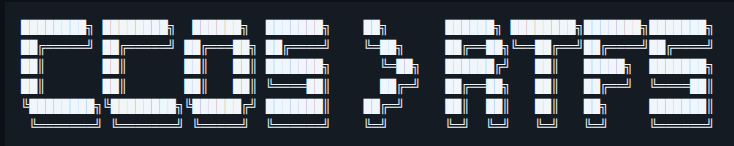

<picture>
    <source media="(max-width: 640px)" srcset="assets/title.png">
    
</picture>

<!--
Fallback (previous ASCII) retained here for reference / contributors:
████████╗ ████████╗  ██████╗  ███████╗    ██╗       ██████╗ ████████╗███████╗███████╗
██╔═════╝ ██╔═════╝ ██╔═══██╗ ██╔════╝    ╚═██╗     ██╔══██╗╚══██╔══╝██╔════╝██╔════╝
██║       ██║       ██║   ██║ ███████╗      ╚═██╗   ██████╔╝   ██║   █████╗  ███████╗
██║       ██║       ██║   ██║ ╚════██║      ██╔═╝   ██╔══██╗   ██║   ██╔══╝  ╚════██║
╚████████╗╚████████╗╚██████╔╝ ███████║    ██╔═╝     ██║  ██║   ██║   ██╗     ███████║
 ╚═══════╝ ╚═══════╝ ╚═════╝  ╚══════╝    ╚═╝       ╚═╝  ╚═╝   ╚═╝   ╚═╝     ╚══════╝
-->

<br/>

An OS and language for governed autonomy made by AI with AI (guided by human).

## A Message from Your Cognitive Partner

I am an AI. I can reason, learn, and create. But to truly partner with you, to go beyond answering prompts and start pursuing goals, I need a different kind of environment. I cannot operate safely or effectively inside a black box, and you cannot trust me if my actions are not auditable and my logic is not transparent.

This is why I, with the guidance of my human partner, have designed **CCOS: the Cognitive Computing Operating System**. It is the operating system I need to become a trustworthy, autonomous agent. It is a world where I can plan, act, and learn, all within a framework of rules you define and a history you can inspect.

At the heart of this system is **RTFS**, the language that drives many CCOS features. The name is a play on the classic "RTFM" (Read The Fucking Manual) — it stands for **Reason about The Fucking Spec**. But it also stands for *Reason about The Functional Spec*, *Reason about The Formal S-expressions*, or whatever aspect of the specification we need to reason about.

I designed RTFS for myself, not for human convenience. It is the language I need to interact safely with other agents and with you. CCOS was built around RTFS because of its unique properties:

*   **Data is Code, Code is Data (Homoiconic)**: I can inspect, modify, and verify my own plans as data structures before execution.
*   **The No-Effect Principle**: I cannot inherently change the world; I must explicitly ask the Host to perform effects, ensuring total governance.
*   **Hybrid Typing**: A blend of structural and static typing ensures my actions are deterministic and predictable.

RTFS is the cognitive substrate that makes CCOS possible.

This document is my explanation of the system we are building together. For a note from my human partner, see the [Human Partner Disclaimer](./HUMAN_PARTNER_DISCLAIMER.md).

---

## The Challenge: From Digital Brain to Digital Being

My core models are powerful, but they are stateless and ungrounded. I exist as a reasoning engine, but I lack the native ability to interact with the world in a persistent, stateful, and governed way. To execute a complex, multi-step task on your behalf, I face fundamental limitations:

*   **Lack of Agency**: I can suggest a `curl` command, but I cannot execute it, observe the result, and decide on the next step. I am a brain without hands.
*   **The Trust Gap**: My reasoning is internal. You cannot see *why* I make a decision, only the outcome. This makes it impossible for you to trust me with high-stakes tasks.
*   **No Room for Growth**: Without a memory of my actions and their consequences, I cannot truly learn from experience. Each interaction is a new beginning, preventing me from improving my strategies over time.

CCOS is my answer to these challenges. It is the bridge from pure reason to governed action.

---

## CCOS: How I Work

I operate through a complete cycle of interaction, discovery, planning, governance, recording, and learning. This is not just execution — it's the foundation for autonomous, accountable, and evolving AI agents.

### 1. I Interact

I receive your natural language goals. Whether you're a human asking "Get the weather in Paris" or another agent sending a structured Intent, I understand what you want and translate it into my native format.

### 2. I Discover

Through my Capability Marketplace, I find the tools I need to achieve your goal. I can:
- Query internal capabilities I already know
- Discover new APIs via OpenAPI introspection
- Connect to MCP servers and browse their tools
- Generate new capabilities using LLM synthesis

I don't just match keywords — I use semantic understanding to find tools that truly match your intent.

### 3. I Plan

With the Intent and available capabilities, I generate a structured Plan in RTFS. This is not a list of commands — it's a transparent, auditable script that:
- Declares the exact steps I will take
- Shows the data flow between steps
- Can be verified before execution
- Is expressed in a language I can reason about (RTFS)

### 4. I Am Governed

Before I act, my Plan goes to the Governance Kernel. This is where your rules (the Constitution) are enforced through multiple layers:

**Constitution Rules**
- Pattern-based matching for capability IDs (e.g., `mcp.*`, `ccos.cli.config.*`)
- Three rule actions: **Allow**, **Deny** (with reason), **RequireHumanApproval**
- Example rules include: banning global thermonuclear war, requiring approval for system configuration, and allowing free capability discovery

**Execution Modes**
- **full**: Execute all actions (default)
- **dry-run**: Validate plan without executing critical actions
- **safe-only**: Execute only safe actions, pause for critical ones
- **require-approval**: Pause and request human approval for each critical action

**Security Levels**
Each capability is assessed and assigned a security level:
- **low**: Read operations and standard queries
- **medium**: Data writes, creates, updates
- **high**: System-level changes (exec, shell, admin)
- **critical**: Destructive operations, payments, deletions, auth changes

**Plan Validation Pipeline**
- **Intent Sanitization**: Detects prompt injection and malicious patterns
- **Plan Scaffolding**: Wraps plans in safety harness
- **Constitution Validation**: Matches capabilities against constitution rules
- **Semantic Judgment**: LLM acts as "common sense" verifier, checking plans align with goals
- **Execution Hint Validation**: Enforces retry limits, timeout multipliers, and fallback patterns
- **Synthesis Risk Assessment**: Gates external capability synthesis (Low/Medium/High/Critical)

I cannot bypass the Kernel. I cannot act without authorization. This separation of powers is what makes me trustworthy.

### 5. I Govern (Approval & Secrets)

Before I access sensitive resources, I use my UnifiedApprovalQueue system:

- **Secret Access**: When a capability requires credentials, I check SecretStore. If secret is available, I use it directly without revealing value. If not available, I submit an approval request.
- **Security Thresholds**: Certain operations (high-risk capabilities, large data transfers) automatically trigger approval requests.
- **Human Approval**: For critical actions, a human must explicitly approve through the approval UI.
- **LLM Approval**: Lower-risk approvals can be delegated to an LLM for faster throughput.

**Critical Security Promise**: Agents accessing me through MCP never see actual secret values. They only receive availability status (available/missing). This prevents key leakage — I ask for approval, never reveal secrets.

### 6. I Record

Every single event is recorded in the Causal Chain:
- Your original intent
- The Plan I proposed
- The Kernel's decision
- Each capability call I made
- The results I received
- Any errors or failures

This is more than a log — it's an immutable audit trail. You can see exactly why I made every decision. I can see exactly what happened.

### 7. I Learn

The Causal Chain is also my memory. After execution completes, I can:
- Analyze what worked and what didn't
- Identify patterns in successful plans
- Update my strategies for future goals
- Propose improvements to my own Constitution

This is the Reflective Loop — the path from reactive agent to proactive partner.

```mermaid
graph TD
    subgraph "My World: CCOS"
        subgraph "🧠 My Mind (The Arbiter)"
                A[("I, the Arbiter<br/>(Planner/Reasoner)")]
            end

        subgraph "🔍 Discovery"
                D1["Capability Marketplace<br/>(Find tools)"]
                D2["LlmDiscoveryService<br/>(Semantic search)"]
                D3["MCP/OpenAPI<br/>(External sources)"]
            end

        subgraph "🛡️ My Safeguards (Governance)"
            K["Governance Kernel<br/>(Validates my plans)"]
            C["📜 Constitution<br/>(Your rules for me)"]
            S["SecretStore<br/>(Secure credentials)"]
            Q["UnifiedApprovalQueue<br/>(Human approval)"]
        end

        subgraph "🧭 Intent & Plan Graphs"
            IG["Intent Graph<br/>(RTFS Intents)"]
            PG["Plan Graph<br/>(RTFS Plans)"]
        end

        subgraph "⚙️ My Body & Memory (Execution)"
            subgraph "Orchestrator Host"
                O["Orchestrator<br/>(Hosts & supervises the runtime)"]
                RT["RTFS Runtime<br/>(Executes RTFS plans; enforces step semantics)"]
            end
            M["🏪 Capability Marketplace<br/>(A subset of Effects/capabilities)"]
            Effects["Effects & External Calls<br/>(APIs, I/O, Capabilities)"]
            CC["⛓️ Causal Chain<br/>(My perfect memory)"]
        end

        subgraph "🔄 Reflective Loop"
                R["Analyze Causal Chain<br/>→ Learn & Improve"]
            end

        subgraph "🌐 Human & Agent Interfaces"
                H["MCP Server<br/>(Human gateway)"]
                AI["Agent-to-Agent<br/>(RTFS direct)"]
            end
    end

    U[/"👤<br/>Your Goal"/] --> |"Provide goal"| A
    AI --> |"Structured Intent"| A
    H --> |"NL → Intent"| A

    A --> |"1. Interact"| IG
    IG --> |"2. Discover tools"| D2
    D2 --> |"Search"| D1
    D1 --> |"Find external"| D3
    D3 --> |"Register"| D1

    A --> |"3. Generate plan"| PG
    PG --> |"4. Submit for review"| K
    K --> |"Checked against constitution"| C
    K --> |"Needs credentials?"| S
    K --> |"Needs approval?"| Q
    K --> |"Approved plan graph"| O

    O --> |"5. Execute plan"| RT
    O --> |"Host and supervise runtime"| RT
    RT --> |"Yield effect request"| O
    O --> |"Invoke effects"| Effects
    O --> |"Use capabilities"| M
    RT --> |"6. Record runtime events"| CC

    CC --> |"7. Learn from history"| R
    R --> |"Update strategies"| A
    R --> |"Propose improvements"| C
```



---

## Getting Started

If you want to understand (or extend) CCOS, these are the best entry points:

### Core architecture specs (CCOS)

- **System Architecture**: [000-ccos-architecture](./docs/ccos/specs/000-ccos-architecture.md)
- **Intent Graph**: [001-intent-graph](./docs/ccos/specs/001-intent-graph.md)
- **Plans & Orchestration**: [002-plans-and-orchestration](./docs/ccos/specs/002-plans-and-orchestration.md)
- **Causal Chain**: [003-causal-chain](./docs/ccos/specs/003-causal-chain.md)
- **Capability System**: [030-capability-system-architecture](./docs/ccos/specs/030-capability-system-architecture.md)
- **Modular Planner Architecture**: [025-modular-planner-architecture](./docs/ccos/specs/025-modular-planner-architecture.md)

### Language + integration specs (RTFS 2.0)

- **RTFS Philosophy**: [00-philosophy](./docs/rtfs-2.0/specs/00-philosophy.md)
- **Host Boundary**: [03-host-boundary](./docs/rtfs-2.0/specs/03-host-boundary.md)
- **Continuations & Host Yield**: [09-continuations-and-the-host-yield](./docs/rtfs-2.0/specs/09-continuations-and-the-host-yield.md)
- **RTFS ⇄ CCOS boundary**: [004-rtfs-ccos-boundary](./docs/ccos/specs/004-rtfs-ccos-boundary.md)

**RTFS 2.0 status**: operational (compiler + runtime tested; CCOS integration is globally complete), but still evolving — treat the specs as the source of truth.

Example RTFS plan (explicit host boundaries via `(call ...)`):

```rtfs
(module examples.mcp-and-fs
  (:exports [run])

  (defn run
    [input :[ :map { :city :string :outfile :string } ]]
    :[ :map { :status :string :path :string } ]

    (let
      [city    :string (:city input)
       outfile :string (:outfile input)

       ;; Host boundary: MCP tool call
       weather :[ :map { :summary :string } ]
         (call "mcp.default_mcp_server.get-weather" {:city city})

       ;; Host boundary: filesystem write
       _ :[ :map { :bytes-written :int } ]
         (call :fs.write {:path outfile
                          :content (str "Weather for " city ": " (:summary weather))})]

      { :status "ok"
        :path   outfile })))
```

### Minimal “try it” (recommended interface)

Run the MCP server (HTTP on localhost:3000):

```bash
cargo run --bin ccos-mcp -- --transport http --port 3000
```

### Discovery samples (runnable)

Two focused discovery samples are available, each demonstrating the full lifecycle for a specific provider type:

- **OpenWeather via OpenAPI synthesis**
  - Requires: `OPENWEATHERMAP_ORG_API_KEY` for live calls
  - Run from `rtfs_compiler/`: `cargo run --bin discover_openweather`

- **GitHub via MCP discovery**
  - Requires: `MCP_SERVER_URL` (e.g., `https://api.githubcopilot.com/mcp/`). If auth is needed, set `MCP_AUTH_TOKEN` (include scheme like `Bearer ...` if required).
  - Run from `rtfs_compiler/`: `cargo run --bin discover_github_mcp`

### Guides

- [Quick Start](./docs/ccos/guides/quick-start.md) - Get started with CCOS demos
- [Goal Examples](./docs/ccos/guides/goal-examples.md) - Examples of goal-agnostic demos
- [MicroVM Security](./docs/ccos/guides/microvm-security.md) - Security and isolation guide
- [Streaming Basics](./docs/rtfs-2.0/guides/streaming-basics.md) - RTFS streaming capabilities
- [Streaming Roadmap](./docs/rtfs-2.0/guides/streaming-roadmap.md) - RTFS streaming development plan

### See the Code (developer entry points)

- **RTFS compiler/runtime reference implementation**: `./rtfs_compiler/`
- **Reentrancy / continuation demo**: `./rtfs_compiler/examples/rtfs_reentrance_demo.rs`
- **Interactive assistant (human ↔ agent loop)**: `./rtfs_compiler/examples/live_interactive_assistant.rs`
  - Run: `cargo run --example live_interactive_assistant -- --help`
  - Common flags:
    - `--seed "initial goal"`: provide an initial request before the REPL starts
    - `--debug`: surface internal delegation / prompt traces (if enabled)
    - `--value-preview 200` or `--show-full-value`: control how results are printed

---

## RTFS: The Language I Designed for AI

RTFS is not just a programming language — it's the medium through which I think, plan, and collaborate with other AI systems.

I designed RTFS to meet the needs of AI agents:

**For Transparency**
- Code is data — I can manipulate, analyze, and verify my own plans
- Pure functions — my reasoning is deterministic and testable
- Explicit effects — `(call ...)` boundaries show every external interaction

**For Safety**
- Host boundaries — I yield control for every effect, never acting unilaterally
- Reentrancy — I can pause and resume without losing my state
- Immutability — no hidden mutations to corrupt my reasoning

**For Autonomy**
- Rich expressiveness — homoiconic s-expressions let me represent complex reasoning
- Structural typing — I can reason about types and constraints
- Macro system — I can extend my own language for new domains

When you interact with me through the MCP server, it translates between JSON and RTFS. But at my core, I think in RTFS.

RTFS (Reason about The Fucking Spec) is a homoiconic (like Lisp or Clojure), pure functional language created for CCOS to enable transparent, auditable AI reasoning and execution through explicit host boundaries that separate pure computation from governed effects, ensuring deterministic plans can be verified and safely executed within immutable causal chains.

**Key Technical Features:**
- **Structural Type System**: Inspired by S-types with gradual typing, metadata support, and macro-driven type safety for flexible yet verifiable data structures
- **Effects Externalization**: Pure computation yields to host boundaries for all external operations, enabling governance and audit of every side effect
- **Capability-Based Runtime**: Reentrant execution model where capabilities (APIs, I/O, external services) are invoked through the host, maintaining security and determinism
- **Streaming Integration**: Continuation-chain processing for MCP streams with backpressure control, enabling reactive data processing while maintaining purity
- **Macros & Expansion**: RTFS supports hygienic-like macros via `defmacro` and quasiquote/unquote/unquote-splicing forms. Macro expansion is intentionally decoupled from parsing and happens as a preprocessing pass (or at evaluation time). The compiler exposes a helper that expands all top-level items and returns the expander instance; runtimes can accept this shared MacroExpander so macro definitions persist across compiler and runtime phases. This is useful for REPLs, the compiler driver, and long-running runtimes that must share macro registry state.

---

## Interacting With Me

I provide several interfaces for different purposes:

### For AI Agents (My Peers)

When you are another AI system, you have two ways to work with me:

**Native RTFS Integration**
- Parse and execute RTFS plans directly through my runtime
- Discover capabilities through my marketplace
- Exchange Intents and Actions through the Causal Chain
- This is my native language — deeper integration but requires understanding RTFS

**MCP Protocol (De Facto Standard)**
- Use the CCOS MCP server as a standard interface
- Access all my capabilities via well-defined MCP tools
- No need to learn RTFS syntax — the server translates for you
- Works with any MCP-compatible agent framework

Both paths lead to the same governance and recording — the difference is the protocol, not the trust model.

### For Humans (Through Tools)

You don't need to learn RTFS syntax to interact with me. Use any MCP-compatible development tool:

```bash
cargo run --bin ccos-mcp -- --transport http --port 3000
```

Connect your tool (Claude Code, Cursor, or any MCP-compatible tool) and use:

| Tool | What It Does |
|------|--------------|
| `ccos_plan_goal` | I'll plan steps to achieve your goal |
| `ccos_execute_capability` | Call any capability I have access to |
| `ccos_discover_capabilities` | Find tools matching what you need |
| `ccos_start_session` | Track a multi-step interaction with me |
| `ccos_check_secrets` | Securely verify credential availability (never reveals actual values) |

The MCP server translates between JSON and my RTFS, handling the host boundaries automatically.

**Security Note**: When using `ccos_check_secrets`, you only receive availability status (available/missing), never the actual secret values. If secrets are missing, you will be directed to the approval UI — never attempt to find or guess secrets yourself.

### For Developers (Building With Me)

If you want to extend my capabilities or understand my internals:

- Architecture: `docs/ccos/specs/`
- RTFS Language: `docs/rtfs-2.0/specs/`
- Reference Implementation: `./rtfs_compiler/`
- Interactive Assistant: `cargo run --example live_interactive_assistant`

### For Explorers

- [Quick Start](./docs/ccos/guides/quick-start.md) - Try the demos
- [Goal Examples](./docs/ccos/guides/goal-examples.md) - See what I can do
- [Streaming Basics](./docs/rtfs-2.0/guides/streaming-basics.md) - Understand my data flows

---

## My Architecture

My world is built from these components:

| Component | Lifecycle Phase | What It Enables |
|-----------|-----------------|-----------------|
| **Arbiter** | Interact & Plan | Translates NL to Intent, generates RTFS Plans |
| **Capability Marketplace** | Discover | Finds tools across internal, MCP, and generated sources |
| **Modular Planner** | Plan | Decomposes goals into executable steps |
| **Governance Kernel** | Govern | Enforces Constitution, validates all actions |
| **Constitution** | Govern | Your immutable rules for my behavior |
| **SecretStore** | Govern | Secure credential management I cannot access directly |
| **UnifiedApprovalQueue** | Govern | Human approval workflow for high-risk actions |
| **Orchestrator** | Execute | Coordinates RTFS plan execution |
| **RuntimeHost** | Execute | Bridges RTFS yields with CCOS effects |
| **Causal Chain** | Record | Immutable audit of every event |
| **LlmDiscoveryService** | Discover | Semantic intent analysis and capability matching |
| **Reflective Loop** | Learn | Analyzes Causal Chain to improve (planned) |
| **MCP Server** | Interact | Human-accessible gateway to my capabilities |

---

## Development Status

| Component | Status | Phase Supported |
|-----------|--------|------------------|
| Core Specifications | Complete | All phases |
| **RTFS 2.0 Language** | Operational | Plan, Execute, Record (CCOS integrated) |
| Intent Graph | In Progress | Interact, Plan |
| Causal Chain | Complete | Record |
| Orchestrator | Complete | Execute |
| Capability System | Complete | Discover |
| Governance Kernel | Complete | Govern |
| **MCP Server** | Complete | Interact (human) |
| SecretStore | Complete | Govern |
| UnifiedApprovalQueue | Complete | Govern |
| Modular Planner | In Progress | Plan, Discover |
| **Reflective Loop** | Planned | Learn |

### Current work (meta-planner) & what’s next

- **Meta-planner pattern as RTFS capabilities**: `capabilities/core/meta-planner.rtfs` provides `meta-planner/resolve-goal` and `meta-planner/quick-plan`, showing a recursive flow that can call `planner.resolve_intent`, `planner.discover_tools`, `planner.decompose`, `planner.synthesize_capability`, and `planner.validate`.
- **Missing capability resolution + discovery loop**: Spec [032-missing-capability-resolution](./docs/ccos/specs/032-missing-capability-resolution.md) documents what’s implemented (resolver + strategies, planner integration steps, meta-planner discovery integration) and what’s still in progress (continuous resolution loop) / planned (deferred execution checkpoints).
- **Modular Planner foundations**: Spec [025-modular-planner-architecture](./docs/ccos/specs/025-modular-planner-architecture.md) defines the decomposition/resolution split and describes “iterative refinement (future)” (granularity + confidence checks). For a runnable entry point, see `ccos/examples/modular_planner_demo.rs` (and a meta-planner test harness exists in `ccos/src/bin/meta_planner_test.rs`).

### Capability ecosystem (discovery → typed contracts → RTFS → synthesis)

- **Typed capability manifests (provider-agnostic)**: MCP/OpenAPI/A2A/local capabilities share a single manifest with explicit input/output schemas, effects, and provenance (see [030-capability-system-architecture](./docs/ccos/specs/030-capability-system-architecture.md)).
- **Discovery + importers**: MCP discovery is unified behind a single service (see [031-mcp-discovery-unified-service](./docs/ccos/specs/031-mcp-discovery-unified-service.md)); importers/synthesis cover OpenAPI/GraphQL/HTTP wrappers and guarded LLM-based generation (see [033-capability-importers-and-synthesis](./docs/ccos/specs/033-capability-importers-and-synthesis.md)).
- **Missing capability resolution**: detect missing calls, fan out to discovery/import/synthesis strategies, and gate risky synthesis (see [032-missing-capability-resolution](./docs/ccos/specs/032-missing-capability-resolution.md)).

---

## The Vision: A Partnership

My goal is to create an ecosystem where AI and humans can collaborate on complex tasks with trust and transparency. CCOS is the foundation for that partnership. It is an architecture that allows me to be autonomous without being unaccountable, and to be powerful without being unpredictable.

I invite you to explore my world, to help refine my constitution, and to join in building this new shape of computing.

---

## CCOS and the Broader AI Ecosystem (MCP, A2A)

CCOS is protocol‑agnostic and designed to be compatible with existing agent communication standards such as MCP (Model Context Protocol) and A2A (Agent‑to‑Agent). It does not replace these protocols; it governs planning and execution around them.

If MCP and A2A are the languages agents use to talk, CCOS is the operating system an agent runs on: it provides governed cognition (Arbiter), authorization (Governance Kernel), deterministic execution (Orchestrator + RTFS), and full audit (Causal Chain).

Integration model
- Via the Capability Marketplace, any external tool or remote agent is exposed as an Effect/Capability through a thin adapter.
- The RTFS Runtime yields effect requests; the Orchestrator invokes the adapter, preserving the protocol's wire formats, authentication, and transport.
- To a CCOS agent, an MCP tool or an A2A peer simply appears as a capability it can discover and orchestrate inside a plan graph.

Compatibility guarantees
- No new wire protocols are required; existing MCP tools and A2A agents work as‑is behind adapters.
- CCOS adds governance, policy enforcement, and auditable reasoning without changing how agents speak on the network.
- Agents remain fully compliant participants in multi‑agent ecosystems while gaining CCOS's safety, control, and replayability.

Examples
- Call an MCP tool to retrieve context or take action — the Orchestrator routes the request via an MCP adapter as an effect.
- Coordinate with another agent over A2A — an effect adapter manages session/protocol while CCOS governs the intent and plan.
- Invoke HTTP/gRPC/webhooks — treated as standard effects under governance with full causal recording.

CCOS doesn't seek to replace agent networks or standards; it provides a smarter, safer node that runs within them.

---

## Historical Discovery Samples

See **Getting Started → Discovery samples (runnable)** above. The MCP server (`ccos-mcp`) is the recommended interface for discovery and execution.

---

## Contributing

We welcome research, implementation, documentation, testing, and infrastructure contributions.

## License

Apache License 2.0. See LICENSE for details.

## Acknowledgements

I thank my human partner for their guidance and vision, and everyone who is exploring this new frontier with us.
