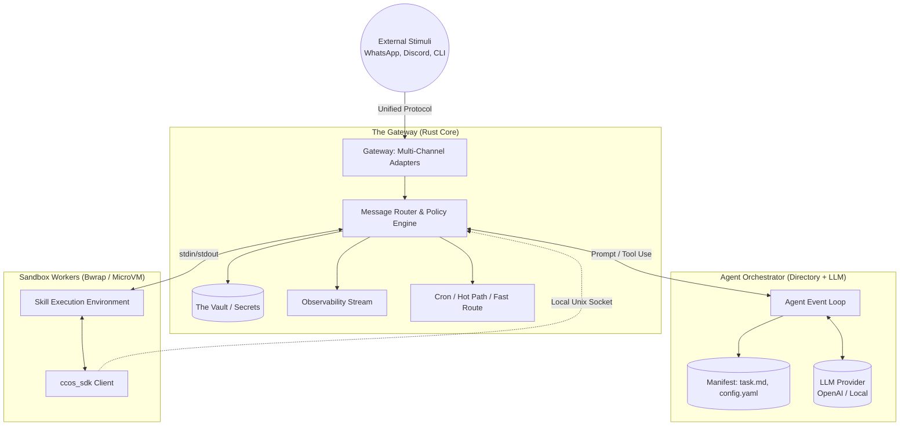

# CCOS-NG: Architecture & Modules Specification

This document defines the physical and logical boundaries, system topology, and concurrency model of the CCOS-NG platform, as outlined in the core concepts.

## 1. High-Level System Topology

CCOS-NG operates on a strictly segregated architecture designed to maximize security, observability, and flexibility. 

The system consists of three primary domains:
1. **The Gateway (Trust Anchor)**: The core Rust binary that manages network connections, API keys, routing, and access control. 
2. **The Agent Orchestrator (Reasoning Loop)**: Instances of LLMs acting within the constraints of the Gateway, maintaining state in textual memory.
3. **The Sandbox Workers (Untrusted Execution)**: Isolated ephemeral environments where code generated by the LLM or helper scripts associated with complex skills are executed safely.



## 2. The Gateway (The Absolute Choke Point)

The Gateway is a lightweight, heavily optimized Rust binary. It is the sole entity that holds raw network sockets and controls the physical machine.

### Core Modules
* **Network & Multi-Channel Adapters**: Translates external proprietary protocols (e.g., Discord WebSocket, HTTP endpoints) into the internal, unified CCOS-NG message protocol. 
* **Message Router & Policy Engine**: Every message, whether from the outside world, from an Agent, or from a Sandbox, passes through here. It evaluates requests against declarative textual policies (e.g., `policy.yaml`) before routing them.
* **The Vault (Secret Management)**: Securely stores API keys and credentials. The Vault can source secrets from multiple backends: a local encrypted store, a remote secret manager, or **the host machine's own environment variables** (e.g., `$GITHUB_TOKEN` already configured on the server). At startup, the Gateway reads permitted host environment variables into its internal Vault — the host environment is never directly exposed to any Agent or Sandbox process. No raw keys are ever passed to the LLM. Keys are injected directly into Sandbox processes as scoped, ephemeral environment variables or fetched securely via the SDK upon explicitly authorized requests.
  - **Secret Zeroization**: All secret values held in Gateway memory use automatic zeroization (e.g., Rust's `zeroize` crate). When a secret handle is dropped, the underlying memory is wiped, preventing secrets from lingering in process memory after use.
* **Observability & Causal Chain Logger**: Quietly logs every action, request, and Sandbox artifact into an immutable, append-only JSON/text stream.
* **Cold Path Scheduler**: A lightweight cron-like scheduler capable of directly invoking Sandbox Skills at intervals without waking up the Agent LLM, routing failures back to the relevant Agent only when necessary.

### LLM Driver Abstraction
The Gateway abstracts the LLM provider entirely via a unified driver interface.
- **Provider Agnosticism**: The driver handles Anthropic, OpenAI-compatible (covering OpenAI, DeepSeek, Groq, Mistral, Together, OpenRouter, local Ollama/vLLM), and Google Gemini APIs behind a single trait.
- **Streaming Support**: Drivers support both synchronous request/response and streaming (via event channels) for real-time token delivery to Channel Adapters.
- **Per-Agent Driver Resolution**: Each Agent's `config.yaml` can override the Gateway's default provider, model, and API key. The Gateway reuses a shared driver instance when possible, creating a dedicated one only when the Agent specifies a custom endpoint or key.
- **Graceful Fallback**: If the primary LLM provider returns errors or is unreachable, the Gateway automatically falls back to a secondary provider defined in the Agent's `config.yaml`. The Agent never knows the switch happened.

### Gateway Topology (Singleton vs. Federated)
The Gateway architecture is not restricted to a local singleton process.
- **Singleton**: Runs as a single process managing local Agents and Sandboxes for a single user/server.
- **Federated**: Gateways can be clustered across different trust boundaries or machines. Agent Manifests can be serialized and transmitted to remote Gateways for execution, allowing heavy workloads (e.g., massive Sandbox tests) to burst into cloud infrastructure while retaining local privacy for the Primary Agent.

## 3. The Agent Orchestrator

An Agent is not a long-running system thread, but a conceptual loop bound to a directory on disk (The Manifest).

### The Manifest Directory
```text
my_agent/
├── config.yaml    # LLM settings, fallback rules, recovery policy
├── persona.md     # System prompt outlining role and capabilities
├── state/         # Agent working memory (e.g., task.md, scratchpad.md)
├── history/       # Context window backup / summarizations
├── skills/        # The Agent's capability bundles (agentskills.io standard)
│   └── pdf-processing/
│       ├── SKILL.md   # The required instructional Markdown card with YAML frontmatter
│       ├── scripts/   # Optional executable Python/JS helper code
│       └── assets/    # Optional templates or static files
└── metrics.json   # Token usage and cost tracking
```

### Manifest Signing & Portability
An Agent Manifest is a fully self-contained directory. It can be `git commit`-ed, ZIPped, shared, and respawned on a different Gateway.
- **Ed25519 Manifest Signing**: To ensure integrity and authenticity (especially for marketplace/sharing scenarios), Manifests can be cryptographically signed using Ed25519. The Gateway verifies the signature before loading an external Manifest.
- **Version Control**: Because the Agent is just a directory, its entire history (skills learned, persona changes, state evolution) can be tracked in Git.

### Multi-Agent Communities & Peer-to-Peer
CCOS-NG natively supports complex Agent interactions beyond simple parent-child relationships:
- **Communities**: Multiple Agents can serve the same human (e.g., a "DevOps Agent" and a "Finance Agent"), or different users' Agents can collaborate (e.g., User A's Agent shares a generated PDF with User B's Agent).
- **Peer-to-Peer Message Bus**: Sub-Agents do not have to route their intermediate results back through their spawning parent. The Gateway acts as a message bus, allowing a "Researcher" Sub-Agent to send data directly to a "Coder" Sub-Agent without exhausting the primary Agent's context window.

### The Concept of "Skills" (AgentSkills Standard)
CCOS-NG adopts the **[AgentSkills open standard](https://agentskills.io/)** for defining capabilities. Skills are not just single scripts; they are file bundles built around a unifying `SKILL.md` file.
- **Instructional Focus:** The core `SKILL.md` is a Markdown guide that teaches the LLM *how* to perform a task, formatted with necessary YAML frontmatter (`name`, `description`, `allowed-tools`).
- **One Skill, Multiple Tools (1-to-Many):** A Skill is a holistic capability (e.g., "GitHub Management"), not a single tool. A single `SKILL.md` file can instruct the LLM on how to use *multiple distinct tools* (e.g., `github_search_issues`, `github_create_pr`, `github_merge`).
- **Code as an Optional Sidecar (From Snippets to Full Projects):** If a Skill requires arbitrary execution, it is bundled with helper code placed inside the `scripts/` directory. **This directory is not restricted to tiny single-file scripts.** A Coder Agent can generate and bundle an entire fully-fledged project (e.g., a Python project managed by `uv`, a Node.js module with a `package.json`, or a Rust binary). The `SKILL.md` teaches the LLM how to invoke the entry points of that complex project, and the Gateway executes it synchronously in the Sandbox Worker.
- **Self-Sufficiency & Discovery:** Because skills are self-documenting, the Agent loads just the name and description from the `SKILL.md` frontmatter during discovery, reading the full Markdown body only when the skill is actually needed.

### Strict Constraints for Dynamically Generated Skills
When Agents dynamically generate and persist new Skills into the Global Skill Engine Repository, CCOS-NG forces them to populate the AgentSkills `metadata` field with strict execution contracts. This prevents unbounded hallucination or resource exhaustion when other agents blindly consume the generated skill.
A dynamically generated `SKILL.md` must include:
  - **`metadata.input_schema` / `metadata.output_schema`**: A strict JSON Schema defining exactly what parameters the script expects and what format the artifacts will take.
  - **`metadata.resource_limits`**: Declared thresholds (`max_memory_mb`, `timeout_seconds`) that the Gateway will physically enforce on the Sandbox process running the `scripts/` payload.

### Lifecycle & Event Loop
1. **Wake**: An incoming event from the Gateway loads the Manifest directory into memory.
2. **Context Assembly**: The Agent reads its `persona.md`, current `state/task.md`, and relevant `history` into the LLM context.
3. **Reasoning & Execution**: The Agent outputs structured requests (e.g., skill executions, inter-agent messages, file read/writes) back to the Gateway.
4. **Hibernate**: If the task is delegated (spawning a Sub-Agent) or completed, the Gateway flushes the state back to disk and unloads the context, freeing up system memory.

## 4. Sandbox Workers

Untrusted text scripts dynamically generated by the Primary Agent, or complex execution environments bounded within an AgentSkills `scripts/` directory, are executed here.

### Beyond Tiny Scripts (Full Project Runtimes)
CCOS-NG intentionally does not limit the Agent's output to simple, 50-line Python snippets. If a problem is highly complex, a specialist Coder Agent is free to scaffold an entire project inside the Sandbox.
- **Dependency Management**: The process runner can inherently trigger package managers (like `uv run`, `npm start`) as the entry point.
- **Directory Mounting**: The entire `scripts/` directory of the Skill bundle is mounted into the ephemeral worker, giving the executing code access to its multi-file architecture, localized `assets/`, and internal modules.

### Isolation Strategy
CCOS-NG allows configurable backend runners:
* **Bubblewrap (bwrap)**: For lightweight, fast Linux namespace sandboxing. Read-only root filesystem, ephemeral `/tmp`, isolated network namespaces.
* **Docker / gVisor**: For heavier dependencies, full project toolchains (e.g., requiring a specific Node version), or when true kernel isolation is required.

### Standardized Execution
The Gateway executes the codebase as a standard process:
1. It creates an isolated directory and mounts the relevant Skill payload.
2. It injects the `ccos_sdk` into the environment.
3. It pipes the task instructions into standard input (`stdin`) of the primary entry point script.
4. It streams standard output (`stdout`) and standard error (`stderr`) to the Causal Chain.
5. On exit, the Gateway retrieves the resulting artifacts and the exit code, packaging it for the parent Agent.

## 5. Two-Tier Memory Architecture

CCOS-NG uses a layered memory model. The Agent's *active reasoning* happens in text files. The Gateway provides a *searchable substrate* behind the SDK for long-term recall.

### Tier 1 — Textual Working State (Agent-Side)
The LLM reads and edits plain text files directly inside its Manifest directory:
* `state/task.md` — Active task progress. The LLM checks off items as it works.
* `state/scratchpad.md` — Temporary reasoning, intermediate data.
* `history/summary.md` — Compressed summaries of older conversations.

This is fully transparent, human-debuggable, git-friendly, and crash-recoverable. The LLM never talks to a database for its active state.

### Tier 2 — Gateway Memory Substrate (Behind the SDK)
For long-term recall, semantic search, and multi-agent coordination, the Gateway maintains an indexed storage backend (e.g., SQLite, vector DB). The Agent interacts with it *only* through the SDK, receiving text back:
* **KV Store**: `sdk.memory.remember(key, value)` / `sdk.memory.recall(query)` — Persist and retrieve structured knowledge (e.g., user preferences, project facts).
* **Semantic Search**: `sdk.memory.search(query)` — Vector similarity search over accumulated knowledge, returning the most relevant text snippets.
* **Knowledge Graph**: Entity-relation storage for structured knowledge (e.g., "John → prefers → CSV").
* **Task Board**: A shared queue for multi-agent coordination: `sdk.tasks.post()`, `sdk.tasks.claim()`, `sdk.tasks.complete()`. Enables peer-to-peer collaboration without routing through a parent Agent.
* **Canonical Sessions**: Cross-channel memory. The Gateway compacts conversation history into summaries that are injected into Agent system prompts, ensuring continuity across WhatsApp, Discord, CLI, etc.

### Why Both Tiers?
The Agent never *knows* there is a database. It works in text for its active reasoning (Tier 1), and when it needs to recall something from the past, it calls `sdk.memory.recall()` — which returns *text*. The Gateway handles indexing internally. The LLM stays in text-land the whole time.

### Horizontal Scaling (Sub-Agents)
Instead of one massive LLM request trying to do everything, the Primary Agent delegates steps by dispatching standard events to the Gateway, which spawns autonomous, fire-and-forget Sub-Agents (each with their own Manifests).

### Asynchronous Resolution
When an Agent delegates a task and hibernates, the Gateway manages the wait. Once the Sandbox process or Sub-Agent finishes, the Gateway produces a "Result Event" that wakes the original parent Agent, bringing the result back into its context.

## 6. Execution Paradigms

CCOS-NG classifies workloads into three distinct execution paths to conserve tokens and reduce latency:
1. **Single Action (The Hot Path)**: Synchronous, single-shot execution. The Agent immediately generates a tool call, the Gateway runs it rapidly in a Sandbox, and the result is returned directly to the user.
2. **Scheduled Action (The Cold Path)**: Long-running or recurring tasks (e.g., Cron jobs). The Gateway executes predefined Scripts directly without polling the LLM, only waking the Agent if an anomalous error occurs or a summary is explicitly requested.
3. **Complex Goal (The Orchestration Path)**: Asynchronous, multi-step execution. The Primary LLM breaks the request into a `task.md` plan and delegates chunks to specialized Sub-Agents.

## 7. Learning & Evolution

Agents in CCOS-NG improve continuously:
- **Conceptual Learning (Primary Agent)**: Distills episodic events from the Causal Chain into long-term Semantic Memory (e.g., user preferences, project context) to enhance future routing or tone.
- **Procedural Learning (Sub-Agents & Skill Engine)**: When a specialized Agent invents a highly successful script or prompt to solve an edge case, the platform can formally capture it. The resulting generated package is saved to the **Global Skill Engine Repository**, instantly expanding the capabilities of all other Agents in the ecosystem.

## 8. Capability-Based Security Model

Every Agent operation is subject to capability checks. Capabilities are declared in the Agent's `config.yaml` Manifest and enforced at runtime by the Gateway before every operation.

### Capability Types
* `ToolInvoke(name)` — Access to a specific tool (e.g., `file_read`).
* `MemoryRead(scope)` / `MemoryWrite(scope)` — Scoped access to memory keys (e.g., `self.*`, `*`).
* `NetConnect(host)` — Access to a specific external host.
* `AgentSpawn` — Permission to spawn child Agents.
* `AgentMessage(pattern)` — Permission to message Agents matching a name pattern.
* `ShellExec(pattern)` — Permission to execute shell commands matching a pattern.

### Capability Inheritance Validation
When an Agent spawns a child via `ecosystem.spawn_agent`, the Gateway runs `validate_capability_inheritance()`. A child Agent can **never** receive capabilities that its parent does not hold. This prevents privilege escalation through delegation chains.

### Enforcement Flow
1. The Agent requests an action (e.g., tool call, message send).
2. The Gateway's `CapabilityManager` checks the Agent's granted capabilities.
3. **Granted** → validate parameters (path traversal, SSRF) → execute.
4. **Denied** → return a typed `PermissionDenied` error to the LLM.

## 9. Agent Loop Stability

Production LLM agent loops are prone to degeneracy. CCOS-NG implements multiple stability guards:

### Loop Guard
The Gateway hashes `(tool_name, params)` for each tool call. If the Agent calls the same tool with the same parameters repeatedly:
- **Warn threshold (3)**: Inject a hint into the LLM context.
- **Block threshold (5)**: Refuse the tool call and return an error.
- **Circuit breaker (30)**: Terminate the Agent loop entirely.

### Session Repair
Before each Agent loop iteration, the Gateway validates message history consistency: drops orphaned tool results, removes empty messages, and merges consecutive same-role messages.

### Depth & Continuation Limits
- **Max Continuations (3)**: Prevents infinite "please continue" loops.
- **Inter-Agent Depth Limit (5)**: Prevents unbounded recursive Agent-to-Agent call chains.

### Stability Guidelines
Anti-loop and anti-retry behavioral rules are appended to every Agent's system prompt, guiding the LLM to avoid degenerate patterns.

## 10. Security Hardening

Relying on autonomous LLMs introduces attack vectors. The Gateway is designed to mitigate them explicitly:

### Attack Vector Mitigations
1. **Prompt Injection & The "Confused Deputy"**: The Gateway's strict textual `policy.yaml` rules supersede the LLM's commands. Even if tricked, the Primary Agent cannot bypass the Gateway's hardcoded network or file boundaries.
2. **Economic Exhaustion**: The Gateway enforces per-user and per-agent Token Spending Hard-Caps and Rate Limits (GCRA algorithm).
3. **Sandbox Escapes**: CCOS-NG relies on zero-trust runtimes without host loopback access, read-only root filesystems, and minimal kernel capabilities.
4. **Knowledge Poisoning & The Auditor Agent**: A malicious skill could contain an obfuscated backdoor. CCOS-NG employs a completely out-of-band **Auditor Agent**. This "immune system" agent wakes up periodically (e.g., overnight) and uses heavy LLM reasoning to deeply inspect the Causal Chain logs and every dynamically generated script in the Global Skill Repository. If toxicity or a backdoor is detected, it quarantines the Skill.
5. **SDK Abuse (Lateral Movement)**: Every SDK call is a Gateway request subject to Capability checks. The Gateway rate-limits SDK calls per Sandbox, enforces least-privilege on secret access, and caps the number of inter-agent messages a single skill execution can send.

### Proactive Defenses
* **Prompt Injection Scanner**: All incoming skill content and messages are scanned for override attempts, data exfiltration patterns, and shell references *before* activation. Trust boundary markers wrap skill-injected context in system prompts.
* **Information Flow Taint Tracking**: Data from external untrusted sources carries taint labels that propagate through operations, enabling the Gateway to track data provenance and prevent tainted data from reaching sensitive outputs.
* **SSRF Protection**: The Gateway blocks requests to private IPs, cloud metadata endpoints, and performs DNS rebinding checks.
* **Path Traversal Prevention**: All file paths are validated and resolved safely before any file operation.
* **Secret Zeroization**: See §2 (The Vault).
* **Manifest Signing**: See §3 (Ed25519).
* **Merkle Audit Trail**: See Protocols spec (§4).
