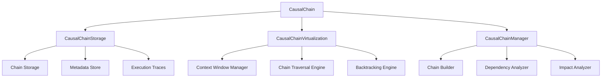

# Causal Chain - Detailed Documentation

**Module:** `src/ccos/causal_chain.rs`  
**Purpose:** Track execution causality and dependencies between operations

---

## Architecture Overview

The Causal Chain implements the "Causal Chain" concept from the CCOS vision. It maintains a persistent record of execution causality, enabling backtracking, debugging, and understanding of how results were achieved.

### Core Components



---

## Data Structures

### Causal Chain Node

```rust
pub struct CausalChainNode {
    pub node_id: NodeId,               // Unique identifier
    pub operation: String,             // Operation name/description
    pub inputs: Vec<Value>,            // Input values
    pub outputs: Vec<Value>,           // Output values
    pub dependencies: Vec<NodeId>,     // Dependent nodes
    pub metadata: HashMap<String, Value>, // Additional metadata
    pub timestamp: u64,                // Execution timestamp
    pub execution_time: u64,           // Execution duration (ms)
    pub success: bool,                 // Success status
    pub error_message: Option<String>, // Error details if failed
}
```

### Chain Relationship

```rust
pub enum ChainRelationship {
    DependsOn,     // This node depends on another
    Enables,       // This node enables another
    Conflicts,     // This node conflicts with another
    Parallel,      // This node runs in parallel with another
}

pub struct ChainEdge {
    pub from_node: NodeId,
    pub to_node: NodeId,
    pub relationship: ChainRelationship,
    pub weight: f64,                   // Relationship strength
    pub metadata: HashMap<String, Value>,
}
```

---

## API Reference

### Core Causal Chain Operations

#### Creating and Storing Nodes

```rust
// Create a new causal chain node
let node = CausalChainNode::new("calculate_sales_totals".to_string())
    .with_inputs(vec![Value::Number(100.0), Value::Number(200.0)])
    .with_outputs(vec![Value::Number(300.0)])
    .with_dependencies(vec!["node-001".to_string()])
    .with_metadata("module".to_string(), Value::String("sales".to_string()));

// Store in the chain
chain.store_node(node)?;
```

#### Building Execution Chains

```rust
// Start a new execution chain
let chain_id = chain.start_execution_chain("analyze_quarterly_data".to_string())?;

// Add operations to the chain
chain.add_operation(chain_id, "load_sales_data".to_string(), &inputs, &outputs)?;
chain.add_operation(chain_id, "calculate_totals".to_string(), &inputs, &outputs)?;
chain.add_operation(chain_id, "generate_report".to_string(), &inputs, &outputs)?;

// Complete the chain
chain.complete_execution_chain(chain_id)?;
```

#### Querying Dependencies

```rust
// Get all dependencies for a node
let dependencies = chain.get_dependencies("node-001")?;

// Get all nodes that depend on this node
let dependents = chain.get_dependents("node-001")?;

// Get the full chain for a node
let full_chain = chain.get_full_chain("node-001")?;

// Get parallel operations
let parallel = chain.get_parallel_operations("node-001")?;
```

#### Backtracking and Impact Analysis

```rust
// Find what caused a specific result
let causes = chain.find_causes("node-001")?;

// Find what would be affected by changing a node
let impact = chain.find_impact("node-001")?;

// Get execution path to a result
let path = chain.get_execution_path("node-001")?;
```

---

## Virtualization and Context Management

### Context Window Management

```rust
impl CausalChainVirtualization {
    pub fn load_context_window(&self, node_ids: &[NodeId], storage: &CausalChainStorage) -> Vec<CausalChainNode> {
        let mut context_nodes = Vec::new();

        for node_id in node_ids {
            if let Some(node) = storage.get_node(node_id) {
                context_nodes.push(node.clone());

                // Add immediate dependencies
                for dep_id in &node.dependencies {
                    if let Some(dep_node) = storage.get_node(dep_id) {
                        context_nodes.push(dep_node.clone());
                    }
                }
            }
        }

        // Remove duplicates and limit context size
        context_nodes.sort_by(|a, b| a.timestamp.cmp(&b.timestamp));
        context_nodes.dedup_by(|a, b| a.node_id == b.node_id);

        if context_nodes.len() > self.max_context_size {
            context_nodes.truncate(self.max_context_size);
        }

        context_nodes
    }
}
```

### Chain Traversal

```rust
impl CausalChainManager {
    pub fn traverse_chain(&self, start_node: &NodeId, storage: &CausalChainStorage) -> Vec<CausalChainNode> {
        let mut visited = HashSet::new();
        let mut queue = VecDeque::new();
        let mut result = Vec::new();

        queue.push_back(start_node.clone());

        while let Some(node_id) = queue.pop_front() {
            if visited.contains(&node_id) {
                continue;
            }

            visited.insert(node_id.clone());

            if let Some(node) = storage.get_node(&node_id) {
                result.push(node.clone());

                // Add dependencies to queue
                for dep_id in &node.dependencies {
                    queue.push_back(dep_id.clone());
                }
            }
        }

        result
    }
}
```

---

## Dependency Analysis

### Automatic Dependency Detection

```rust
impl CausalChainManager {
    pub fn detect_dependencies(&self, node: &CausalChainNode, storage: &CausalChainStorage) -> Vec<NodeId> {
        let mut dependencies = Vec::new();

        // Check for input dependencies
        for input in &node.inputs {
            if let Some(dep_node) = self.find_node_producing_value(input, storage) {
                dependencies.push(dep_node.node_id.clone());
            }
        }

        // Check for resource dependencies
        if let Some(resource) = node.metadata.get("resource") {
            if let Some(dep_node) = self.find_node_using_resource(resource, storage) {
                dependencies.push(dep_node.node_id.clone());
            }
        }

        dependencies
    }

    fn find_node_producing_value(&self, value: &Value, storage: &CausalChainStorage) -> Option<&CausalChainNode> {
        // Find the most recent node that produced this value
        storage.nodes.values()
            .filter(|node| node.outputs.contains(value))
            .max_by_key(|node| node.timestamp)
    }
}
```

### Impact Analysis

```rust
impl CausalChainManager {
    pub fn analyze_impact(&self, node_id: &NodeId, storage: &CausalChainStorage) -> ImpactAnalysis {
        let mut impact = ImpactAnalysis::new();

        // Find all nodes that depend on this node
        let dependents = self.get_all_dependents(node_id, storage);

        for dependent in dependents {
            impact.add_affected_node(dependent.node_id.clone());

            // Check if this would cause a cascade failure
            if dependent.dependencies.len() == 1 {
                impact.add_cascade_risk(dependent.node_id.clone());
            }
        }

        impact
    }
}
```

---

## Execution Tracing

### Trace Collection

```rust
impl CausalChain {
    pub fn trace_execution(&mut self, operation: &str, inputs: &[Value], outputs: &[Value]) -> Result<NodeId, RuntimeError> {
        let node = CausalChainNode::new(operation.to_string())
            .with_inputs(inputs.to_vec())
            .with_outputs(outputs.to_vec())
            .with_timestamp(SystemTime::now().duration_since(UNIX_EPOCH).unwrap().as_millis() as u64);

        // Detect dependencies automatically
        let dependencies = self.detect_dependencies(&node)?;
        let node = node.with_dependencies(dependencies);

        // Store the node
        let node_id = node.node_id.clone();
        self.storage.store_node(node)?;

        Ok(node_id)
    }
}
```

### Performance Monitoring

```rust
impl CausalChainNode {
    pub fn record_execution_time(&mut self, start_time: u64, end_time: u64) {
        self.execution_time = end_time - start_time;
        self.metadata.insert("execution_time_ms".to_string(), Value::Number(self.execution_time as f64));
    }

    pub fn record_memory_usage(&mut self, memory_usage: usize) {
        self.metadata.insert("memory_usage_bytes".to_string(), Value::Number(memory_usage as f64));
    }
}
```

---

## Usage Examples

### Example 1: Data Processing Pipeline

```rust
// Start a data processing chain
let chain_id = chain.start_execution_chain("process_sales_data".to_string())?;

// Load data
let load_node = chain.trace_execution("load_csv", &[Value::String("sales.csv".to_string())], &[Value::Array(vec![/* data */])])?;

// Transform data
let transform_node = chain.trace_execution("transform_data", &[Value::Array(vec![/* data */])], &[Value::Array(vec![/* transformed */])])?;

// Calculate metrics
let metrics_node = chain.trace_execution("calculate_metrics", &[Value::Array(vec![/* transformed */])], &[Value::Object(HashMap::new())])?;

// Generate report
let report_node = chain.trace_execution("generate_report", &[Value::Object(HashMap::new())], &[Value::String("report.pdf".to_string())])?;

// Complete chain
chain.complete_execution_chain(chain_id)?;
```

### Example 2: Debugging Execution

```rust
// Find what caused an error
let error_node = chain.get_node("error-node-001")?;
let causes = chain.find_causes(&error_node.node_id)?;

println!("Error was caused by:");
for cause in causes {
    println!("  - {}: {}", cause.operation, cause.error_message.unwrap_or_default());
}

// Find impact of changing a calculation
let calc_node = chain.get_node("calc-node-001")?;
let impact = chain.analyze_impact(&calc_node.node_id)?;

println!("Changing this calculation would affect:");
for affected in impact.affected_nodes {
    println!("  - {}", affected);
}
```

### Example 3: Performance Analysis

```rust
// Analyze execution performance
let slow_nodes = chain.get_nodes_by_execution_time(1000); // > 1 second

for node in slow_nodes {
    println!("Slow operation: {} took {}ms", node.operation, node.execution_time);

    // Check dependencies
    let deps = chain.get_dependencies(&node.node_id)?;
    println!("  Dependencies: {}", deps.len());
}

// Find bottlenecks
let bottlenecks = chain.find_bottlenecks()?;
for bottleneck in bottlenecks {
    println!("Bottleneck: {} affects {} downstream operations",
             bottleneck.node_id, bottleneck.impact_count);
}
```

---

## Performance Considerations

### Storage Strategy

- **Current:** In-memory storage with HashMap
- **Future:** Time-series database for large-scale tracing
- **Optimization:** Compression for repeated operations

### Query Performance

- **Dependency Lookup:** O(1) with HashMap indexing
- **Chain Traversal:** O(n) where n is chain length
- **Impact Analysis:** O(n²) worst case, optimized with caching

### Memory Management

- **Context Window:** Configurable size limits
- **Garbage Collection:** Archive old chains automatically
- **Compression:** Store similar operations efficiently

---

## Testing

### Unit Tests

```rust
#[test]
fn test_causal_chain_creation() {
    let chain = CausalChain::new();
    assert!(chain.is_ok());
}

#[test]
fn test_node_dependencies() {
    let mut chain = CausalChain::new().unwrap();

    let node1 = chain.trace_execution("op1", &[], &[Value::Number(1.0)]).unwrap();
    let node2 = chain.trace_execution("op2", &[Value::Number(1.0)], &[]).unwrap();

    let deps = chain.get_dependencies(&node2).unwrap();
    assert!(deps.contains(&node1));
}

#[test]
fn test_impact_analysis() {
    let mut chain = CausalChain::new().unwrap();

    let node1 = chain.trace_execution("op1", &[], &[Value::Number(1.0)]).unwrap();
    let node2 = chain.trace_execution("op2", &[Value::Number(1.0)], &[]).unwrap();

    let impact = chain.analyze_impact(&node1).unwrap();
    assert!(impact.affected_nodes.contains(&node2));
}
```

---

## Future Enhancements

1. **Distributed Tracing:** Support for distributed execution chains
2. **Visualization:** Graph-based chain visualization
3. **ML Integration:** Predictive impact analysis
4. **Real-time Monitoring:** Live chain monitoring and alerting
5. **Optimization Suggestions:** Automatic performance optimization recommendations
6. **Version Control:** Chain versioning and rollback capabilities

---

## References

- [CCOS Foundation Documentation](./CCOS_FOUNDATION.md)
- [Intent Graph Documentation](./INTENT_GRAPH_API.md)
- [Task Context Documentation](./TASK_CONTEXT_DETAILED.md)

## Causal Chain of Thought & Pre-Execution Auditing

The _Sentient Runtime Vision_ extends the Causal Chain beyond a post-hoc execution log into a **Causal Chain of Thought** – a record of _why_ each action was chosen, not just _what_ happened.

### Key Additions (future work)

1. **Thought Node Extension** – Each `CausalChainNode` gains optional fields:
   - `intent_ref` → the Intent ID that motivated the action.
   - `delegation_path` → one of `:self`, `:local`, `:agent`, `:recursive`.
   - `ethical_rule_refs` → list of Constitutional Rule IDs consulted.
2. **Pre-Execution Simulation Record** – Before high-stakes plans, the Arbiter can attach a predicted outcome subtree that supervisors may approve.
3. **Audit API** – `chain.request_preflight_approval(plan_id)` produces a compact summary for human review.

### Example Thought-Enhanced Node

```rust
pub struct ThoughtMeta {
    pub intent_ref: Option<IntentId>,
    pub delegation_path: Option<DelegationPath>,
    pub ethical_rule_refs: Vec<ConstRuleId>,
}
```

### Pre-Execution Approval Flow

1. Arbiter builds Plan → simulates execution paths & cost.
2. Generates _preview_ Causal Chain with hypothetical nodes.
3. Sends to human supervisor or Digital Ethics Committee.
4. Upon approval, Plan executes and real nodes overwrite preview.

These enhancements ensure that reasoning is transparent **before** the system acts, fulfilling the predict-and-audit requirement of the vision.
