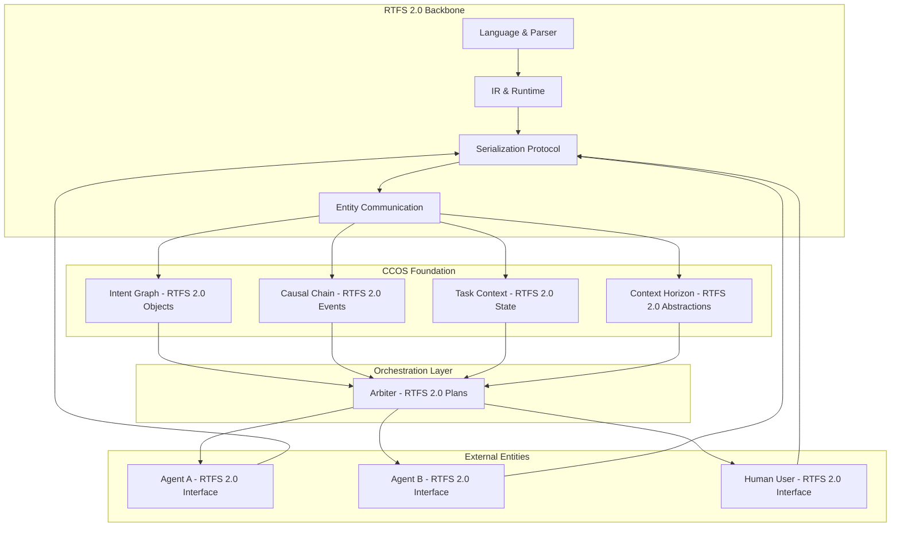

# CCOS Foundation Documentation

**Location:** `docs/ccos/CCOS_FOUNDATION.md`

---

## Overview

The **Cognitive Computing Operating System (CCOS) Foundation** is built on **RTFS 2.0**, which serves as the backbone language for representing and exchanging intent, tasks, and plans between CCOS entities. RTFS 2.0 is not just the execution substrate - it's the fundamental communication protocol that enables cognitive systems to understand, share, and coordinate their intentions and actions.

CCOS provides the cognitive substrate for intelligent, orchestrated execution, enabling features such as persistent intent graphs, immutable causal chains, context propagation, and context horizon management - all expressed and exchanged using RTFS 2.0 as the lingua franca.

---

## RTFS 2.0 as the Backbone

RTFS 2.0 is the foundational language that enables:

### Intent Representation

- **First-class intent objects** that can be serialized, shared, and understood across entities
- **Intent relationships** (dependencies, conflicts, hierarchies) expressed as RTFS 2.0 data structures
- **Intent lifecycle** tracking from creation to completion

### Task Exchange

- **Task definitions** as executable RTFS 2.0 plans
- **Task decomposition** into subtasks with clear interfaces
- **Task coordination** between multiple entities through shared task representations

### Plan Communication

- **Plan serialization** in RTFS 2.0 format for exchange between systems
- **Plan composition** from multiple sources into coherent execution strategies
- **Plan versioning** and evolution tracking

### Entity Coordination

- **Cross-entity communication** using RTFS 2.0 as the protocol
- **Shared understanding** of goals, constraints, and capabilities
- **Distributed execution** with consistent state representation

---

## High-Level Architecture



---

## CCOS Foundation Modules

### 1. Intent Graph

- **Purpose:** Persistent, virtualized graph of user intents and their relationships (subgoals, dependencies, conflicts, etc).
- **RTFS 2.0 Integration:**
  - All intents stored as first-class RTFS 2.0 objects
  - Intent relationships expressed as RTFS 2.0 data structures
  - Intent serialization for cross-entity sharing
- **Features:**
  - Stores all intents as first-class objects
  - Supports semantic search and virtualization for context window management
  - Tracks intent lifecycle (active, completed, archived)

### 2. Causal Chain

- **Purpose:** Immutable, cryptographically verifiable ledger of all actions and decisions.
- **RTFS 2.0 Integration:**
  - All events recorded as RTFS 2.0 objects with metadata
  - Event serialization for audit trail exchange
  - Cryptographic signatures embedded in RTFS 2.0 structures
- **Features:**
  - Records every significant action with provenance and audit trail
  - Supports cryptographic signing and verification
  - Tracks performance metrics and cost

### 3. Task Context

- **Purpose:** Context propagation and management across execution.
- **RTFS 2.0 Integration:**
  - Context stored as RTFS 2.0 key-value structures
  - Context serialization for cross-entity sharing
  - Type-safe context access through RTFS 2.0 type system
- **Features:**
  - Key-value context store with type and access control
  - Context stack for execution frames
  - Context persistence and propagation rules

### 4. Context Horizon

- **Purpose:** Manages the finite context window of the Arbiter/LLM.
- **RTFS 2.0 Integration:**
  - Context abstractions expressed as RTFS 2.0 objects
  - Wisdom distillation using RTFS 2.0 reduction strategies
  - Abstracted plans serialized in RTFS 2.0 format
- **Features:**
  - Virtualizes the intent graph and causal chain
  - Distills wisdom and abstracts plans to fit within context limits
  - Applies reduction strategies to keep execution efficient

---

## Integration with RTFS 2.0

- **RTFS 2.0** provides the language, parser, IR, and runtime for all code execution and entity communication.
- **CCOS Foundation** wraps and orchestrates RTFS execution, providing context, auditability, and advanced orchestration.
- All RTFS plans are now executed through the CCOSRuntime, which:
  - Loads relevant context (intents, wisdom, plan abstraction)
  - Records all actions in the causal chain
  - Updates the intent graph with results
  - Exchanges information with other entities using RTFS 2.0 serialization

---

## Entity Communication Protocol

RTFS 2.0 serves as the universal protocol for CCOS entity communication:

### Message Format

```rtfs
{
  "type": "intent_update",
  "sender": "agent:calculator",
  "recipient": "arbiter:main",
  "payload": {
    "intent_id": "calc:compute_fibonacci",
    "status": "completed",
    "result": 55,
    "metadata": {
      "execution_time": 0.023,
      "cost": 0.001
    }
  },
  "signature": "sha256:abc123..."
}
```

### Coordination Patterns

- **Intent Broadcasting:** Entities announce new intents to the system
- **Task Delegation:** Plans are exchanged between entities for execution
- **Result Propagation:** Outcomes are shared back through the causal chain
- **Context Synchronization:** Shared state is maintained across entities

---

## Migration Path

1. **Stabilize RTFS 2.0:** Ensure all language/runtime features are stable and tested.
2. **Implement CCOS Foundation:** Add and wire up the four core modules.
3. **Integrate RTFS Execution:** Route all plan execution through CCOSRuntime.
4. **Document and Test:** Move all CCOS documentation to `docs/ccos/` and add integration tests.
5. **Future:** Add the Arbiter orchestration layer, agent/marketplace integration, and advanced features.

---

## References

- [RTFS → CCOS Migration Plan](./RTFS_MIGRATION_PLAN.md)
- [CCOS Roadmap](../CCOS_ROADMAP.md)
- [Arbiter/CCOSRuntime Relationship](../ARBITER_CCOSRUNTIME_RELATIONSHIP.md)
- [RTFS 2.0 Self-Hosting Evolution](./RTFS_SELF_HOSTING_EVOLUTION.md)
