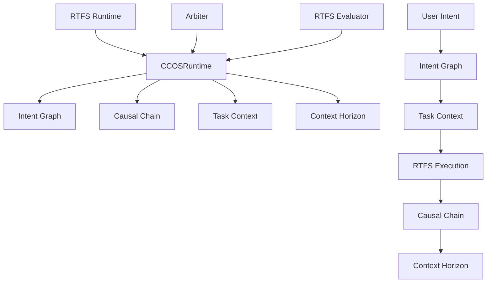

# CCOS Runtime Integration

**Purpose:** Document the integration of CCOS modules with RTFS runtime and execution flow

---

## Architecture Overview

The CCOS modules integrate with the RTFS runtime to provide cognitive capabilities while maintaining the existing RTFS execution model. The integration follows a layered approach where CCOS components enhance rather than replace RTFS functionality.

### Integration Layers



## Dynamic Execution Delegation

One of the core ideas from the **Sentient Runtime Vision** is that **every function call is dynamically delegated** based on real-time context. The Arbiter (or CCOSRuntime acting on its behalf) chooses _how_ to run each call across four execution paths:

| Delegation Path                 | When Used                                                           | Example                                                                             |
| ------------------------------- | ------------------------------------------------------------------- | ----------------------------------------------------------------------------------- |
| **Self-Execution (LLM)**        | Linguistic / creative tasks that benefit from generative reasoning. | `(summarize text)` – Arbiter answers directly.                                      |
| **Local Deterministic Runtime** | Pure, fast, verifiable operations.                                  | `(sum 1 2)` – CCOSRuntime executes via native RTFS evaluator.                       |
| **Agent Delegation**            | Specialized or heavy workload requiring external capability.        | `(analyze-market-data ...)` – Offloaded to remote agent via Capability Marketplace. |
| **Recursive Arbiter**           | Meta-level planning or simulation.                                  | `(find-optimal-plan-for ...)` – Spawns sandboxed Arbiter instance.                  |

**Decision Factors:** security policy, cost, latency, confidence, data locality, ethical constraints.

> The decision logic will live in a future `DelegationEngine` module, which consults Task Context, Intent constraints, SLA data from the Capability Marketplace, and Ethical Governance rules before selecting a path.

The selected path is recorded in the **Causal Chain of Thought** so that auditors can trace _why_ a particular delegation decision was made.

---

## CCOSRuntime Integration

### Core Integration Point

The `CCOSRuntime` serves as the main integration point between RTFS and CCOS components:

```rust
pub struct CCOSRuntime {
    pub intent_graph: IntentGraph,
    pub causal_chain: CausalChain,
    pub task_context: TaskContext,
    pub context_horizon: ContextHorizon,
    pub rtfs_runtime: RTFSRuntime,
}

impl CCOSRuntime {
    pub fn new() -> Result<Self, RuntimeError> {
        Ok(CCOSRuntime {
            intent_graph: IntentGraph::new()?,
            causal_chain: CausalChain::new()?,
            task_context: TaskContext::new()?,
            context_horizon: ContextHorizon::new()?,
            rtfs_runtime: RTFSRuntime::new()?,
        })
    }

    pub fn execute_with_cognitive_context(&mut self, plan: &Plan, user_intent: &str) -> Result<Value, RuntimeError> {
        // 1. Process user intent
        let intent_id = self.process_user_intent(user_intent)?;

        // 2. Create task context
        let context_id = self.create_execution_context(intent_id)?;

        // 3. Load relevant context
        let context = self.load_cognitive_context(context_id)?;

        // 4. Execute RTFS plan with context
        let result = self.execute_rtfs_plan(plan, context)?;

        // 5. Update cognitive state
        self.update_cognitive_state(intent_id, context_id, result.clone())?;

        Ok(result)
    }
}
```

### Intent Processing

```rust
impl CCOSRuntime {
    pub fn process_user_intent(&mut self, user_intent: &str) -> Result<IntentId, RuntimeError> {
        // Create or find existing intent
        let intent = Intent::new(user_intent.to_string())
            .with_metadata("source".to_string(), Value::String("user".to_string()));

        let intent_id = intent.intent_id.clone();
        self.intent_graph.store_intent(intent)?;

        // Find related intents
        let related = self.intent_graph.find_relevant_intents(user_intent)?;

        // Create relationships
        for related_intent in related {
            if related_intent.intent_id != intent_id {
                self.intent_graph.create_edge(
                    intent_id.clone(),
                    related_intent.intent_id.clone(),
                    EdgeType::RelatedTo,
                )?;
            }
        }

        Ok(intent_id)
    }
}
```

### Context Creation and Loading

```rust
impl CCOSRuntime {
    pub fn create_execution_context(&mut self, intent_id: IntentId) -> Result<ContextId, RuntimeError> {
        // Create task context
        let context_id = self.task_context.create_context(
            format!("execution_{}", intent_id),
            None,
        )?;

        // Load intent information into context
        if let Some(intent) = self.intent_graph.get_intent(&intent_id) {
            self.task_context.set_state(
                &context_id,
                "goal".to_string(),
                Value::String(intent.goal.clone()),
            )?;

            // Add constraints and preferences
            for (key, value) in &intent.constraints {
                self.task_context.set_environment(
                    &context_id,
                    format!("constraint_{}", key),
                    value.clone(),
                )?;
            }

            for (key, value) in &intent.preferences {
                self.task_context.set_environment(
                    &context_id,
                    format!("preference_{}", key),
                    value.clone(),
                )?;
            }
        }

        Ok(context_id)
    }

    pub fn load_cognitive_context(&mut self, context_id: ContextId) -> Result<ExecutionContext, RuntimeError> {
        // Load task context
        let task_context = self.task_context.get_context(&context_id)?;

        // Load related intents
        let goal = task_context.state.get("goal")
            .and_then(|v| v.as_string())
            .unwrap_or_default();

        let related_intents = self.intent_graph.find_relevant_intents(&goal)?;

        // Create execution context
        let mut execution_context = ExecutionContext::new();

        // Add task context
        execution_context.add_context(task_context);

        // Add related intents (virtualized)
        for intent in related_intents {
            execution_context.add_intent(intent);
        }

        // Apply context horizon constraints
        let horizon = self.context_horizon.get_active_horizon()?;
        execution_context = self.context_horizon.apply_boundaries(horizon, execution_context)?;

        Ok(execution_context)
    }
}
```

---

## RTFS Execution Integration

### Enhanced RTFS Execution

```rust
impl CCOSRuntime {
    pub fn execute_rtfs_plan(&mut self, plan: &Plan, context: ExecutionContext) -> Result<Value, RuntimeError> {
        // Start causal chain tracking
        let chain_id = self.causal_chain.start_execution_chain(
            format!("rtfs_execution_{}", plan.name),
        )?;

        // Execute each step with context
        let mut result = Value::Nil;

        for (step_index, step) in plan.steps.iter().enumerate() {
            // Record step start
            let step_node_id = self.causal_chain.trace_execution(
                &format!("step_{}", step_index),
                &[Value::String(step.name.clone())],
                &[],
            )?;

            // Execute RTFS step with cognitive context
            let step_result = self.execute_rtfs_step(step, &context)?;

            // Record step completion
            self.causal_chain.update_node(
                &step_node_id,
                &[step_result.clone()],
                true,
                None,
            )?;

            result = step_result;
        }

        // Complete causal chain
        self.causal_chain.complete_execution_chain(chain_id)?;

        Ok(result)
    }

    pub fn execute_rtfs_step(&mut self, step: &Step, context: &ExecutionContext) -> Result<Value, RuntimeError> {
        // Enhance RTFS environment with cognitive context
        let mut enhanced_env = self.rtfs_runtime.get_environment().clone();

        // Add task context environment variables
        for (key, value) in &context.task_context.environment {
            enhanced_env.insert(key.clone(), value.clone());
        }

        // Add intent information
        for intent in &context.intents {
            enhanced_env.insert(
                format!("intent_goal_{}", intent.intent_id),
                Value::String(intent.goal.clone()),
            );
        }

        // Execute with enhanced environment
        self.rtfs_runtime.set_environment(enhanced_env);
        let result = self.rtfs_runtime.evaluate(&step.expression)?;

        Ok(result)
    }
}
```

---

## Cognitive State Updates

### Post-Execution Updates

```rust
impl CCOSRuntime {
    pub fn update_cognitive_state(&mut self, intent_id: IntentId, context_id: ContextId, result: Value) -> Result<(), RuntimeError> {
        // Update intent with execution result
        if let Some(mut intent) = self.intent_graph.get_intent_mut(&intent_id) {
            intent.status = IntentStatus::Completed;
            intent.updated_at = SystemTime::now().duration_since(UNIX_EPOCH).unwrap().as_millis() as u64;

            // Store result in intent metadata
            intent.metadata.insert("last_result".to_string(), result.clone());

            self.intent_graph.update_intent(intent)?;
        }

        // Update task context with execution state
        self.task_context.set_state(
            &context_id,
            "execution_completed".to_string(),
            Value::Boolean(true),
        )?;

        self.task_context.set_state(
            &context_id,
            "final_result".to_string(),
            result,
        )?;

        // Update causal chain with final result
        if let Some(chain_id) = self.causal_chain.get_active_chain() {
            self.causal_chain.add_final_result(chain_id, result)?;
        }

        Ok(())
    }
}
```

---

## Context Horizon Integration

### Context Window Management

```rust
impl CCOSRuntime {
    pub fn apply_context_horizon(&mut self, context: ExecutionContext) -> Result<ExecutionContext, RuntimeError> {
        // Get active horizon
        let horizon = self.context_horizon.get_active_horizon()?;

        // Estimate token usage
        let token_estimate = self.context_horizon.estimate_tokens(&context)?;

        // Check if context fits within boundaries
        if !self.context_horizon.check_boundary(&horizon, token_estimate)? {
            // Apply reduction strategies
            let reduced_context = self.context_horizon.reduce_context(context, horizon)?;
            Ok(reduced_context)
        } else {
            Ok(context)
        }
    }

    pub fn record_context_access(&mut self, context_id: &ContextId, access_type: &str) -> Result<(), RuntimeError> {
        // Record access pattern for optimization
        self.context_horizon.record_access_pattern(
            "context_access".to_string(),
            access_type.to_string(),
        )?;

        // Update access metadata
        self.task_context.set_metadata(
            context_id,
            "last_access".to_string(),
            Value::Number(SystemTime::now().duration_since(UNIX_EPOCH).unwrap().as_millis() as f64),
        )?;

        Ok(())
    }
}
```

---

## Execution Flow Examples

### Example 1: Simple Intent Execution

```rust
// User provides intent
let user_intent = "Analyze quarterly sales data";

// CCOSRuntime processes the intent
let mut ccos_runtime = CCOSRuntime::new()?;
let result = ccos_runtime.execute_with_cognitive_context(&plan, user_intent)?;

// The execution flow:
// 1. Intent Graph: Creates/updates intent for sales analysis
// 2. Task Context: Creates execution context with sales-related environment
// 3. Context Horizon: Ensures context fits within token limits
// 4. Causal Chain: Tracks execution steps
// 5. RTFS Runtime: Executes the actual analysis
// 6. Cognitive State: Updates intent and context with results
```

### Example 2: Multi-Step Pipeline

```rust
// Complex pipeline execution
let pipeline_intent = "Process customer data and generate insights";

let mut ccos_runtime = CCOSRuntime::new()?;

// Execute with cognitive context
let result = ccos_runtime.execute_with_cognitive_context(&pipeline_plan, pipeline_intent)?;

// Each step is tracked in the causal chain
// Context is maintained across steps
// Intent relationships are discovered and stored
// Results are accumulated in the task context
```

### Example 3: Context-Aware Execution

```rust
// Execution with existing context
let context_id = ccos_runtime.task_context.create_context("existing_session", None)?;

// Set session-wide environment
ccos_runtime.task_context.set_environment(
    &context_id,
    "user_id".to_string(),
    Value::String("john_doe".to_string()),
)?;

// Execute with inherited context
let result = ccos_runtime.execute_with_context(&plan, &context_id)?;

// The execution inherits the session context
// New intents are related to existing ones
// Causal chain shows the relationship to previous executions
```

---

## Performance Considerations

### Context Loading

- **Lazy Loading:** Load context components only when needed
- **Caching:** Cache frequently accessed context elements
- **Virtualization:** Apply context horizon constraints early

### Intent Processing

- **Batch Processing:** Process multiple intents together when possible
- **Incremental Updates:** Update intent relationships incrementally
- **Semantic Caching:** Cache semantic search results

### Causal Chain Tracking

- **Selective Tracking:** Track only significant operations
- **Compression:** Compress chain data for long executions
- **Archival:** Archive old chains to reduce memory usage

---

## Error Handling

### Cognitive Error Recovery

```rust
impl CCOSRuntime {
    pub fn handle_cognitive_error(&mut self, error: RuntimeError, context_id: &ContextId) -> Result<(), RuntimeError> {
        // Record error in causal chain
        if let Some(chain_id) = self.causal_chain.get_active_chain() {
            self.causal_chain.record_error(chain_id, &error)?;
        }

        // Update task context with error state
        self.task_context.set_state(
            context_id,
            "error".to_string(),
            Value::String(error.to_string()),
        )?;

        // Update intent status
        if let Some(intent_id) = self.get_intent_for_context(context_id) {
            if let Some(mut intent) = self.intent_graph.get_intent_mut(&intent_id) {
                intent.status = IntentStatus::Failed;
                intent.metadata.insert("error".to_string(), Value::String(error.to_string()));
                self.intent_graph.update_intent(intent)?;
            }
        }

        Ok(())
    }
}
```

---

## Testing Integration

### Integration Tests

```rust
#[test]
fn test_ccos_runtime_integration() {
    let mut ccos_runtime = CCOSRuntime::new().unwrap();

    // Test intent processing
    let intent_id = ccos_runtime.process_user_intent("Test goal").unwrap();
    assert!(ccos_runtime.intent_graph.get_intent(&intent_id).is_some());

    // Test context creation
    let context_id = ccos_runtime.create_execution_context(intent_id).unwrap();
    assert!(ccos_runtime.task_context.get_context(&context_id).is_some());

    // Test execution
    let plan = Plan::new_rtfs("test_plan".to_string(), vec![]);
    let result = ccos_runtime.execute_with_cognitive_context(&plan, "Test goal").unwrap();
    assert!(result != Value::Nil);
}

#[test]
fn test_context_horizon_integration() {
    let mut ccos_runtime = CCOSRuntime::new().unwrap();

    // Create large context
    let context_id = ccos_runtime.task_context.create_context("large_context", None).unwrap();

    // Add many variables
    for i in 0..1000 {
        ccos_runtime.task_context.set_environment(
            &context_id,
            format!("var_{}", i),
            Value::String(format!("value_{}", i)),
        ).unwrap();
    }

    // Apply context horizon
    let context = ccos_runtime.load_cognitive_context(context_id).unwrap();
    assert!(context.task_context.environment.len() < 1000); // Should be reduced
}
```

---

## Future Enhancements

1. **Distributed Execution:** Support for distributed CCOS runtime
2. **Advanced Caching:** Intelligent caching of cognitive state
3. **ML Integration:** Machine learning for intent prediction and optimization
4. **Real-time Collaboration:** Multi-user cognitive state management
5. **Advanced Analytics:** Deep analytics on cognitive execution patterns
6. **Visualization:** Real-time visualization of cognitive execution

---

## References

- [CCOS Foundation Documentation](./CCOS_FOUNDATION.md)
- [Intent Graph API](./INTENT_GRAPH_API.md)
- [Task Context Documentation](./TASK_CONTEXT_DETAILED.md)
- [Causal Chain Documentation](./CAUSAL_CHAIN_DETAILED.md)
- [Context Horizon Documentation](./CONTEXT_HORIZON_DETAILED.md)

## Recent Runtime Enhancements (June 2025 – July 2025)

> These updates correspond to the first wiring of CCOS cognitive substrate into the RTFS runtime. They are implemented in PR _"Plan lifecycle & capability logging"_ (July 2025).

### 1. Natural-language Preservation

- `Intent` now stores the user's full **`original_request`** string.  
  This guarantees that the _exact_ wording is never lost even after multiple processing passes or intent renaming.

### 2. Plan Lifecycle & Provenance Fields

- `Plan` gains **`status`**, **`parent_plan_id`**, **`aborted_at_step`**.  
  This allows:
  - runtime pause/resume bookkeeping,
  - chain-of-command tracking when plans supersede each other,
  - forensic analysis of failures (which step aborted?).
- `CausalChain` helper methods were added:
  - `log_plan_started`
  - `log_plan_aborted`
  - `log_plan_completed`

### 3. Unified Action Categorisation

`ActionType` enum was introduced with seven explicit variants:

```
CapabilityCall | PlanStarted | PlanPaused | PlanResumed | PlanAborted | PlanCompleted | InternalStep
```

This replaces implicit string matching and gives the ledger a fixed taxonomy for analytics.

### 4. Human-in-the-Loop Capability

- Introduced **constant** `ASK_HUMAN_CAPABILITY_ID = "ccos.ask-human"`.
- Std-lib now exposes `(ask-human prompt [expected-type])` returning
  `#resource-handle("prompt-…")` so the evaluator remains agnostic of user-interaction mechanics.

### 5. Capability Logging Infrastructure

- New file `runtime/capability.rs` defines a `Capability` wrapper that:
  1. Accepts a logger closure `(cap_id, args) -> Result<()>`,
  2. Executes the logger **before** calling the inner function.
- Helper `inject_capability(env, sym, cap_id, arity, logger)` swaps an existing `Value::Function` for a wrapped capability.

### 6. Automatic Ledger Recording of Capability Calls

`CausalChain::log_capability_call(plan_id, intent_id, capability_id, function_name, args)` creates and signs an `Action` of type `CapabilityCall` and records performance metrics.

### 7. Arbiter ↔ Runtime Wiring

```rust
Arbiter::execute_plan ->
    let mut env = StandardLibrary::create_global_environment();
    self.inject_standard_capabilities(&mut env, plan_id, intent_id)?;
```

`inject_standard_capabilities` currently wraps **`ask-human`** but is designed to scale to any future capability. All capability calls are now logged automatically – the evaluator itself stays pure.

### 8. Goodbye `println!`

The temporary stdout print inside `ask_human` has been removed to avoid mixing runtime and UI layers. Prompt surfacing will be handled by `Arbiter::issue_user_prompt` in a subsequent milestone.

---
