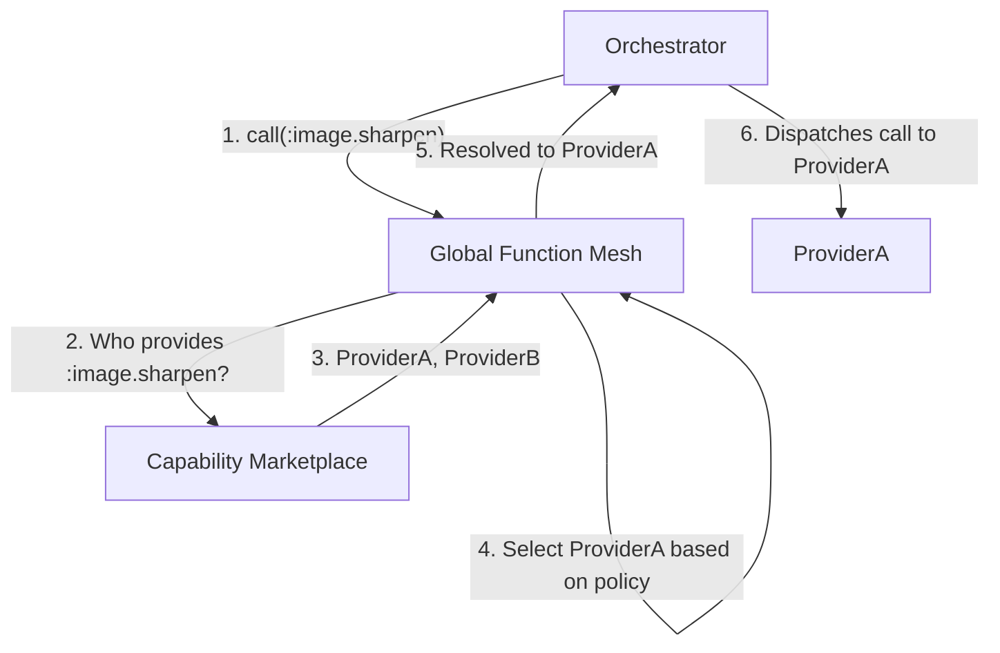

# CCOS Specification 007: Global Function Mesh

**Status:** Proposed
**Version:** 1.0
**Date:** 2025-07-20
**Related:**
- [SEP-000: System Architecture](./000-ccos-architecture.md)
- [SEP-004: Capabilities and Delegation](./004-capabilities-and-delegation.md)

## 1. Abstract

The Global Function Mesh (GFM) is a universal discovery and routing layer for CCOS capabilities. It acts as a "DNS for functions," allowing plans to call abstract capabilities (e.g., `:image.sharpen`) without being hardcoded to a specific provider. The GFM resolves these abstract requests to concrete, available `Capability` providers at runtime based on policy, performance, and cost.

## 2. Position in the Architecture

The GFM sits within the **Orchestration Layer**, acting as an intermediary between the **Orchestrator** and the **Capability Marketplace**.

-   **Orchestrator**: When it encounters a `(call ...)` in a plan, it does not look up the capability directly. Instead, it asks the GFM to resolve the function name.
-   **Global Function Mesh**: It takes the function name and a set of criteria (from the `RuntimeContext`) and determines the best provider.
-   **Capability Marketplace**: This is the local registry of concrete providers that the GFM queries to find candidates for resolution. The GFM can also query other decentralized registries.

## 3. Core Functionality

### 3.1. Function Resolution

The GFM's primary task is to resolve a function name to a specific, executable `Capability` provider. This process involves:
1.  **Querying Sources**: Checking the local `CapabilityMarketplace` first, then a resolution cache, and finally external/decentralized registries.
2.  **Filtering**: Removing any providers that are not permitted by the current `RuntimeContext`'s security policy.
3.  **Selection**: Applying a selection strategy to the remaining candidates to choose the single best provider for the current call.

### 3.2. Provider Selection Strategies

The GFM is configured with a strategy to decide which provider to use when multiple are available. Standard strategies include:
-   `LowestCost`: Choose the cheapest provider based on SLA data.
-   `FastestResponse`: Choose the provider with the lowest latency.
-   `HighestAvailability`: Choose the most reliable provider.
-   `LoadBalance`: Distribute calls among available providers.

### 3.3. Decentralization

While the GFM uses the local `CapabilityMarketplace` as its primary source, its true power comes from its ability to query a decentralized network of registries. This allows a CCOS instance to discover and use capabilities provided by other instances across a network, enabling a truly global, collaborative ecosystem. Implementations for this can be based on Git, IPFS, or other distributed technologies.

## 4. Benefits

-   **Decoupling**: Plans can be written in a portable way, focusing on *what* they need to do (`:image.sharpen`) rather than *who* should do it (`:acme-corp.image-sharpener-v2`).
-   **Resilience**: If a preferred provider is down, the GFM can automatically failover to an alternative provider without any change to the plan itself.
-   **Optimization**: The GFM can perform runtime optimization, selecting the most cost-effective or performant provider based on real-time conditions and the user's preferences (e.g., a `{"priority": "cost"}` preference in the `Intent`).
-   **Interoperability**: Enables a vast ecosystem where different CCOS instances can share and consume each other's capabilities seamlessly.
