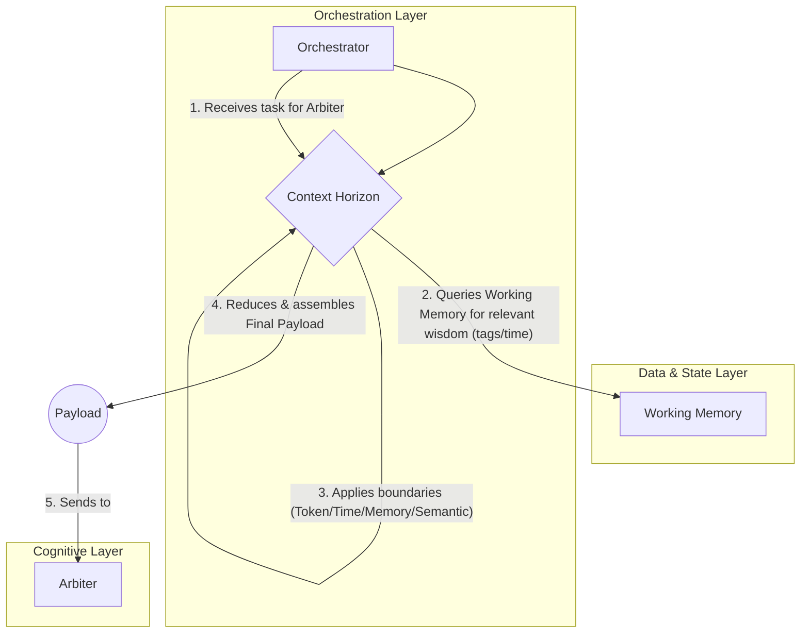

# CCOS Specification 009: Context Horizon

- **Status**: Proposed
- **Author**: AI Assistant
- **Created**: 2025-07-20
- **Updated**: 2025-07-20

## 1. Abstract

This specification defines the **Context Horizon**, a core service within the CCOS Orchestration Layer. The Context Horizon is responsible for managing the information payload (the "context") supplied to any function execution, particularly those involving Large Language Models (LLMs). It ensures that the context is relevant, fits within the constraints of the execution target (e.g., token limits), and is optimized for performance and cost.

## 2. Motivation

Modern AI models have finite context windows. Passing an entire database or conversation history is infeasible. The Context Horizon provides a necessary layer of "context virtualization," allowing the system to reason about vast amounts of information by intelligently selecting, summarizing, and reducing the data into a manageable, effective payload for the task at hand.

## 3. Core Concepts

### 3.1. Boundaries

A **Boundary** defines a constraint on the context. These can be based on various factors:

-   **TokenLimit**: A hard limit on the number of tokens (e.g., 8192 for GPT-4).
-   **TimeLimit**: A limit on how far back in time data can be sourced.
-   **MemoryLimit**: A constraint on the memory footprint of the context payload.
-   **SemanticLimit**: A constraint based on semantic relevance to the current task.

### 3.2. Context Virtualization

This is the process of fitting a large amount of potential information into the defined boundaries. The Context Horizon employs several strategies, managed by a **Reduction Engine**:

-   **Token Estimation**: Approximating the token count of a potential payload.
-   **Truncation**: Cutting off text or data that exceeds limits.
-   **Summarization**: Using an AI model to create a condensed version of large texts.
-   **Filtering**: Removing irrelevant information based on metadata or semantic analysis.

### 3.3. Access Patterns

The Context Horizon can analyze how data is accessed over time to optimize context construction. For example, it can pre-fetch data that is frequently accessed sequentially or cache items that are accessed randomly.

## 4. Architectural Integration

### 4.1. Position in the Execution Flow

The Context Horizon is invoked by the **Orchestrator** before delegating a plan/sub-task to the **Arbiter** or any cognitive component. Its role is to prepare a token-aware, relevant context based on defined boundaries and policies.



### 4.2. Relationship with Working Memory

The Context Horizon is the primary consumer of **Working Memory (`SEP-013`)**. It queries WM for relevant distilled wisdom within specified boundaries, optionally merges with fresh distillation outputs, deduplicates (e.g., by content hash), ranks, and reduces to meet token constraints. This separation of concerns is critical:

-   **Working Memory**: Long-lived, rebuildable store of digested information with pluggable backends (in-memory/JSONL, vector, graph, time-series).
-   **Context Horizon**: Real-time, task-specific retrieval, ranking, boundary enforcement, and payload assembly.

Direct raw `Causal Chain` queries are avoided in favor of WM.

## 5. Boundary Model and Data Structures

Introduce an explicit boundary model to support governance-managed constraints and extensibility.

```rust
// The main container for context construction rules/policies.
pub struct ContextHorizon {
    pub horizon_id: HorizonId,
    pub name: String,
    pub boundaries: HashMap<String, Boundary>,
    // Optional: strategy weights for ranking and reduction
    pub strategy: ReductionStrategy,
    // Other metadata and execution hints...
}

// A specific rule or constraint on the context.
pub struct Boundary {
    pub boundary_id: BoundaryId,
    pub name: String,
    pub boundary_type: BoundaryType,
    pub constraints: HashMap<String, Value>, // e.g., {"max_tokens": 8192, "from_ts": 1719772800}
}

pub enum BoundaryType {
    TokenLimit,   // e.g., max_tokens for overall payload or per-section allocations
    TimeLimit,    // e.g., from_ts, to_ts to constrain recall window
    MemoryLimit,  // e.g., max_bytes for payload footprint
    SemanticLimit // e.g., min_relevance_score, tag allow/deny lists
}

// Optional ranking/reduction configuration.
pub struct ReductionStrategy {
    pub enable_semantic_scoring: bool,
    pub time_decay_half_life_s: Option<u64>,
    pub per_section_budgets: HashMap<String, usize>, // e.g., {"intents": 4000, "wisdom": 2000, "plan": 2000}
}
```

### 5.1. Retrieval and Reduction Flow

1) Retrieve
- Query WM for wisdom entries using:
  - tags_any: e.g., ["wisdom","distillation"] + task/domain tags
  - time window: derived from TimeLimit (from_ts/to_ts)
  - limit: coarse cap guided by TokenLimit

2) Merge and Deduplicate
- Merge retrieved WM entries with any fresh distillation outputs from the current causal analysis.
- Deduplicate by content hash or title/content equivalence.

3) Rank
- Apply semantic scoring (if enabled) and time-decay ranking to prioritize relevance and recency.

4) Reduce
- Estimate tokens and reduce per-section according to per_section_budgets and overall TokenLimit:
  - reduce_intents
  - reduce_wisdom (from WM + fresh)
  - reduce_plan

5) Assemble
- Build the final payload for Arbiter with provenance-preserving slices and metadata.

This model enables the Orchestrator to manage complex information flows with policy-driven, auditable constraints across diverse execution targets.
