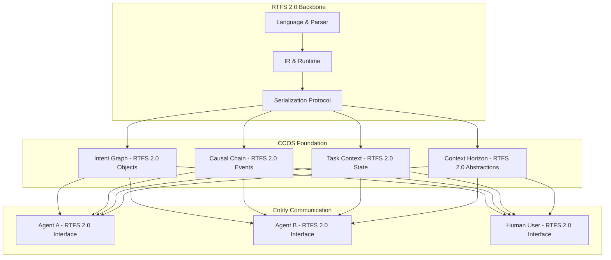
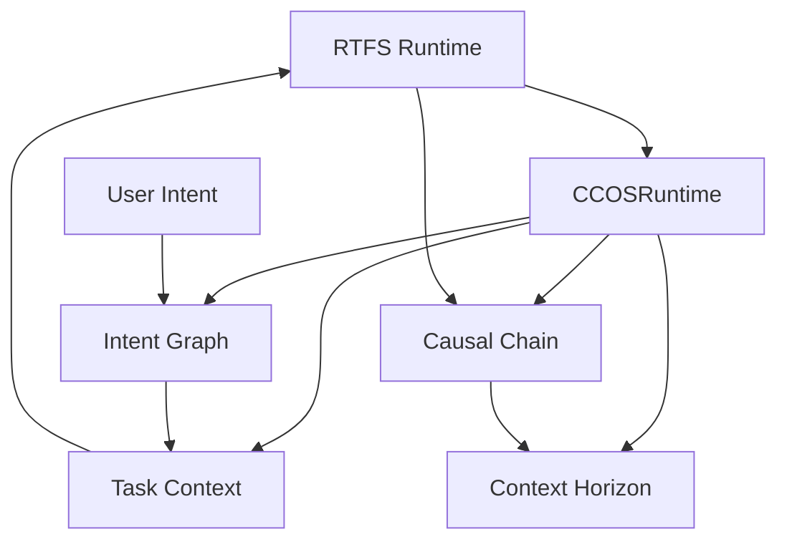

# CCOS Documentation Summary

**Purpose:** Overview and navigation guide for CCOS documentation

---

## Core Concept: RTFS 2.0 as the Backbone

**RTFS 2.0** is the foundational language that enables CCOS systems to represent and exchange intent, tasks, and plans between entities. It serves as:

- **The Backbone Language** - All CCOS components express their data structures and communication in RTFS 2.0
- **The Exchange Protocol** - Entities communicate using RTFS 2.0 serialization for intent, task, and plan sharing
- **The Reason** - RTFS 2.0 was specifically designed to enable this type of cognitive system coordination

This fundamental relationship makes RTFS 2.0 not just an execution substrate, but the universal language for cognitive computing orchestration.

---

## Documentation Structure

The CCOS documentation is organized into the following sections:

### Core Foundation

- **[CCOS_FOUNDATION.md](./CCOS_FOUNDATION.md)** - Architecture overview, modules, and RTFS 2.0 as the backbone language
- **[RTFS_MIGRATION_PLAN.md](./RTFS_MIGRATION_PLAN.md)** - Migration path from RTFS 2.0 to CCOS

### Module Documentation

- **[INTENT_GRAPH_API.md](./INTENT_GRAPH_API.md)** - Intent Graph API reference and usage
- **[TASK_CONTEXT_DETAILED.md](./TASK_CONTEXT_DETAILED.md)** - Task Context detailed documentation
- **[CAUSAL_CHAIN_DETAILED.md](./CAUSAL_CHAIN_DETAILED.md)** - Causal Chain detailed documentation
- **[CONTEXT_HORIZON_DETAILED.md](./CONTEXT_HORIZON_DETAILED.md)** - Context Horizon detailed documentation

### Integration and Implementation

- **[CCOS_RUNTIME_INTEGRATION.md](./CCOS_RUNTIME_INTEGRATION.md)** - Runtime integration with RTFS
- **[IMPLEMENTATION_GUIDE.md](./IMPLEMENTATION_GUIDE.md)** - Developer implementation guide

### Future Evolution

- **[SELF_HOSTING_ROADMAP.md](./SELF_HOSTING_ROADMAP.md)** - Roadmap for self-hosting in RTFS 2.0
- **[RTFS_SELF_HOSTING_EVOLUTION.md](./RTFS_SELF_HOSTING_EVOLUTION.md)** - Detailed evolution strategy
- **[GLOBAL_FUNCTION_MESH.md](./GLOBAL_FUNCTION_MESH.md)** - Universal function naming and discovery (stub)
- **[CAPABILITY_MARKETPLACE.md](./CAPABILITY_MARKETPLACE.md)** - Economic layer with SLA metadata (stub)
- **[ETHICAL_GOVERNANCE_FRAMEWORK.md](./ETHICAL_GOVERNANCE_FRAMEWORK.md)** - Constitutional AI and ethics (stub)
- **[ARBITER_FEDERATION.md](./ARBITER_FEDERATION.md)** - Multiple specialized arbiters collaboration (stub)
- **[ADVANCED_VISION_ALIGNMENT.md](./ADVANCED_VISION_ALIGNMENT.md)** - Mapping SRV → CCOS docs (living doc)

---

## Quick Reference

### Core CCOS Components

| Component           | Purpose                                | Key Features                                         |
| ------------------- | -------------------------------------- | ---------------------------------------------------- |
| **Intent Graph**    | Manage user goals and relationships    | Persistent storage, semantic search, edge inference  |
| **Task Context**    | Manage execution environment and state | Environment variables, state management, inheritance |
| **Causal Chain**    | Track execution causality              | Execution tracing, dependency analysis, backtracking |
| **Context Horizon** | Manage context boundaries              | Token limits, virtualization, access patterns        |

### Key Data Structures

```rust
// Intent Graph
pub struct Intent {
    pub intent_id: IntentId,
    pub goal: String,
    pub constraints: HashMap<String, Value>,
    pub preferences: HashMap<String, Value>,
    pub status: IntentStatus,
}

// Task Context
pub struct TaskContext {
    pub context_id: ContextId,
    pub environment: HashMap<String, Value>,
    pub state: HashMap<String, Value>,
    pub parent_context: Option<ContextId>,
}

// Causal Chain
pub struct CausalChainNode {
    pub node_id: NodeId,
    pub operation: String,
    pub inputs: Vec<Value>,
    pub outputs: Vec<Value>,
    pub dependencies: Vec<NodeId>,
}

// Context Horizon
pub struct ContextHorizon {
    pub horizon_id: HorizonId,
    pub boundaries: HashMap<String, Boundary>,
    pub access_patterns: Vec<AccessPattern>,
}
```

### Common Usage Patterns

#### 1. Basic Intent-Driven Execution

```rust
let mut ccos_runtime = CCOSRuntime::new()?;
let plan = Plan::new_rtfs("analysis".to_string(), vec![]);
let result = ccos_runtime.execute_with_cognitive_context(&plan, "Analyze data")?;
```

#### 2. Context-Aware Execution

```rust
let context_id = ccos_runtime.task_context.create_context("session", None)?;
ccos_runtime.task_context.set_environment(&context_id, "user_id", Value::String("john".to_string()))?;
let result = ccos_runtime.execute_with_context(&plan, &context_id)?;
```

#### 3. Intent Management

```rust
let intent = Intent::new("Improve sales".to_string())
    .with_constraint("timeline", Value::String("3 months".to_string()));
let intent_id = ccos_runtime.intent_graph.store_intent(intent)?;
```

#### 4. Causal Tracking

```rust
let chain_id = ccos_runtime.causal_chain.start_execution_chain("workflow")?;
let node_id = ccos_runtime.causal_chain.trace_execution("operation", &inputs, &outputs)?;
ccos_runtime.causal_chain.complete_execution_chain(chain_id)?;
```

---

## Architecture Overview

### RTFS 2.0 as the Backbone



### CCOS Runtime Integration



### Execution Flow

1. **Intent Processing** - User intent is processed and stored in Intent Graph
2. **Context Creation** - Task Context is created with intent information
3. **Context Loading** - Relevant context is loaded and virtualized
4. **RTFS Execution** - RTFS plan is executed with cognitive context
5. **State Updates** - Intent and context are updated with results
6. **Causal Tracking** - Execution causality is recorded

---

## Key Features

### Intent Graph Features

- **Persistent Storage** - Intents persist across sessions
- **Semantic Search** - Find related intents by content
- **Edge Inference** - Automatic relationship detection
- **Conflict Detection** - Identify conflicting goals
- **Lifecycle Management** - Track intent status and completion

### Task Context Features

- **Environment Variables** - Runtime configuration
- **State Management** - Execution state tracking
- **Context Inheritance** - Parent-child context relationships
- **Virtualization** - Context window management
- **Context Merging** - Combine multiple contexts

### Causal Chain Features

- **Execution Tracing** - Track operation causality
- **Dependency Analysis** - Understand operation relationships
- **Backtracking** - Find causes of results
- **Impact Analysis** - Understand operation effects
- **Performance Monitoring** - Track execution metrics

### Context Horizon Features

- **Token Management** - Respect LLM context limits
- **Boundary Enforcement** - Apply various constraints
- **Access Pattern Analysis** - Optimize context usage
- **Reduction Strategies** - Intelligent context compression
- **Performance Optimization** - Efficient context handling

---

## Migration Path

### From RTFS 2.0 to CCOS

#### Phase 1: Foundation

- Implement CCOS core modules
- Create CCOSRuntime integration layer
- Add basic intent processing

#### Phase 2: Enhanced Execution

- Enable context-aware execution
- Add causal chain tracking
- Implement context virtualization

#### Phase 3: Advanced Features

- Add intent relationship management
- Implement advanced context features
- Enable performance optimization

#### Phase 4: Production

- Add monitoring and analytics
- Implement error recovery
- Optimize for production workloads

---

## Performance Considerations

### Optimization Strategies

- **Lazy Loading** - Load context components on demand
- **Caching** - Cache frequently accessed data
- **Batch Operations** - Process multiple items together
- **Virtualization** - Apply context limits early
- **Compression** - Compress large data structures

### Resource Management

- **Memory Limits** - Configurable memory constraints
- **Token Limits** - Respect LLM context windows
- **Storage Optimization** - Efficient data storage
- **Garbage Collection** - Automatic cleanup of old data

---

## Testing Strategy

### Unit Testing

- Test individual CCOS components
- Verify data structure operations
- Test error handling and edge cases

### Integration Testing

- Test CCOS-RTFS integration
- Verify end-to-end workflows
- Test performance under load

### System Testing

- Test complete CCOS runtime
- Verify cognitive capabilities
- Test real-world scenarios

---

## Future Roadmap

### Short Term (Next 3 months)

- Complete CCOS core implementation
- Add comprehensive testing
- Implement basic monitoring

### Medium Term (3-6 months)

- Add advanced intent features
- Implement ML-based optimization
- Add distributed capabilities

### Long Term (6+ months)

- Add real-time collaboration
- Implement advanced analytics
- Add visualization tools

---

## Getting Started

### For Developers

1. Read **[CCOS_FOUNDATION.md](./CCOS_FOUNDATION.md)** for architecture overview
2. Review **[IMPLEMENTATION_GUIDE.md](./IMPLEMENTATION_GUIDE.md)** for usage patterns
3. Check **[CCOS_RUNTIME_INTEGRATION.md](./CCOS_RUNTIME_INTEGRATION.md)** for integration details

### For System Architects

1. Start with **[CCOS_FOUNDATION.md](./CCOS_FOUNDATION.md)**
2. Review **[RTFS_MIGRATION_PLAN.md](./RTFS_MIGRATION_PLAN.md)** for migration strategy
3. Check module documentation for detailed architecture

### For Operations

1. Review **[IMPLEMENTATION_GUIDE.md](./IMPLEMENTATION_GUIDE.md)** for deployment
2. Check performance considerations in each module
3. Review testing strategy for validation

---

## Support and Resources

### Documentation

- All documentation is in the `docs/ccos/` directory
- Each module has detailed API documentation
- Implementation guide provides practical examples

### Code Examples

- See `src/ccos/` for implementation
- Check `tests/` for usage examples
- Review integration tests for patterns

### Architecture Decisions

- Foundation document explains design rationale
- Migration plan shows evolution strategy
- Each module documents its specific design

---

## References

### External Documentation

- [RTFS 2.0 Specifications](../rtfs-2.0/specs/)
- [Vision Document](../vision/SENTIENT_RUNTIME_VISION.md)
- [CCOS Roadmap](../CCOS_ROADMAP.md)

### Internal Documentation

- [CCOS Foundation](./CCOS_FOUNDATION.md)
- [Implementation Guide](./IMPLEMENTATION_GUIDE.md)
- [Runtime Integration](./CCOS_RUNTIME_INTEGRATION.md)

---

## Contributing

### Documentation Standards

- Use clear, concise language
- Include code examples
- Provide practical usage patterns
- Keep documentation up to date

### Code Standards

- Follow Rust conventions
- Include comprehensive tests
- Document public APIs
- Maintain backward compatibility

### Review Process

- All changes require review
- Test all code examples
- Verify documentation accuracy
- Update related documents
