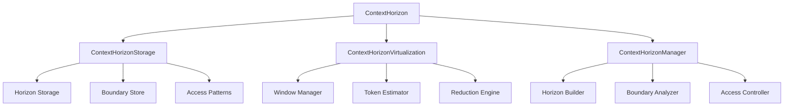

# Context Horizon - Detailed Documentation

**Module:** `src/ccos/context_horizon.rs`  
**Purpose:** Manage context boundaries, virtualization, and LLM context window constraints

---

## Architecture Overview

The Context Horizon implements the "Context Horizon" concept from the CCOS vision. It manages the boundaries of what information is available to the LLM at any given time, ensuring efficient use of context windows while maintaining access to relevant information.

### Core Components



---

## Data Structures

### Context Horizon

```rust
pub struct ContextHorizon {
    pub horizon_id: HorizonId,         // Unique identifier
    pub name: String,                  // Horizon name/description
    pub boundaries: HashMap<String, Boundary>, // Context boundaries
    pub access_patterns: Vec<AccessPattern>, // Access patterns
    pub metadata: HashMap<String, Value>, // Additional metadata
    pub parent_horizon: Option<HorizonId>, // Parent horizon
    pub created_at: u64,               // Creation timestamp
    pub updated_at: u64,               // Last update timestamp
    pub is_active: bool,               // Active status
}
```

### Boundary

```rust
pub struct Boundary {
    pub boundary_id: BoundaryId,       // Unique identifier
    pub name: String,                  // Boundary name
    pub boundary_type: BoundaryType,   // Type of boundary
    pub constraints: HashMap<String, Value>, // Boundary constraints
    pub metadata: HashMap<String, Value>, // Additional metadata
}

pub enum BoundaryType {
    TokenLimit,    // Token-based boundary
    TimeLimit,     // Time-based boundary
    MemoryLimit,   // Memory-based boundary
    AccessLimit,   // Access-based boundary
    SemanticLimit, // Semantic-based boundary
}
```

### Access Pattern

```rust
pub struct AccessPattern {
    pub pattern_id: PatternId,         // Unique identifier
    pub name: String,                  // Pattern name
    pub pattern_type: PatternType,     // Type of pattern
    pub frequency: f64,                // Access frequency
    pub metadata: HashMap<String, Value>, // Additional metadata
}

pub enum PatternType {
    Sequential,    // Sequential access pattern
    Random,        // Random access pattern
    Hierarchical,  // Hierarchical access pattern
    Temporal,      // Temporal access pattern
}
```

---

## API Reference

### Core Context Horizon Operations

#### Creating and Managing Horizons

```rust
// Create a new context horizon
let horizon = ContextHorizon::new("sales_analysis_horizon".to_string())
    .with_boundary("token_limit".to_string(), Boundary::new("token_limit".to_string(), BoundaryType::TokenLimit))
    .with_access_pattern("sequential".to_string(), AccessPattern::new("sequential".to_string(), PatternType::Sequential))
    .with_metadata("priority".to_string(), Value::String("high".to_string()));

// Store the horizon
context_horizon.store_horizon(horizon)?;

// Activate a horizon
context_horizon.activate_horizon("sales_analysis_horizon".to_string())?;

// Deactivate a horizon
context_horizon.deactivate_horizon("sales_analysis_horizon".to_string())?;
```

#### Boundary Management

```rust
// Set boundary constraint
context_horizon.set_boundary_constraint("token_limit".to_string(), "max_tokens".to_string(), Value::Number(4000.0))?;

// Get boundary constraint
let max_tokens = context_horizon.get_boundary_constraint("token_limit".to_string(), "max_tokens")?;

// Check if content fits within boundary
let fits = context_horizon.check_boundary("token_limit".to_string(), &content)?;

// Apply boundary reduction
let reduced_content = context_horizon.apply_boundary_reduction("token_limit".to_string(), &content)?;
```

#### Access Pattern Management

```rust
// Record access pattern
context_horizon.record_access_pattern("sequential".to_string(), "data_access".to_string())?;

// Get access pattern frequency
let frequency = context_horizon.get_access_pattern_frequency("sequential".to_string())?;

// Optimize access pattern
context_horizon.optimize_access_pattern("sequential".to_string())?;
```

---

## Context Virtualization

### Token Estimation

```rust
impl ContextHorizonVirtualization {
    pub fn estimate_tokens(&self, content: &str) -> usize {
        // Simple character-based estimation (~4 characters per token)
        content.len() / 4
    }

    pub fn estimate_tokens_for_value(&self, value: &Value) -> usize {
        match value {
            Value::String(s) => self.estimate_tokens(s),
            Value::Number(n) => n.to_string().len() / 4,
            Value::Boolean(_) => 1,
            Value::Array(arr) => arr.iter().map(|v| self.estimate_tokens_for_value(v)).sum(),
            Value::Object(obj) => obj.iter().map(|(k, v)| self.estimate_tokens(k) + self.estimate_tokens_for_value(v)).sum(),
            Value::Nil => 1,
        }
    }
}
```

### Context Reduction

```rust
impl ContextHorizonVirtualization {
    pub fn reduce_context(&self, content: &str, target_tokens: usize) -> Result<String, RuntimeError> {
        let current_tokens = self.estimate_tokens(content);

        if current_tokens <= target_tokens {
            return Ok(content.to_string());
        }

        // Apply reduction strategies
        let mut reduced = content.to_string();

        // Strategy 1: Remove comments
        reduced = self.remove_comments(&reduced);

        // Strategy 2: Truncate long strings
        reduced = self.truncate_long_strings(&reduced, target_tokens);

        // Strategy 3: Remove whitespace
        reduced = self.remove_excess_whitespace(&reduced);

        // Strategy 4: Summarize content
        if self.estimate_tokens(&reduced) > target_tokens {
            reduced = self.summarize_content(&reduced, target_tokens)?;
        }

        Ok(reduced)
    }

    fn remove_comments(&self, content: &str) -> String {
        // Remove single-line comments
        let lines: Vec<&str> = content.lines()
            .filter(|line| !line.trim().starts_with("//"))
            .collect();
        lines.join("\n")
    }

    fn truncate_long_strings(&self, content: &str, target_tokens: usize) -> String {
        // Truncate strings longer than a certain length
        let mut result = String::new();
        let mut current_tokens = 0;

        for line in content.lines() {
            let line_tokens = self.estimate_tokens(line);
            if current_tokens + line_tokens <= target_tokens {
                result.push_str(line);
                result.push('\n');
                current_tokens += line_tokens;
            } else {
                break;
            }
        }

        result
    }

    fn remove_excess_whitespace(&self, content: &str) -> String {
        // Remove excessive whitespace while preserving structure
        content.lines()
            .map(|line| line.trim())
            .filter(|line| !line.is_empty())
            .collect::<Vec<&str>>()
            .join("\n")
    }

    fn summarize_content(&self, content: &str, target_tokens: usize) -> Result<String, RuntimeError> {
        // Create a summary of the content
        let lines: Vec<&str> = content.lines().collect();
        let summary_lines = lines.len() / 2; // Take half the lines

        let mut summary = String::new();
        let mut current_tokens = 0;

        for (i, line) in lines.iter().enumerate() {
            if i >= summary_lines {
                break;
            }

            let line_tokens = self.estimate_tokens(line);
            if current_tokens + line_tokens <= target_tokens {
                summary.push_str(line);
                summary.push('\n');
                current_tokens += line_tokens;
            } else {
                break;
            }
        }

        Ok(summary)
    }
}
```

---

## Boundary Management

### Boundary Types and Constraints

```rust
impl ContextHorizonManager {
    pub fn create_token_boundary(&mut self, name: String, max_tokens: usize) -> Result<BoundaryId, RuntimeError> {
        let boundary_id = BoundaryId::new();
        let boundary = Boundary {
            boundary_id: boundary_id.clone(),
            name,
            boundary_type: BoundaryType::TokenLimit,
            constraints: HashMap::from([
                ("max_tokens".to_string(), Value::Number(max_tokens as f64)),
            ]),
            metadata: HashMap::new(),
        };

        self.storage.store_boundary(boundary)?;
        Ok(boundary_id)
    }

    pub fn create_time_boundary(&mut self, name: String, max_time_ms: u64) -> Result<BoundaryId, RuntimeError> {
        let boundary_id = BoundaryId::new();
        let boundary = Boundary {
            boundary_id: boundary_id.clone(),
            name,
            boundary_type: BoundaryType::TimeLimit,
            constraints: HashMap::from([
                ("max_time_ms".to_string(), Value::Number(max_time_ms as f64)),
            ]),
            metadata: HashMap::new(),
        };

        self.storage.store_boundary(boundary)?;
        Ok(boundary_id)
    }

    pub fn check_boundary(&self, boundary_id: &BoundaryId, content: &str) -> Result<bool, RuntimeError> {
        if let Some(boundary) = self.storage.get_boundary(boundary_id) {
            match boundary.boundary_type {
                BoundaryType::TokenLimit => {
                    let max_tokens = boundary.constraints.get("max_tokens")
                        .and_then(|v| v.as_number())
                        .unwrap_or(f64::INFINITY) as usize;
                    let current_tokens = self.virtualization.estimate_tokens(content);
                    Ok(current_tokens <= max_tokens)
                }
                BoundaryType::TimeLimit => {
                    // Time-based boundaries would be checked during execution
                    Ok(true)
                }
                _ => Ok(true),
            }
        } else {
            Err(RuntimeError::BoundaryNotFound(boundary_id.clone()))
        }
    }
}
```

---

## Access Pattern Analysis

### Pattern Recognition

```rust
impl ContextHorizonManager {
    pub fn record_access(&mut self, pattern_name: &str, access_type: &str) -> Result<(), RuntimeError> {
        if let Some(pattern) = self.storage.get_access_pattern_mut(pattern_name) {
            // Update access frequency
            pattern.frequency += 1.0;

            // Record access metadata
            pattern.metadata.insert("last_access".to_string(), Value::Number(
                SystemTime::now().duration_since(UNIX_EPOCH).unwrap().as_millis() as f64
            ));
            pattern.metadata.insert("access_type".to_string(), Value::String(access_type.to_string()));

            self.storage.update_access_pattern(pattern.clone())?;
        }
        Ok(())
    }

    pub fn analyze_access_patterns(&self) -> Result<Vec<AccessPatternAnalysis>, RuntimeError> {
        let mut analyses = Vec::new();

        for pattern in self.storage.get_all_access_patterns() {
            let analysis = AccessPatternAnalysis {
                pattern_id: pattern.pattern_id.clone(),
                name: pattern.name.clone(),
                frequency: pattern.frequency,
                efficiency_score: self.calculate_efficiency_score(&pattern),
                optimization_suggestions: self.generate_optimization_suggestions(&pattern),
            };
            analyses.push(analysis);
        }

        Ok(analyses)
    }

    fn calculate_efficiency_score(&self, pattern: &AccessPattern) -> f64 {
        // Calculate efficiency based on access frequency and type
        let base_score = pattern.frequency;

        match pattern.pattern_type {
            PatternType::Sequential => base_score * 1.2, // Sequential access is efficient
            PatternType::Random => base_score * 0.8,     // Random access is less efficient
            PatternType::Hierarchical => base_score * 1.0, // Hierarchical is neutral
            PatternType::Temporal => base_score * 0.9,   // Temporal is slightly less efficient
        }
    }

    fn generate_optimization_suggestions(&self, pattern: &AccessPattern) -> Vec<String> {
        let mut suggestions = Vec::new();

        match pattern.pattern_type {
            PatternType::Random => {
                suggestions.push("Consider batching random accesses".to_string());
                suggestions.push("Implement caching for frequently accessed items".to_string());
            }
            PatternType::Temporal => {
                suggestions.push("Consider prefetching based on temporal patterns".to_string());
            }
            _ => {}
        }

        if pattern.frequency > 100.0 {
            suggestions.push("High frequency access - consider optimization".to_string());
        }

        suggestions
    }
}
```

---

## Usage Examples

### Example 1: Token-Limited Context

```rust
// Create a token-limited context horizon
let horizon_id = context_horizon.create_horizon("llm_context".to_string())?;

// Add token boundary
let boundary_id = context_horizon.create_token_boundary("token_limit".to_string(), 4000)?;
context_horizon.add_boundary_to_horizon(&horizon_id, &boundary_id)?;

// Check if content fits
let content = "Very long content...";
let fits = context_horizon.check_boundary(&boundary_id, content)?;

if !fits {
    // Reduce content to fit
    let reduced = context_horizon.apply_boundary_reduction(&boundary_id, content)?;
    println!("Reduced content: {}", reduced);
}
```

### Example 2: Access Pattern Optimization

```rust
// Record access patterns
context_horizon.record_access_pattern("data_access".to_string(), "sequential".to_string())?;
context_horizon.record_access_pattern("data_access".to_string(), "sequential".to_string())?;
context_horizon.record_access_pattern("data_access".to_string(), "random".to_string())?;

// Analyze patterns
let analyses = context_horizon.analyze_access_patterns()?;

for analysis in analyses {
    println!("Pattern: {}", analysis.name);
    println!("Frequency: {}", analysis.frequency);
    println!("Efficiency Score: {}", analysis.efficiency_score);
    println!("Suggestions: {:?}", analysis.optimization_suggestions);
}
```

### Example 3: Multi-Boundary Context

```rust
// Create horizon with multiple boundaries
let horizon_id = context_horizon.create_horizon("complex_context".to_string())?;

// Add token boundary
let token_boundary = context_horizon.create_token_boundary("token_limit".to_string(), 4000)?;
context_horizon.add_boundary_to_horizon(&horizon_id, &token_boundary)?;

// Add time boundary
let time_boundary = context_horizon.create_time_boundary("time_limit".to_string(), 5000)?;
context_horizon.add_boundary_to_horizon(&horizon_id, &time_boundary)?;

// Check all boundaries
let content = "Content to check...";
let token_fits = context_horizon.check_boundary(&token_boundary, content)?;
let time_fits = context_horizon.check_boundary(&time_boundary, content)?;

if token_fits && time_fits {
    println!("Content fits all boundaries");
} else {
    println!("Content exceeds boundaries");
}
```

---

## Performance Considerations

### Token Estimation

- **Accuracy:** Character-based estimation is approximate (~4 chars/token)
- **Performance:** O(n) where n is content length
- **Optimization:** Cache estimates for repeated content

### Context Reduction

- **Strategies:** Multiple reduction strategies applied in sequence
- **Performance:** O(n) for most strategies
- **Quality:** Balance between reduction and information preservation

### Access Pattern Analysis

- **Storage:** In-memory storage for fast access
- **Analysis:** O(m) where m is number of patterns
- **Optimization:** Batch analysis for large datasets

---

## Testing

### Unit Tests

```rust
#[test]
fn test_token_estimation() {
    let horizon = ContextHorizon::new();
    let tokens = horizon.estimate_tokens("Hello world");
    assert_eq!(tokens, 3); // "Hello world" = 11 chars / 4 ≈ 3 tokens
}

#[test]
fn test_context_reduction() {
    let horizon = ContextHorizon::new();
    let long_content = "Very long content ".repeat(1000);
    let reduced = horizon.reduce_context(&long_content, 100).unwrap();

    let reduced_tokens = horizon.estimate_tokens(&reduced);
    assert!(reduced_tokens <= 100);
}

#[test]
fn test_boundary_checking() {
    let mut horizon = ContextHorizon::new();
    let boundary_id = horizon.create_token_boundary("test".to_string(), 10).unwrap();

    let short_content = "Short";
    let long_content = "Very long content that exceeds the boundary";

    assert!(horizon.check_boundary(&boundary_id, short_content).unwrap());
    assert!(!horizon.check_boundary(&boundary_id, long_content).unwrap());
}
```

---

## Future Enhancements

1. **Advanced Tokenization:** Integration with actual tokenizers
2. **Semantic Boundaries:** Content-aware boundary management
3. **Dynamic Boundaries:** Adaptive boundaries based on usage
4. **Predictive Analysis:** ML-based access pattern prediction
5. **Distributed Horizons:** Support for distributed context management
6. **Visualization:** Horizon visualization and monitoring

---

## References

- [CCOS Foundation Documentation](./CCOS_FOUNDATION.md)
- [Task Context Documentation](./TASK_CONTEXT_DETAILED.md)
- [Intent Graph Documentation](./INTENT_GRAPH_API.md)
