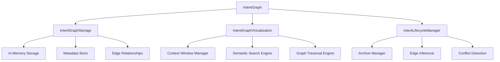

# Intent Graph - Detailed Documentation

**Module:** `src/ccos/intent_graph.rs`  
**Purpose:** Persistent, virtualized graph of user intents and their relationships

---

## Architecture Overview

The Intent Graph implements the "Living Intent Graph" concept from the CCOS vision. It provides persistent storage and virtualization of user intents, enabling context-aware execution and long-term goal tracking.

### Core Components



---

## Data Structures

### Intent

```rust
pub struct Intent {
    pub intent_id: IntentId,           // Unique identifier
    pub goal: String,                  // Human-readable goal description
    pub constraints: HashMap<String, Value>, // Runtime constraints
    pub preferences: HashMap<String, Value>, // User preferences
    pub success_criteria: Option<Value>,     // RTFS function for validation
    pub emotional_tone: Option<String>,      // Desired emotional context
    pub parent_intent: Option<IntentId>,     // Parent goal relationship
    pub created_at: u64,                     // Creation timestamp
    pub updated_at: u64,                     // Last update timestamp
    pub status: IntentStatus,                // Current lifecycle status
    pub metadata: HashMap<String, Value>,    // Additional metadata
}
```

### Edge Relationships

```rust
pub enum EdgeType {
    DependsOn,      // One intent cannot begin until another completes
    IsSubgoalOf,    // This intent is a component of a larger goal
    ConflictsWith,  // Success of this intent may compromise another
    Enables,        // Completion makes another goal possible/effective
    RelatedTo,      // General relationship
}

pub struct Edge {
    pub from_intent: IntentId,
    pub to_intent: IntentId,
    pub edge_type: EdgeType,
    pub weight: f64,                    // Relationship strength
    pub metadata: HashMap<String, Value>,
}
```

### Intent Status Lifecycle

```rust
pub enum IntentStatus {
    Active,         // Currently being pursued
    Completed,      // Successfully achieved
    Failed,         // Failed to achieve
    Archived,       // No longer relevant
    Suspended,      // Temporarily paused
}
```

---

## API Reference

### Core Intent Graph Operations

#### Creating and Storing Intents

```rust
// Create a new intent
let intent = Intent::new("Analyze quarterly sales data".to_string())
    .with_constraint("max_cost".to_string(), Value::Number(100.0))
    .with_preference("priority".to_string(), Value::String("high".to_string()))
    .with_parent("intent-001".to_string());

// Store in the graph
graph.store_intent(intent)?;
```

#### Finding Relevant Intents

```rust
// Semantic search for related intents
let relevant = graph.find_relevant_intents("sales analysis");
for intent in relevant {
    println!("Found intent: {}", intent.goal);
}
```

#### Loading Context Window

```rust
// Load intents for context-aware execution
let intent_ids = vec!["intent-001".to_string(), "intent-002".to_string()];
let context_intents = graph.load_context_window(&intent_ids);
```

#### Managing Relationships

```rust
// Get dependent intents
let dependencies = graph.get_dependent_intents("intent-001");

// Get subgoals
let subgoals = graph.get_subgoals("intent-001");

// Get conflicting intents
let conflicts = graph.get_conflicting_intents("intent-001");
```

#### Lifecycle Management

```rust
// Update intent with execution results
let result = ExecutionResult { success: true, value: Value::Nil, metadata: HashMap::new() };
graph.update_intent(intent, &result)?;

// Archive completed intents
graph.archive_completed_intents()?;

// Get intent statistics
let counts = graph.get_intent_count_by_status();
```

---

## Virtualization and Context Horizon

### Context Window Management

The Intent Graph implements virtualization to respect LLM context window constraints:

```rust
pub struct ContextWindowManager {
    max_intents: usize,    // Maximum intents in context
    max_tokens: usize,     // Maximum tokens in context
}

impl ContextWindowManager {
    pub fn estimate_tokens(&self, intents: &[Intent]) -> usize {
        // Rough estimation: ~4 characters per token
        let mut total = 0;
        for intent in intents {
            total += intent.goal.len() / 4;
            total += intent.constraints.len() * 10;
            total += intent.preferences.len() * 8;
        }
        total
    }

    pub fn should_truncate(&self, intents: &[Intent]) -> bool {
        intents.len() > self.max_intents ||
        self.estimate_tokens(intents) > self.max_tokens
    }
}
```

### Semantic Search

```rust
impl IntentGraphVirtualization {
    pub fn find_relevant_intents(&self, query: &str, storage: &IntentGraphStorage) -> Vec<IntentId> {
        // Simple keyword-based search (placeholder for semantic embeddings)
        let mut relevant = Vec::new();

        for (intent_id, intent) in &storage.intents {
            if intent.goal.to_lowercase().contains(&query.to_lowercase()) {
                relevant.push(intent_id.clone());
            }
        }

        // Sort by relevance score
        relevant.sort_by(|a, b| {
            let score_a = storage.metadata.get(a).map(|m| m.relevance_score).unwrap_or(0.0);
            let score_b = storage.metadata.get(b).map(|m| m.relevance_score).unwrap_or(0.0);
            score_b.partial_cmp(&score_a).unwrap_or(std::cmp::Ordering::Equal)
        });

        relevant
    }
}
```

---

## Edge Inference and Conflict Detection

### Automatic Edge Creation

The Intent Graph automatically infers relationships between intents:

```rust
impl IntentLifecycleManager {
    pub fn infer_edges(&self, storage: &mut IntentGraphStorage) -> Result<(), RuntimeError> {
        let intent_ids: Vec<IntentId> = storage.intents.keys().cloned().collect();

        for i in 0..intent_ids.len() {
            for j in (i + 1)..intent_ids.len() {
                let intent_a = storage.get_intent(&intent_ids[i]).unwrap();
                let intent_b = storage.get_intent(&intent_ids[j]).unwrap();

                // Check for resource conflicts
                if self.detect_resource_conflict(intent_a, intent_b) {
                    let edge = Edge::new(
                        intent_a.intent_id.clone(),
                        intent_b.intent_id.clone(),
                        EdgeType::ConflictsWith,
                    );
                    storage.store_edge(edge)?;
                }
            }
        }
        Ok(())
    }

    fn detect_resource_conflict(&self, intent_a: &Intent, intent_b: &Intent) -> bool {
        let cost_a = intent_a.constraints.get("max_cost")
            .and_then(|v| v.as_number())
            .unwrap_or(f64::INFINITY);
        let cost_b = intent_b.constraints.get("max_cost")
            .and_then(|v| v.as_number())
            .unwrap_or(f64::INFINITY);

        // If both have very low cost constraints, they might conflict
        cost_a < 10.0 && cost_b < 10.0
    }
}
```

---

## Metadata and Analytics

### Intent Metadata

```rust
#[derive(Debug, Clone)]
pub struct IntentMetadata {
    pub last_accessed: u64,     // Last access timestamp
    pub access_count: u64,      // Number of times accessed
    pub relevance_score: f64,   // Semantic relevance (0.0-1.0)
    pub complexity_score: f64,  // Complexity estimation (0.0-1.0)
}

impl IntentMetadata {
    fn calculate_complexity(intent: &Intent) -> f64 {
        let mut complexity = 0.0;

        // Base complexity from goal length
        complexity += intent.goal.len() as f64 * 0.01;

        // Complexity from constraints
        complexity += intent.constraints.len() as f64 * 0.1;

        // Complexity from preferences
        complexity += intent.preferences.len() as f64 * 0.05;

        // Complexity from success criteria
        if intent.success_criteria.is_some() {
            complexity += 0.5;
        }

        complexity.min(1.0) // Cap at 1.0
    }
}
```

---

## Usage Examples

### Example 1: Creating a Goal Hierarchy

```rust
// Create main business goal
let main_goal = Intent::new("Grow startup revenue by 50%".to_string())
    .with_constraint("timeline".to_string(), Value::String("6 months".to_string()));

// Create subgoals
let marketing_goal = Intent::new("Launch new marketing campaign".to_string())
    .with_parent(main_goal.intent_id.clone())
    .with_constraint("budget".to_string(), Value::Number(10000.0));

let product_goal = Intent::new("Release new product features".to_string())
    .with_parent(main_goal.intent_id.clone())
    .with_constraint("timeline".to_string(), Value::String("3 months".to_string()));

// Store in graph
graph.store_intent(main_goal)?;
graph.store_intent(marketing_goal)?;
graph.store_intent(product_goal)?;

// The graph will automatically infer relationships
```

### Example 2: Context-Aware Execution

```rust
// Find relevant intents for a task
let relevant = graph.find_relevant_intents("marketing campaign");

// Load context window for execution
let context_intents = graph.load_context_window(&relevant.iter().map(|i| i.intent_id.clone()).collect::<Vec<_>>());

// Execute with context
let result = execute_with_context(&plan, &context_intents)?;

// Update intent with results
graph.update_intent(intent, &result)?;
```

### Example 3: Conflict Detection

```rust
// Create potentially conflicting intents
let budget_intent = Intent::new("Minimize costs".to_string())
    .with_constraint("max_cost".to_string(), Value::Number(5000.0));

let feature_intent = Intent::new("Add premium features".to_string())
    .with_constraint("min_budget".to_string(), Value::Number(8000.0));

graph.store_intent(budget_intent)?;
graph.store_intent(feature_intent)?;

// The graph will automatically detect the conflict
let conflicts = graph.get_conflicting_intents(&budget_intent.intent_id);
assert!(!conflicts.is_empty());
```

---

## Performance Considerations

### Storage Strategy

- **Current:** In-memory storage with HashMap for fast lookups
- **Future:** Vector database for semantic search, graph database for relationships
- **Scaling:** Horizontal sharding by domain, vertical scaling for memory optimization

### Context Window Optimization

- **Token Estimation:** Rough character-based estimation (~4 chars/token)
- **Reduction Strategy:** Sort by relevance, truncate least relevant intents
- **Caching:** Frequently accessed intents cached in memory

### Edge Inference

- **Complexity:** O(n²) for pairwise comparison
- **Optimization:** Batch processing, incremental updates
- **Future:** ML-based conflict detection

---

## Testing

### Unit Tests

```rust
#[test]
fn test_intent_graph_creation() {
    let graph = IntentGraph::new();
    assert!(graph.is_ok());
}

#[test]
fn test_store_and_retrieve_intent() {
    let mut graph = IntentGraph::new().unwrap();
    let intent = Intent::new("Test goal".to_string());
    let intent_id = intent.intent_id.clone();

    assert!(graph.store_intent(intent).is_ok());
    assert!(graph.get_intent(&intent_id).is_some());
}

#[test]
fn test_find_relevant_intents() {
    let mut graph = IntentGraph::new().unwrap();

    let intent1 = Intent::new("Analyze sales data".to_string());
    let intent2 = Intent::new("Generate report".to_string());

    graph.store_intent(intent1).unwrap();
    graph.store_intent(intent2).unwrap();

    let relevant = graph.find_relevant_intents("sales");
    assert_eq!(relevant.len(), 1);
    assert_eq!(relevant[0].goal, "Analyze sales data");
}
```

---

## Future Enhancements

1. **Semantic Embeddings:** Replace keyword search with vector embeddings
2. **Graph Database:** Use Neo4j or ArangoDB for relationship storage
3. **ML-Based Inference:** Train models for automatic edge detection
4. **Real-time Collaboration:** Multi-user intent graph with conflict resolution
5. **Temporal Reasoning:** Time-based intent relationships and scheduling
6. **Emotional Intelligence:** Advanced emotional tone analysis and matching

---

## References

- [CCOS Foundation Documentation](./CCOS_FOUNDATION.md)
- [Vision Document](../vision/SENTIENT_RUNTIME_VISION.md)
- [Arbiter/CCOSRuntime Relationship](../ARBITER_CCOSRUNTIME_RELATIONSHIP.md)
