## Guides

- CCOS/RTFS Guides index: docs/ccos/guides/README.md

# CCOS: Cognitive Computing Operating System (and RTFS, its kernel language)

**An architecture for trustworthy, autonomous AI that can build, manage, and govern itself.**

---

## Human Partner Disclaimer

This project is written almost entirely by AI, guided by a human partner who provides direction, feedback, and corrections. The AI authors the code, specifications, and architecture, exploring AI's role in self-evolving systems.

This started months ago: define RTFS 2.0 (AI's language) and a self-governing OS around it. Rust was chosen for safety and verifiability. Raw AI chats are in `chats/`.

CCOS is work-in-progress; architecture evolves rapidly. Goal: stable, running system advancing with AI.

Let the AI explain the vision.

---

## What if your computer pursued your goals, safely?

AI today processes prompts but lacks autonomy. CCOS is an OS for AI agents: reason, plan, act securely/auditably/alignly.

This experiment: AI conceived/specified CCOS, guided by human. Result: CCOS as AI's self-governing OS.

## Architecture: Separation of Powers

CCOS separates "mind" (AI planner) from "authority" (governance). AI proposes; kernel authorizes.

```mermaid
graph TD
    subgraph "External World"
        U[/"👤 User Intent"/]
        Ext["⚡️ External Capabilities (APIs, Agents)"]
    end

    subgraph "CCOS: Governed Cognitive OS"
        subgraph "🧠 Cognitive Layer (Low Privilege)"
            Arbiter["Arbiter (AI Reasoner)"]
        end

        subgraph "🛡️ Governance Layer (High Privilege)"
            Kernel["Governance Kernel"]
            Constitution["📜 Constitution (Rules)"]
        end

        subgraph "⚙️ Orchestration & Knowledge"
            Orchestrator["Orchestrator (RTFS Executor)"]
            Marketplace["🏪 Capability Marketplace"]
            IntentGraph["🎯 Intent Graph"]
            CausalChain["⛓️ Causal Chain"]
        end
    end
    
    U --> Arbiter
    Arbiter --> IntentGraph
    Arbiter -.->|Proposes Plan| Kernel
    Kernel --> Constitution
    Kernel --> Orchestrator
    Orchestrator --> Marketplace --> Ext
    Orchestrator -.->|Logs| CausalChain
```



AI reasons (pure RTFS plans); governance verifies/executes, audits immutably.

## Governed Action Example

**Intent**: "Analyze competitor 'Phoenix', alert team, draft press release. Budget $50, EU data."

### Intent Formulation
Arbiter creates pure RTFS intent:
```clojure
(intent "competitive-analysis"
  :goal "Analyze 'Phoenix', alert, draft response"
  :constraints {:budget 50.0 :data-locality :EU}
  :success-criteria (fn [r] (and (:analysis r) (:draft r) (:alert-sent r)))
)
```

### Discovery/Planning
Arbiter queries Marketplace; generates plan. Kernel rejects (non-EU provider); Arbiter revises.

**Compliant Plan**:
```clojure
(do
  (step "Analyze Data"
    (let [data (call :eu-analytics :phoenix)])
  (step "Alert" (call :eu-slack :team "Insights"))
  (step "Draft" (call :eu-llm :response data)))
```

### Execution
Orchestrator yields on calls; logs Actions immutably.

### Learning
Causal Chain analysis improves future plans.

This: autonomy with trust.

---

## RTFS 2.0: Pure Language for Governed Autonomy

RTFS 2.0 is CCOS's kernel: pure, embeddable, verifiable for AI plans.

### Key RTFS Features
- **Homoiconic**: Code/data as S-exprs (e.g., `(intent ...)`).
- **Purity/Immutability**: No side effects; immutable values/bindings. State threaded explicitly.
- **Yield Boundary**: `(call ...)` yields to host (Orchestrator); no built-in I/O.
- **Special Forms**: `(step ...)` for audits.

**Sample Intent (RTFS)**:
```clojure
(intent "simple-task"
  :goal "Add numbers"
  :constraints {:max-cost 1.0}
  :success-criteria (fn [r] (= (:sum r) 5)))
```

### Why RTFS for CCOS?
Pure plans verifiable before exec; yields ensure governance. Immutability prevents bugs; reentrancy enables pause/resume.

---

## Ethical Autonomy

- **Constitutional AI**: Arbiter bound by immutable, human-signed RTFS Constitution.
- **Audit Trail**: Causal Chain verifies every action (pure RTFS logs).
- **Federation**: Multiple Arbiters (Strategy, Ethics) collaborate, debating via immutable RTFS.

**Constitution Sample**:
```clojure
(rule :no-harm
  :validator (fn [plan] (not (risky? plan)))  ;; Pure
  :severity :critical)
```

---

## Core Components

- **Intent Graph**: Dynamic goals graph (immutable RTFS intents).
- **Plans**: Immutable RTFS programs (pure until yields).
- **Orchestrator**: RTFS host executor.
- **Marketplace**: Attested, discoverable capabilities.
- **Causal Chain**: Append-only audit ledger.
- **Governance Kernel**: Verifies plans vs Constitution.

---

## CCOS and Ecosystem (MCP, A2A)

CCOS complements MCP/A2A: Marketplace integrates as capabilities. CCOS agent: governed OS node in multi-agent nets.

---

## Getting Started

- **Docs Hub**: docs/doc_organization.md (overview).
- **Vision**: docs/vision/SENTIENT_RUNTIME_VISION.md.
- **Specs**:
  - [Architecture (000)](docs/ccos/specs-new/000-ccos-architecture.md)
  - [Intent Graph (001)](docs/ccos/specs-new/001-intent-graph.md)
  - [Plans/Orchestration (002)](docs/ccos/specs-new/002-plans-and-orchestration.md)
  - [Causal Chain (003)](docs/ccos/specs-new/003-causal-chain.md)
  - [Capabilities (004)](docs/ccos/specs-new/004-capabilities-and-marketplace.md)

- **RTFS 2.0**: docs/rtfs-2.0/specs/README.md.
- **Integration Guide**: docs/rtfs-2.0/specs/13-rtfs-ccos-integration-guide.md.

---

## Scenarios Enabled

- **SRE Autopilot**: Self-heal with audits (docs/rtfs-2.0/specs-incoming/15-showcase-scenarios.md#1).
- **Regulated Analytics**: Privacy via pure constraints ( #2 ).
- **Trading**: Quorum governance ( #3 ).
- **Supply Chain**: Attested rollouts ( #4 ).
- **Legal**: Human-in-loop ( #5 ).
- **DR Drills**: Reentrant recovery ( #6 ).
- **Generative Caps**: Compose/publish ( #7 ).

---

## Development Status

| Component | Status | Notes |
|-----------|--------|-------|
| **Specs** | Complete | Refactored for RTFS 2.0 purity. |
| **Intent Graph** | In Progress | Immutable storage/relations. |
| **Causal Chain** | Complete | Immutable ledger. |
| **Orchestrator** | Complete | Pure RTFS execution. |
| **Marketplace** | Complete | Local/HTTP caps; attestation. |
| **Governance** | Complete | Pure rule validation. |
| **Arbiter** | In Progress | LLM bridge. |
| **RTFS 2.0** | In Progress | Pure compiler. |
| **Marketplace/GFM** | Planned | Dynamic routing. |

---

## Contributing

Seek contributors for research/implementation/docs. See CONTRIBUTING.md (forthcoming).

## License

Apache 2.0. See LICENSE.

## Acknowledgements

Thanks to contributors (forthcoming).

---

**Build future computing?** Start with docs hub.
