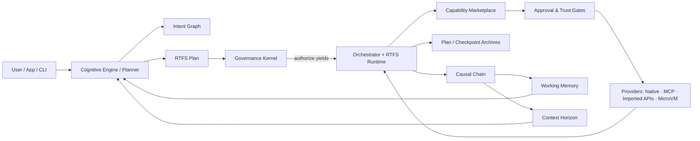

# CCOS (Cognitive Computing Operating System)

CCOS is a **governed execution runtime** for AI/agent workflows.
It separates **intent (why)** → **plan (how)** → **actions/effects (what happened)**, and enforces that *all effects* go through **capabilities** (approved, logged, auditable).

- **RTFS is the kernel language**: plans are expressed in RTFS 2.0 (pure core; yields at the host boundary).
- **CCOS is the host**: it executes RTFS deterministically, mediates tool calls, and records an immutable audit trail.

## Architecture (high level)

## Core concepts (didactic, short)

- **Intent Graph**: structured goals, constraints, relationships (the *why*).
- **Plans (RTFS)**: pure code describing steps and capability calls (the *how*).
- **Orchestrator**: deterministic executor driving yield/resume, step boundaries, checkpointing.
- **Capabilities**: the only way to do I/O / network / side effects; discovered and mediated via the marketplace.
- **Governance Kernel**: validates plans and authorizes each effect (policy, quotas, trust, sandboxing).
- **Causal Chain**: immutable record of execution, decisions, and effects (audit trail + learning substrate).
- **Context Horizon**: ephemeral, task-bounded context fed into LLMs; derived from state + chain.
- **Working Memory**: distilled knowledge extracted from the chain for reuse and retrieval.

## What CCOS can do today (feature map)

- **Governed capability execution** with approval/trust gates and audit logging.
- **Capability discovery & synthesis** (notably MCP), plus registration workflows.
- **MicroVM isolation** for untrusted providers (sandboxing/security features).
- **Checkpoint/resume** patterns for long-running or yield-heavy executions.
- **Observability**: metrics/logging hooks oriented around steps, calls, and governance decisions.

## Specs and guides (entry points)

- **Specs hub (authoritative)**: [`docs/ccos/specs/README.md`](specs/README.md)
- **Guides index (how-to)**: [`docs/ccos/guides/README.md`](guides/README.md)
- **RTFS 2.0 specs hub**: [`docs/rtfs-2.0/specs/README.md`](../rtfs-2.0/specs/README.md)

### Recommended “learn CCOS” reading order

1. **CCOS overview & trust boundaries**
   - [`000-ccos-architecture.md`](specs/000-ccos-architecture.md)
   - [`004-rtfs-ccos-boundary.md`](specs/004-rtfs-ccos-boundary.md)
2. **Execution model**
   - [`002-plans-and-orchestration.md`](specs/002-plans-and-orchestration.md)
   - [`017-checkpoint-resume.md`](specs/017-checkpoint-resume.md)
3. **Security & governance**
   - [`010-ethical-governance.md`](specs/010-ethical-governance.md)
   - [`005-security-and-context.md`](specs/005-security-and-context.md)
   - [`035-two-tier-governance.md`](specs/035-two-tier-governance.md)
4. **Capabilities & integration**
   - [`030-capability-system-architecture.md`](specs/030-capability-system-architecture.md)
   - [`031-mcp-discovery-unified-service.md`](specs/031-mcp-discovery-unified-service.md)
   - [`032-missing-capability-resolution.md`](specs/032-missing-capability-resolution.md)
5. **Memory & context**
   - [`013-working-memory.md`](specs/013-working-memory.md)
   - [`009-context-horizon.md`](specs/009-context-horizon.md)

### Getting started (practical)

- **CLI usage (start here)**: [`docs/ccos/guides/cli-usage.md`](guides/cli-usage.md) — how to run `ccos`/`rtfs`, execute plans, and inspect outputs.
- **MCP runtime (what works reliably)**: [`docs/ccos/guides/mcp-runtime-guide.md`](guides/mcp-runtime-guide.md) — running MCP servers, discovery, and tool execution flow.
- **MCP overrides & scoring (operational tuning)**:
  - [`docs/ccos/guides/mcp-overrides.md`](guides/mcp-overrides.md)
  - [`docs/ccos/guides/mcp-server-scoring.md`](guides/mcp-server-scoring.md)
- **Autonomous agent demo (WIP)**: `ccos/examples/autonomous_agent_demo.rs` — early prototype; expect breaking changes and incomplete behavior.

