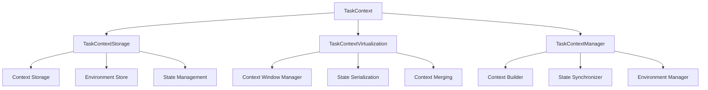

# Task Context - Detailed Documentation

**Module:** `src/ccos/task_context.rs`  
**Purpose:** Manage execution context, state, and environment for RTFS operations

---

## Architecture Overview

The Task Context implements the "Task Context" concept from the CCOS vision. It provides a persistent, virtualized context that maintains execution state, environment variables, and runtime information across operations.

### Core Components



---

## Data Structures

### Task Context

```rust
pub struct TaskContext {
    pub context_id: ContextId,         // Unique identifier
    pub name: String,                  // Context name/description
    pub environment: HashMap<String, Value>, // Environment variables
    pub state: HashMap<String, Value>, // Runtime state
    pub metadata: HashMap<String, Value>, // Additional metadata
    pub parent_context: Option<ContextId>, // Parent context
    pub created_at: u64,               // Creation timestamp
    pub updated_at: u64,               // Last update timestamp
    pub is_active: bool,               // Active status
}
```

### Context Relationship

```rust
pub enum ContextRelationship {
    Parent,        // This context is a parent of another
    Child,         // This context is a child of another
    Sibling,       // This context shares a parent with another
    Independent,   // No direct relationship
}

pub struct ContextEdge {
    pub from_context: ContextId,
    pub to_context: ContextId,
    pub relationship: ContextRelationship,
    pub metadata: HashMap<String, Value>,
}
```

---

## API Reference

### Core Task Context Operations

#### Creating and Managing Contexts

```rust
// Create a new task context
let context = TaskContext::new("sales_analysis".to_string())
    .with_environment("data_source".to_string(), Value::String("database".to_string()))
    .with_state("current_step".to_string(), Value::String("loading".to_string()))
    .with_metadata("priority".to_string(), Value::String("high".to_string()));

// Store the context
task_context.store_context(context)?;

// Activate a context
task_context.activate_context("sales_analysis".to_string())?;

// Deactivate a context
task_context.deactivate_context("sales_analysis".to_string())?;
```

#### Environment and State Management

```rust
// Set environment variable
task_context.set_environment("API_KEY".to_string(), Value::String("secret_key".to_string()))?;

// Get environment variable
let api_key = task_context.get_environment("API_KEY")?;

// Set state variable
task_context.set_state("current_user".to_string(), Value::String("john_doe".to_string()))?;

// Get state variable
let user = task_context.get_state("current_user")?;

// Update multiple values at once
let updates = HashMap::from([
    ("step".to_string(), Value::String("processing".to_string())),
    ("progress".to_string(), Value::Number(0.5)),
]);
task_context.batch_update_state(updates)?;
```

#### Context Hierarchy and Inheritance

```rust
// Create parent context
let parent = TaskContext::new("main_session".to_string())
    .with_environment("base_url".to_string(), Value::String("https://api.example.com".to_string()));

// Create child context
let child = TaskContext::new("data_processing".to_string())
    .with_parent(parent.context_id.clone())
    .with_environment("timeout".to_string(), Value::Number(30.0));

task_context.store_context(parent)?;
task_context.store_context(child)?;

// Get inherited environment (parent + child)
let inherited = task_context.get_inherited_environment("data_processing".to_string())?;
```

#### Context Virtualization

```rust
// Load context for execution
let context = task_context.load_context("sales_analysis".to_string())?;

// Get context window (respects LLM limits)
let context_window = task_context.get_context_window("sales_analysis".to_string())?;

// Merge contexts
let merged = task_context.merge_contexts(&["context1".to_string(), "context2".to_string()])?;
```

---

## Context Lifecycle Management

### Context Creation and Initialization

```rust
impl TaskContextManager {
    pub fn create_context(&mut self, name: String, parent: Option<ContextId>) -> Result<ContextId, RuntimeError> {
        let context_id = ContextId::new();
        let now = SystemTime::now().duration_since(UNIX_EPOCH).unwrap().as_millis() as u64;

        let mut context = TaskContext {
            context_id: context_id.clone(),
            name,
            environment: HashMap::new(),
            state: HashMap::new(),
            metadata: HashMap::new(),
            parent_context: parent,
            created_at: now,
            updated_at: now,
            is_active: true,
        };

        // Inherit from parent if specified
        if let Some(parent_id) = parent {
            if let Some(parent_context) = self.storage.get_context(&parent_id) {
                context.environment.extend(parent_context.environment.clone());
                context.state.extend(parent_context.state.clone());
            }
        }

        self.storage.store_context(context)?;
        Ok(context_id)
    }
}
```

### Context Activation and Deactivation

```rust
impl TaskContextManager {
    pub fn activate_context(&mut self, context_id: &ContextId) -> Result<(), RuntimeError> {
        if let Some(mut context) = self.storage.get_context_mut(context_id) {
            context.is_active = true;
            context.updated_at = SystemTime::now().duration_since(UNIX_EPOCH).unwrap().as_millis() as u64;
            self.storage.update_context(context)?;
        }
        Ok(())
    }

    pub fn deactivate_context(&mut self, context_id: &ContextId) -> Result<(), RuntimeError> {
        if let Some(mut context) = self.storage.get_context_mut(context_id) {
            context.is_active = false;
            context.updated_at = SystemTime::now().duration_since(UNIX_EPOCH).unwrap().as_millis() as u64;
            self.storage.update_context(context)?;
        }
        Ok(())
    }
}
```

---

## Environment and State Management

### Environment Variable Operations

```rust
impl TaskContextManager {
    pub fn set_environment(&mut self, context_id: &ContextId, key: String, value: Value) -> Result<(), RuntimeError> {
        if let Some(mut context) = self.storage.get_context_mut(context_id) {
            context.environment.insert(key, value);
            context.updated_at = SystemTime::now().duration_since(UNIX_EPOCH).unwrap().as_millis() as u64;
            self.storage.update_context(context)?;
        }
        Ok(())
    }

    pub fn get_environment(&self, context_id: &ContextId, key: &str) -> Result<Option<Value>, RuntimeError> {
        if let Some(context) = self.storage.get_context(context_id) {
            Ok(context.environment.get(key).cloned())
        } else {
            Ok(None)
        }
    }

    pub fn get_inherited_environment(&self, context_id: &ContextId) -> Result<HashMap<String, Value>, RuntimeError> {
        let mut inherited = HashMap::new();

        if let Some(context) = self.storage.get_context(context_id) {
            // Start with current context
            inherited.extend(context.environment.clone());

            // Add parent environments
            let mut current_parent = context.parent_context.clone();
            while let Some(parent_id) = current_parent {
                if let Some(parent_context) = self.storage.get_context(&parent_id) {
                    for (key, value) in &parent_context.environment {
                        inherited.entry(key.clone()).or_insert_with(|| value.clone());
                    }
                    current_parent = parent_context.parent_context.clone();
                } else {
                    break;
                }
            }
        }

        Ok(inherited)
    }
}
```

### State Management

```rust
impl TaskContextManager {
    pub fn set_state(&mut self, context_id: &ContextId, key: String, value: Value) -> Result<(), RuntimeError> {
        if let Some(mut context) = self.storage.get_context_mut(context_id) {
            context.state.insert(key, value);
            context.updated_at = SystemTime::now().duration_since(UNIX_EPOCH).unwrap().as_millis() as u64;
            self.storage.update_context(context)?;
        }
        Ok(())
    }

    pub fn get_state(&self, context_id: &ContextId, key: &str) -> Result<Option<Value>, RuntimeError> {
        if let Some(context) = self.storage.get_context(context_id) {
            Ok(context.state.get(key).cloned())
        } else {
            Ok(None)
        }
    }

    pub fn batch_update_state(&mut self, context_id: &ContextId, updates: HashMap<String, Value>) -> Result<(), RuntimeError> {
        if let Some(mut context) = self.storage.get_context_mut(context_id) {
            context.state.extend(updates);
            context.updated_at = SystemTime::now().duration_since(UNIX_EPOCH).unwrap().as_millis() as u64;
            self.storage.update_context(context)?;
        }
        Ok(())
    }
}
```

---

## Context Virtualization

### Context Window Management

```rust
impl TaskContextVirtualization {
    pub fn get_context_window(&self, context_id: &ContextId, storage: &TaskContextStorage) -> Result<TaskContext, RuntimeError> {
        if let Some(context) = storage.get_context(context_id) {
            let mut window_context = context.clone();

            // Estimate token usage
            let token_estimate = self.estimate_tokens(&window_context);

            // If context is too large, apply reduction strategies
            if token_estimate > self.max_tokens {
                window_context = self.reduce_context(window_context)?;
            }

            Ok(window_context)
        } else {
            Err(RuntimeError::ContextNotFound(context_id.clone()))
        }
    }

    fn estimate_tokens(&self, context: &TaskContext) -> usize {
        let mut tokens = 0;

        // Estimate tokens for environment variables
        for (key, value) in &context.environment {
            tokens += key.len() / 4; // ~4 chars per token
            tokens += self.estimate_value_tokens(value);
        }

        // Estimate tokens for state variables
        for (key, value) in &context.state {
            tokens += key.len() / 4;
            tokens += self.estimate_value_tokens(value);
        }

        tokens
    }

    fn estimate_value_tokens(&self, value: &Value) -> usize {
        match value {
            Value::String(s) => s.len() / 4,
            Value::Number(n) => n.to_string().len() / 4,
            Value::Boolean(_) => 1,
            Value::Array(arr) => arr.iter().map(|v| self.estimate_value_tokens(v)).sum(),
            Value::Object(obj) => obj.iter().map(|(k, v)| k.len() / 4 + self.estimate_value_tokens(v)).sum(),
            Value::Nil => 1,
        }
    }
}
```

### Context Merging

```rust
impl TaskContextVirtualization {
    pub fn merge_contexts(&self, context_ids: &[ContextId], storage: &TaskContextStorage) -> Result<TaskContext, RuntimeError> {
        let mut merged = TaskContext::new("merged_context".to_string());

        for context_id in context_ids {
            if let Some(context) = storage.get_context(context_id) {
                // Merge environment variables (later contexts override earlier ones)
                for (key, value) in &context.environment {
                    merged.environment.insert(key.clone(), value.clone());
                }

                // Merge state variables
                for (key, value) in &context.state {
                    merged.state.insert(key.clone(), value.clone());
                }

                // Merge metadata
                for (key, value) in &context.metadata {
                    merged.metadata.insert(key.clone(), value.clone());
                }
            }
        }

        Ok(merged)
    }
}
```

---

## Usage Examples

### Example 1: Session Management

```rust
// Create main session context
let session_id = task_context.create_context("user_session".to_string(), None)?;

// Set session-wide environment
task_context.set_environment(&session_id, "user_id".to_string(), Value::String("john_doe".to_string()))?;
task_context.set_environment(&session_id, "api_base_url".to_string(), Value::String("https://api.example.com".to_string()))?;

// Create task-specific context
let task_id = task_context.create_context("data_analysis".to_string(), Some(session_id.clone()))?;

// Task inherits session environment
let inherited = task_context.get_inherited_environment(&task_id)?;
assert!(inherited.contains_key("user_id"));
assert!(inherited.contains_key("api_base_url"));

// Set task-specific state
task_context.set_state(&task_id, "current_step".to_string(), Value::String("loading_data".to_string()))?;
task_context.set_state(&task_id, "progress".to_string(), Value::Number(0.25))?;
```

### Example 2: Pipeline Execution

```rust
// Create pipeline context
let pipeline_id = task_context.create_context("sales_pipeline".to_string(), None)?;

// Set pipeline configuration
task_context.set_environment(&pipeline_id, "data_source".to_string(), Value::String("sales_db".to_string()))?;
task_context.set_environment(&pipeline_id, "output_format".to_string(), Value::String("json".to_string()))?;

// Execute pipeline steps
for (step, operation) in pipeline_steps.iter().enumerate() {
    // Create step context
    let step_id = task_context.create_context(format!("step_{}", step), Some(pipeline_id.clone()))?;

    // Update progress
    task_context.set_state(&pipeline_id, "current_step".to_string(), Value::Number(step as f64))?;
    task_context.set_state(&pipeline_id, "progress".to_string(), Value::Number((step as f64) / (pipeline_steps.len() as f64)))?;

    // Execute operation with context
    let result = execute_with_context(operation, &step_id)?;

    // Store result in context
    task_context.set_state(&step_id, "result".to_string(), result)?;
}
```

### Example 3: Context Virtualization

```rust
// Create large context
let large_context_id = task_context.create_context("large_context".to_string(), None)?;

// Add many environment variables
for i in 0..1000 {
    task_context.set_environment(&large_context_id, format!("var_{}", i), Value::String(format!("value_{}", i)))?;
}

// Get virtualized context window
let window = task_context.get_context_window(&large_context_id)?;

// Context is automatically reduced to fit token limits
assert!(window.environment.len() < 1000);
```

---

## Performance Considerations

### Storage Strategy

- **Current:** In-memory HashMap storage
- **Future:** Redis or similar for distributed contexts
- **Optimization:** Lazy loading for large contexts

### Context Inheritance

- **Performance:** O(depth) where depth is inheritance chain length
- **Caching:** Cache inherited environments for frequently accessed contexts
- **Optimization:** Flatten inheritance chains for deep hierarchies

### Virtualization

- **Token Estimation:** Rough character-based estimation
- **Reduction Strategy:** Remove least recently used variables
- **Memory:** Configurable limits for context size

---

## Testing

### Unit Tests

```rust
#[test]
fn test_context_creation() {
    let mut task_context = TaskContext::new();
    let context_id = task_context.create_context("test".to_string(), None).unwrap();
    assert!(task_context.get_context(&context_id).is_some());
}

#[test]
fn test_environment_inheritance() {
    let mut task_context = TaskContext::new();

    let parent_id = task_context.create_context("parent".to_string(), None).unwrap();
    task_context.set_environment(&parent_id, "key".to_string(), Value::String("value".to_string())).unwrap();

    let child_id = task_context.create_context("child".to_string(), Some(parent_id)).unwrap();
    let inherited = task_context.get_inherited_environment(&child_id).unwrap();

    assert_eq!(inherited.get("key"), Some(&Value::String("value".to_string())));
}

#[test]
fn test_context_virtualization() {
    let mut task_context = TaskContext::new();
    let context_id = task_context.create_context("large".to_string(), None).unwrap();

    // Add many variables
    for i in 0..100 {
        task_context.set_environment(&context_id, format!("var_{}", i), Value::String(format!("value_{}", i))).unwrap();
    }

    let window = task_context.get_context_window(&context_id).unwrap();
    assert!(window.environment.len() < 100); // Should be reduced
}
```

---

## Future Enhancements

1. **Distributed Contexts:** Support for distributed context management
2. **Context Persistence:** Database storage for long-lived contexts
3. **Context Versioning:** Version control for context changes
4. **Context Templates:** Reusable context templates
5. **Context Analytics:** Usage analytics and optimization
6. **Context Security:** Encryption and access control

---

## References

- [CCOS Foundation Documentation](./CCOS_FOUNDATION.md)
- [Intent Graph Documentation](./INTENT_GRAPH_API.md)
- [Causal Chain Documentation](./CAUSAL_CHAIN_DETAILED.md)
