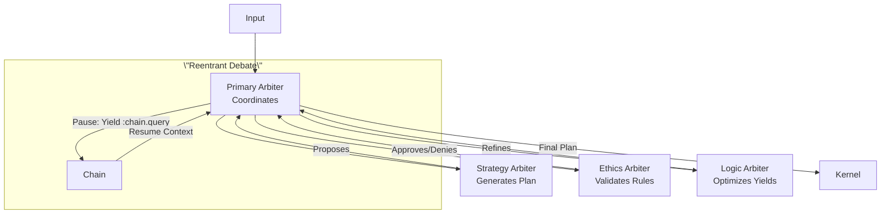

# CCOS Specification 006: Arbiter and Cognitive Control (RTFS 2.0 Edition)

**Status:** Draft for Review  
**Version:** 1.0  
**Date:** 2025-09-20  
**Related:** [000: Architecture](./000-ccos-architecture-new.md), [001: Intent Graph](./001-intent-graph-new.md), [002: Plans](./002-plans-and-orchestration-new.md)  

## Introduction: The AI Mind in a Governed System

The Arbiter is CCOS's cognitive core: An AI (LLM or federation) that reasons over intents, generates pure RTFS plans, and adapts from outcomes. Sandboxed—no direct effects; proposes to Kernel. In RTFS 2.0, it targets pure code, yielding for actions, enabling safe, reentrant cognition.

Why central? Handles non-determinism (creativity, exceptions) while Orchestrator does determinism. Reentrancy: Arbiters can pause debates, resume with chain context.

## Core Concepts

### 1. Arbiter Role and Lifecycle
- **Intent Formulation**: Parse user input → Structured intent in graph.
- **Plan Generation**: Query graph/chain → Output RTFS source (pure + yields).
- **Exception Handling**: On Orchestrator failure → Analyze chain → New plan or abort.
- **Cognitive Execution**: For linguistic tasks, direct RTFS (e.g., summarize).

Runs in low-privilege sandbox; Kernel approves proposals.

**Sample Arbiter Workflow** (Pseudo-prompt for LLM):
```
Context: Intent Graph subtree + Chain summary (last 5 actions).
Task: Generate RTFS plan for :intent-123 (analyze sentiment).
Constraints: Pure functions, yields only for :storage/* :nlp/*.
Output: Valid RTFS source + metadata.
```

Generated Plan: As in 002 sample.

### 2. Federation: Collaborative Reasoning
Single Arbiter → Multiple specialists (e.g., Strategy, Ethics) for robustness.

- **Roles**: Strategy: Long-term plans; Ethics: Constitution check; Logic: Optimize yields.
- **Debate**: Primary Arbiter coordinates: Propose plan → Subs critique (via RTFS queries to chain) → Vote/consensus.
- **Recording**: Each sub-response as chain action, hierarchical.

**Federation Diagram**:


### 3. Integration with RTFS 2.0 Reentrancy
Arbiters generate/use pure RTFS:
- **Generation**: Output source → Compile/verify before Orchestrator.
- **Querying**: Use RTFS for analysis, e.g., `(call :chain.query {:intent :123})` → Yield for context.
- **Reentrant Cognition**: Complex decisions: Pause mid-debate (yield for external data) → Resume with injected results.

**Reentrant Example** (Federated Adaptation):
1. Plan fails (chain shows yield error).
2. Primary: 'Debate fix' → Strat proposes new yields; Eth checks.
3. Yield :external-advice (e.g., API) → Pause.
4. Resume: Inject result → Consensus on refined plan → Propose to Kernel.
5. Chain: Debate as sub-actions under failure action.

### 3.a LLM Execution Bridge (Prompting, Tools, Budgets)
Arbiters interface with LLMs via a bridge that standardizes prompting, token budgeting, and tool-use. The bridge is host-side (pure RTFS yields), keeping Arbiter logic declarative and safe.

- **Prompt Construction**: Uses Context Horizon payload (009) and Intent Graph snapshots. Prompts are templates with slotted fields (intent, constraints, recent chain events).
- **Token Budgets**: Enforced via Runtime Context quotas; bridge truncates/summarizes inputs to meet limits.
- **Tool Use**: LLM suggests actions in a constrained schema; bridge maps them to RTFS constructs (e.g., capability calls) or requests Arbiter to generate RTFS source directly.

**Sample Bridge Yield**:
```
(call :llm.generate-plan
      {:intent :intent-123
       :context (call :horizon.build {:intent :intent-123 :max-tokens 2048})
       :constraints {:caps [:storage/* :nlp/*] :max-yields 5}
       :output-schema :rtfs.plan-source})
```
Bridge returns RTFS source (validated/sanitized) for compilation. All interactions logged to the Causal Chain with token and cost metrics.

### 3.b Agent Registry & Delegation (Summary)
For higher-order tasks, a Delegating Arbiter can consult an Agent Registry (directory of autonomous agents capable of taking an Intent and returning a Plan/Result). This avoids conflation with primitive capability selection (handled by GFM/DE).

- **AgentDescriptor (summary fields)**: `agent_id`, `kind` (planner/analyzer/remote-arbiter), `skills` (semantic tags), `supported-constraints`, cost/latency model, trust tier, isolation requirements, performance history, provenance/attestation, quotas.
- **Delegation Flow**:
  1. Draft intent + constraints.
  2. Query registry for candidates (skill/constraint/trust match).
  3. Propose `DelegationMetadata` {selected_agent?, rationale, expected-plan-shape, fallback_strategy}.
  4. Governance Kernel evaluates delegation policy (budget, trust vs sensitivity).
  5. If approved: intent ownership temporarily transferred/shared; agent produces plan; plan returns for normal validation/execution.
  6. Telemetry + outcomes recorded to Causal Chain; registry scores updated.
- **Governance**: Data boundary redaction for lower-trust agents; revocation of active delegation if trust drops; full audit via chain events (Proposed/Approved/Completed).

This keeps the Arbiter modular: local reasoning when appropriate, agent delegation when beneficial—both consistent with RTFS purity and host-governed effects.

### 3.c Constrained LLM Output → Safe Plans (Example)
The LLM bridge returns outputs in a constrained JSON schema that is validated before any RTFS compilation. This prevents prompt-injection from smuggling side effects or arbitrary code.

Schema (conceptual):
```
PlanGenerationOutput := {
  version: "1.x",
  plan_source?: string,               // Either plan_source OR steps must be provided
  steps?: [ {
    step_id: string,
    purpose: string,
    rtfs_pure?: string,              // Pure RTFS snippets (no effects)
    yields?: [ { cap: string, args: any[] } ]
  } ],
  constraints: { caps: string[], max_yields: number },
  rationale?: string
}
```

Validation pipeline:
- JSON shape check (required fields, types)
- Capability allowlist: every `yields[*].cap` ∈ constraints.caps
- RTFS static checks: if `plan_source` present → parse/compile in strict mode (pure-only; yields via `call`), else synthesize RTFS plan from `steps` and compile
- Policy checks: budgets/quotas; environment redactions
- Only on success → Orchestrator receives compiled IR

Minimal example output and mapping:
```
{
  "version": "1.0",
  "plan_source": "(defplan analyze (reviews) (let [sents (call :nlp.sentiment reviews)] (pure (summarize sents))))",
  "constraints": {"caps": [":nlp/*"], "max_yields": 3},
  "rationale": "Use single batch sentiment, then summarize"
}
```

If instead `steps` are provided, the bridge emits a canonical RTFS plan:
```
steps -> (defplan <auto> (...) (step :s1 (pure ...)) (step :s2 (call cap args)) ...)
```

All rejections (schema/allowlist/compile failures) are logged to the Causal Chain with explicit reasons and do not reach execution.

### Future: Agent Registry & Federation (non-breaking)
The Arbiter interface is stable and designed for future multi-agent extensions without breaking changes:
- **Input Contract**: Arbiter consumes Intent Graph subtrees and Context Horizon payloads. Additional specialized agents can do the same.
- **Output Contract**: Arbiter emits RTFS plan source (or analysis summaries). Any agent must produce the same artifact type for the Kernel (compile → verify → execute), keeping the Orchestrator unchanged.
- **Tooling**: All effects go through yields; new agents cannot bypass the host boundary. Policies/quotas/ACLs continue to apply uniformly.
- **Auditability**: Delegation decisions and agent outputs are recorded in the Causal Chain as additional action types, preserving the existing audit model.

This keeps today’s single‑arbiter path simple while making room for federated or external agents later.

### 4. Constraints and Safety
- Sandbox: Arbiters yield for all effects; no mutation in their RTFS.
- Feedback Loop: Chain outcomes update graph → Better future generations.

Arbiter + RTFS = Aligned cognition: Creative but governed, reentrant for long-running reasoning.

All specs complete (todos 2-8). Now finalizing README-new.md (todo 9).