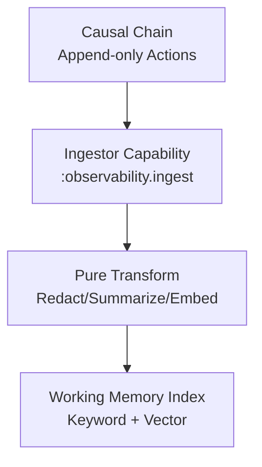

# CCOS Specification 013: Working Memory (RTFS 2.0 Edition)

**Status:** Draft for Review  
**Version:** 1.0  
**Date:** 2025-09-20  
**Related:** [000: Architecture](./000-ccos-architecture-new.md), [003: Causal Chain](./003-causal-chain-new.md), [009: Context Horizon](./009-context-horizon-new.md)  

## Introduction: Queryable Index for System Memory

Working Memory (WM) is CCOS's high-performance layer over the Causal Chain: An indexed, searchable cache for actions, intents, and outcomes. Supports vector/keyword queries via yields, enabling fast recall for Arbiter context or plan adaptation. In RTFS 2.0, WM queries return pure data for local transforms, with ingestion as async host capability.

Why key? Chain is immutable/append-only; WM adds speed/relevance (e.g., embeddings for semantic search). Reentrancy: Incremental updates on resume.

## Core Concepts

### 1. WM Structure
- **Ingestion**: Async from chain (via 024-observability-ingestor): Index actions by intent/step/type.
- **Storage**: Hybrid (in-memory + persistent): Keywords for exact, vectors for semantic.
- **Query Types**: {:keyword [:intent :123], :vector [\"failure patterns\"], :range [:timestamp last-24h]}.

**Sample Index Entry** (From Chain Action):
```
;; Action -> WM Doc (RTFS Map)
{:id :act-456
 :intent :123
 :type :YieldFailed
 :embedding [0.1 0.2 ...]  ;; For semantic search
 :keywords [:nlp :timeout]
 :summary \"Sentiment analysis timed out on batch 2.\"}
```

### 2. API via Yields
Host capabilities for interaction.

**Sample Query** (RTFS in Plan/Arbiter):
```
(call :wm.search
      {:query {:intent :123 :type :failure :limit 10}
       :mode :semantic  ;; Or :keyword
       :max-results 5})
```
Result: List<RTFS Map> of matching docs, pure for filtering.

**Workflow Diagram**:
```mermaid
graph TD
    Chain[New Action Appended<br/>to Causal Chain]
    Ingest[Ingestor Capability<br/>Async Yield: Index]
    WM[Working Memory<br/>Index + Embeddings]
    Query[RTFS Yield: :wm.search<br/>(Intent/Type)]
    Search[Search: Keyword + Vector<br/>(e.g., Cosine Sim)]
    Results[Pure List<Map><br/>Summaries/Docs]
    Results --> Horizon[Feed to Context Horizon] or Arbiter[Direct Use]

    Chain --> Ingest
    Ingest --> WM
    Query --> WM
    WM --> Search
    Search --> Results
```

### 2.a Observability Ingestion (Consolidated)
Working Memory is populated asynchronously from the Causal Chain via a dedicated ingestor capability. This replaces separate observability docs by summarizing the core flow here.

- **Trigger**: New Action appended to Chain (Plan/Step/Yield/etc.).
- **Ingestor Capability**: `(call :observability.ingest {:from-action last-ingested-id})` pulls deltas, computes embeddings/summaries, and indexes into WM.
- **Transform**: Pure RTFS post-processing (redaction, summarization) before index.
- **Metrics**: Ingest throughput, lag, and error rates are logged (and optionally surfaced via a monitoring capability).

**Ingestion Flow**:


**Sample Ingest Call**:
```
(call :observability.ingest
      {:from-action :act-1024
       :redact [:pii :secrets]
       :embed-model :text-emb-2
       :summarize true})
```

This keeps WM up-to-date for Horizon/Arbiter queries without coupling plans to ingestion details.

### 3. Integration with RTFS 2.0 Reentrancy
- **Incremental**: On resume, query deltas (`:since-action :act-100`) → Pure merge with prior memory.
- **Purity**: Queries return immutable Values; local RTFS processes (e.g., `filter relevant`).
- **Performance**: Embeddings pre-computed; yields batched.

**Reentrant Example**:
- Session: Query WM for context → Plan executes.
- Pause → New actions ingested.
- Resume: Query since last → Updated results → Arbiter adapts without full re-scan.

### 4. Governance and Pruning
Kernel ACLs on queries (e.g., no sensitive actions). Prune old entries (TTL policy, logged).

WM turns raw history into actionable memory: Fast, pure queries for reentrant cognition.

Next: Checkpoint-Resume in 017.