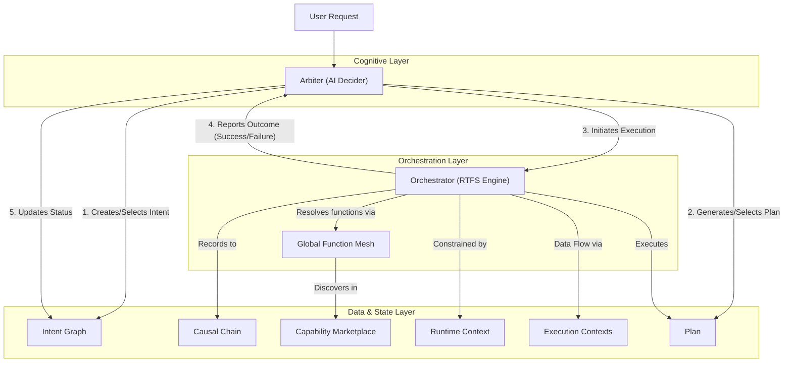
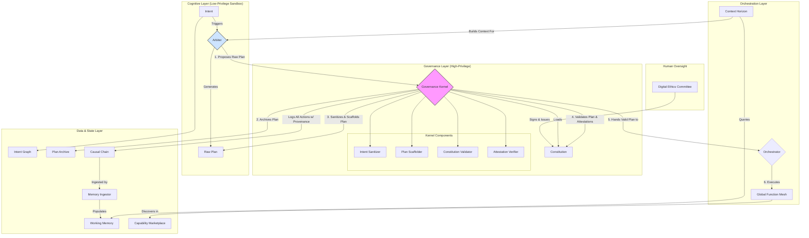

# CCOS Specification 000: System Architecture

**Status:** Proposed
**Version:** 1.0
**Date:** 2025-07-20

## 1. Abstract

This document specifies the architecture of the Cognitive Computing Operating System (CCOS), a framework for building autonomous agents capable of reasoning, planning, and execution. CCOS leverages the **RTFS (Runtime Functional Specification)** language as its universal backbone for data representation, communication, and defining executable logic.

The core principle of CCOS is the separation of **"why"** (Intent), **"how"** (Plan), and **"what happened"** (Action). This specification details the components that manage these concepts and their interactions.

## 2. Core Philosophy

- **Intent-Driven**: All actions performed by the system originate from a clearly defined **Intent**.
- **Orchestration over Execution**: The system prioritizes the ability to observe, manage, and adapt the execution flow of a plan, rather than treating it as an opaque script.
- **Immutable Auditing**: All significant events are recorded in an immutable, cryptographically verifiable ledger known as the **Causal Chain**. This provides a complete and trustworthy audit trail.
- **Secure by Design**: The system is built on a zero-trust model. Security is not an add-on but a core architectural principle, enforced through privilege separation, formal verification, and cryptographic attestations.
- **Extensible & Verifiable Capabilities**: The system's abilities are not fixed. They can be dynamically extended through a marketplace of versioned, cryptographically signed, and verifiable `Capabilities`.

## 3. System Components

CCOS is composed of several primary components organized into layers: Cognitive, Orchestration, and Data/State.

### 3.1. Cognitive Layer

-   **Arbiter**: The "mind" of the CCOS. This is an AI-driven component responsible for high-level reasoning, plan generation, and strategic exception handling. See [SEP-006: Arbiter and Cognitive Control](./006-arbiter-and-cognitive-control.md).

### 3.2. Orchestration Layer

-   **Orchestrator & RTFS Runtime**: The "engine" of the CCOS. This is a deterministic component that executes a `Plan` step-by-step, enforces security, and logs to the Causal Chain. See [SEP-002: Plans and Orchestration](./002-plans-and-orchestration.md).
-   **Global Function Mesh (GFM)**: The "DNS for functions." A universal discovery and routing layer that resolves abstract capability requests (e.g., `:image.sharpen`) to specific, available providers based on policies and SLAs. See [SEP-007: Global Function Mesh](./007-global-function-mesh.md).
-   **Delegation Engine (DE)**: The "Policy Engine." A pluggable component that works with the GFM. While the GFM finds *what* providers are available, the DE decides *which* provider to use based on runtime context (cost, privacy, latency, etc.). See [SEP-008: Delegation Engine](./008-delegation-engine.md).
-   **Context Horizon**: The "Payload Manager." A service that virtualizes large information spaces into a constrained, relevant context for an execution target, especially an LLM. It manages token limits, data relevance, and summarization. See [SEP-009: Context Horizon](./009-context-horizon.md).

### 3.3. Data & State Layer

-   **Intent Graph**: Stores and manages the "why." See [SEP-001: Intent Graph](./001-intent-graph.md).
-   **Plan Archive**: A permanent, content-addressable store for the immutable `Plan` scripts generated by the Arbiter. See [SEP-002: Plans and Orchestration](./002-plans-and-orchestration.md).
-   **Causal Chain**: The immutable, long-term memory ledger. Records "what happened." See [SEP-003: Causal Chain](./003-causal-chain.md).
-   **Working Memory**: A high-performance cache and index of the Causal Chain for efficient recall. See [SEP-013: Working Memory](./013-working-memory.md).
-   **Capability Marketplace**: A registry of all concrete `Capability` providers available to the Orchestrator. See [SEP-004: Capabilities and Marketplace](./004-capabilities-and-marketplace.md).
 -   **Runtime Context**: Enforces security policies and resource constraints. See [SEP-005: Security and Context](./005-security-and-context.md).
 -   **Execution Contexts**: Hierarchical execution data/state. See [SEP-015: Execution Contexts](./015-execution-contexts.md).

## 4. High-Level Execution Flow & Security

The diagram below illustrates the primary path from an `Intent` to the execution of a `Plan`. The flow is governed at every step by the **formally verified Governance Kernel** to ensure security, safety, and alignment.

1.  **Governance**: The **Digital Ethics Committee (DEC)**, a human body, defines and cryptographically signs the `Constitution`.
2.  **Bootstrap**: The high-privilege **Governance Kernel** loads the `Constitution` at boot. Its own correctness is guaranteed through formal verification.
3.  **Context Building**: Before invoking the Arbiter, the **Context Horizon** queries the **Working Memory** to build a relevant, token-aware payload of the user's history and preferences.
4.  **Intent & Proposal**: The **Arbiter**, running in a low-privilege sandbox, receives an `Intent` and the context payload. It generates a `Plan` and *proposes* it to the Governance Kernel.
5.  **Archival**: The Governance Kernel immediately archives the immutable `Plan` in the **Plan Archive**, ensuring a permanent record of the proposed logic exists before any further processing.
6.  **Sanitize & Scaffold**: The Kernel first runs the plan through the **Intent Sanitizer** to check for prompt injection, then uses the **Plan Scaffolder** to wrap it in a safety harness (e.g., resource limits, failure handlers). See [SEP-012](./012-intent-sanitization.md).
7.  **Validate & Verify**: The Kernel's **Constitution Validator** checks the scaffolded plan against all rules. Simultaneously, the **Attestation Verifier** checks the cryptographic signature of every `Capability` in the plan to ensure it's from a trusted source and hasn't been tampered with. See [SEP-011](./011-capability-attestation.md).
8.  **Orchestration**: Only if the plan is valid and all capabilities are verified does the Kernel hand it to the **Orchestrator** for execution.
9.  **Execution**: The Orchestrator executes the plan's RTFS, resolving capabilities via the **Global Function Mesh**.
10. **Causal Chain Logging**: The **Governance Kernel** is the only component with write access to the **Causal Chain**. It records every action, creating an unforgeable audit trail.
11. **Memory Ingestion**: The **Memory Ingestor** runs as an asynchronous process, reading from the Causal Chain and populating the **Working Memory** with indexed, queryable data for future interactions. See [SEP-013](./013-working-memory.md).

## 5. Vision: Towards a Living Architecture

The robust, security-first architecture defined above provides the foundation for a truly cognitive system. The following advanced concepts, drawn from the project's vision, are the next logical evolution, enabled by the core components we have specified.

-   **The Subconscious & Strategic Replay**: The **Causal Chain of Thought (`SEP-003`)** is not just an audit log; it is the system's memory. Future system-level agents will continuously analyze this chain to discover more efficient strategies and propose new, optimized `Capabilities` to the **Marketplace (`SEP-004`)**. This is the system's core learning loop.

-   **The Persona & Evolving Identity**: The **Living Intent Graph (`SEP-001`)** will serve as the foundation for a persistent `Persona`. By learning from the user's goals, preferences, and feedback, the Arbiter can evolve from a generic tool into a true, personalized cognitive partner.

-   **The Immune System & Self-Defense**: The **Capability Attestation (`SEP-011`)** model is the first step of a proactive Immune System. This system will evolve to actively monitor the marketplace for threats, using the Governance Kernel to quarantine malicious actors and protect the health of the entire ecosystem.

-   **Metabolism & Homeostasis**: The principles of resource management will be codified within the **Constitution (`SEP-010`)** and enforced by the **Plan Scaffolder (`SEP-012`)**. This ensures the system operates sustainably and safely, with a core drive to maintain resource equilibrium.

This architecture provides a robust foundation for building powerful AI systems while ensuring they remain safe, aligned, and under meaningful human control.
