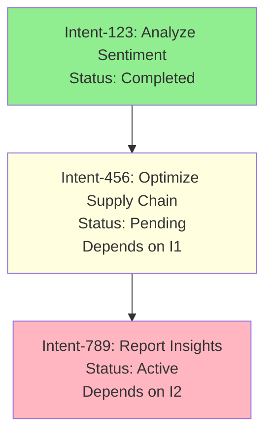

# CCOS Specification 001: Intent Graph (RTFS 2.0 Edition)

**Status:** Draft for Review  
**Version:** 1.0  
**Date:** 2025-09-20  
**Related:** [000: Architecture](./000-ccos-architecture-new.md), [006: Arbiter](./006-arbiter-and-cognitive-control-new.md)  

## Introduction: The Living Goals Backbone

The Intent Graph is CCOS's dynamic representation of 'why'—a hierarchical, immutable graph of user/system goals. Unlike static tasks, intents evolve: They start simple, gain dependencies from outcomes, and inform plan generation. In RTFS 2.0 world, intents are pure data (Maps), feeding into pure plans while state (progress) is host-managed via yields to the Causal Chain.

Why critical? Agents need context. The graph provides it: Query past intents to build relevant payloads for the Arbiter, ensuring plans align with long-term objectives. Immutability: Updates create new versions, preserving history.

## Core Concepts

### 1. Intent Structure
An Intent is a self-contained node: Goal + metadata. No mutation—'updates' append new nodes linking to priors.

**Fields** (RTFS Map):
- `:id` (Symbol): Unique UUID.
- `:goal` (String): Human-readable objective.
- `:description` (String): Detailed rationale.
- `:status` (Enum: :pending, :active, :completed, :aborted): Current state.
- `:priority` (Int): 1-10 for scheduling.
- `:constraints` (Map): Limits (e.g., {:max-tokens 4096, :budget 10.0}).
- `:dependencies` (List<Symbol>): Linked intent IDs.
- `:parent-id` (Symbol, Optional): For hierarchy.
- `:created-at` / `:updated-at` (Timestamp): Provenance.
- `:provenance` (Map): Links to triggering action/chain ID.

**Sample Intent**:
```
{:id :intent-456
 :goal \"Optimize supply chain based on sentiment analysis\"
 :description \"Use prior review insights to reroute shipments.\"
 :status :pending
 :priority 8
 :constraints {:max-cost 50.0 :privacy :pii-safe}
 :dependencies [:intent-123]  ;; Links to sentiment analysis
 :parent-id nil
 :created-at \"2025-09-20T11:00:00Z\"
 :provenance {:from-action :action-789 :arbiter-version \"gpt-4o\"}}
```

### 2. Graph Structure
Directed acyclic graph (DAG): Nodes = Intents, Edges = Dependencies (e.g., A → B if B fulfills A). Stored immutably in a graph DB (host capability `:graph.store`).

- **Creation**: Arbiter adds root intent from user input.
- **Evolution**: On plan completion, append child intent (e.g., 'follow-up optimization').
- **Querying**: Traverse for context (e.g., 'all active children of :intent-123').

**Mermaid Graph Sample**:


### 3. Integration with RTFS 2.0
Intents are inputs to plan generation: Arbiter queries graph, builds context payload (summarized via `:context.horizon` yield), generates pure RTFS plan referencing intent ID.

**Reentrant Process Example**:
1. User: \"Analyze reviews.\" → Arbiter creates Intent-123, queries graph (empty → root).
2. Generates Plan: `(let [context (call :graph.query {:intent :intent-123 :depth 1})] ...)` — yields for graph read.
3. Execution: Pure transform on reviews, yield `:nlp.analyze` → Chain logs action.
4. Success: Append Intent-456 as child (yield `:graph.append`), resume any dependent plans reentrantly (inject new context).

Reentrancy shines: If paused (e.g., budget check), resume by loading graph state + partial chain, re-invoking Arbiter with updated intent.

### 4. Governance and Immutability
Kernel validates intent creation (e.g., no conflicting goals). All ops yield to host: No direct mutation—graph is append-only, versions via hashes.

This graph isn't just storage; it's the system's 'memory of purpose,' enabling adaptive, intent-driven agents without losing traceability.

Next: Plans in 002.