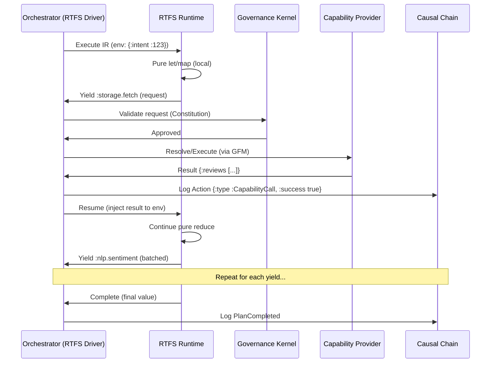

# CCOS Specification 002: Plans and Orchestration (RTFS 2.0 Edition)

**Status:** Draft for Review (Enhanced)
**Version:** 1.1
**Date:** 2025-01-10
**Related:** [000: Architecture](./000-ccos-architecture-new.md), [001: Intent Graph](./001-intent-graph-new.md), [003: Causal Chain](./003-causal-chain-new.md), [035: Two-Tier Governance](./035-two-tier-governance.md)  

## Introduction: Declarative Execution in a Pure World

Plans in CCOS are executable RTFS 2.0 programs—compiled, immutable IR representing 'how' to fulfill an intent. The Orchestrator is the deterministic driver: It executes plans reentrantly, handling yields as host calls while keeping RTFS pure (no state/mutation). This spec explains plan design, compilation, and the yield-resume loop, emphasizing why purity enables safe, verifiable orchestration.

Core Idea: Plans are data transformers. Effects (I/O, state) yield to CCOS; local logic (maps, lets) runs purely. Reentrancy: Execution can pause/resume without side effects, using chain for state.

> **Note on Interactive Mode**: In the **MPC Server** implementation, full Orchestration is bypassed in favor of a simpler **Session** model. Here, the external agent acts as the Orchestrator, submitting tool calls one by one. The Session accumulates these steps, which can ostensibly be replayed as a linear RTFS plan. See [007: Interactive Mode](./007-mcp-server-interactive-mode.md).

## Core Concepts

### 1. Plan Structure
A Plan is RTFS source → verified IR, archived immutably. Includes steps (special form for sequencing), pure functions, and yields.

**Key Elements**:
- **Header**: Metadata (intent ID, version, constraints).
- **Body**: S-expressions: Pure ops (`let`, `map`, `if`) + `(step ...)` for scoped execution + `(call :cap ...)` for yields.
- **IR Format**: Bytecode with opcodes (e.g., `OP_CALL`, `OP_YIELD`), verifiable at compile.

Note: In the codebase, plan metadata reflects this as `PlanLanguage::Rtfs20` and the body as `PlanBody::Rtfs(<source>)`.

**Sample Plan Source** (pure analysis pipeline):
```
;; Plan Header (metadata)
{:intent-id :intent-123
 :version 1
 :constraints {:timeout 30000 :max-yields 5}}

;; Body: Pure + Yields
(step "load-data"
  (let [reviews (call :storage.fetch {:bucket \"reviews\" :key \"2025.json\"})]  ;; Yield 1
    reviews))

(step "analyze"
  (let [reviews (call :storage.fetch {:bucket \"reviews\" :key \"2025.json\"})   ;; Explicit fetch within this step
        raw-sentiments (map (fn (review)
                               (call :nlp.sentiment review))  ;; Yield per item (batched)
                             reviews)]
    (reduce (fn (acc sent) (assoc acc sent :count (+ (get acc sent :count 0) 1)))
            {} raw-sentiments)))  ;; Pure aggregation

(step "persist"
  (call :storage.save {:key \"sentiments.json\" :data :<computed-summary>}))  ;; Yield 2 (reference to prior computed value if exposed by implementation)
```
- **Pure Parts**: `let`, `map`, `reduce`—create new data, no mutation.
- **Yields**: `(call ...)` → `RequiresHost({:cap :storage.fetch, :args [...] , :step-id "load-data"})`.
- **Steps**: Scoped units for logging/hierarchy/checkpoints. Step IDs can be symbols or strings. Data can be threaded explicitly (e.g., via env/state capabilities) depending on implementation ergonomics. If a runtime exposes the previous step result as a binding, it must be immutable.

Compiled IR: Efficient, portable (e.g., Wasm-compatible).

### 1.a Step Special Form & Parameters
Steps provide semantic and operational boundaries inside a plan. They scope logging, retries, and timeouts, and anchor reentrancy checkpoints.

**Syntax** (source):
```
(step :step-id-or-string {:timeout-ms 5000
                :retries {:max 2 :backoff-ms 200}
                :on-fail :abort  ;; or :retry / :delegate
                :metadata {:purpose :analysis}}
  ;; body (pure + yields)
  (let [...])
)
```

- `:timeout-ms`: Max wall-time for the step. Kernel enforces; exceeding triggers failure action.
- `:retries`: Policy for transient yield failures; idempotent keys required.
- `:on-fail`: Strategy (abort, retry, delegate to Cognitive Engine).
- `:metadata`: Free-form annotations; reflected in chain actions.

Steps map to hierarchical actions in the Causal Chain (StepStarted/Completed/Failed). Each step boundary is a natural checkpoint location.

### 1.e Step Profile Derivation (Security & Isolation)

For security-sensitive operations, steps can have derived profiles that determine isolation level, MicroVM configuration, and resource limits:

```rust
pub struct StepProfile {
    pub step_id: String,
    pub intent_id: String,

    // Security Profile
    pub security_level: SecurityLevel,  // "low", "medium", "critical"
    pub isolation_level: IsolationLevel,  // "inherit", "isolated", "sandboxed"

    // MicroVM Configuration
    pub microvm_config: Option<MicroVMConfig>,

    // Security Flags
    pub syscall_filter: Option<SyscallFilter>,
    pub network_acl: Option<NetworkACL>,
    pub fs_acl: Option<FilesystemACL>,
    pub read_only_fs: bool,
    pub cpu_monitoring: bool,

    // Resource Limits
    pub resource_limits: ResourceLimits,

    // Determinism Detection
    pub deterministic: bool,

    // Metadata
    pub metadata: HashMap<String, Value>,
}

pub struct MicroVMConfig {
    pub runtime: String,              // "firecracker", "qemu", "wasmtime"
    pub network_policy: NetworkPolicy,
    pub filesystem_policy: FilesystemPolicy,
    pub memory_mb: u64,
    pub cpus: u32,
}

pub enum SecurityLevel {
    Low,       // General operations, minimal isolation
    Medium,    // Data processing, moderate isolation
    Critical,   // High-value data, maximum isolation
}

pub enum IsolationLevel {
    Inherit,    // Inherit parent step's isolation
    Isolated,    // Isolated from siblings, read parent
    Sandboxed,   // Completely isolated, no parent access
}

pub struct ResourceLimits {
    pub max_time_ms: Option<u64>,
    pub max_memory_mb: Option<u64>,
    pub max_cpu_percent: Option<u32>,
    pub max_iops: Option<u64>,
    pub max_bandwidth_mbps: Option<u64>,
}

pub struct SyscallFilter {
    pub allowlist: Vec<String>,      // Allowed syscalls (e.g., ["read", "write"])
    pub blocklist: Vec<String>,      // Blocked syscalls (e.g., ["exec", "network"])
    pub mode: FilterMode,           // "default-allow" or "default-deny"
}

pub struct NetworkACL {
    pub allowed_hosts: Vec<String>,   // Allowed endpoints
    pub blocked_hosts: Vec<String>,   // Blocked endpoints
    pub allowed_ports: Vec<u16>,     // Allowed ports
    pub blocked_ports: Vec<u16>,     // Blocked ports
}

pub struct FilesystemACL {
    pub read_paths: Vec<String>,     // Readable paths
    pub write_paths: Vec<String>,    // Writable paths
    pub read_only: bool,             // Force read-only mode
}

pub enum NetworkPolicy {
    AllowAll,                    // Full network access
    BlockAll,                     // No network access
    Whitelist(Vec<String>),        // Only allowed hosts
    Blacklist(Vec<String>),        // Block specific hosts
}

pub enum FilesystemPolicy {
    AllowAll,                     // Full FS access
    ReadOnly,                     // Read-only access
    Whitelist(Vec<String>),        // Only allowed paths
    Blacklist(Vec<String>),        // Block specific paths
}
```

#### StepProfileDeriver

The `StepProfileDeriver` analyzes step content and intent constraints to derive security profiles:

```rust
pub struct StepProfileDeriver {
    pub fn new() -> Self;
    pub fn derive_profile(&self, step: &Step, intent: &Intent, constraints: &HashMap<String, Value>) -> StepProfile;
    pub fn detect_determinism(&self, step: &Step) -> bool;
}
```

**Derivation Rules**:

1. **Security Level Detection**:
   - Check intent constraints for `:max-sensitivity` or `:security-level`
   - Analyze capability calls: network/FS access requires Medium+, data access requires Critical
   - Check intent metadata for `:critical` flag

2. **Isolation Level Selection**:
   - Default: `Inherit` (use parent step's isolation)
   - Parallel branches: `Isolated` (prevent sibling interference)
   - Untrusted capabilities: `Sandboxed` (maximum isolation)

3. **MicroVM Configuration**:
   - High security level (Critical) → MicroVM with minimal privileges
   - Network capabilities → NetworkPolicy with Whitelist
   - FS capabilities → FilesystemPolicy with ReadOnly or Whitelist

4. **Security Flags**:
   - **Syscall Filter**: Block dangerous syscalls (exec, fork, mount) based on step operations
   - **Network ACL**: Restrict to required endpoints (e.g., API URLs only)
   - **FS ACL**: Restrict to required paths (e.g., /data/input only)
   - **Read-only FS**: Force read-only for analysis-only steps
   - **CPU Monitoring**: Enable CPU usage tracking for performance

5. **Resource Limits**:
   - Extract from intent constraints (`:timeout`, `:max-cost`)
   - Apply step-level limits overrides
   - Enforce via Orchestrator runtime

6. **Determinism Detection**:
   - Analyze step body for pure operations only (no `(call ...)`)
   - Mark as `deterministic = true` if no side-effect calls
   - Enable fast-path execution and caching

**Example Derived Profile**:
```rust
let profile = StepProfileDeriver::new()
    .derive_profile(&step, &intent, &constraints);

// Output:
StepProfile {
    step_id: "analyze-logs",
    security_level: Medium,
    isolation_level: Isolated,
    microvm_config: Some(MicroVMConfig {
        runtime: "firecracker",
        memory_mb: 512,
        cpus: 1,
        network_policy: Whitelist(vec!["api.example.com".to_string()]),
        filesystem_policy: ReadOnly,
    }),
    syscall_filter: Some(SyscallFilter {
        allowlist: vec!["read".to_string(), "write".to_string()],
        blocklist: vec!["exec".to_string(), "fork".to_string()],
        mode: DefaultDeny,
    }),
    network_acl: Some(NetworkACL {
        allowed_hosts: vec!["api.example.com".to_string()],
        blocked_hosts: vec![],
        allowed_ports: vec![443],
        blocked_ports: vec![],
    }),
    fs_acl: Some(FilesystemACL {
        read_paths: vec!["/data/input".to_string(), "/var/log".to_string()],
        write_paths: vec![],
        read_only: true,
    }),
    resource_limits: ResourceLimits {
        max_time_ms: Some(30000),
        max_memory_mb: Some(512),
        max_cpu_percent: Some(80),
    },
    deterministic: false,  // Contains network calls
}
```

### 1.f Execution Contexts (Hierarchical)

### 1.b Execution Contexts (Hierarchical)
Execution contexts carry immutable, hierarchical metadata/environment across steps.

**Model**:
- Plan Context → Step Context → Substep Context
- Inheritance: Child context extends parent with overrides (e.g., tighter quotas).

**Fields** (examples):
- `:intent-id`, `:plan-id`
- `:quota` (tokens, yields, budget)
- `:acl` (allowed capabilities)
- `:policy` (delegation preferences)
- `:checkpoint` (last action-id)

Contexts are injected as RTFS env bindings; yields include the active context for Kernel decisions. On resume, context reloads from chain to prevent privilege drift.

**Sample**:
```
(step :analyze {:quota {:yields 2}}
  (let [ctx (merge context {:step :analyze})]
    (call :nlp.sentiment {:text review :context ctx})))
```

### 1.c Macros & Ergonomics
To keep plan source expressive while preserving purity, provide macros that expand into pure forms + yields. Examples:

- `(with-timeout 5000 body)` → wraps body in a step with :timeout-ms.
- `(with-kv key body)` → expands to `:kv.get` yield + binds value in body.
- `(batch-call :cap coll)` → expands to `map` with per-item yield + idempotent keys.

Macros compile away; runtime remains minimal and pure.

### 1.d Sample: Stateful Orchestration via Capabilities (Demo-like)
This mirrors the demo program using string step IDs and `ccos.*` state capabilities to preserve context across steps via host effects.

```
(do
  (step "initialize-state"
    (let [initial-data (call :ccos.state.kv.put "workflow-state" "initialized")]
      (call :ccos.echo (str "State initialized: " initial-data))))

  (step "process-data"
    (let [counter (call :ccos.state.counter.inc "process-counter" 1)
          data (call :ccos.state.kv.get "workflow-state")]
      (do
        (call :ccos.echo (str "Processing data: " data))
        (call :ccos.echo (str "Counter value: " counter))
        (if (> counter 0)
          (do
            (call :ccos.echo "Counter is positive, proceeding...")
            (let [processed (call :ccos.state.event.append "workflow-events" "data-processed")]
              (call :ccos.echo (str "Event logged: " processed))))
          (call :ccos.echo "Counter is zero or negative")))))

  (step "finalize"
    (let [final-counter (call :ccos.state.counter.inc "process-counter" 1)
          final-state (call :ccos.state.kv.put "workflow-state" "completed")
          summary (call :ccos.state.event.append "workflow-events" "workflow-completed")]
      (do
        (call :ccos.echo (str "Final counter: " final-counter))
        (call :ccos.echo (str "Final state: " final-state))
        (call :ccos.echo (str "Summary: " summary))
        {:status "completed" :counter final-counter :state final-state}))) )
```

This showcases reentrancy with multiple yields per step and context preservation via explicit capability calls, consistent with RTFS purity (no hidden mutation).

### 2. Orchestration: The Yield-Resume Engine
Orchestrator embeds RTFS runtime:
1. Load verified IR + initial env (from intent/graph).
2. Eval step-by-step: Pure ops locally; yields → pause, return `effect_request`.
3. On yield: Forward to Governance Kernel → Resolve (GFM/DE) → Execute capability → Log action → Resume with result injected.
4. Reentrancy: If interrupted, store env/chain ID; resume by replaying pure prefix + injecting host results.

**Yield-Resume Cycle Diagram**:


**Reentrant Sample** (Interrupted Analysis):
- Start: Eval to first yield → Pause (e.g., quota).
- Chain: `Action {:id :act-1, :type :YieldPending, :env-snapshot {...}}`.
- Resume Later: Load IR, replay pure ops to yield point (deterministic), inject prior results, continue. No re-execution of effects—idempotency via request keys.

### 3. Compilation and Verification
- **Compile**: Source → IR (parse, macro-expand, optimize). Macros add syntax sugar (e.g., `(with-kv key body)` → yield sequence).
- **Verify**: Kernel scans IR for disallowed yields (e.g., no `:dangerous.exec`), checks complexity, signs for archive.
- **Why Pure?** Enables static analysis; reentrancy without races (no shared mutable state).

### 4. Error Handling and Adaptation
- Local Errors: Pure (e.g., type mismatch) → Abort step, log, notify Cognitive Engine.
- Yield Errors: Host failure → Retry (idempotent) or escalate to Cognitive Engine for new plan.
- Reentrancy: Failed resumes roll back to last chain checkpoint, preserving purity.

Plans + Orchestrator form CCOS's 'how': Declarative, safe execution where RTFS computes, CCOS acts.

Next: Causal Chain in 003.

### 2.a Resume-and-Continue Semantics (API)

CCOS supports a resume-and-continue flow for long-running or interactive plans where a plan yields to the host (RequiresHost) and a checkpoint is recorded. The orchestrator exposes a helper that restores a serialized execution context and continues executing the plan body until either completion or the next host pause.

Key points:
- Checkpoint id format: `cp-<sha256hex>`; checkpoints store the serialized evaluator context.
- To resume and continue the plan in one call, call the Orchestrator API: `resume_and_continue_from_checkpoint(plan, context, checkpoint_id)`.
- The helper will:
  - recreate a `RuntimeHost` and `Evaluator` with the provided `RuntimeContext` (must have appropriate capability ACLs),
  - restore the serialized context from the checkpoint archive,
  - log a `PlanResumed` action, and
  - continue execution using the same deterministic evaluation path used by `execute_plan`.
- Return value: an `ExecutionResult` mirroring `execute_plan` semantics:
  - success=true + PlanCompleted logged when execution finishes, or
  - success=false + PlanPaused logged if execution yields again (new checkpoint created), or
  - success=false + PlanAborted logged on error.

Audit notes:
- `PlanResumed` and subsequent `PlanCompleted`/`PlanPaused` actions are appended to the Causal Chain so external observers can reconstruct the timeline. If you want stricter parent linkage to the original `PlanStarted` action, consumers may inspect the chain and correlate action ids.

Example usage (pseudo-Rust):

```rust
let (plan, result) = ccos.process_request_with_plan("Plan a trip", &ctx).await?;
if !result.success {
    // find PlanPaused action for plan_id and extract checkpoint id arg
    let checkpoint_id = find_latest_checkpoint_id(&ccos.get_causal_chain(), &plan.plan_id);
    let resumed = ccos
        .get_orchestrator()
        .resume_and_continue_from_checkpoint(&plan, &ctx, &checkpoint_id)
        .await?;
    // resumed now contains final ExecutionResult or a fresh paused result
}
```

This flow is helpful for interactive assistants that collect user input mid-plan or for long-running integrations where host actions must be gated and audited. It preserves determinism by restoring the exact serialized evaluator context and replaying the same pure operations up to the next yield.