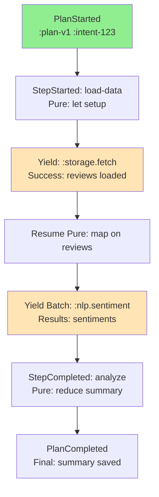
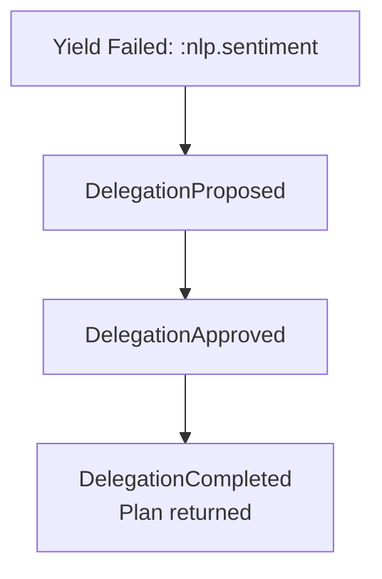

# CCOS Specification 003: Causal Chain (RTFS 2.0 Edition)

**Status:** Draft for Review  
**Version:** 1.1  
**Date:** 2025-01-10  
**Related:** [000: Architecture](./000-ccos-architecture-new.md), [002: Plans](./002-plans-and-orchestration-new.md), [006: Cognitive Engine](./006-cognitive-engine-and-cognitive-control.md), [030: Capabilities](./030-capability-system-architecture.md), [035: Two-Tier Governance](./035-two-tier-governance.md)  

## Introduction: The Immutable Audit Backbone

The Causal Chain is CCOS's tamper-proof ledger: An append-only, hashed tree recording every action, yield, and outcome. In RTFS 2.0, it captures pure execution + host effects, enabling 'Causal Chain of Thought'—verifiable reasoning traces. Why essential? Provides replayability for debugging, learning (e.g., optimize plans), and compliance (prove alignment to intents/Constitution).

Immutability: Once appended, entries are eternal; updates via new links. Reentrancy: Use as checkpoint store for resume.

## Core Concepts

### 1. Action Structure
Each entry is an `Action`: Hierarchical record of an event.

**Fields** (RTFS Map for storage):
- `:action-id` (Symbol): UUID.
- `:parent-action-id` (Symbol, Optional): Links hierarchy.
- `:plan-id` (Symbol): Associated plan IR hash.
- `:intent-id` (Symbol): Fulfilling goal.
- `:step-id` (Symbol): RTFS step (e.g., :load-data).
- `:type` (Enum): :PlanStarted, :StepYield, :CapabilityCall, :PureEval, :PlanCompleted, etc.
- `:function-name` (Symbol): e.g., :storage.fetch.
- `:args` (List<Value>): Yield inputs (sanitized).
- `:result` (Value): Output (redacted if sensitive).
- `:success` (Bool): Outcome.
- `:error` (String, Optional): Failure details.
- `:cost` (Float): Resources used.
- `:duration-ms` (Int): Time.
- `:timestamp` (Timestamp): When logged.
- `:hash` (String): Merkle-proof (includes prior hash).
- `:provenance` (Map): {:constitutional-rule :budget-ok, :attestation-id :cap-xyz, :effect-request {...}}.

**Sample Action** (from sentiment plan yield):
```
{:action-id :act-456
 :parent-action-id :act-123  ;; Prior pure step
 :plan-id :plan-v1
 :intent-id :intent-123
 :step-id :load-data
 :type :CapabilityCall
 :function-name :storage.fetch
 :args [:bucket \"reviews\" :key \"2025.json\"]
 :result {:reviews [{\"text\": \"Great product!\"} ]}
 :success true
 :cost 0.02
 :duration-ms 150
 :timestamp \"2025-09-20T10:05:00Z\"
 :hash \"sha256:abc...\"  ;; Chains to parent
 :provenance {:rule :data-access-allowed :request-idempotent true}}
```

### 2. Chain as Hierarchical Tree
Not flat log: Tree mirrors plan structure (plan → steps → yields). Hash chain: Each action hashes (fields + parent hash), ensuring integrity.

**Tree Sample Diagram** (for above plan):


### 3. Integration with RTFS 2.0 Reentrancy
Orchestrator logs automatically:
- Pure evals: Optional fine-grained (for debug).
- Yields: Mandatory, with `effect_request` (step/intent IDs for provenance).
- Resumes: Log as `:ResumeFrom {:checkpoint-action :act-2}`.

**Reentrant Replay Example**:
1. Execution to A4 yield → Pause (e.g., error in :nlp).
2. Chain: Up to A4, with env snapshot (immutable results so far).
3. Resume: Verify chain hash → Replay pure A1/A3 (deterministic, fast) → Re-issue yield (idempotent key prevents dupes) → Continue to A5.
4. Learning: Query chain (`:chain.query {:intent :123 :type :YieldFailed}`) → Cognitive Engine generates optimized plan (e.g., batch smaller).

### 4. API and Verifiability
Host capabilities:
- `:chain.append (action)`: Validate + hash + store.
- `:chain.query (filter)`: By ID/intent/step; returns subtree.
- `:chain.verify (from-id)`: Traverse + check hashes.
- `:chain.replay (action-id, env)`: For reentrancy/testing.

RTFS Purity Boost: Yields are explicit, so chain captures full 'thought process'—pure transforms + governed effects—without mutation gaps.

This chain turns execution into a queryable story, powering adaptive agents.

### 3.a Delegation Events (Example)

Delegation is fully auditable via dedicated action types that nest under the relevant intent/step where the decision occurred. Typical types:

- `:DelegationProposed`
- `:DelegationApproved` / `:DelegationRejected`
- `:DelegationRevoked` (policy change) 
- `:DelegationCompleted` (agent returned a result/plan)

Minimal example entries (under the failed yield at `A4` from the tree above):
```
{:action-id :act-700
 :parent-action-id :act-4  ;; The failing yield or step node
 :plan-id :plan-v1
 :intent-id :intent-123
 :step-id :analyze
 :type :DelegationProposed
 :delegation {:agent-id :agent.sentiment.v2
              :rationale "Specialist agent for multilingual reviews"
              :constraints {:caps [:nlp/* :storage/*]
                           :max-yields 4
                           :redactions [:pii]}}
 :provenance {:rule :delegation-allowed :sensitivity :low}}

{:action-id :act-701
 :parent-action-id :act-700
 :type :DelegationApproved
 :provenance {:cognitive engine :primary
              :kernel-decision :budget-ok
              :attestation-id :agent-sig-abc}}

{:action-id :act-702
 :parent-action-id :act-701
 :type :DelegationCompleted
 :result {:rtfs.plan-source "(defplan analyze ... )"
          :metrics {:latency-ms 5200 :cost 0.03}}
 :success true}
```

Subtree sketch:


Reentrant replay notes:
- Delegation entries are effects (host boundary) and are idempotent via a `:request-id` stored in `:provenance` (omitted above for brevity). Replays won’t re-call an external agent if a completed record exists.
- If a proposal was rejected or revoked between runs, replay halts before execution and surfaces the governance decision deterministically.
 - The returned `:rtfs.plan-source` is revalidated and compiled before execution; its compilation and subsequent yields are logged as normal under the same intent.

 ### 3.b ActionType Enumeration

The Causal Chain supports a comprehensive set of action types for full system traceability. Action types are categorized by their domain and lifecycle stage.

#### Plan Lifecycle Actions
- `:PlanStarted` - Plan execution begins, records initial state and intent association
- `:PlanCompleted` - Plan finishes successfully, records final outcome
- `:PlanAborted` - Plan terminated before completion (error, cancellation)
- `:PlanPaused` - Plan paused for later resumption
- `:PlanResumed` - Previously paused plan resumes execution

#### Step Lifecycle Actions
- `:PlanStepStarted` - Step execution begins, records context and inputs
- `:PlanStepCompleted` - Step finishes successfully
- `:PlanStepFailed` - Step execution fails, records error details
- `:PlanStepRetrying` - Step being retried per retry policy

#### Execution Actions
- `:CapabilityCall` - Capability invoked via `(call ...)` yield
- `:CapabilityResult` - Result of capability call (appended after execution)
- `:PureEval` - Pure RTFS evaluation (debug mode)
- `:StepYield` - Explicit yield from step to host
- `:ResumeFrom` - Resume execution from checkpoint

#### Intent Lifecycle Actions (NEW)
- `:IntentCreated` - New intent node added to Intent Graph
- `:IntentStatusChanged` - Intent status modified (Active → Executing → Completed)
- `:IntentRelationshipCreated` - New edge added between intents (DependsOn, IsSubgoalOf, etc.)
- `:IntentRelationshipModified` - Existing relationship properties updated
- `:IntentArchived` - Intent moved to archival storage
- `:IntentReactivated` - Archived intent restored to active state

#### Capability Lifecycle Actions (NEW)
- `:CapabilityRegistered` - New capability discovered, synthesized, or manually registered
- `:CapabilityRemoved` - Capability deregistered from marketplace
- `:CapabilityUpdated` - Capability metadata, schema, or provider changed
- `:CapabilityDiscoveryCompleted` - Discovery scan completes (MCP, OpenAPI, network)
- `:CapabilityVersionCreated` - Version snapshot created before modification
- `:CapabilityRollback` - Capability reverted to previous version
- `:CapabilitySynthesisStarted` - AI synthesis process begins for missing capability
- `:CapabilitySynthesisCompleted` - Synthesis finishes (success or failure)

#### Governance & Self-Programming Actions (NEW)
- `:GovernanceApprovalRequested` - Action requires human or automatic approval
- `:GovernanceApprovalGranted` - Approval granted, execution proceeds
- `:GovernanceApprovalDenied` - Approval denied, action blocked
- `:BoundedExplorationLimitReached` - Synthesis or decomposition hit exploration limit

#### Atomic Governance Checkpoints (NEW)
- `:GovernanceCheckpointDecision` - Tier-2 governance decision before step execution
- `:GovernanceCheckpointOutcome` - Recorded outcome after governed step execution
- `:HintApplied` - Execution hint triggered (retry, fallback, timeout, cache, circuit-breaker, rate-limit)

#### Catalog & Internal Actions (NEW)
- `:CatalogReuse` - Plan reused from catalog (avoided synthesis)
- `:InternalStep` - Control flow step without capability call
- `:StepProfileDerived` - Security profile derived for step (syscall filter, ACLs, isolation level)

**Governance Traceability**: All action types include `:provenance` field referencing governing rules, attestations, and checkpoints. This enables full audit trails for:
- Capability synthesis and rollback chains
- Two-tier governance decisions (global plan validation + per-step checkpoints)
- Learning system interactions (bounded exploration, hint applications)
- Human approval workflows

Next: Capabilities in 004.