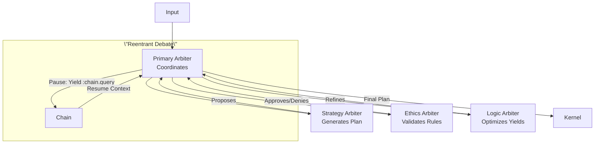

# CCOS Specification 006: Arbiter and Cognitive Control (RTFS 2.0 Edition)

**Status:** Draft for Review (Enhanced)
**Version:** 1.1
**Date:** 2025-01-10
**Related:** [000: Architecture](./000-ccos-architecture-new.md), [001: Intent Graph](./001-intent-graph-new.md), [002: Plans](./002-plans-and-orchestration-new.md), [009: Context Horizon](./009-context-horizon.md)  

## Introduction: The AI Mind in a Governed System

The Arbiter is CCOS's cognitive core: An AI (LLM or federation) that reasons over intents, generates pure RTFS plans, and adapts from outcomes. Sandboxed—no direct effects; proposes to Kernel. In RTFS 2.0, it targets pure code, yielding for actions, enabling safe, reentrant cognition.

Why central? Handles non-determinism (creativity, exceptions) while Orchestrator does determinism. Reentrancy: Arbiters can pause debates, resume with chain context.

## Core Concepts

### 1. Arbiter Role and Lifecycle
- **Intent Formulation**: Parse user input → Structured intent in graph.
- **Plan Generation**: Query graph/chain → Output RTFS source (pure + yields).
- **Exception Handling**: On Orchestrator failure → Analyze chain → New plan or abort.
- **Cognitive Execution**: For linguistic tasks, direct RTFS (e.g., summarize).

Runs in low-privilege sandbox; Kernel approves proposals.

**Sample Arbiter Workflow** (Pseudo-prompt for LLM):
```
Context: Intent Graph subtree + Chain summary (last 5 actions).
Task: Generate RTFS plan for :intent-123 (analyze sentiment).
Constraints: Pure functions, yields only for :storage/* :nlp/*.
Output: Valid RTFS source + metadata.
```

Generated Plan: As in 002 sample.

### 2. Federation: Collaborative Reasoning
Single Arbiter → Multiple specialists (e.g., Strategy, Ethics) for robustness.

- **Roles**: Strategy: Long-term plans; Ethics: Constitution check; Logic: Optimize yields.
- **Debate**: Primary Arbiter coordinates: Propose plan → Subs critique (via RTFS queries to chain) → Vote/consensus.
- **Recording**: Each sub-response as chain action, hierarchical.

**Federation Diagram**:


### 3. Integration with RTFS 2.0 Reentrancy
Arbiters generate/use pure RTFS:
- **Generation**: Output source → Compile/verify before Orchestrator.
- **Querying**: Use RTFS for analysis, e.g., `(call :chain.query {:intent :123})` → Yield for context.
- **Reentrant Cognition**: Complex decisions: Pause mid-debate (yield for external data) → Resume with injected results.

**Reentrant Example** (Federated Adaptation):
1. Plan fails (chain shows yield error).
2. Primary: 'Debate fix' → Strat proposes new yields; Eth checks.
3. Yield :external-advice (e.g., API) → Pause.
4. Resume: Inject result → Consensus on refined plan → Propose to Kernel.
5. Chain: Debate as sub-actions under failure action.

### 3.a LLM Execution Bridge (Prompting, Tools, Budgets)
Arbiters interface with LLMs via a bridge that standardizes prompting, token budgeting, and tool-use. The bridge is host-side (pure RTFS yields), keeping Arbiter logic declarative and safe.

- **Prompt Construction**: Uses Context Horizon payload (009) and Intent Graph snapshots. Prompts are templates with slotted fields (intent, constraints, recent chain events).
- **Token Budgets**: Enforced via Runtime Context quotas; bridge truncates/summarizes inputs to meet limits.
- **Tool Use**: LLM suggests actions in a constrained schema; bridge maps them to RTFS constructs (e.g., capability calls) or requests Arbiter to generate RTFS source directly.

**Sample Bridge Yield**:
```
(call :llm.generate-plan
      {:intent :intent-123
       :context (call :horizon.build {:intent :intent-123 :max-tokens 2048})
       :constraints {:caps [:storage/* :nlp/*] :max-yields 5}
       :output-schema :rtfs.plan-source})
```
Bridge returns RTFS source (validated/sanitized) for compilation. All interactions logged to the Causal Chain with token and cost metrics.

### 3.b Delegation Engine Architecture

For higher-order tasks and capability selection, CCOS uses a **StaticDelegationEngine** with L1 cache for memoization. This replaces the simple AgentRegistry model with a more sophisticated system that decides where to execute RTFS function calls based on static policies and cached delegation plans.

#### 3.b.1 Execution Targets

The Delegation Engine determines where RTFS function calls are executed:

```rust
pub enum ExecTarget {
    LocalPure,                    // Run directly in deterministic evaluator
    LocalModel(String),             // Call on-device model (e.g., "phi-mini", "rule-engine")
    RemoteModel(String),            // Delegate to remote model via Arbiter RPC
    L4CacheHit {                 // Execute pre-compiled RTFS from content-addressable cache
        storage_pointer: String,    // S3 object key or blob storage pointer
        signature: String,          // Cryptographic signature for verification
    },
}
```

**Target Selection Criteria**:
- `LocalPure`: Pure RTFS functions, deterministic operations
- `LocalModel`: Fast on-device inference (quantized transformers, rule engines)
- `RemoteModel`: Heavy computation requiring cloud LLMs
- `L4CacheHit`: Previously compiled RTFS modules with verified signature

#### 3.b.2 L1 Delegation Cache for Memoization

The L1 cache memoizes delegation decisions for performance:

**Cache Structure**:
```rust
pub struct DelegationPlan {
    target: String,                           // "local-pure", "remote-gpt4o", etc.
    confidence: f64,                         // 0.0 - 1.0
    reasoning: String,                          // Human-readable explanation
    metadata: HashMap<String, String>,          // Additional context
}
```

**Cache Key**: `(agent_identifier, task_hash)` where:
- `agent_identifier`: Fully-qualified RTFS symbol (e.g., "math/add")
- `task_hash`: `arg_type_fingerprint XOR runtime_context_hash`

**Cache Configuration**:
- Max entries: 1000 (default)
- TTL: 24 hours
- Eviction: LRU (Least Recently Used)

**Example Cache Entry**:
```
Key: ("math/add", "abc123")  // agent + XOR of type hash and context hash
Value: DelegationPlan {
    target: "local-pure",
    confidence: 0.95,
    reasoning: "Mathematical operation is deterministic",
    metadata: {
        "intent_type": "mathematical",
        "complexity": "low"
    }
}
```

**Cache Benefits**:
- Fast delegation decisions (avoid recomputation)
- Learned patterns (system adapts to workload)
- Reduced latency for repeated calls

#### 3.b.3 ModelProvider Abstraction

All LLM-like capabilities implement the `ModelProvider` trait for consistent interface:

```rust
pub trait ModelProvider: Send + Sync + Debug {
    fn id(&self) -> &'static str;  // "phi-mini", "gpt4o"
    fn infer(&self, prompt: &str) -> Result<String>;
}
```

**Built-in Providers**:
- `LocalEchoModel`: Echoes input with prefix (testing only)
- `RemoteArbiterModel`: Delegates to remote Arbiter via RPC (production)
- `DeterministicStubModel`: Returns predictable JSON/RTFS (CI/tests)
- `LocalLlamaModel`: Quantized on-device transformer (optional, requires `RTFS_LOCAL_MODEL_PATH`)

#### 3.b.4 ModelRegistry

Global registry for dynamic `ModelProvider` registration and lookup:

```rust
pub struct ModelRegistry {
    providers: RwLock<HashMap<String, Arc<dyn ModelProvider>>>,
}

impl ModelRegistry {
    pub fn register<P: ModelProvider + 'static>(&self, provider: P);
    pub fn get(&self, id: &str) -> Option<Arc<dyn ModelProvider>>;
    pub fn with_defaults() -> Self;  // Registers built-in providers
}
```

**Usage Example**:
```rust
let registry = ModelRegistry::with_defaults();
registry.register(LocalLlamaModel::default());

let provider = registry.get("phi-mini")?;
let response = provider.infer("Hello, CCOS!")?;
```

#### 3.b.5 CallContext and Fingerprinting

Delegation decisions are keyed on cheap structural fingerprints:

```rust
pub struct CallContext<'a> {
    pub fn_symbol: &'a str,              // Fully-qualified RTFS symbol
    pub arg_type_fingerprint: u64,        // Hash of argument types
    pub runtime_context_hash: u64,         // Hash of runtime context (permissions, quotas, etc.)
    pub semantic_hash: Option<Vec<f32>>,   // Vector embedding for L4 cache only
    pub metadata: Option<DelegationMetadata>,  // Hints from CCOS components
}
```

**DelegationMetadata** provides hints from intent graph/planners:
```rust
pub struct DelegationMetadata {
    pub confidence: Option<f64>,          // 0.0 - 1.0
    pub reasoning: Option<String>,          // Explanation
    pub context: HashMap<String, String>,   // Intent-specific context
    pub source: Option<String>,            // Component providing metadata
}
```

**Example CallContext with CCOS Metadata**:
```rust
let metadata = DelegationMetadata::new()
    .with_confidence(0.95)
    .with_reasoning("Intent analysis suggests local execution")
    .with_context("intent_type", "mathematical")
    .with_context("complexity", "low")
    .with_source("intent-analyzer");

let ctx = CallContext::new("math/add", 0x12345678, 0xABCDEF01)
    .with_metadata(metadata);
```

#### 3.b.6 Delegation Decision Flow

```
Input: CallContext (fn_symbol, args, runtime context)

1. Static fast-path: Check fn_symbol in static_map
   → If found: Return configured ExecTarget

2. L1 Cache lookup:
   → Generate task_hash = arg_type_fingerprint XOR runtime_context_hash
   → Check cache for (fn_symbol, task_hash)
   → If hit: Return cached DelegationPlan target

3. Use DelegationMetadata if available:
   → Extract confidence, reasoning, context
   → Cache decision with metadata for future hits

4. Default fallback: ExecTarget::LocalPure
   → Cache with default reasoning: "No static policy or cache hit"
```

#### 3.b.7 Agent Capabilities as Capabilities

Agents are now discovered via Capability Marketplace rather than separate AgentRegistry:

**Query for Agents**:
```
(:capability.query
  :kind :agent
  :skills ["image-processing" "analysis"]
  :trust-tier 3)
```

**Agent Capability Descriptor**:
```rust
CapabilityManifest {
    id: "agent.sentiment.v2",
    kind: CapabilityKind::Agent,
    skills: ["sentiment-analysis", "multilingual"],
    trust_tier: 3,
    quotas: {...},
    provenance: {...}
}
```

This keeps delegation architecture consistent with capability system.

### 3.c Constrained LLM Output → Safe Plans (Example)
The LLM bridge returns outputs in a constrained JSON schema that is validated before any RTFS compilation. This prevents prompt-injection from smuggling side effects or arbitrary code.

Schema (conceptual):
```
PlanGenerationOutput := {
  version: "1.x",
  plan_source?: string,               // Either plan_source OR steps must be provided
  steps?: [ {
    step_id: string,
    purpose: string,
    rtfs_pure?: string,              // Pure RTFS snippets (no effects)
    yields?: [ { cap: string, args: any[] } ]
  } ],
  constraints: { caps: string[], max_yields: number },
  rationale?: string
}
```

Validation pipeline:
- JSON shape check (required fields, types)
- Capability allowlist: every `yields[*].cap` ∈ constraints.caps
- RTFS static checks: if `plan_source` present → parse/compile in strict mode (pure-only; yields via `call`), else synthesize RTFS plan from `steps` and compile
- Policy checks: budgets/quotas; environment redactions
- Only on success → Orchestrator receives compiled IR

Minimal example output and mapping:
```
{
  "version": "1.0",
  "plan_source": "(defplan analyze (reviews) (let [sents (call :nlp.sentiment reviews)] (pure (summarize sents))))",
  "constraints": {"caps": [":nlp/*"], "max_yields": 3},
  "rationale": "Use single batch sentiment, then summarize"
}
```

If instead `steps` are provided, the bridge emits a canonical RTFS plan:
```
steps -> (defplan <auto> (...) (step :s1 (pure ...)) (step :s2 (call cap args)) ...)
```

All rejections (schema/allowlist/compile failures) are logged to the Causal Chain with explicit reasons and do not reach execution.

### 3.c Agent Discovery via Capability Marketplace

Agents are now managed as capabilities with `:kind :agent` rather than separate AgentRegistry. This unifies discovery, governance, and delegation under Capability Marketplace.

**Agent Query Example**:
```rtfs
(:capability.query
  :kind :agent
  :skills ["sentiment-analysis", "multilingual"]
  :trust-tier 3)
```

**Delegation Flow with Capabilities**:
1. Draft intent + constraints
2. Query Capability Marketplace for agent candidates (skill/constraint/trust match)
3. Propose `DelegationMetadata` {selected_capability?, rationale, expected_plan_shape, fallback_strategy}
4. Governance Kernel evaluates delegation policy (budget, trust vs sensitivity)
5. If approved: intent ownership temporarily transferred/shared; agent produces plan; plan returns for normal validation/execution
6. Telemetry + outcomes recorded to Causal Chain; capability scores updated

**Governance**: Data boundary redaction for lower-trust agents; revocation of active delegation if trust drops; full audit via chain events (GovernanceApprovalRequested/Granted/Denied).

This keeps Arbiter modular: local reasoning when appropriate, agent delegation when beneficial—both consistent with RTFS purity and host-governed effects.

### 4. Constraints and Safety

### 4. Constraints and Safety
- Sandbox: Arbiters yield for all effects; no mutation in their RTFS.
- Feedback Loop: Chain outcomes update graph → Better future generations.
- Delegation Governance: All delegation decisions logged to Causal Chain with provenance.
- Cache Validation: L1 cache entries validated against current policies on hit.

Arbiter + RTFS + StaticDelegationEngine = Aligned cognition: Creative but governed, reentrant for long-running reasoning.

---

**Related Specifications**:
- [001: Intent Graph](./001-intent-graph-new.md) - Intent structure and query
- [002: Plans & Orchestration](./002-plans-and-orchestration-new.md) - Plan execution
- [003: Causal Chain](./003-causal-chain.md) - Action logging and audit
- [009: Context Horizon](./009-context-horizon.md) - Context building for LLMs
- [030: Capability System](./030-capability-system-architecture.md) - Capability discovery and marketplace