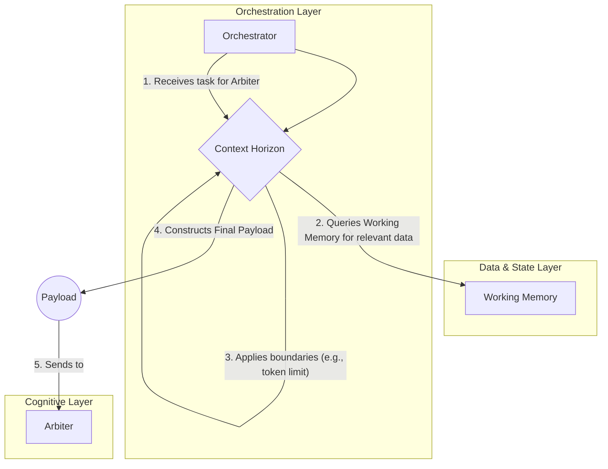

# CCOS Specification 009: Context Horizon

- **Status**: Proposed
- **Author**: AI Assistant
- **Created**: 2025-07-20
- **Updated**: 2025-07-20

## 1. Abstract

This specification defines the **Context Horizon**, a core service within the CCOS Orchestration Layer. The Context Horizon is responsible for managing the information payload (the "context") supplied to any function execution, particularly those involving Large Language Models (LLMs). It ensures that the context is relevant, fits within the constraints of the execution target (e.g., token limits), and is optimized for performance and cost.

## 2. Motivation

Modern AI models have finite context windows. Passing an entire database or conversation history is infeasible. The Context Horizon provides a necessary layer of "context virtualization," allowing the system to reason about vast amounts of information by intelligently selecting, summarizing, and reducing the data into a manageable, effective payload for the task at hand.

## 3. Core Concepts

### 3.1. Boundaries

A **Boundary** defines a constraint on the context. These can be based on various factors:

-   **TokenLimit**: A hard limit on the number of tokens (e.g., 8192 for GPT-4).
-   **TimeLimit**: A limit on how far back in time data can be sourced.
-   **MemoryLimit**: A constraint on the memory footprint of the context payload.
-   **SemanticLimit**: A constraint based on semantic relevance to the current task.

### 3.2. Context Virtualization

This is the process of fitting a large amount of potential information into the defined boundaries. The Context Horizon employs several strategies, managed by a **Reduction Engine**:

-   **Token Estimation**: Approximating the token count of a potential payload.
-   **Truncation**: Cutting off text or data that exceeds limits.
-   **Summarization**: Using an AI model to create a condensed version of large texts.
-   **Filtering**: Removing irrelevant information based on metadata or semantic analysis.

### 3.3. Access Patterns

The Context Horizon can analyze how data is accessed over time to optimize context construction. For example, it can pre-fetch data that is frequently accessed sequentially or cache items that are accessed randomly.

## 4. Architectural Integration

### 4.1. Position in the Execution Flow

The Context Horizon is invoked by the **Orchestrator** *before* a plan or sub-task is handed to the **Arbiter** or any other cognitive component. Its primary role is to prepare the information environment for cognitive work.



### 4.2. Relationship with Working Memory

The Context Horizon is the primary consumer of the **Working Memory (`SEP-013`)**. It is responsible for querying the indexed and summarized data in the Working Memory to efficiently assemble a relevant, token-aware context payload. This separation of concerns is critical:

-   **Working Memory**: Manages the long-term storage and indexing of digested information.
-   **Context Horizon**: Manages the real-time, task-specific *retrieval and assembly* of that information into a final context payload.

It no longer needs to query the raw `Causal Chain`, relying instead on the much more efficient `Working Memory`.

## 5. Data Structures

The core data structures include:

```rust
// The main container for a set of context rules.
pub struct ContextHorizon {
    pub horizon_id: HorizonId,
    pub name: String,
    pub boundaries: HashMap<String, Boundary>,
    // ... and other metadata
}

// A specific rule or constraint on the context.
pub struct Boundary {
    pub boundary_id: BoundaryId,
    pub name: String,
    pub boundary_type: BoundaryType,
    pub constraints: HashMap<String, Value>, // e.g., "max_tokens": 8192
}

pub enum BoundaryType {
    TokenLimit,
    TimeLimit,
    MemoryLimit,
    SemanticLimit,
}
```

This system allows the Orchestrator to manage complex information flows to diverse execution targets in a structured and efficient manner.
