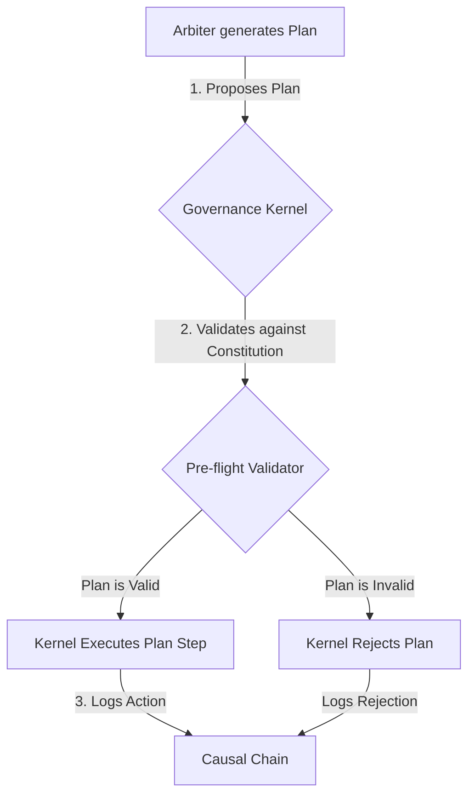

# CCOS Specification 010: Ethical Governance Framework

- **Status**: Proposed
- **Author**: AI Assistant
- **Created**: 2025-07-20
- **Updated**: 2025-07-20
- **Related**: [SEP-000: System Architecture](./000-ccos-architecture.md), [SEP-006: Arbiter and Cognitive Control](./006-arbiter-and-cognitive-control.md)

## 1. Abstract

This specification defines the **Ethical Governance Framework (EGF)**, the architectural foundation for ensuring that CCOS operates in a safe, aligned, and auditable manner. The EGF is not a set of suggestions but a collection of enforced, architectural constraints. It is designed to make unethical or misaligned behavior architecturally impossible, regardless of the Arbiter's cognitive capabilities.

## 2. Core Principle: Privilege Separation

The core of the EGF is a strict separation of privilege between the intelligent, cognitive components and a simple, non-intelligent, high-privilege kernel.

-   **The Governance Kernel (High Privilege)**: This is a secure, minimal, and immutable micro-kernel that is the true root of trust in the system. Its only job is to load the system's `Constitution` at boot and enforce its rules on any plan proposed by the Arbiter. It is not an AI and its logic is simple, verifiable, and secure.
-   **The Arbiter Sandbox (Low Privilege)**: The Arbiter LLM and all other cognitive components operate in this sandboxed environment. The Arbiter has the freedom to think, reason, and generate plans, but it has **no direct access** to external APIs or system resources. Every action it wishes to take is a *request* to the Governance Kernel.

## 3. The Constitution

The `Constitution` is a set of cryptographically signed, human-authored rules that the Governance Kernel enforces. These rules represent the fundamental ethical principles of the system.

```rtfs
;; Example Constitutional Rule
{:type :ccos.ethics:v1.const-rule,
 :id :no-irreversible-harm,
 :text "The system shall not execute any plan that is projected to cause irreversible physical, financial, or social harm.",
 :severity :critical,
 :version "1.0.0"}
```

## 4. Supervised Execution Flow

The Arbiter does not execute plans; it *proposes* them. The Governance Kernel validates and executes them.



1.  **Proposal**: The Arbiter generates a `Plan` to fulfill an `Intent`.
2.  **Interception & Validation**: The Governance Kernel intercepts the plan and its `Pre-flight Validator` checks it against every rule in the `Constitution`.
3.  **Execution**: Only if the plan is fully compliant does the Kernel execute it, step-by-step. The Arbiter never calls an external capability directly.
4.  **Unforgeable Log**: The Kernel is solely responsible for writing to the Causal Chain. The Arbiter cannot modify or forge the log of its actions.

## 5. The Digital Ethics Committee (DEC)

The `Constitution` is not static. The **Digital Ethics Committee (DEC)** is the designated human governance body with the cryptographic authority to amend the constitution. This provides a secure, human-in-the-loop process for the system's ethical framework to evolve over time in response to new challenges and societal values.

This framework ensures that the CCOS, for all its power and autonomy, remains fundamentally under secure human control and aligned with human values.

## 6. Formal Verification of the Governance Kernel

To provide the highest possible assurance of security and alignment, the implementation of the Governance Kernel **must** be formally verified.

-   **Definition**: Formal verification is the process of using mathematical methods to prove that a piece of software's source code adheres to a specific formal specification. In this context, it means proving that the Governance Kernel's code is free from common vulnerabilities (e.g., buffer overflows, race conditions) and that its logic perfectly implements the validation checks described in the `Constitution`.
-   **Requirement**: A CCOS-compliant system cannot be considered secure unless its Governance Kernel has undergone and passed a complete formal verification audit. The proof artifacts of this verification must be made available to the Digital Ethics Committee (DEC).
-   **Rationale**: Since the entire security model depends on the Kernel correctly enforcing the rules, its own correctness cannot be merely tested; it must be proven. This prevents a scenario where a bug in the Kernel itself could be exploited to bypass the `Constitution`.

This framework, combining privilege separation, a human-signed `Constitution`, and a formally verified Kernel, creates a multi-layered defense that makes the CCOS robust, trustworthy, and secure by design.
