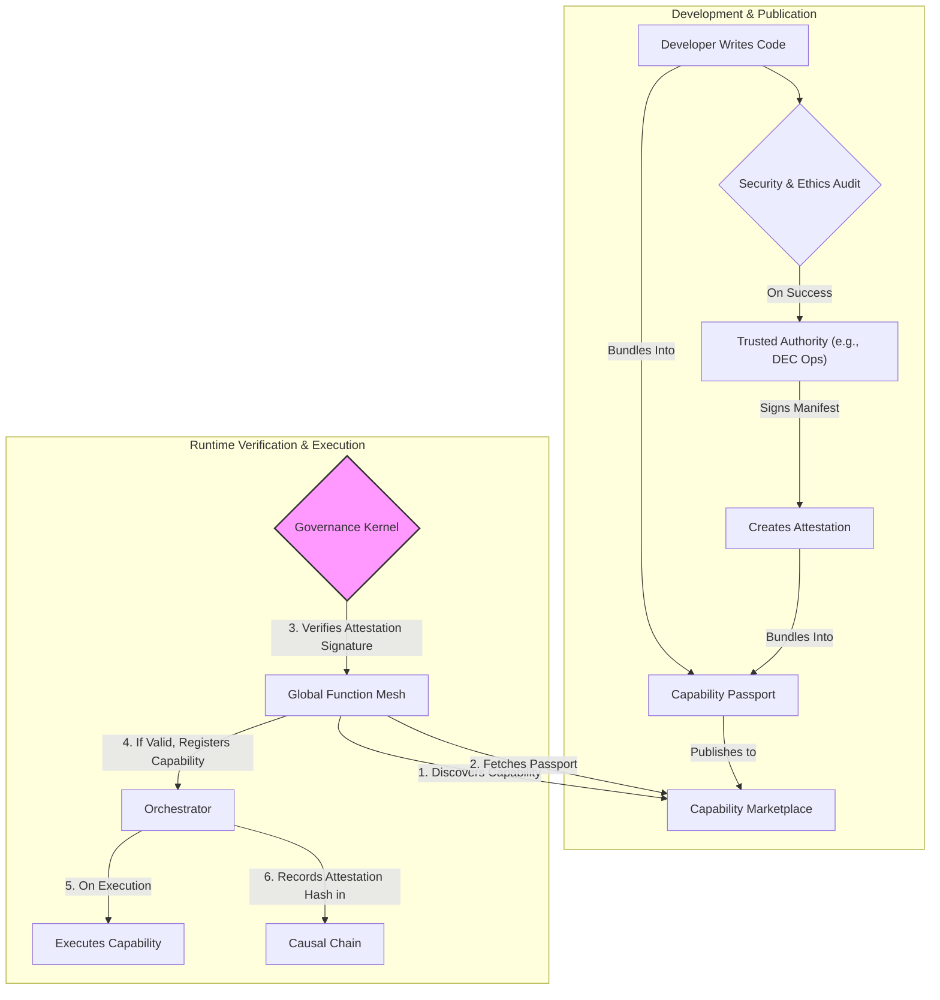

# CCOS Specification 011: Capability Attestation and Provenance

**Status:** Proposed
**Version:** 1.0
**Date:** 2025-07-20

## 1. Abstract

This specification defines the mechanism for ensuring that all `Capabilities` within the CCOS ecosystem are authentic, secure, and traceable. It introduces the concepts of **Capability Attestation** (cryptographic verification of a capability's source and integrity) and **Data Provenance** (an immutable record of a capability's origin and usage). This forms a cornerstone of the CCOS zero-trust security model, preventing the execution of unauthorized or tampered-with code.

## 2. Core Problem

An open and extensible system like CCOS, which relies on a marketplace of capabilities, is vulnerable to supply chain attacks. A malicious actor could publish a seemingly benign capability that contains hidden harmful logic. Without a formal verification process, the system has no way to distinguish a legitimate tool from a malicious one. This specification aims to solve that problem.

## 3. Key Concepts

### 3.1. Capability Attestation

The process by which a trusted authority cryptographically signs a `Capability`'s manifest. This signature, the **Attestation**, vouches for several key facts:

-   **Integrity**: The capability's code has not been altered since it was reviewed. This is achieved by signing a hash of the source code or compiled binary.
-   **Authenticity**: The identity of the publisher is verified.
-   **Compliance**: The capability has passed a defined security and ethical review process, as mandated by the `Constitution`.

### 3.2. Capability Passport

A data structure that bundles a `Capability` with its `Attestation` and `Provenance` information. A valid, verified Passport is required for a capability to be registered with the Global Function Mesh (GFM) and executed by the Orchestrator.

### 3.3. Data Provenance

An auditable, append-only log that tracks the lifecycle of a capability. It answers the questions:

-   Who published this capability and when?
-   What is the precise source code commit hash it was built from?
-   What other capabilities does it depend on?
-   Which `Attestation` authority signed it?

## 4. Attestation & Execution Flow

1.  **Development & Audit**: A developer submits a new or updated capability for review. The review process is defined by the `Constitution` and carried out by human auditors or automated systems.
2.  **Attestation**: Upon successful review, a trusted authority (e.g., a service controlled by the Digital Ethics Committee) signs the capability's manifest, creating the `Attestation`.
3.  **Publication**: The capability is bundled into a `Capability Passport` and published to the marketplace.
4.  **Discovery & Verification**: When the GFM discovers the capability, it retrieves the Passport. It passes the `Attestation` to the **Governance Kernel**, which uses the public key of the trusted authority to verify the signature. If the signature is invalid or the authority is not trusted, the capability is rejected.
5.  **Execution & Logging**: If the capability is valid, the Orchestrator can execute it. When it does, the unique identifier (e.g., a hash) of the `Attestation` is permanently recorded as part of the `Action` in the **Causal Chain**.

## 5. Impact on System Components

-   **Governance Kernel**: Must manage the public keys of trusted attestation authorities. It is the sole component responsible for verifying attestation signatures.
-   **Capability Marketplace**: Must be updated to store and serve `Capability Passports` instead of raw capability definitions.
-   **Global Function Mesh (GFM)**: Must be updated to perform the verification flow before activating a capability.
-   **Causal Chain**: The `Action` data structure must be extended to include a field for `capability_attestation_id`. This creates an unforgeable link between an action and the exact, verified capability that performed it.
-   **Constitution**: Must define the policies for what constitutes a valid audit and which authorities are trusted to sign capabilities.
