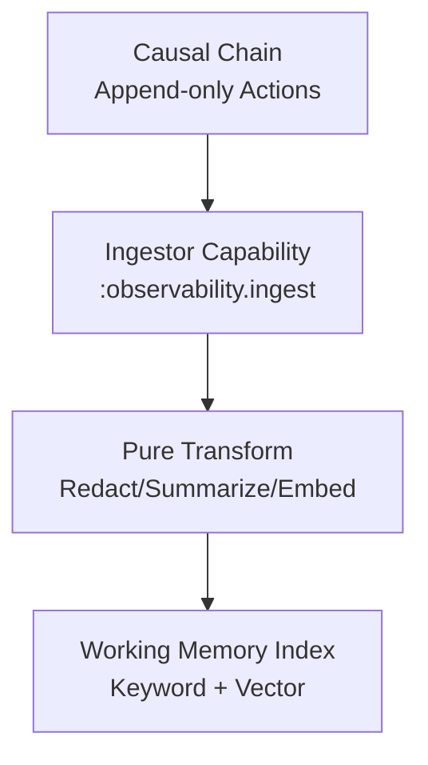

# CCOS Specification 013: Working Memory (RTFS 2.0 Edition)

**Status:** Draft for Review (Enhanced)
**Version:** 1.1
**Date:** 2025-01-10
**Related:** [000: Architecture](./000-ccos-architecture-new.md), [003: Causal Chain](./003-causal-chain-new.md), [009: Context Horizon](./009-context-horizon.md)

## Introduction: Queryable Index for System Memory

Working Memory (WM) is CCOS's high-performance layer over the Causal Chain: An indexed, searchable cache for actions, intents, and outcomes. Supports vector/keyword queries via yields, enabling fast recall for Arbiter context or plan adaptation. In RTFS 2.0, WM queries return pure data for local transforms, with ingestion as async host capability.

Why key? Chain is immutable/append-only; WM adds speed/relevance (e.g., embeddings for semantic search). Reentrancy: Incremental updates on resume.

## Core Concepts

### 1. Working Memory Architecture

#### 1.1 Backend Abstraction

Working Memory uses a backend abstraction to support multiple storage implementations:

```rust
pub trait WorkingMemoryBackend: Send + Sync {
    // CRUD operations
    fn store(&self, entry: &WorkingMemoryEntry) -> Result<WorkingMemoryId>;
    fn retrieve(&self, id: &WorkingMemoryId) -> Result<Option<WorkingMemoryEntry>>;
    fn query(&self, params: &QueryParams) -> Result<QueryResult>;

    // Batch operations
    fn store_batch(&self, entries: &[WorkingMemoryEntry]) -> Result<Vec<WorkingMemoryId>>;

    // Metadata
    fn get_stats(&self) -> Result<WorkingMemoryStats>;

    // Lifecycle
    fn clear(&self) -> Result<()>;
}
```

**Implemented Backends**:

**InMemoryJsonlBackend** (default):
- In-memory storage for fast queries
- JSONL (JSON Lines) append-only persistence
- Automatic compaction on restart
- Supports: keyword search, vector search (optional), time-based queries

**Future Backends** (planned):
- **PostgresBackend**: PostgreSQL with pgvector for production
- **QdrantBackend**: Vector database for efficient semantic search
- **SQLiteBackend**: Lightweight embedded database with FTS5

#### 1.2 Facade Pattern

A facade provides a stable API surface across backends:

```rust
pub struct WorkingMemory {
    backend: Box<dyn WorkingMemoryBackend>,
    query_cache: Arc<RwLock<LruCache<QueryParams, QueryResult>>>,
}

impl WorkingMemory {
    pub fn new(backend: Box<dyn WorkingMemoryBackend>) -> Self;
    pub fn store(&self, entry: WorkingMemoryEntry) -> Result<WorkingMemoryId>;
    pub fn query(&self, params: QueryParams) -> Result<QueryResult>;
    pub fn ingest(&self, ingestor: &MemoryIngestor) -> Result<IngestStats>;
}
```

**Benefits**:
- Stable API: callers don't depend on backend implementation
- Easy migration: swap backend without changing callers
- Testing: Mock backend for unit tests
- Performance: Query cache reduces backend calls

#### 1.3 MemoryIngestor Contract

Async ingestion pipeline for populating Working Memory from Causal Chain:

```rust
pub trait MemoryIngestor: Send + Sync {
    // Subscription management
    fn subscribe(&self, chain: Arc<CausalChain>) -> Result<()>;
    fn unsubscribe(&self) -> Result<()>;

    // Ingestion control
    fn start_ingestion(&self) -> Result<()>;
    fn stop_ingestion(&self) -> Result<()>;

    // State query
    fn is_running(&self) -> bool;
    fn get_stats(&self) -> IngestStats;
}
```

**Ingestion Pipeline**:
1. **Subscribe** to Causal Chain append events
2. **Transform** each new action via derivation rules
3. **Index** derived entries into backend
4. **Replay** existing chain on first startup (subscribe + full scan)

**Derivation Rules** (pure RTFS functions):
- Summarization: Compress repetitive actions
- Pattern extraction: Identify common failure modes
- Relevance scoring: Prioritize recent and high-impact actions
- Redaction: Remove sensitive data (PII, secrets)

### 1. WM Structure
- **Ingestion**: Async from chain (via 024-observability-ingestor): Index actions by intent/step/type.
- **Storage**: Hybrid (in-memory + persistent): Keywords for exact, vectors for semantic.
- **Query Types**: {:keyword [:intent :123], :vector [\"failure patterns\"], :range [:timestamp last-24h]}.

**Sample Index Entry** (From Chain Action):
```
;; Action -> WM Doc (RTFS Map)
{:id :act-456
  :intent :123
  :type :YieldFailed
  :embedding [0.1 0.2 ...]  ;; For semantic search
  :keywords [:nlp :timeout]
  :summary \"Sentiment analysis timed out on batch 2.\"
  :boundary {:type :temporal :value \"2025-01-01T00:00:00Z\"}}
```

#### 1.4 Boundary System

Boundaries control which entries are visible in queries based on privacy, jurisdiction, and temporal constraints:

**Boundary Types**:
```rust
pub enum BoundaryType {
    Temporal {          // Time-based boundaries
        since: Option<DateTime<Utc>>,
        before: Option<DateTime<Utc>>,
        duration: Option<Duration>,
    },
    Privacy {             // Sensitivity-based filtering
        max_level: PrivacyLevel,  // :public, :low, :medium, :high, :critical
    },
    Jurisdictional {      // Geography-based filtering
        allowed_regions: Vec<String>,  // [\"US\", \"EU\", \"APAC\"]
        denied_regions: Vec<String>,
    },
    Scope {              // Intent/plan scoping
        intent_id: Option<String>,
        plan_id: Option<String>,
        step_id: Option<String>,
    },
}

pub enum PrivacyLevel {
    Public,    // No restrictions
    Low,       // Personal preferences, non-sensitive
    Medium,     // Operational data, business-logic
    High,       // Confidential data, PII
    Critical,   // Secrets, credentials
}
```

**Boundary Application**:
- Entries are tagged with metadata during ingestion
- Queries filter results based on active boundaries
- Boundaries are enforced at Working Memory level (not Causal Chain)

**Boundary Query Example**:
```
(wm.query
  {:intent "intent-123"
   :boundaries {:or
     (:type :privacy :max-level :medium)
     (:type :jurisdictional :allowed-regions ["US" "EU"])}
   :limit 20})
```

**Boundary Enforcement**:
- Temporal: Exclude entries older/before specified dates
- Privacy: Hide entries exceeding max privacy level
- Jurisdictional: Exclude entries from denied regions
- Scope: Limit results to specific intent/plan/step

#### 1.5 Reduction Strategies

When Working Memory grows large, reduction strategies compress data while preserving relevance:

```rust
pub enum ReductionStrategy {
    None,                      // No reduction
    Summarization {           // Compress similar entries
        max_length: usize,       // Maximum entries to summarize
        similarity_threshold: f64, // 0.0-1.0
    },
    Sampling {                // Keep representative subset
        sample_size: usize,
        method: SamplingMethod,  // random, recent, weighted
    },
    Prioritization {           // Keep highest-value entries
        max_count: usize,
        scoring_function: ScoringFunction, // recency, impact, relevance
    },
}
```

**Summarization Strategy**:
- Group similar entries by intent/step/type
- Generate summary with count and key details
- Example: Ten `:CapabilityCall` for `:nlp.sentiment` →
  `{:count 10 :action-type :CapabilityCall :capability :nlp.sentiment}`

**Sampling Strategy**:
- **Recent sampling**: Keep last N entries
- **Random sampling**: Random selection from filtered results
- **Weighted sampling**: Higher weight to recent/high-impact entries

**Prioritization Strategy**:
- Score entries by: recency (exponential decay), impact (governance actions), relevance (keyword match)
- Keep top N entries by score
- Example: Recent `:GovernanceCheckpointDecision` scores higher than old `:CapabilityCall`

**Reduction Trigger Conditions**:
- Entry count exceeds threshold (default: 10,000)
- Query returns too many results (limit exceeded)
- Performance degradation detected (query latency > threshold)

**Reduction Example**:
```
;; Query returns 1000 entries, limit 50
(wm.query
  {:intent "intent-456"
   :reduction (:type :prioritization :max-count 50 :scoring :recency)})

;; Returns top 50 most relevant entries
```
```

### 2. API via Yields
Host capabilities for interaction.

**Sample Query** (RTFS in Plan/Arbiter):
```
(call :wm.search
      {:query {:intent :123 :type :failure :limit 10}
       :mode :semantic  ;; Or :keyword
       :max-results 5})
```
Result: List<RTFS Map> of matching docs, pure for filtering.

**Workflow Diagram**:
```mermaid
graph TD
    Chain[New Action Appended<br/>to Causal Chain]
    Ingest[Ingestor Capability<br/>Async Yield: Index]
    WM[Working Memory<br/>Index + Embeddings]
    Query[RTFS Yield: :wm.search<br/>(Intent/Type)]
    Search[Search: Keyword + Vector<br/>(e.g., Cosine Sim)]
    Results[Pure List<Map><br/>Summaries/Docs]
    Results --> Horizon[Feed to Context Horizon] or Arbiter[Direct Use]

    Chain --> Ingest
    Ingest --> WM
    Query --> WM
    WM --> Search
    Search --> Results
```

### 2.a Observability Ingestion (Consolidated)
Working Memory is populated asynchronously from the Causal Chain via a dedicated ingestor capability. This replaces separate observability docs by summarizing the core flow here.

- **Trigger**: New Action appended to Chain (Plan/Step/Yield/etc.).
- **Ingestor Capability**: `(call :observability.ingest {:from-action last-ingested-id})` pulls deltas, computes embeddings/summaries, and indexes into WM.
- **Transform**: Pure RTFS post-processing (redaction, summarization) before index.
- **Metrics**: Ingest throughput, lag, and error rates are logged (and optionally surfaced via a monitoring capability).

**Ingestion Flow**:


**Sample Ingest Call**:
```
(call :observability.ingest
      {:from-action :act-1024
       :redact [:pii :secrets]
       :embed-model :text-emb-2
       :summarize true})
```

This keeps WM up-to-date for Horizon/Arbiter queries without coupling plans to ingestion details.

### 3. Integration with RTFS 2.0 Reentrancy
- **Incremental**: On resume, query deltas (`:since-action :act-100`) → Pure merge with prior memory.
- **Purity**: Queries return immutable Values; local RTFS processes (e.g., `filter relevant`).
- **Performance**: Embeddings pre-computed; yields batched.

**Reentrant Example**:
- Session: Query WM for context → Plan executes.
- Pause → New actions ingested.
- Resume: Query since last → Updated results → Arbiter adapts without full re-scan.

### 4. Governance and Pruning
Kernel ACLs on queries (e.g., no sensitive actions). Prune old entries (TTL policy, logged).

WM turns raw history into actionable memory: Fast, pure queries for reentrant cognition.

Next: Checkpoint-Resume in 017.