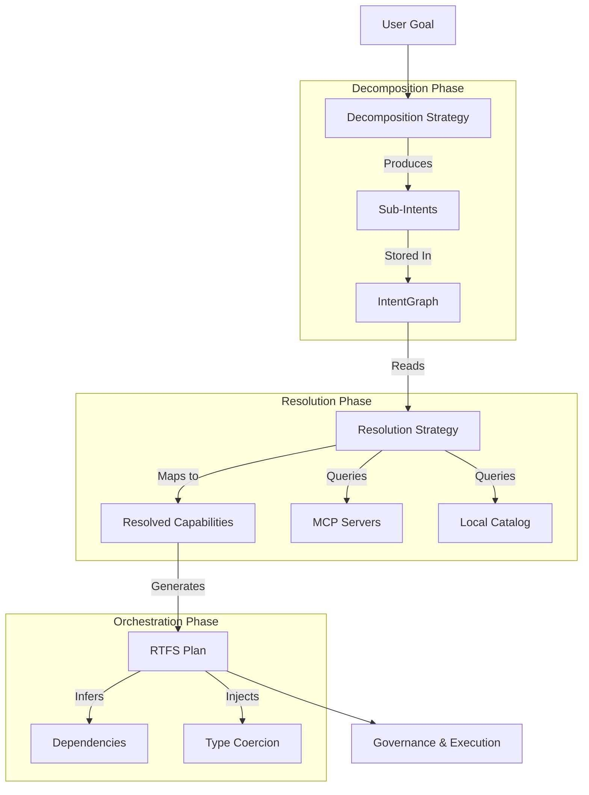

# Modular Planner Architecture

**Status**: Implemented (Phase K)
**Date**: 2025-11-26
**Related Specs**: `001-intent-graph`, `002-plans-and-orchestration`, `020-mcp-discovery-master-guide`

## Overview

The **Modular Planner** is the next-generation planning engine for CCOS. It decouples the "cognitive" act of breaking down a goal (**Decomposition**) from the "mechanical" act of finding tools to execute it (**Resolution**). This separation allows for more robust, flexible, and auditable autonomous behavior, specifically designed to support the **IntentGraph** as the central source of truth.

## Core Philosophy

1.  **Decoupling**: Decomposing a goal (e.g., "Summarize issues") is distinct from finding a tool (e.g., `github.list_issues` vs `jira.search`).
2.  **Intent-Centric**: Every step in a plan is first instantiated as a semantic **Intent** in the IntentGraph before any tool is selected.
3.  **Pluggable Strategies**: Both decomposition and resolution are strategy-based, allowing mixed modes (e.g., Regex patterns for speed + LLM for complexity).
4.  **Schema-Driven**: Resolution and Plan Generation rely heavily on capability schemas to ensure correctness (parameter mapping, type coercion).
5.  **"Ask, Don't Guess"**: When uncertain, the system should ask for clarification rather than produce garbage silently. Strategies should be *humble* about their limitations.

## "Ask, Don't Guess" Principle

This principle pervades the entire planning architecture:

```
┌─────────────────────────────────────────────────────────────────┐
│  Better to ask and refine than to produce garbage silently      │
└─────────────────────────────────────────────────────────────────┘
```

### Pattern Matching: Be Humble

Pattern decomposition is **fast and deterministic**, but it must know its limits:
- ✅ Simple: `"list issues in owner/repo"` → Pattern handles it (confidence 0.9)
- ⚠️ Complex: `"list issues and filter per X asked to user"` → Pattern detects user interaction signals, admits uncertainty (confidence 0.0), defers to LLM

**Complexity signals** that trigger deferral:
- User interaction: "asked to user", "user provides", "prompt me"
- Multiple clauses: More than one "and" conjunction
- Temporal sequences: "then", "after", "before"

### Iterative Refinement (Future)

The architecture supports iterative decomposition:
1. **Granularity Check**: After decomposition, verify each intent is truly atomic (maps to ONE capability)
2. **Recursive Decomposition**: If an intent is too coarse, decompose it further
3. **Validation Loop**: Present plan to user/arbiter for confirmation; refine with hints if rejected

```
                    Goal
                      │
                      ▼
              ┌──────────────┐
              │ Decompose    │
              └──────────────┘
                      │
                      ▼
              ┌──────────────┐         ┌─────────────────┐
              │ Granularity  │────NO──▶│ Re-decompose    │
              │ Check        │         │ (recursive)     │
              └──────────────┘         └─────────────────┘
                      │ YES
                      ▼
              ┌──────────────┐         ┌─────────────────┐
              │ Confidence   │───LOW──▶│ Ask Arbiter/    │
              │ Check        │         │ User/Judge LLM  │
              └──────────────┘         └────────┬────────┘
                      │ HIGH                    │
                      │◀────────────────────────┘
                      │     (with hints if needed)
                      ▼
              ┌──────────────┐
              │ Resolution   │
              └──────────────┘
```

## Architecture



## 1. Decomposition Phase (The "What")

Decomposition strategies accept a natural language goal and produce a list of `SubIntent` objects. These intents are semantic descriptions of *what* needs to be done, without specifying *how*.

### Strategies
*   **`PatternDecomposition`**: Uses regex patterns for high-speed, deterministic handling of common phrases (e.g., "list X but ask me for Y").
    *   **Humble Matching**: Patterns check for "complexity signals" (user interaction, multiple clauses) and defer to LLM when detected. A regex match is not enough—the pattern must be *fully handleable*.
*   **`IntentFirstDecomposition`**: Uses an LLM to break down complex goals into abstract intents. Does not see available tools to prevent hallucination of non-existent tool IDs.
*   **`GroundedLlmDecomposition`**: Retrieves relevant tool summaries (with schemas) from the `CapabilityCatalog` *before* prompting the LLM. This "grounds" the decomposition, encouraging the LLM to generate intents that map directly to available tools and their specific parameters (e.g., `perPage` not "page size").
    *   **Schema-Aware Prompts**: Tool summaries include input schema parameters so the LLM can ask for specific values (e.g., "Ask user for perPage" rather than "Ask user for pagination").
    *   **Pre-Discovery Requirement**: For dynamic tools (like MCP) to be visible to `GroundedLlmDecomposition`, they must be discovered and registered in the `CapabilityMarketplace` *before* the planning phase begins. Lazy discovery (during resolution) is too late for grounding.
*   **`HybridDecomposition`**: The default production strategy. Attempts `PatternDecomposition` first; if no pattern matches (or pattern detects complexity it can't handle), falls back to `GroundedLlm` (if tools are available) or `IntentFirst`.

## 2. IntentGraph Integration

The Modular Planner is deeply integrated with the IntentGraph (Spec `001`).
*   **Root Intent**: The top-level goal is stored as the Root Intent.
*   **Sub-Intents**: Decomposed steps are stored as child nodes linked via `IsSubgoalOf` edges.
*   **Dependencies**: Data flow requirements are stored as `DependsOn` edges between sub-intents.

This persistence enables:
*   **Auditability**: "Why did the agent execute `rm -rf`?" -> Trace back to the semantic intent.
*   **Resumability**: Planning can pause and resume from the graph state.
*   **Learning**: Successful intent-to-capability mappings can be reinforced.

## 3. Resolution Phase (The "How")

Resolution strategies take a `SubIntent` and find the best capability to fulfill it.

### Strategies
*   **`McpResolution`**: Discovers and resolves tools from connected MCP servers (Model Context Protocol). Supports dynamic schema inspection.
*   **`CatalogResolution`**: Searches the local CCOS capability catalog (built-ins, standard library). Includes **Soft Validation** to adapt intent parameters to schema requirements (e.g., mapping generic description to `prompt` or `question` arguments).
*   **`SemanticResolution`**: Uses vector embeddings to match intent descriptions to capability documentation.
*   **`CompositeResolution`**: Chains multiple strategies (e.g., try Catalog first, then MCP).

### Advanced Features
*   **Schema-Aware Parameter Mapping**: `McpResolution` inspects the tool's JSON schema to map intent parameters (often `snake_case` from LLMs) to the exact property names required by the tool (often `camelCase`).
    *   *Example*: Maps `per_page` (intent) -> `perPage` (GitHub MCP schema).
*   **Soft Schema Validation**: Resolution strategies (like `CatalogResolution`) perform "soft" validation. If a required argument is missing, they attempt to adapt the intent (e.g., using the intent's description as the value for a `prompt` argument) before rejecting the match. This prevents "brittle" failures where a capability is semantically correct but syntactically imperfect.

## 4. Plan Generation & Orchestration

The `ModularPlanner` orchestrator converts the list of `ResolvedCapability` objects into executable **RTFS** code.

### Dependency Inference
When Step B depends on Step A, the planner must pass Step A's result to Step B.
*   **Fuzzy Schema Matching**: The planner attempts to infer the correct input parameter name for Step B by fuzzy-matching Step A's "topic" against Step B's input schema.
    *   *Example*: Step A is "Ask for **page size**". Step B has input `perPage`. The planner matches "page" to "Page" and generates `(call ... :perPage step_A)`.

### Generic Type Coercion
LLMs and user inputs often provide data as strings (e.g., "10", "true"). Strict APIs (like many MCP servers) require typed JSON numbers or booleans.
*   **Automatic Coercion**: The planner inspects the target capability's schema.
*   **Injection**: If the schema expects `integer`, `number`, or `boolean` but the input is dynamic/string, the planner injects `(parse-json ...)` into the generated RTFS.
    *   *Result*: `(call "mcp.tool" {:count (parse-json input_var)})` instead of passing a string.

## Current Implementation State (Phase K)

As of **November 2025**, the Modular Planner is fully operational in `modular_planner_demo`.

### Validated Capabilities
*   **Hybrid Decomposition**: Successfully switches between Patterns and LLM based on goal complexity.
*   **Grounded Decomposition**: Can utilize catalog tools to guide LLM decomposition. Supports `_suggested_tool` hints for direct capability lookup.
*   **Real MCP Integration**: Connects to live MCP servers (e.g., GitHub), discovers tools, and executes them.
*   **Robustness**:
    *   Correctly handles snake_case/camelCase mismatches.
    *   Correctly coerces string inputs to numbers/booleans for strict APIs.
    *   **Soft Validation**: Adapts intent parameters to prevent rigid schema failures (e.g., auto-filling `prompt` from description).
    *   **Smart Tool Scoring**: Penalizes unwanted specificity (e.g., `list_issue_types` vs `list_issues`), aligns action verbs, handles singular/plural.
    *   **Transform Collapse**: Automatically merges filter/sort/paginate intents into preceding API calls when appropriate.
    *   **Minimal Step Generation**: LLM prompts teach models that filter/pagination are API parameters, not separate steps.
    *   Generates valid, executable RTFS plans.

### Usage Example

```rust
// Configure CCOS with generic agent config
let ccos = CCOS::new_with_agent_config(...).await?;

// Create Planner with Hybrid Decomposition and Composite Resolution
let planner = ModularPlanner::new(
    Box::new(HybridDecomposition::new().with_llm(llm_adapter)),
    Box::new(CompositeResolution::new()
        .with(CatalogResolution::new(catalog))
        .with(McpResolution::new(discovery))),
    intent_graph.clone()
);

// Execute
let plan_result = planner.plan("list issues in mandubian/ccos but ask me for the page size").await?;
// plan_result.rtfs_plan contains the executable code
```

