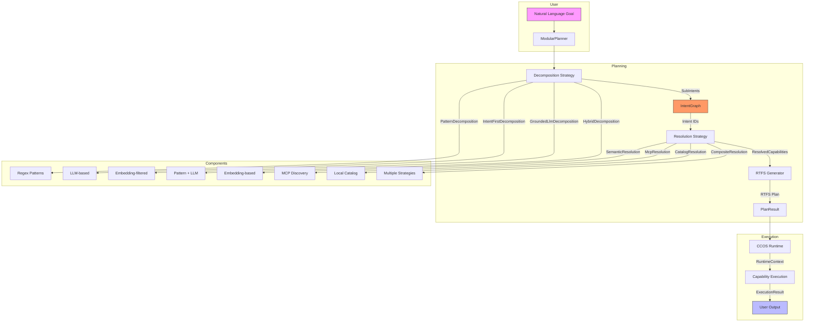
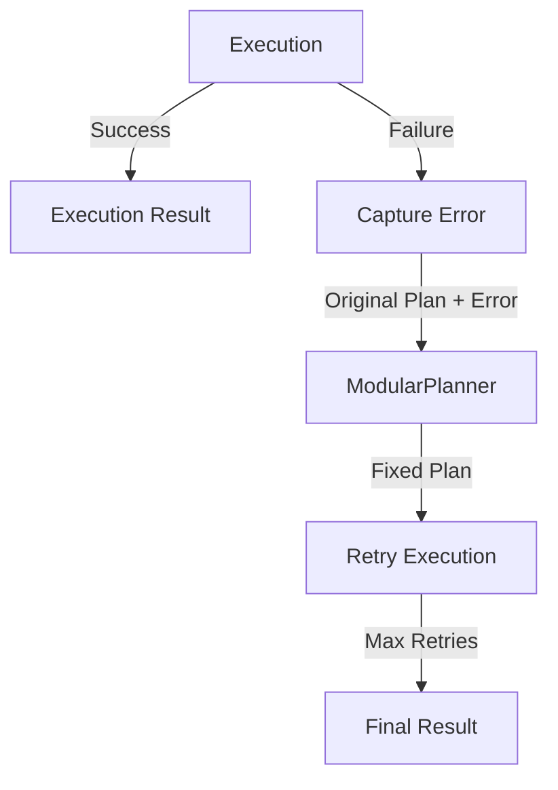
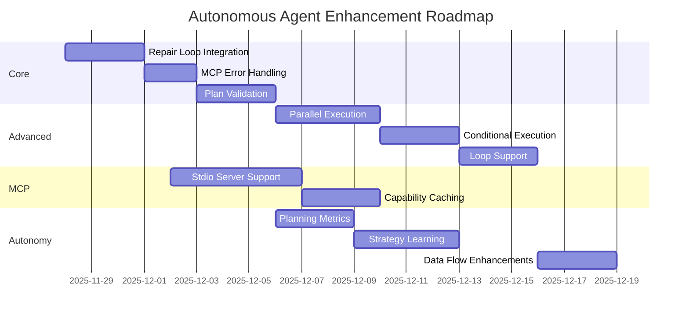
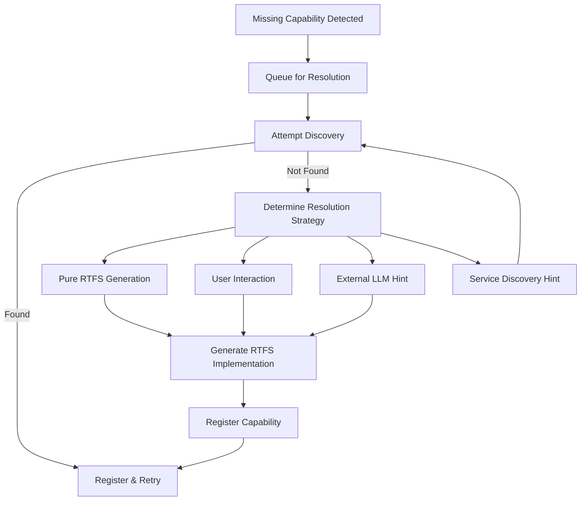
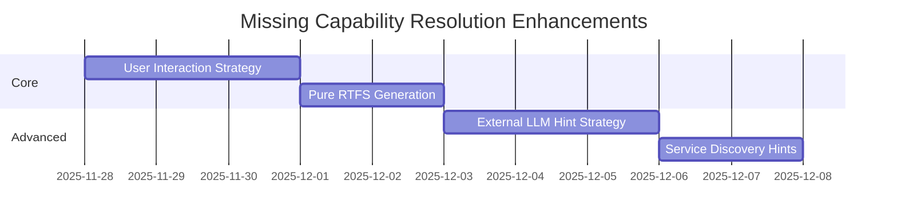

# Modular Planner Architecture

**Status**: Implemented (Phase K)
**Date**: 2025-11-26
**Related Specs**: `001-intent-graph`, `002-plans-and-orchestration`, `020-mcp-discovery-master-guide`

## Overview

The **Modular Planner** is the next-generation planning engine for CCOS. It decouples the "cognitive" act of breaking down a goal (**Decomposition**) from the "mechanical" act of finding tools to execute it (**Resolution**). This separation allows for more robust, flexible, and auditable autonomous behavior, specifically designed to support the **IntentGraph** as the central source of truth.

## Core Philosophy

1.  **Decoupling**: Decomposing a goal (e.g., "Summarize issues") is distinct from finding a tool (e.g., `github.list_issues` vs `jira.search`).
2.  **Intent-Centric**: Every step in a plan is first instantiated as a semantic **Intent** in the IntentGraph before any tool is selected.
3.  **Pluggable Strategies**: Both decomposition and resolution are strategy-based, allowing mixed modes (e.g., Regex patterns for speed + LLM for complexity).
4.  **Schema-Driven**: Resolution and Plan Generation rely heavily on capability schemas to ensure correctness (parameter mapping, type coercion).
5.  **"Ask, Don't Guess"**: When uncertain, the system should ask for clarification rather than produce garbage silently. Strategies should be *humble* about their limitations.

## "Ask, Don't Guess" Principle

This principle pervades the entire planning architecture:

```
┌─────────────────────────────────────────────────────────────────┐
│  Better to ask and refine than to produce garbage silently      │
└─────────────────────────────────────────────────────────────────┘
```

### Pattern Matching: Be Humble

Pattern decomposition is **fast and deterministic**, but it must know its limits:
- ✅ Simple: `"list issues in owner/repo"` → Pattern handles it (confidence 0.9)
- ⚠️ Complex: `"list issues and filter per X asked to user"` → Pattern detects user interaction signals, admits uncertainty (confidence 0.0), defers to LLM

**Complexity signals** that trigger deferral:
- User interaction: "asked to user", "user provides", "prompt me"
- Multiple clauses: More than one "and" conjunction
- Temporal sequences: "then", "after", "before"

### Iterative Refinement (Future)

The architecture supports iterative decomposition:
1. **Granularity Check**: After decomposition, verify each intent is truly atomic (maps to ONE capability)
2. **Recursive Decomposition**: If an intent is too coarse, decompose it further
3. **Validation Loop**: Present plan to user/cognitive engine for confirmation; refine with hints if rejected

```
                    Goal
                      │
                      ▼
              ┌──────────────┐
              │ Decompose    │
              └──────────────┘
                      │
                      ▼
              ┌──────────────┐         ┌─────────────────┐
              │ Granularity  │────NO──▶│ Re-decompose    │
              │ Check        │         │ (recursive)     │
              └──────────────┘         └─────────────────┘
                      │ YES
                      ▼
              ┌──────────────┐         ┌─────────────────┐
              │ Confidence   │───LOW──▶│ Ask Cognitive Engine/    │
              │ Check        │         │ User/Judge LLM  │
              └──────────────┘         └────────┬────────┘
                      │ HIGH                    │
                      │◀────────────────────────┘
                      │     (with hints if needed)
                      ▼
              ┌──────────────┐
              │ Resolution   │
              └──────────────┘
```

## Architecture



## 1. Decomposition Phase (The "What")

Decomposition strategies accept a natural language goal and produce a list of `SubIntent` objects. These intents are semantic descriptions of *what* needs to be done, without specifying *how*.

### Strategies
*   **`PatternDecomposition`**: Uses regex patterns for high-speed, deterministic handling of common phrases (e.g., "list X but ask me for Y").
    *   **Humble Matching**: Patterns check for "complexity signals" (user interaction, multiple clauses) and defer to LLM when detected. A regex match is not enough—the pattern must be *fully handleable*.
*   **`IntentFirstDecomposition`**: Uses an LLM to break down complex goals into abstract intents. Does not see available tools to prevent hallucination of non-existent tool IDs.
*   **`GroundedLlmDecomposition`**: Retrieves relevant tool summaries (with schemas) from the `CapabilityCatalog` *before* prompting the LLM. This "grounds" the decomposition, encouraging the LLM to generate intents that map directly to available tools and their specific parameters (e.g., `perPage` not "page size").
    *   **Schema-Aware Prompts**: Tool summaries include input schema parameters so the LLM can ask for specific values (e.g., "Ask user for perPage" rather than "Ask user for pagination").
    *   **Pre-Discovery Requirement**: For dynamic tools (like MCP) to be visible to `GroundedLlmDecomposition`, they must be discovered and registered in the `CapabilityMarketplace` *before* the planning phase begins. Lazy discovery (during resolution) is too late for grounding.
*   **`HybridDecomposition`**: The default production strategy. Attempts `PatternDecomposition` first; if no pattern matches (or pattern detects complexity it can't handle), falls back to `GroundedLlm` (if tools are available) or `IntentFirst`.

## 2. IntentGraph Integration

The Modular Planner is deeply integrated with the IntentGraph (Spec `001`).
*   **Root Intent**: The top-level goal is stored as the Root Intent.
*   **Sub-Intents**: Decomposed steps are stored as child nodes linked via `IsSubgoalOf` edges.
*   **Dependencies**: Data flow requirements are stored as `DependsOn` edges between sub-intents.

This persistence enables:
*   **Auditability**: "Why did the agent execute `rm -rf`?" -> Trace back to the semantic intent.
*   **Resumability**: Planning can pause and resume from the graph state.
*   **Learning**: Successful intent-to-capability mappings can be reinforced.

## 3. Resolution Phase (The "How")

Resolution strategies take a `SubIntent` and find the best capability to fulfill it.

### Strategies
*   **`McpResolution`**: Discovers and resolves tools from connected MCP servers (Model Context Protocol). Supports dynamic schema inspection.
*   **`CatalogResolution`**: Searches the local CCOS capability catalog (built-ins, standard library). Includes **Soft Validation** to adapt intent parameters to schema requirements (e.g., mapping generic description to `prompt` or `question` arguments).
*   **`SemanticResolution`**: Uses vector embeddings to match intent descriptions to capability documentation.
*   **`CompositeResolution`**: Chains multiple strategies (e.g., try Catalog first, then MCP).

### Advanced Features
*   **Schema-Aware Parameter Mapping**: `McpResolution` inspects the tool's JSON schema to map intent parameters (often `snake_case` from LLMs) to the exact property names required by the tool (often `camelCase`).
    *   *Example*: Maps `per_page` (intent) -> `perPage` (GitHub MCP schema).
*   **Soft Schema Validation**: Resolution strategies (like `CatalogResolution`) perform "soft" validation. If a required argument is missing, they attempt to adapt the intent (e.g., using the intent's description as the value for a `prompt` argument) before rejecting the match. This prevents "brittle" failures where a capability is semantically correct but syntactically imperfect.

## 4. Plan Generation & Orchestration

The `ModularPlanner` orchestrator converts the list of `ResolvedCapability` objects into executable **RTFS** code.

### Multi-Dependency Wiring
When a step depends on multiple previous steps (e.g., step 3 depends on step 1 AND step 2), all dependencies must be correctly wired:
*   **Pre-compute all dependencies**: For each dependency, infer the target parameter name
*   **Wire each dependency**: Map each preceding step's output to its inferred parameter
*   **Apply coercion per-parameter**: Type coercion is applied individually to each wired dependency

*Example*: Step 3 (`list_issues`) depends on step 1 (user's `perPage`) and step 2 (user's `labels`):
```clojure
(let [step_1 (call "ccos.user.ask" {:prompt "..."})]
  (let [step_2 (call "ccos.user.ask" {:prompt "..."})]
    (call "mcp.github.list_issues" 
      {:perPage (parse-json step_1) :labels step_2})))
```

### Dependency Inference
When Step B depends on Step A, the planner must pass Step A's result to Step B.
*   **Fuzzy Schema Matching**: The planner attempts to infer the correct input parameter name for Step B by fuzzy-matching Step A's "topic" against Step B's input schema.
    *   *Example*: Step A is "Ask for **page size**". Step B has input `perPage`. The planner matches "page" to "Page" and generates `(call ... :perPage step_A)`.

### Generic Type Coercion
LLMs and user inputs often provide data as strings (e.g., "10", "true"). Strict APIs (like many MCP servers) require typed JSON numbers or booleans.
*   **Automatic Coercion**: The planner inspects the target capability's schema.
*   **Injection**: If the schema expects `integer`, `number`, or `boolean` but the input is dynamic/string, the planner injects `(parse-json ...)` into the generated RTFS.
    *   *Result*: `(call "mcp.tool" {:count (parse-json input_var)})` instead of passing a string.

## 5. Plan Verification

After RTFS plan generation, an optional **Verification** step checks for consistency issues before execution.

```
                    Generated Plan
                          │
                          ▼
                ┌─────────────────┐
                │ Verification    │
                │ (Cognitive Engine/Judge) │
                └─────────────────┘
                          │
            ┌─────────────┼─────────────┐
            ▼             ▼             ▼
         ✅ OK       ⚠️ Warning     ❌ Invalid
      (proceed)    (warn user)    (re-plan)
```

### Verification Strategies

*   **`RuleBasedVerifier`** (default, fast):
    - **Data Flow**: Are all dependencies correctly wired?
    - **Goal Coverage**: Does the plan address all parts of the goal?
    - **Semantic Clarity**: Are user prompts understandable?
*   **`LlmVerifier`** (optional, thorough): Uses an Cognitive Engine/Judge LLM to analyze the plan
*   **`CompositeVerifier`**: Runs rule-based first, optionally LLM for deeper analysis

### Prompt Humanization

When generating user prompts, cryptic parameter names are converted to human-friendly text:

| Parameter | Generated Prompt |
|-----------|-----------------|
| `perPage` | "How many items per page? (e.g., 10, 25, 50)" |
| `state` | "Issue state: open, closed, or all?" |
| `labels` | "Labels to filter by (comma-separated, e.g., bug, enhancement)" |
| `assignee` | "Assignee username (or 'none' for unassigned)" |

Filler words (`first`, `please`, `the`) are stripped from topics before matching.

## Current Implementation State (Phase K)

As of **November 2025**, the Modular Planner is fully operational in `modular_planner_demo`.

## Autonomy Enhancement Roadmap

The modular planner architecture provides a solid foundation for autonomous agents. The following enhancements are recommended to achieve full autonomy:

### 1. Self-Correction & Error Recovery (Phase D)

**Goal**: Enable the agent to recover from runtime failures by feeding errors back to the planner.

**Implementation**:
- **Repair Loop Integration**: Wrap plan execution in a retry loop (max 3 attempts)
- **Error Context**: Capture execution errors and feed back to planner with original intent + error message
- **Plan Repair**: Update RTFS plan with fixes and retry execution
- **MCP Error Handling**: Parse MCP error responses and convert to `RuntimeError` for repair loop integration



### 2. Advanced Planning Features (Phase I)

**Goal**: Improve plan quality and handle complex multi-capability workflows.

**Implementation**:
- **Plan Validation**: Pre-execution validation for capability existence and argument compatibility
- **Parallel Execution**: Identify independent steps and execute using `tokio::join!`
- **Conditional Execution**: Support `if/else` patterns based on step results
- **Loop/Iteration**: Handle "for each X, do Y" patterns with RTFS `map`/`filter`/`reduce`

### 3. MCP Robustness Enhancements

**Goal**: Improve reliability and performance of MCP integration.

**Implementation**:
- **Stdio MCP Server Support**: Implement `StdioSessionHandler` for local MCP servers
- **Capability Caching**: Cache discovered MCP capabilities across sessions
- **Enhanced Error Handling**: Handle rate limiting, auth errors, and network failures gracefully

### 4. Self-Improvement Mechanisms

**Goal**: Enable the agent to learn from experience and improve over time.

**Implementation**:
- **Planning Metrics**: Collect success/failure metrics by strategy and intent type
- **Strategy Learning**: Implement adaptive strategy selection based on historical performance
- **Feedback Loop**: Store successful intent-to-capability mappings for future reuse
- **Intent Reuse**: Leverage IntentGraph for intent pattern reuse across sessions

### 5. Enhanced Data Flow

**Goal**: Improve handling of complex data dependencies and transformations.

**Implementation**:
- **Complex Data Handling**: Extend data processing to handle nested structures
- **Data Transformation**: Add more sophisticated transformation capabilities
- **Context Accumulation**: Enhance context accumulation for multi-step workflows

### Implementation Priority



### Recommended First Steps

1. **Integrate repair loop** - Provides immediate autonomy benefits through self-correction
2. **Add MCP error handling** - Makes the agent more robust with real-world services
3. **Implement plan validation** - Prevents execution of invalid plans before they fail
4. **Add parallel execution** - Improves performance for independent steps

These enhancements will transform the modular planner from a capable planning system into a truly autonomous agent that can self-correct, learn from experience, and handle complex workflows in the CCOS environment.

## 6. Approval Queue Integration

**Status**: Implemented (December 2025)

The modular planner now integrates with the `UnifiedApprovalQueue` to handle risky capability execution with proper governance.

### Overview

When executing capabilities during planning (via `SafeCapabilityExecutor`), the planner now:
1. Checks if a capability requires approval based on its declared effects
2. Respects per-agent effect constraints (`allowed_effects`, `denied_effects`)
3. Queues risky capabilities for human approval before execution

### Components

| Component | Purpose |
|-----------|---------|
| `SafeCapabilityExecutor.requires_approval()` | Check if capability needs approval |
| `SafeCapabilityExecutor.queue_for_approval()` | Queue capability for effect approval |
| `ModularPlanner.with_safe_executor_and_approval()` | Wire approval queue to planner |
| `AgentConstraints.allowed_effects` | Per-agent effect allowlist |
| `AgentConstraints.denied_effects` | Per-agent effect denylist |

### Approval Categories

The `UnifiedApprovalQueue` supports three approval types relevant to autonomous planning:

| Category | When Used | Purpose |
|----------|-----------|---------|
| `EffectApproval` | Capability has risky effects | Approve filesystem, system, write, delete |
| `LlmPromptApproval` | Potentially risky LLM prompt | Review prompts before sending to LLM |
| `SynthesisApproval` | Generated code | Review auto-generated RTFS capabilities |

### Usage

```rust
let planner = ModularPlanner::new(decomposition, resolution, intent_graph)
    .with_safe_executor_and_approval(
        marketplace,
        approval_queue,
        Some(AgentConstraints {
            allowed_effects: vec!["read".to_string(), "network".to_string()],
            denied_effects: vec!["filesystem".to_string()],
            ..Default::default()
        }),
    );
```

### Effect Classification

Effects are classified for approval decisions:

| Safe Effects | Risky Effects |
|--------------|---------------|
| `read`, `network`, `compute`, `output`, `pure`, `llm` | `filesystem`, `system`, `write`, `delete` |

Per-agent constraints take precedence over the static allowlist/denylist.

### Validated Capabilities
*   **Hybrid Decomposition**: Successfully switches between Patterns and LLM based on goal complexity.
*   **Grounded Decomposition**: Can utilize catalog tools to guide LLM decomposition. Supports `_suggested_tool` hints for direct capability lookup.
*   **Real MCP Integration**: Connects to live MCP servers (e.g., GitHub), discovers tools, and executes them.
*   **Plan Verification**: Rule-based checks for data flow, goal coverage, and semantic clarity.
*   **Robustness**:
    *   Correctly handles snake_case/camelCase mismatches.
    *   Correctly coerces string inputs to numbers/booleans for strict APIs.
    *   **Multi-Dependency Wiring**: Correctly passes multiple user inputs to a single API call.
    *   **Soft Validation**: Adapts intent parameters to prevent rigid schema failures (e.g., auto-filling `prompt` from description).
    *   **Smart Tool Scoring**: Penalizes unwanted specificity (e.g., `list_issue_types` vs `list_issues`), aligns action verbs, handles singular/plural.
    *   **Transform Collapse**: Automatically merges filter/sort/paginate intents into preceding API calls when appropriate.
    *   **Minimal Step Generation**: LLM prompts teach models that filter/pagination are API parameters, not separate steps.
    *   **Human-Friendly Prompts**: Cryptic parameter names are converted to descriptive prompts.
    *   Generates valid, executable RTFS plans.

### Usage Example

```rust
// Configure CCOS with generic agent config
let ccos = CCOS::new_with_agent_config(...).await?;

// Create Planner with Hybrid Decomposition and Composite Resolution
let planner = ModularPlanner::new(
    Box::new(HybridDecomposition::new().with_llm(llm_adapter)),
    Box::new(CompositeResolution::new()
        .with(CatalogResolution::new(catalog))
        .with(McpResolution::new(discovery))),
    intent_graph.clone()
);

// Execute
let plan_result = planner.plan("list issues in mandubian/ccos but ask me for the page size").await?;
// plan_result.rtfs_plan contains the executable code
```

## Missing Capability Resolution Enhancement

When no capability is found for an intent, the system should employ a multi-strategy approach to resolve the missing capability:

### Enhanced Resolution Flow



### 1. Pure RTFS Generation Strategy

**Implementation**: Add a new synthesis strategy that generates pure RTFS implementations without external dependencies.

**Key Features**:
- **Pure RTFS Mode**: Generate capabilities that only use RTFS standard library functions
- **No External Dependencies**: Avoid MCP calls, HTTP requests, etc.
- **User-Provided Logic**: Allow user to specify the implementation logic
- **Example Prompt**:
  ```text
  Generate a pure RTFS implementation for capability "data.filter_items" that:
  - Takes a list of items and a filter function
  - Returns items that match the filter
  - Uses only RTFS standard library functions
  - Include input/output schema validation
  ```

### 2. User Interaction Strategy

**Implementation**: Add interactive resolution that prompts the user for guidance.

**Key Features**:
- **Clarification Prompts**: Ask user to clarify intent when resolution fails
- **Alternative Suggestions**: Present alternatives when exact match not found
- **Implementation Hints**: Ask user for implementation guidance
- **Example Prompts**:
  ```text
  I couldn't find capability "github.list_issues". Did you mean:
  1. mcp.github.list_issues (GitHub MCP)
  2. ccos.data.filter (local data filtering)
  3. None of the above

  How would you like me to implement "data.filter_items"?
  1. Pure RTFS implementation
  2. Use existing MCP service
  3. Search for alternative APIs
  4. Provide custom implementation
  ```

### 3. External LLM Hint Strategy

**Implementation**: Integrate with external LLMs to get implementation suggestions.

**Key Features**:
- **Implementation Suggestions**: Ask LLM how to implement the capability
- **Service Discovery**: Ask LLM which services might provide the capability
- **RTFS Generation**: Ask LLM to generate RTFS code for the capability
- **Example Prompt**:
  ```text
  How would you implement a capability called "github.list_issues" in RTFS?
  Provide:
  1. Recommended MCP server/tool name
  2. RTFS implementation code
  3. Input/output schemas
  4. Required permissions
  ```

### 4. Service Discovery Hint Strategy

**Implementation**: Add mechanism to get user hints about service discovery.

**Key Features**:
- **MCP Server Hints**: Ask user which MCP servers might provide the capability
- **API Discovery**: Ask user about known APIs that could be used
- **Override Patterns**: Allow user to specify override patterns for discovery
- **Example Prompt**:
  ```text
  I couldn't discover capability "weather.get_forecast".
  Which MCP servers should I check for this capability?
  (Enter server names, domains, or patterns)
  ```

### Implementation Priority



### Recommended First Steps

1. **Add User Interaction Strategy** - Enable interactive clarification when resolution fails
2. **Implement Pure RTFS Generation** - Add capability to generate pure RTFS implementations
3. **Enhance LLM Synthesis Prompts** - Improve prompts to get better implementation suggestions
4. **Add Service Discovery Hints** - Allow users to provide hints about where to find capabilities

These enhancements will enable the autonomous agent to handle missing capabilities more effectively by leveraging user knowledge, external expertise, and pure RTFS generation capabilities.

