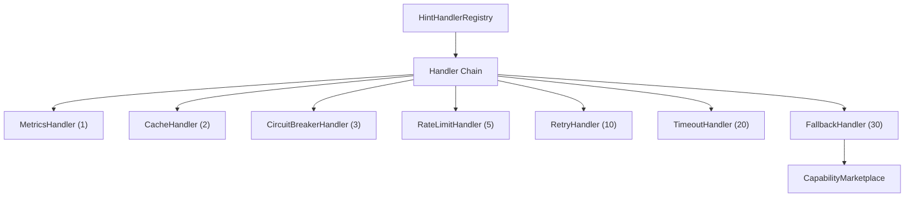

# Two-Tier Governance Architecture

## Overview

CCOS implements a two-tier governance model for execution hints:
- **Tier 1 (Global)**: Pre-execution plan validation by Gov Kernel
- **Tier 2 (Atomic)**: Per-step governance checkpoints during execution

## Execution Flows

### Direction 1: Top-Down (CCOS → RTFS)

```
User Intent → Arbiter.intent_to_plan()
    ↓
Plan with ^{:runtime.learning.retry ...} metadata
    ↓
GovKernel.validate_and_execute()
    ├── sanitize_intent()
    ├── scaffold_plan()
    ├── validate_against_constitution()
    ├── judge_plan_semantically() ← SEMANTIC JUDGE: Common sense check
    └── validate_execution_hints() ← TIER 1: Policy limits check
    ↓
Orchestrator.execute_plan()
    ↓
RuntimeHost → Evaluator.evaluate(plan_body)
```

### Direction 2: Bottom-Up (RTFS → Effects)

```
Evaluator.eval_expr(^{:runtime.learning.retry ...} (call :capability args))
    ↓
Extract metadata → host.set_execution_hint(key, value)
    ↓
eval_expr(inner) → RequiresHost(HostCall)
    ↓
RuntimeHost.execute_capability()
    └── build_call_metadata() includes execution_hints
    ↓
Orchestrator.handle_host_call() ← TIER 2: Atomic governance
    ├── if security_level >= "medium": record_decision()
    ├── validate_execution_hints() - enforces limits
    ├── apply_execution_hints() - retry/timeout/fallback
    └── record_outcome()
    ↓
CapabilityMarketplace.execute_capability_enhanced()
```

## Governance Checkpoints

| Level | When | What | Where |
|-------|------|------|-------|
| Global | Plan submission | Constitution rules, hint limits | `GovKernel.validate_and_execute()` |
| Atomic | Each capability call | Security level check, hint application | `Orchestrator.handle_host_call()` |

## Hint Flow

```
Arbiter generates: ^{:runtime.learning.retry {:max-retries 3}}
                    ↓
Evaluator extracts: host.set_execution_hint("runtime.learning.retry", value)
                    ↓
RuntimeHost stores: execution_hints["runtime.learning.retry"] = value
                    ↓
CallMetadata built: metadata.execution_hints = hints
                    ↓
Orchestrator reads: HintHandlerRegistry executes chain
```

## Modular Hint Handler System



### Handler Priority System

| Priority | Layer | Handler | Purpose |
|----------|-------|---------|---------|
| 1 | Observability | Metrics | Timing, call counts, percentiles |
| 2 | Caching | Cache | TTL-based memoization |
| 3 | Resilience | CircuitBreaker | Failure protection |
| 5 | Rate Control | RateLimit | Token bucket throttling |
| 10 | Resilience | Retry | Exponential backoff |
| 20 | Resource | Timeout | Absolute time limit |
| 30 | Recovery | Fallback | Alternative capability |

### Dynamic Handler Chaining

```rust
// Each handler wraps the next in the chain
fn apply(&self, host_call, hint_value, ctx, next: NextExecutor) -> BoxFuture<Value> {
    // Pre-execution logic (metrics start, cache lookup)
    let result = next().await;  // Call next handler in chain
    // Post-execution logic (record metrics, cache result)
    result
}
```

## Security Guarantees

1. **Allowlist**: Only known hint keys (`runtime.learning.*`) are accepted
2. **Policy limits**: max_retries, max_timeout_multiplier enforced
3. **No bypass**: All capability calls flow through `handle_host_call()`
4. **Audit trail**: Risky operations logged to CausalChain
5. **Runtime extensibility**: Custom handlers can be registered dynamically

## Files

| Component | File |
|-----------|------|
| Constitution & Policies | `ccos/src/governance_kernel.rs` |
| Handler Registry | `ccos/src/hints/registry.rs` |
| Handler Trait | `ccos/src/hints/types.rs` |
| Built-in Handlers | `ccos/src/hints/handlers/*.rs` |
| Atomic Checkpoints | `ccos/src/orchestrator.rs` |
| Hint Extraction | `rtfs/src/runtime/evaluator.rs` |
| Hint Storage | `ccos/src/host.rs` |
