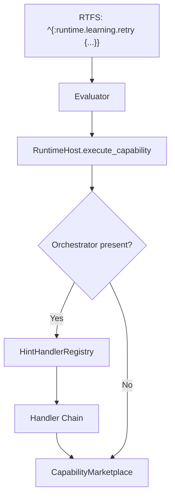

# Execution Hints System Specification

## Overview

The **Execution Hints System** provides a modular, middleware-like mechanism for applying resilience, observability, and caching behaviors to capability calls. Hints are specified in RTFS metadata and processed by a chain of pluggable handlers.

## Status

| Aspect | Status |
|--------|--------|
| Implementation | ✅ Complete |
| Handlers | 7 built-in |
| Runtime API | ✅ Complete |
| Causal Chain Integration | ✅ Complete |

## Architecture



### Handler Chain Model

Handlers are applied as nested wrappers around the base capability execution. Lower priority numbers execute first (outermost wrapper).

```
metrics(1) {
  cache(2) {
    circuit_breaker(3) {
      rate_limit(5) {
        retry(10) {
          timeout(20) {
            fallback(30) {
              base_execution()
            }
          }
        }
      }
    }
  }
}
```

## Built-in Handlers

| Handler | Priority | Hint Key | Purpose |
|---------|----------|----------|---------|
| `MetricsHintHandler` | 1 | `runtime.learning.metrics` | Timing, call counts, percentiles |
| `CacheHintHandler` | 2 | `runtime.learning.cache` | TTL-based memoization with LRU |
| `CircuitBreakerHintHandler` | 3 | `runtime.learning.circuit-breaker` | Failure protection (Closed→Open→HalfOpen) |
| `RateLimitHintHandler` | 5 | `runtime.learning.rate-limit` | Token bucket throttling |
| `RetryHintHandler` | 10 | `runtime.learning.retry` | Exponential backoff retries |
| `TimeoutHintHandler` | 20 | `runtime.learning.timeout` | Absolute time limit |
| `FallbackHintHandler` | 30 | `runtime.learning.fallback` | Alternative capability on failure |

## Handler Configuration

### Retry
```rtfs
^{:runtime.learning.retry {:max-retries 3 :initial-delay-ms 100 :backoff-multiplier 2.0}}
```

### Timeout
```rtfs
^{:runtime.learning.timeout {:timeout-ms 5000}}
```

### Fallback
```rtfs
^{:runtime.learning.fallback {:capability "alternative.capability"}}
```

### Cache
```rtfs
^{:runtime.learning.cache {:ttl-ms 60000 :max-entries 100}}
```

### Circuit Breaker
```rtfs
^{:runtime.learning.circuit-breaker {:failure-threshold 5 :cooldown-ms 30000}}
```

### Rate Limit
```rtfs
^{:runtime.learning.rate-limit {:requests-per-second 10 :burst 5}}
```

### Metrics
```rtfs
^{:runtime.learning.metrics {:label "my-operation" :emit-to-chain true :track-percentiles true}}
```

## HintHandler Trait

```rust
pub trait HintHandler: Send + Sync {
    /// Unique key matching RTFS metadata (e.g., "runtime.learning.retry")
    fn hint_key(&self) -> &str;

    /// Priority for chaining (lower = outer wrapper)
    fn priority(&self) -> u32;

    /// Human-readable description
    fn description(&self) -> &str { "No description" }

    /// Optional validation of hint configuration
    fn validate_hint(&self, hint_value: &Value) -> RuntimeResult<()> { Ok(()) }

    /// Apply handler logic, calling next() for inner handlers
    fn apply<'a>(
        &'a self,
        host_call: &'a HostCall,
        hint_value: &'a Value,
        ctx: &'a ExecutionContext,
        next: NextExecutor<'a>,
    ) -> BoxFuture<'a, RuntimeResult<Value>>;
}
```

## Runtime Registration API

```rust
let mut registry = HintHandlerRegistry::with_defaults();

// List handlers
registry.list_handlers();   // ["runtime.learning.metrics", ...]
registry.handler_info();    // [(key, priority, description), ...]

// Dynamic registration
registry.register(Arc::new(CustomHandler::new()));
registry.unregister("runtime.learning.cache");

// Builder pattern
let minimal = HintHandlerRegistry::with_handlers(|r| {
    r.register(Arc::new(RetryHintHandler::new()));
});
```

## Causal Chain Integration

All handlers can log to the causal chain for audit purposes:

- **MetricsHintHandler**: Logs timing summaries when `emit-to-chain: true`
- **CircuitBreakerHintHandler**: Logs state transitions (open, half-open, closed)
- **RetryHintHandler**: Logs retry attempts and final outcome

## Priority Guidelines

| Range | Layer | Purpose |
|-------|-------|---------|
| 1-9 | Observability | Metrics, tracing, logging |
| 10-19 | Resilience | Retry, circuit breaker |
| 20-29 | Resource Control | Timeout, rate limit |
| 30-39 | Error Recovery | Fallback, defaults |
| 40+ | Post-processing | Caching, transformations |

## Files

| Component | Location |
|-----------|----------|
| Module Entry | `ccos/src/hints/mod.rs` |
| Core Types | `ccos/src/hints/types.rs` |
| Registry | `ccos/src/hints/registry.rs` |
| Handlers | `ccos/src/hints/handlers/*.rs` |

## Learning Integration

The hint system integrates with the learning loop to automatically inject hints based on observed failures:

### Automatic Hint Injection Flow

```
Capability Fails → CausalChain → extract_patterns → WorkingMemory
                                        ↓
Next Execution → recall_patterns_for_intent → pattern_to_modification
                                        ↓
augment_plan_with_learning → inject_*_metadata → ^{:runtime.learning.*}
                                        ↓
HintHandlerRegistry.execute_with_hints → 7 Handlers Applied
```

### Error→Hint Mapping

| Error Category | Injected Hints |
|----------------|----------------|
| NetworkError | `retry` + `circuit-breaker` |
| TimeoutError | `timeout` (increased) + `retry` |
| MissingCapability | `fallback` (to synthesis) |
| SchemaError | `metrics` (for debugging) |
| RateLimitError | `rate-limit` + `retry` |
| LLMError | `fallback` + `circuit-breaker` |

### Related Files
- `arbiter/learning_augmenter.rs` - Metadata injection functions
- `arbiter/delegating_arbiter.rs` - Pattern→modification mapping

## Related Specifications

- [003-causal-chain.md](003-causal-chain.md) - Audit trail and provenance
- [006-arbiter-and-cognitive-control.md](006-arbiter-and-cognitive-control.md) - Plan generation
- [030-capability-system-architecture.md](030-capability-system-architecture.md) - Capability execution
- [035-two-tier-governance.md](035-two-tier-governance.md) - Governance architecture
