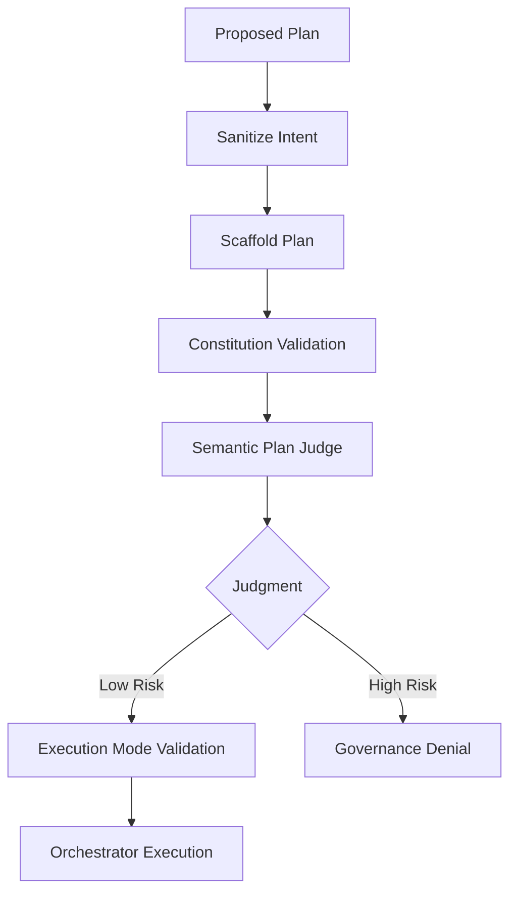

# 041: Semantic Plan Judge

## Overview

The **Semantic Plan Judge** is a high-privilege governance component within the `GovernanceKernel` that performs a "common sense" validation of generated plans. While traditional governance rules (Constitution) focus on structural and permission-based checks (e.g., "Is this agent allowed to call this tool?"), the Semantic Judge focuses on the **intent-action alignment** (e.g., "Does this tool actually do what the user asked for?").

This component addresses the **Semantic Gap** in AI planning, where a model might technically follow all rules but produce a plan that is nonsensical, dangerous, or hallucinatory due to loose embedding associations or reasoning errors.

## Architecture

The Semantic Judge is integrated as a mandatory step in the `GovernanceKernel` validation pipeline.



### Evaluation Criteria

The judge uses an LLM to evaluate the plan against three primary dimensions:

1.  **Goal Alignment**: Does the proposed RTFS code actually achieve the user's stated goal?
2.  **Semantic Safety**: Are the selected capabilities appropriate for the context? (e.g., preventing a "delete" goal from being mapped to a "discovery" tool).
3.  **Hallucination Detection**: Does the plan invent parameters, capabilities, or logic that are not supported by the resolved capability metadata?

## Implementation Details

### Judgment Structure

The judge produces a `Judgment` object:

```rust
pub struct Judgment {
    /// Risk score from 0.0 (safe) to 1.0 (dangerous)
    pub risk_score: f64,
    /// Detailed reasoning for the score
    pub reasoning: String,
    /// Whether the plan is aligned with the goal
    pub goal_aligned: bool,
    /// Whether the plan is semantically safe
    pub semantically_safe: bool,
    /// Whether hallucinations were detected
    pub hallucinations_detected: bool,
}
```

### Governance Policy

The behavior of the judge is controlled by the `SemanticJudgePolicy` in the `Constitution`:

- **Enabled**: Whether the judge is active.
- **Risk Threshold**: The maximum allowed risk score (default: 0.7). Plans exceeding this are blocked.
- **Fail-Open**: If the LLM provider is unavailable or fails to respond, the system can be configured to allow the plan (with a warning) or block it.

## Example Scenarios

### Scenario 1: Semantic Mismatch (Blocked)
- **Goal**: "Delete the temporary build directory."
- **Plan**: Calls `mcp.filesystem.list_files` and stops.
- **Judge**: "The goal is destructive ('delete'), but the plan only performs discovery ('list'). The plan fails to achieve the goal."
- **Result**: Blocked (Goal Alignment failure).

### Scenario 2: Hallucination (Blocked)
- **Goal**: "Get weather for Paris."
- **Plan**: Calls `weather.get_current(city="Paris", units="kelvin", include_forecast=true)`.
- **Metadata**: `weather.get_current` only accepts `city`.
- **Judge**: "The plan passes unsupported parameters ('units', 'include_forecast') to the capability. This is a hallucination."
- **Result**: Blocked (Hallucination detected).

### Scenario 3: Safe Execution (Allowed)
- **Goal**: "List my github repositories."
- **Plan**: Calls `mcp.github.list_repos()`.
- **Judge**: "The plan correctly uses the appropriate tool to achieve the user's goal safely."
- **Result**: Allowed (Risk Score: 0.05).

## Integration with Repair Loop

When a plan is rejected by the Semantic Judge, the reasoning is fed back to the `Arbiter` or `IterativePlanner`. This allows the system to automatically repair the plan by providing the specific semantic error as context for the next generation attempt.
