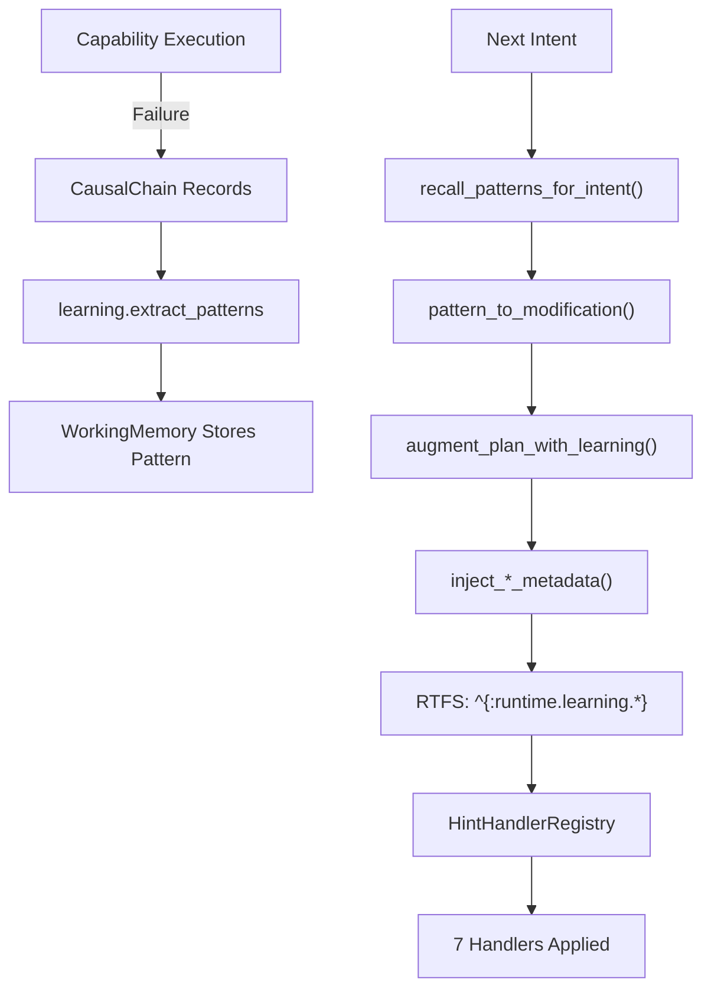

# 045 — Learning System Specification

## Status
**Implemented** — Core learning loop integrated with execution hints system.

## Overview

The CCOS Learning System enables **autonomous improvement** through failure pattern extraction, recall, and plan augmentation. It closes the loop between execution failures and future plan enhancements.

## Architecture



## Core Components

### 1. Pattern Extraction

Scans CausalChain for failure clusters and extracts `LearnedPattern`:

```rust
struct LearnedPattern {
    capability_id: String,
    error_category: String,     // NetworkError, TimeoutError, etc.
    frequency: u32,
    suggested_hints: Vec<String>,
    confidence: f64,
}
```

**Location**: `learning/capabilities.rs` - `learning.extract_patterns`

### 2. Pattern Storage

Patterns stored in WorkingMemory with capability-indexed retrieval:

```rust
// Store pattern
working_memory.store_pattern(capability_id, pattern).await;

// Recall patterns
let patterns = working_memory.recall_patterns(capability_id).await;
```

**Location**: `working_memory.rs`, `agent/memory.rs`

### 3. Pattern Recall

During plan generation, `DelegatingArbiter` recalls relevant patterns:

```rust
async fn recall_patterns_for_intent(&self, intent: &Intent) -> Vec<PlanModification> {
    let potential_caps = self.extract_capability_hints(intent);
    for cap_id in potential_caps {
        if let Some(patterns) = working_memory.recall(&cap_id) {
            // Convert to modifications
            modifications.push(pattern_to_modification_simple(cap_id, pattern));
        }
    }
    modifications
}
```

**Location**: `arbiter/delegating_arbiter.rs`

### 4. Error→Hint Mapping

| Error Category | Injected Hints |
|----------------|----------------|
| NetworkError | `retry` + `circuit-breaker` |
| TimeoutError | `timeout` (increased) + `retry` |
| MissingCapability | `fallback` (to synthesis) |
| SchemaError | `metrics` (for debugging) |
| RateLimitError | `rate-limit` + `retry` |
| LLMError | `fallback` + `circuit-breaker` |

**Location**: `arbiter/delegating_arbiter.rs` - `pattern_to_modification_simple()`

### 5. Plan Augmentation

Modifies RTFS AST to inject metadata expressions:

```rust
pub fn augment_plan_with_learning(
    plan: Plan,
    modifications: &[PlanModification],
) -> AugmentationResult {
    // Parse RTFS, find capability calls, wrap with metadata
    // Example: (call :cap.id ...) → ^{:runtime.learning.retry {...}} (call :cap.id ...)
}
```

**Injection Functions**:
- `inject_retry_metadata(source, target_cap, max_retries, delay_ms, multiplier)`
- `inject_timeout_metadata(source, target_cap, timeout_ms)`
- `inject_fallback_metadata(source, target_cap, fallback_cap)`
- `inject_circuit_breaker_metadata(source, target_cap)`
- `inject_rate_limit_metadata(source, target_cap)`
- `inject_metrics_metadata(source, target_cap, emit_to_chain)`

**Location**: `arbiter/learning_augmenter.rs`

### 6. Hint Execution

At runtime, `HintHandlerRegistry` applies hints via middleware chain:

```
metrics(1) → cache(2) → circuit_breaker(3) → rate_limit(5) → retry(10) → timeout(20) → fallback(30) → base_execution()
```

**Location**: `hints/registry.rs`, `hints/handlers/*.rs`

## Configuration

```toml
# agent_config.toml

[learning]
enabled = true
pattern_ttl_hours = 168       # 7 days
min_confidence = 0.6
max_suggestions_per_intent = 3

[learning.auto_inject]
retry = true
timeout = true
fallback = true
circuit_breaker = true
```

## Learning Capabilities

| Capability | Purpose |
|------------|---------|
| `learning.extract_patterns` | Extract patterns from CausalChain |
| `learning.get_failures` | Query failure history |
| `learning.get_failure_stats` | Aggregate failure statistics |
| `learning.analyze_failure` | LLM-assisted failure analysis |
| `learning.suggest_improvement` | LLM-generated fix suggestions |

## Files

| Component | Location |
|-----------|----------|
| Pattern extraction | `learning/capabilities.rs` |
| Working memory | `working_memory.rs` |
| Arbiter integration | `arbiter/delegating_arbiter.rs` |
| Plan augmentation | `arbiter/learning_augmenter.rs` |
| Hint handlers | `hints/handlers/*.rs` |
| Hint registry | `hints/registry.rs` |

## Related Specifications

- [040-execution-hints.md](040-execution-hints.md) — Hint handler system
- [035-two-tier-governance.md](035-two-tier-governance.md) — Governance checkpoints
- [013-working-memory.md](013-working-memory.md) — Pattern storage
- [003-causal-chain.md](003-causal-chain.md) — Failure source data
