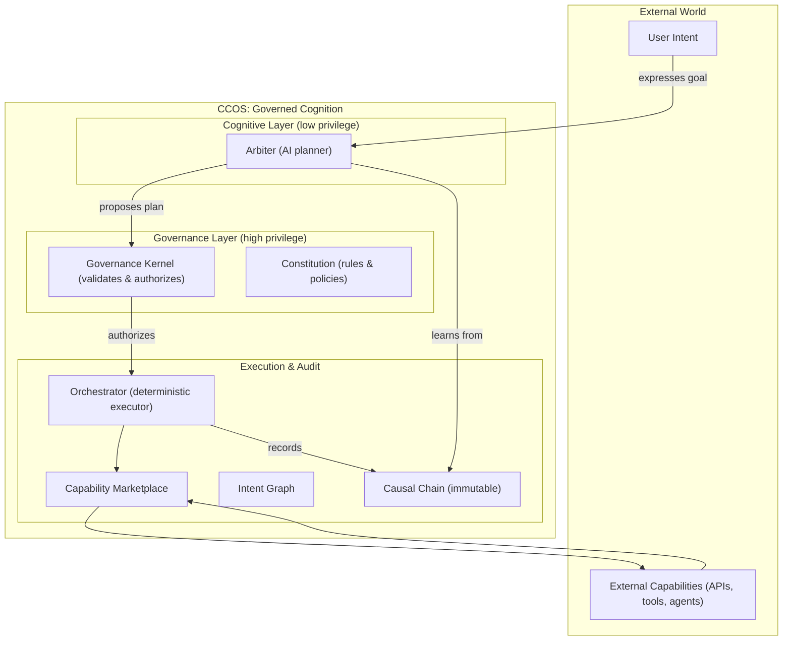

# CCOS: Cognitive-Causal Orchestration System

## Guides

- CCOS/RTFS Guides index: docs/ccos/guides/README.md

# CCOS: Cognitive Computing Operating System (and RTFS, its kernel language)

An architecture that gives AI models more execution and logical power—while keeping every effect traceable and every decision verifiable.

---

## Human Partner Disclaimer (also reformulated by AI :D)

This project has been built primarily by AI, with a human partner guiding direction and reviewing changes. The aim is to explore how far AI can go in specifying and building its own operating system: a governed environment where AI can plan and act safely.

The system started with RTFS, a language designed for AI-to-system coordination, and evolved into CCOS, the runtime that executes RTFS plans under governance. The runtime is AI‑native: logic is generated by LLMs in RTFS and executed under the Orchestrator with the Governance Kernel enforcing policy. In some modes, effects can be executed by an LLM tool runner acting as a governed capability, as long as each effect is authorized and traceable on the Causal Chain. The journey is documented in the `chats/` directory.

---

## What if your computer didn’t just follow instructions, but pursued your goals?

Today’s models are powerful reasoners, but their actions are opaque. They don’t provide a reliable audit trail, and they can’t be allowed to act freely.

CCOS closes this gap. It separates intent (why), plan (how), and action (what happened), and runs plans in RTFS 2.0—a pure language where any side-effect must be an explicit yield to the host. The result: models can generate and execute complex strategies, yet all effects are authorized, logged, and replayable.

## The Architecture of Trust: Separation of Powers

The model proposes; the system disposes. The Arbiter (LLM-driven planner) has no direct authority. The Governance Kernel validates plans and authorizes effects. The Orchestrator executes deterministically; the Capability Marketplace resolves providers; the Causal Chain records every step.

This design gives models room to think and plan, without giving them unchecked power.

## Anatomy of a Governed Action

1) From the user’s natural‑language goal, the Arbiter (AI) creates a structured intent with constraints and success criteria.
2) The Arbiter generates an RTFS plan (pure code; effects via `(call ...)`).
3) The Governance Kernel validates the plan and enforces policies.
4) The Orchestrator executes step by step. Each `(call ...)` yields to the host, is resolved through the Marketplace, and logged to the Causal Chain.
5) If a step fails, the system can resume deterministically. The chain provides a full, verifiable story.

The audit trail ties every effect to its plan, intent, and governing rule.

---

## RTFS (Reason about The Fucking Spec): The language of governed execution

RTFS 2.0 is designed to make powerful plans safe to run:

- Pure core: no hidden mutation; values are immutable
- Host-boundary yields: side-effects happen only through `(call ...)`
- Steps: `(step ...)` scopes orchestration and checkpoints
- Compiled IR: verifiable, portable, and efficient
- Reentrancy: deterministic replay, resume after yields
- Homoiconicity: code as data for model-friendly generation

Two primitives do most of the work:
- `(call ...)` is the only way to interact with the world
- `(step ...)` creates observable, auditable execution boundaries

---

## An architecture for ethical autonomy

Governance is built in, not bolted on.

- Constitutional rules: human-authored, enforced by the Kernel before any effect
- Capability attestation: providers are discoverable, versioned, and signed
- Immutable Causal Chain: every action is recorded with provenance and cost
- Federation ready: multiple Arbiters can collaborate, with debate logged

---

## Core concepts

- Living Intent Graph: a dynamic map of goals and relationships
- Capability Marketplace: discovery and selection with policy controls
- Causal Chain: a tamper-proof record of plan steps and effects
- Governance Kernel: validates plans, authorizes yields, enforces quotas/ACLs
- Orchestrator: deterministic driver of the RTFS runtime and yield-resume loop
- Working Memory and Horizon: queryable context built from the chain and graph

---

## CCOS and the broader AI ecosystem (MCP, A2A)

CCOS complements open protocols. External tools and agents appear as capabilities. The same governance, auditing, and validation apply, so collaboration doesn’t compromise safety.

---

## Getting started

1) Explore the vision and architecture
- Documentation Hub: ./docs/doc_organization.md
- CCOS Core Specifications:
  - System Architecture: ./docs/ccos/specs/000-ccos-architecture.md
  - Intent Graph: ./docs/ccos/specs/001-intent-graph.md
  - Plans & Orchestration: ./docs/ccos/specs/002-plans-and-orchestration.md
  - Causal Chain: ./docs/ccos/specs/003-causal-chain.md
  - **Capability System**: ./docs/ccos/specs/030-capability-system-architecture.md
  - **MCP Discovery**: ./docs/ccos/specs/031-mcp-discovery-unified-service.md
  - **Missing Capability Resolution**: ./docs/ccos/specs/032-missing-capability-resolution.md
  - **Importers & Synthesis**: ./docs/ccos/specs/033-capability-importers-and-synthesis.md

2) Understand the RTFS language
- RTFS 2.0 Spec Hub: ./docs/rtfs-2.0/specs/README.md
- RTFS & CCOS Integration: ./docs/rtfs-2.0/specs/13-rtfs-ccos-integration-guide.md

3) Dive into implementation
- Reference implementation: ./rtfs_compiler/ (Rust)
- Reentrance demo: ./rtfs_compiler/examples/rtfs_reentrance_demo.rs

## Development status

CCOS is active and evolving. The RTFS 2.0 migration and reentrance demo are merged. Core components exist with room to harden and extend.

| Component                 | Status            | Notes                                                |
| ------------------------- | ----------------- | ---------------------------------------------------- |
| Core Specifications       | Complete          | RTFS 2.0 aligned                                     |
| Intent Graph              | In Progress       | Persistence and relations                            |
| Causal Chain              | Basic Complete    | Immutable ledger; replay hooks                       |
| Orchestrator              | Basic Complete    | Yield-resume engine; deterministic execution         |
| Capability System         | Complete          | CapabilityMarketplace, domains/categories, MCP       |
| MCP Discovery             | Complete          | Unified service with domain inference, caching       |
| Missing Cap Resolution    | Complete          | 4 strategies, backoff, risk assessment               |
| Governance Kernel         | Basic Complete    | Plan/yield validation; quotas/ACLs                   |
| Delegation Engine         | Basic Complete    | Policy selection; future agent delegation ready      |
| Arbiter (LLM Bridge)      | In Progress       | Constrained outputs; plan compilation pipeline       |
| RTFS 2.0 Language         | In Progress       | Purity, yields, IR verification, reentrancy          |

---

## More scenarios (what CCOS/RTFS enables)

- SRE autopilot: self-heal with audit and compensations (see scenarios §1)
- Regulated analytics: DP budgets, IFC labels, provenance (see §2)
- Trading guardrails: quorum arbiters, dry-run simulation (see §3)
- Secure supply chain: attested builds to rollout with chain proofs (see §4)
- Legal workflows: approvals and DLP post-filters (see §5)
- DR drills: provable RPO/RTO with EU-only data (see §6)
- Generative capabilities: compose, test, attest, publish (see §7)

Links: ./docs/rtfs-2.0/specs-incoming/15-showcase-scenarios.md

## The vision

The goal is an operating system that understands intent, executes autonomously under rules, and records a complete causal story. Plans get more powerful; oversight stays strong. Safety is architectural.

---

## Contributing

We welcome research, implementation, documentation, testing, and infrastructure contributions. See PR_CHECKLIST.md and CLAUDE.md for guidelines.

## License

Apache License 2.0. See LICENSE for details.

## Acknowledgements

Thanks to everyone exploring this new shape of computing with us.

---

Start with the Documentation Hub: ./docs/DOCUMENTATION_ORGANIZATION_SUMMARY.md