# CCOS Specifications (docs/ccos/specs)

This directory is the **spec hub** for CCOS. Specs describe the intended architecture *and* the current implementation constraints.

- **CCOS overview (didactic)**: [`docs/ccos/README.md`](../README.md)
- **Guides (how-to)**: [`docs/ccos/guides/README.md`](../guides/README.md)
- **RTFS 2.0 specs hub**: [`docs/rtfs-2.0/specs/README.md`](../../rtfs-2.0/specs/README.md)

## Architecture at a glance

```mermaid
flowchart LR
  U[User / App / CLI] --> A[Cognitive Engine / Planner]
  A --> IG[Intent Graph]
  A --> P[RTFS Plan]
  P --> G[Governance Kernel]
  G --> O[Orchestrator + RTFS Runtime]
  O --> CC[Causal Chain]
  O --> M[Capability Marketplace]
  M --> AQ[Approval & Trust Gates]
  AQ --> Prov[Providers: Native · MCP · Imported APIs · MicroVM]
  Prov --> O
  WM[Working Memory] --> A
  CH[Context Horizon] --> A
```

## Specs index

### Core architecture & execution

- **System architecture**: [`000-ccos-architecture.md`](000-ccos-architecture.md)
- **Plans & orchestration (step model)**: [`002-plans-and-orchestration.md`](002-plans-and-orchestration.md)
- **Causal Chain**: [`003-causal-chain.md`](003-causal-chain.md)
- **RTFS ↔ CCOS boundary**: [`004-rtfs-ccos-boundary.md`](004-rtfs-ccos-boundary.md)
- **Checkpoint / resume**: [`017-checkpoint-resume.md`](017-checkpoint-resume.md)
- **Execution modes**: [`execution-modes.md`](execution-modes.md)

### Governance & security

- **Security & context propagation**: [`005-security-and-context.md`](005-security-and-context.md)
- **Ethical governance (constitution/rules)**: [`010-ethical-governance.md`](010-ethical-governance.md)
- **Intent sanitization**: [`012-intent-sanitization.md`](012-intent-sanitization.md)
- **Two-tier governance**: [`035-two-tier-governance.md`](035-two-tier-governance.md)
- **Execution hints**: [`040-execution-hints.md`](040-execution-hints.md)

### Capabilities, marketplace, discovery

- **Capability system architecture**: [`030-capability-system-architecture.md`](030-capability-system-architecture.md)
- **MCP discovery unified service**: [`031-mcp-discovery-unified-service.md`](031-mcp-discovery-unified-service.md)
- **Missing capability resolution**: [`032-missing-capability-resolution.md`](032-missing-capability-resolution.md)
- **Capability importers & synthesis**: [`033-capability-importers-and-synthesis.md`](033-capability-importers-and-synthesis.md)
- **MCP server architecture**: [`036-mcp-server-architecture.md`](036-mcp-server-architecture.md)
- **Interactive MCP server mode**: [`007-mcp-server-interactive-mode.md`](007-mcp-server-interactive-mode.md)
- **Capabilities vs agents**: [`015-capabilities-vs-agents.md`](015-capabilities-vs-agents.md)

### Cognitive layer, memory, and context

- **Cognitive engine (planning & cognitive control)**: [`006-cognitive-engine-and-cognitive-control.md`](006-cognitive-engine-and-cognitive-control.md)
- **Delegation engine**: [`008-delegation-engine.md`](008-delegation-engine.md)
- **Context horizon**: [`009-context-horizon.md`](009-context-horizon.md)
- **Working memory**: [`013-working-memory.md`](013-working-memory.md)
- **Learning system**: [`045-learning-system.md`](045-learning-system.md)

### Isolation & MicroVM

- **MicroVM architecture**: [`020-microvm-architecture.md`](020-microvm-architecture.md)
- **Sandbox isolation**: [`022-sandbox-isolation.md`](022-sandbox-isolation.md)
- **Firecracker internals (details)**: [`022-firecracker-internals.md`](022-firecracker-internals.md)

### Planner & synthesis (deeper dives)

- **Modular planner architecture**: [`025-modular-planner-architecture.md`](025-modular-planner-architecture.md)
- **Planner synthesis**: [`026-planner-synthesis.md`](026-planner-synthesis.md)
- **Plan generation retry**: [`021-plan-generation-retry.md`](021-plan-generation-retry.md)
- **Semantic plan judge**: [`041-semantic-plan-judge.md`](041-semantic-plan-judge.md)

## Implementation status (honest snapshot)

This repo is **active and evolving**. This table aims to be realistic rather than aspirational.

**Legend**:
- ✅ **Implemented**: present in code and used by demos/tests
- ⚠️ **Partial**: implemented but still changing / missing important parts / limited coverage
- 🚧 **In progress**: active development; shape not stabilized
- 🧪 **Experimental**: prototype or research path; not production-grade

| Component | Status | Notes / pointers |
|---|---|---|
| **Orchestrator (yield/resume loop)** | ✅ | Core execution driver; deterministic stepping; integrates with host boundary |
| **Causal Chain** | ✅ | Wires through many flows; used for audit and learning events |
| **Approval & trust gates** | ✅ | Unified approval queue and storage backends exist |
| **Capability marketplace** | ✅ | Resolution + provider selection present; multiple provider types |
| **MCP integration & discovery** | ⚠️ | Implemented and used, but still evolving in scoring/config and UX |
| **Missing capability resolution** | ⚠️ | Multiple strategies exist; still being tuned and integrated across flows |
| **Governance kernel** | ⚠️ | Core checks exist; policies and coverage are still maturing |
| **Intent graph** | ⚠️ | Core data structures + storage/search exist; higher-level lifecycle is still evolving |
| **Context horizon** | ⚠️ | Implemented; strategies and boundaries are still under iteration |
| **Working memory** | ⚠️ | Implemented backend + ingestion; integration/quality is still evolving |
| **Cognitive engine / planning layer** | 🚧 | Multiple planning paths exist; outputs and plan compilation pipeline are still being hardened |
| **MicroVM isolation** | ⚠️ | Implemented plumbing + docs; operational hardening and policies still evolving |
| **Multi-agent architecture** | 🧪 | Mostly architectural/design material; implementations are experimental |

### RTFS status

RTFS has its own spec hub and implementation status tracking:
- **RTFS 2.0 specs hub**: [`docs/rtfs-2.0/specs/README.md`](../../rtfs-2.0/specs/README.md)