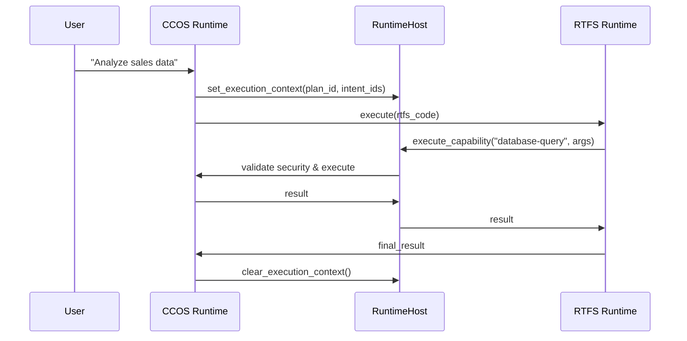

# RTFS vs CCOS Runtime: Quick Reference Guide

**Purpose:** Quick reference for understanding the distinction between RTFS and CCOS runtime systems

---

## TL;DR - Key Differences

| Aspect | RTFS Runtime | CCOS Runtime |
|--------|--------------|--------------|
| **Purpose** | Execute RTFS language code | Provide cognitive infrastructure |
| **Scope** | Language semantics & evaluation | Intent tracking, capability management |
| **Security** | Pure by design, no external access | Controls all external interactions |
| **Components** | AST Evaluator, IR Runtime | Intent Graph, Causal Chain, etc. |
| **Data Flow** | RTFS expressions → Values | Plans → Actions → Results |

---

## What is RTFS Runtime?

**RTFS Runtime** = The engine that executes RTFS programming language code

### Two Implementation Strategies:

#### 1. **AST Evaluator** (`evaluator.rs`)
- **What**: Tree-walking interpreter
- **When**: Development, debugging, full feature support needed
- **Performance**: Baseline (1x speed)
- **Features**: 100% language support
- **Maturity**: Production ready

#### 2. **IR Runtime** (`ir_runtime.rs`)  
- **What**: Optimized intermediate representation execution
- **When**: Production, performance-critical applications
- **Performance**: 2-26x faster than AST
- **Features**: 95%+ language support (growing)
- **Maturity**: Operational, actively optimized

### RTFS Runtime Responsibilities:
```clojure
;; RTFS Runtime handles:
(let [x 42]                    ; Variable binding
  (map inc [1 2 3]))           ; Function application
                               ; Collection processing
(if condition then-expr else)  ; Control flow
(call "capability" args)       ; ← Only external access point
```

---

## What is CCOS Runtime?

**CCOS Runtime** = The cognitive infrastructure that surrounds RTFS execution

### Core Components:

#### 1. **Intent Graph**
- **What**: Persistent storage of user goals and intents
- **Why**: Context continuity across sessions

#### 2. **Causal Chain** 
- **What**: Immutable ledger of all actions and decisions
- **Why**: Full auditability and reasoning about causation

#### 3. **Task Context**
- **What**: Context propagation across execution boundaries  
- **Why**: Maintain state across different execution phases

#### 4. **Context Horizon**
- **What**: LLM context window management
- **Why**: Handle large contexts efficiently

#### 5. **Capability Marketplace**
- **What**: Registry and execution engine for external capabilities
- **Why**: Controlled access to system resources

### CCOS Runtime Responsibilities:
```rust
// CCOS Runtime manages:
- User intent: "Analyze quarterly sales data"
- Plan execution: Steps to accomplish the intent  
- Capability calls: http-get, file-read, database-query
- Action tracking: What was done, when, why
- Context management: Maintaining state across calls
- Security enforcement: What's allowed to run
```

---

## Integration Architecture

### The Bridge: HostInterface

```rust
// RTFS Runtime communicates with CCOS through this interface:
pub trait HostInterface {
    fn set_execution_context(&self, plan_id: String, intent_ids: Vec<String>);
    fn execute_capability(&self, name: &str, args: &[Value]) -> RuntimeResult<Value>;
    fn clear_execution_context(&self);
}
```

### Execution Flow:



---

## When to Use Which Runtime Strategy?

### Choose **AST Runtime** when:
- ✅ **Development/Debugging**: Need full debugging support
- ✅ **New Features**: Working with latest language features
- ✅ **Compatibility**: Need 100% feature support
- ✅ **Stability**: Risk-averse production environments

### Choose **IR Runtime** when:
- ⚡ **Performance Critical**: Need maximum execution speed
- 📊 **Large Data Processing**: Working with significant datasets  
- 🔄 **Frequent Execution**: Code runs repeatedly
- 💾 **Memory Constrained**: Need memory efficiency

### Choose **IR with Fallback** when:
- 🎯 **Best of Both**: Want performance with safety net
- 🚀 **Production**: Need reliability + performance
- 🧪 **Testing**: Want to validate IR improvements
- 📈 **Migration**: Transitioning from AST to IR

---

## Code Examples

### RTFS Code Execution:

```clojure
;; This RTFS code...
(let [url "https://api.sales.com/quarterly"]
  (call "http-get" url))

;; Becomes this execution flow:
;; 1. RTFS Runtime: Parse and evaluate let binding
;; 2. RTFS Runtime: Recognize (call ...) as capability request
;; 3. Host Interface: execute_capability("http-get", [url])
;; 4. CCOS Runtime: Validate security permissions
;; 5. CCOS Runtime: Execute via capability marketplace  
;; 6. CCOS Runtime: Record action in causal chain
;; 7. Result flows back through the chain
```

### Runtime Strategy Selection:

```rust
// Choose runtime strategy based on needs
let runtime = match use_case {
    UseCase::Development => Runtime::new(Box::new(
        TreeWalkingStrategy::new(ast_evaluator)
    )),
    UseCase::Production => Runtime::new(Box::new(
        IrStrategy::new(module_registry)
    )),
    UseCase::Migration => Runtime::new(Box::new(
        IrWithFallbackStrategy::new(ir_runtime, ast_evaluator)
    )),
};
```

---

## Security Model

### RTFS Security: "Secure by Design"
```clojure
;; RTFS code CANNOT do:
(file-read "/etc/passwd")        ; ❌ No direct file access
(http-get "https://evil.com")    ; ❌ No direct network access  
(system "rm -rf /")              ; ❌ No system commands

;; RTFS code CAN do:
(call "file-read" "/data/sales.csv")     ; ✅ Through capability
(call "http-get" "https://api.com")      ; ✅ If allowed by security context
(map process-record records)             ; ✅ Pure computation always allowed
```

### CCOS Security: "Defense in Depth"
```rust
// Security enforcement at multiple layers:
1. SecurityContext: What capabilities are allowed?
2. CapabilityMarketplace: Is the capability registered?
3. Capability Implementation: Does it validate arguments?
4. CausalChain: Record everything for audit
```

---

## Performance Comparison

| Metric | AST Runtime | IR Runtime | Improvement |
|--------|-------------|------------|-------------|
| Simple expressions | 1000ns | 40-380ns | **2-26x faster** |
| Variable access | O(log n) | O(1) | **~10x faster** |  
| Function calls | Dynamic | Specialized | **~5x faster** |
| Memory usage | 200 bytes | 105 bytes | **47% reduction** |
| Compilation | N/A | 7-38μs | **Sub-microsecond** |

---

## Common Patterns

### Capability Definition:
```rust
// 1. Define the capability
pub struct DatabaseQueryCapability {
    connection: Arc<DatabaseConnection>,
}

// 2. Register with marketplace
marketplace.register("database-query", Arc::new(capability));

// 3. Use in RTFS
(call "database-query" "SELECT * FROM sales WHERE quarter = 'Q1'")
```

### Error Handling:
```rust
// RTFS runtime errors propagate through the stack:
RuntimeError::SecurityViolation → 
  HostInterface::execute_capability → 
    CCOS validation failure → 
      User-friendly error message
```

### Context Management:
```rust
// Always set context before RTFS execution:
host.set_execution_context(plan_id, intent_ids);
let result = runtime.execute(rtfs_code)?;
host.clear_execution_context();
```

---

## Debugging Guide

### RTFS Runtime Issues:
- **Use AST Runtime**: More debuggable than IR
- **Check Host Interface**: Verify capability calls work
- **Enable Verbose Logging**: See expression evaluation steps

### CCOS Integration Issues:
- **Verify Security Context**: Check capability permissions
- **Check Execution Context**: Ensure context is set
- **Examine Causal Chain**: See what actions were recorded

### Performance Issues:
- **Profile Both Runtimes**: Compare AST vs IR performance
- **Check Capability Overhead**: Measure host interface costs
- **Monitor Memory Usage**: Track allocation patterns

---

## Migration Checklist

### From Development (AST) to Production (IR):

- [ ] **Verify Feature Support**: Test all language features used
- [ ] **Performance Testing**: Measure actual improvement  
- [ ] **Error Handling**: Ensure IR errors are handled properly
- [ ] **Fallback Strategy**: Have AST fallback for edge cases
- [ ] **Monitoring**: Set up performance monitoring
- [ ] **Gradual Rollout**: Deploy to subset of workloads first

---

## Quick Decision Matrix

| Question | AST Runtime | IR Runtime | CCOS Runtime |
|----------|-------------|------------|--------------|
| "How do I execute RTFS code?" | ✅ Yes | ✅ Yes | ❌ No (wrong layer) |
| "How do I call external APIs?" | ❌ No (use host) | ❌ No (use host) | ✅ Yes (capabilities) |
| "How do I track user intents?" | ❌ No (wrong layer) | ❌ No (wrong layer) | ✅ Yes (intent graph) |
| "How do I optimize performance?" | ❌ Limited | ✅ Yes | ❌ No (wrong layer) |
| "How do I debug execution?" | ✅ Excellent | ⚠️ Good | ⚠️ Limited |
| "How do I ensure security?" | ❌ No (use host) | ❌ No (use host) | ✅ Yes (security context) |

---

*Quick Reference Version: 1.0*  
*For detailed information, see: RUNTIME_ARCHITECTURE_INTEGRATION.md and TECHNICAL_IMPLEMENTATION_GUIDE.md*
