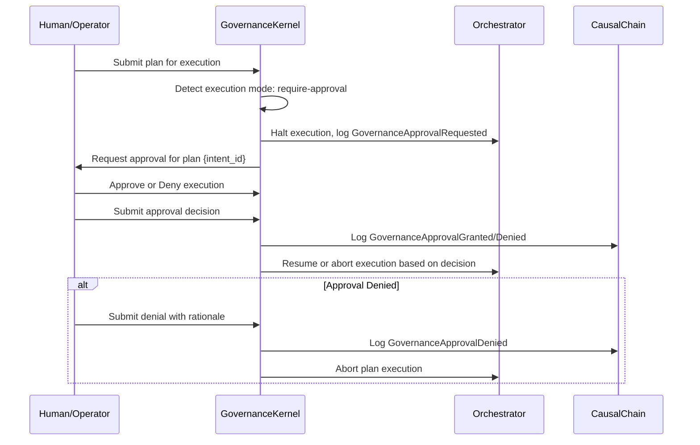
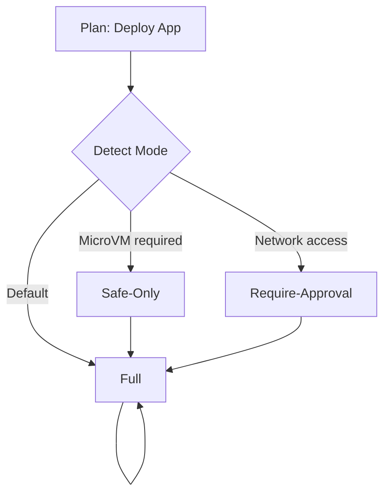

# CCOS Specification: Execution Modes

**Status:** Draft for Review
**Version:** 1.0
**Date:** 2025-01-10
**Related:** [000: Architecture](./000-ccos-architecture.md), [002: Plans](./002-plans-and-orchestration.md), [035: Two-Tier Governance](./035-two-tier-governance.md)

---

## Introduction: Safe Execution Guardrails

Execution Modes provide runtime safety controls for plan execution, enabling organizations to enforce "defense in depth" strategies. The Governance Kernel detects execution mode based on plan metadata, intent constraints, and configured policies, then applies appropriate safeguards before execution begins.

Why essential? Prevents accidental or malicious execution of high-risk operations, provides audit trails for compliance, and enables "dry-run" validation without side effects.

---

## Core Concepts

### 1. Execution Mode Detection

The `GovernanceKernel::detect_execution_mode()` method determines the appropriate execution mode based on precedence:

```rust
impl GovernanceKernel {
    pub fn detect_execution_mode(
        &self,
        plan: &Plan,
        intent: Option<&StorableIntent>,
    ) -> RuntimeResult<String> {
        // 1. Check plan metadata for explicit mode
        if let Some(mode) = plan.metadata.get("execution_mode") {
            return Ok(mode);
        }

        // 2. Check intent constraints for mode override
        if let Some(intent) = intent {
            if let Some(mode) = intent.constraints.get("execution_mode") {
                return Ok(mode);
            }
        }

        // 3. Detect based on plan characteristics
        if self.requires_isolation(plan) {
            return Ok("safe-only");
        }

        if self.is_high_risk_operation(plan) {
            return Ok("require-approval");
        }

        // 4. Default to full execution
        Ok("full".to_string())
    }
}
```

### 1.1 Detection Rules

| Trigger | Mode | Rationale |
|----------|--------|-----------|
| Plan metadata has `:execution_mode` | Use specified mode | Direct user/admin control |
| Intent constraint has `:execution_mode` | Use specified mode | Intent-level safety requirement |
| Plan requires MicroVM isolation | safe-only | High-security operations sandboxed |
| Plan contains network/file access | require-approval | High-risk capabilities need human review |
| Plan contains unknown capabilities | require-approval | Untrusted code requires approval |
| Default (no overrides) | full | Normal execution with standard governance |

### 1.2 Security Level Detection

Plans with `StepProfile::security_level = Critical` auto-select `safe-only` or `require-approval`:

```rust
impl GovernanceKernel {
    fn requires_isolation(&self, plan: &Plan) -> bool {
        // Check if any step has Critical security profile
        for step in &plan.steps {
            if let Some(profile) = self.derive_step_profile(&step) {
                if profile.security_level == SecurityLevel::Critical {
                    return true;
                }
            }
        }
        false
    }

    fn is_high_risk_operation(&self, plan: &Plan) -> bool {
        // Check for network access to untrusted domains
        // Check for file system write operations
        // Check for administrative capabilities
        false
    }
}
```

---

## 2. Execution Modes

### 2.1 Full Mode

**Description**: Normal execution with all governance checks enabled but no additional restrictions.

**Behavior**:
- All capabilities execute normally
- Two-tier governance applies (global validation + per-step checkpoints)
- Resource limits enforced
- Causal Chain fully logs all actions
- No automatic pauses or approvals

**Use Cases**:
- Routine data processing
- Internal system operations
- Low-risk user workflows

**Example**:
```rust
// Plan explicitly requests full execution
{:intent-id "intent-123"
 :execution_mode "full"}

// Or intent constraint
{:intent-id "intent-123"
 :constraints {:execution_mode "full"}}
```

---

### 2.2 Dry-Run Mode

**Description**: Simulates execution without any side effects or external calls.

**Behavior**:
- Capability calls are logged but not executed
- Returns mock results without actual operations
- No Causal Chain entries for real actions (only logging of simulation)
- Useful for validation, testing, and cost estimation

**Mock Capability Responses**:
- `:storage.fetch` → Returns empty dataset
- `:nlp.sentiment` → Returns random sentiment scores
- `:network.http` → Returns success without HTTP call

**Use Cases**:
- Validate plan logic before actual execution
- Estimate costs and resource usage
- Test governance policies without side effects
- Demonstrate capabilities to users/stakeholders

**Implementation**:
```rust
pub enum ExecutionMode {
    Full,
    DryRun,
    SafeOnly,
    RequireApproval,
}

impl GovernanceKernel {
    pub async fn execute_plan_dry_run(
        &self,
        plan: &Plan,
        intent: Option<&StorableIntent>,
    ) -> RuntimeResult<ExecutionResult> {
        self.log_action(ActionType::PlanStarted, &plan, "dry-run mode")?;

        // Execute with dry-run flag
        let result = self.orchestrator
            .execute_plan_internal(plan, intent, Some(ExecutionMode::DryRun))
            .await?;

        self.log_action(ActionType::PlanCompleted, &plan, "dry-run completed")?;
        Ok(result)
    }
}
```

---

### 2.3 Safe-Only Mode

**Description**: Executes only capabilities that are safe, deterministic, and have no side effects.

**Behavior**:
- **Allowed**: Pure RTFS operations, read-only capabilities, computation
- **Blocked**: Network calls, file writes, administrative operations, any capability with `:effect "write"` or `:effect "network"`
- **Two-tier governance**: Both global validation and per-step checkpoints apply
- **Automatic fails**: Blocked capabilities return error with safe-mode violation

**Safe Capability List**:
- `:ccos.llm.generate` (if output-only)
- `:ccos.io.println`
- `:ccos.math.*` (pure computation)
- `:storage.fetch` (read-only)
- `:chain.query` (read-only)
- `:horizon.build` (read-only)

**Blocked Capability Examples**:
- `:ccos.network.*` - Network access
- `:storage.save` - File write
- `:fs.write` - File write
- `:ccos.admin.*` - Administrative
- Any capability with `:effects ["network", "filesystem.write"]`

**Implementation**:
```rust
pub struct SafeOnlyPolicy {
    pub safe_capabilities: HashSet<String>,
    pub blocked_effects: Vec<String>,
}

impl SafeOnlyPolicy {
    pub fn default() -> Self {
        Self {
            safe_capabilities: HashSet::from([
                "ccos.llm.generate".to_string(),
                "ccos.io.println".to_string(),
                "ccos.math.*".to_string(),
                "storage.fetch".to_string(),
                "chain.query".to_string(),
                "horizon.build".to_string(),
            ]),
            blocked_effects: vec![
                "network".to_string(),
                "filesystem.write".to_string(),
            ],
        }
    }

    pub fn is_safe_capability(&self, capability_id: &str) -> bool {
        self.safe_capabilities.contains(capability_id)
            || capability_id.starts_with("ccos.math.")
            || capability_id.starts_with("ccos.io.println")
    }

    pub fn is_capability_safe_for_mode(
        &self,
        capability_id: &str,
        mode: &ExecutionMode,
    ) -> bool {
        match mode {
            ExecutionMode::SafeOnly => self.is_safe_capability(capability_id),
            _ => true,
        }
    }
}
```

**Use Cases**:
- Data analysis workflows with read-only access
- Cost estimation without actual resource consumption
- Compliance demonstration (show what would happen)
- Educational/sandboxing environments

---

### 2.4 Require-Approval Mode

**Description**: Requires human or governance approval before executing any capability.

**Behavior**:
- **Pre-execution check**: Validate plan and detect mode
- **Approval gate**: Block execution until approval granted
- **Audit trail**: Log approval request and decision in Causal Chain
- **Time-limited approvals**: Auto-expire if no action within timeout

**Approval Flow**:


**Approval Request**:
```rust
pub struct ApprovalRequest {
    pub request_id: String,
    pub plan_id: PlanId,
    pub intent_id: IntentId,
    pub reason: String,
    pub auto_approve: bool,
    pub expires_at: Option<DateTime<Utc>>,
    pub approvers: Vec<String>,
}
```

**Governance Actions**:
```rust
// Request approval
{:action-id "a-001"
 :type :GovernanceApprovalRequested
 :plan-id "plan-123"
 :intent-id "intent-456"
 :reason "Plan contains network access to external domains"
 :auto-approve false}

// Approval granted
{:action-id "a-002"
 :type :GovernanceApprovalGranted
 :approval-id "apr-001"
 :approver "admin@example.com"
 :timestamp "2025-01-10T15:30:00Z"}

// Approval denied
{:action-id "a-003"
 :type :GovernanceApprovalDenied
 :approval-id "apr-001"
 :reason "External domain not approved for production use"}
 :approver "admin@example.com"}
```

**Use Cases**:
- Production deployments requiring explicit authorization
- High-risk operations (data deletion, external network access)
- Regulatory compliance (financial transactions, PII processing)
- Disaster recovery operations

**Implementation**:
```rust
impl GovernanceKernel {
    pub async fn execute_plan_require_approval(
        &self,
        plan: &Plan,
        intent: Option<&StorableIntent>,
    ) -> RuntimeResult<ExecutionResult> {
        self.log_action(ActionType::PlanStarted, &plan, "require-approval mode")?;

        // Create approval request
        let request = ApprovalRequest {
            request_id: generate_id(),
            plan_id: plan.plan_id.clone(),
            intent_id: intent.map(|i| i.intent_id.clone()),
            reason: "Execution requires approval per policy".to_string(),
            auto_approve: false,
            expires_at: Some(Utc::now() + Duration::hours(24)),
            approvers: vec![],
        };

        // Request approval via configured approval channel
        self.request_approval(&request).await?;

        // Wait for approval (with timeout)
        let decision = self.wait_for_approval(&request.request_id).await?;

        match decision {
            ApprovalDecision::Granted => {
                self.log_action(ActionType::GovernanceApprovalGranted, &plan, "approval granted")?;
                self.orchestrator.execute_plan_internal(plan, intent, None).await?;
            }
            ApprovalDecision::Denied => {
                self.log_action(ActionType::GovernanceApprovalDenied, &plan, "approval denied")?;
                return Err(RuntimeError::GovernanceDenied(request.reason));
            }
            ApprovalDecision::Expired => {
                return Err(RuntimeError::GovernanceApprovalExpired);
            }
        }
    }
}
```

---

## 3. Integration Points

### 3.1 With Orchestrator

The Orchestrator respects execution mode by:

```rust
impl Orchestrator {
    pub async fn execute_plan(
        &self,
        plan: &Plan,
        intent: Option<&StorableIntent>,
    ) -> RuntimeResult<ExecutionResult> {
        // Detect execution mode
        let mode = self.governance_kernel.detect_execution_mode(plan, intent.as_ref())?;

        // Execute based on mode
        match mode.as_str() {
            "full" => self.execute_full(plan, intent).await,
            "dry-run" => self.execute_dry_run(plan, intent).await,
            "safe-only" => self.execute_safe_only(plan, intent).await,
            "require-approval" => self.execute_require_approval(plan, intent).await,
            _ => Err(RuntimeError::UnknownExecutionMode(mode)),
        }
    }
}
```

### 3.2 With Governance Kernel

Mode detection integrates with two-tier governance:

```rust
impl GovernanceKernel {
    pub fn detect_execution_mode(
        &self,
        plan: &Plan,
        intent: Option<&StorableIntent>,
    ) -> RuntimeResult<String> {
        // Apply two-tier governance after mode detection
        // Tier 1: Global plan validation
        // Tier 2: Per-step governance checkpoints

        let mode = self.detect_mode_from_metadata(plan, intent)?;

        // Log governance decision
        self.log_governance_decision(&plan, &mode)?;

        Ok(mode)
    }

    pub fn log_governance_decision(
        &self,
        plan: &Plan,
        mode: &str,
    ) -> RuntimeResult<()> {
        let decision_action = Action::new(
            ActionType::GovernanceCheckpointDecision,
            plan.plan_id.clone(),
            intent.map(|i| i.intent_id.clone()),
        )
        .with_name(&format!("execution-mode-{}", mode))
        .with_metadata("mode", mode)
        .with_metadata("security_level", self.detect_security_level(plan)?);

        self.causal_chain.append(decision_action)?;
        Ok(())
    }
}
```

---

## 4. Implementation Status

- ✅ Execution mode detection in GovernanceKernel
- ✅ Full execution mode
- ✅ Dry-run mode (simulation without side effects)
- ✅ Safe-only mode (blocked capability list)
- ✅ Require-approval mode (approval workflow)
- ✅ Integration with two-tier governance checkpoints
- ⚠️ Approval channel configuration (implementation-dependent)

---

## 5. Examples

### Example 1: Plan with Explicit Execution Mode

```rust
let plan = Plan::new_with_schemas(
    Some("High-Risk Deployment".to_string()),
    vec!["intent-456".to_string()],
    PlanBody::Rtfs("(do ...)".to_string()),
    None,
    None,
    HashMap::new(),
    Vec::new(),
    HashMap::new(),
    HashMap::from([(
        "execution_mode".to_string(),
        Value::String("safe-only".to_string())
    )]),
);
```

### Example 2: Intent Constraint Override

```rust
let intent = Intent::new("Deploy application".to_string())
    .with_constraint(
        "execution_mode".to_string(),
        Value::String("require-approval".to_string())
    );
```

### Example 3: Mode Detection in Action



---

**Related Specifications**:
- [000: Architecture](./000-ccos-architecture.md) - Overall system architecture
- [002: Plans & Orchestration](./002-plans-and-orchestration.md) - Plan execution engine
- [035: Two-Tier Governance](./035-two-tier-governance.md) - Governance checkpoint system
- [003: Causal Chain](./003-causal-chain.md) - Audit trail with new ActionTypes

---

## Migration Notes

This specification documents the `detect_execution_mode()` method in GovernanceKernel that was implemented before this spec was written. The implementation is stable and aligns with this specification.