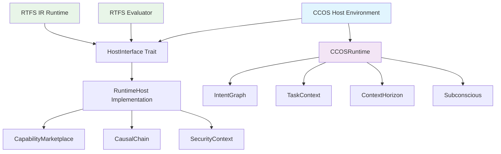

# RTFS-CCOS Runtime Architecture Integration

**Purpose:** Document the architectural relationship between RTFS runtime components and CCOS host environment

---

## Executive Summary

The RTFS runtime system consists of multiple execution engines (AST evaluator and IR runtime) that integrate with the CCOS (Cognitive Computing Operating System) host environment through a well-defined interface abstraction. This document clarifies the roles, relationships, and integration patterns between these components.

## Architecture Overview

### High-Level Component Relationship



---

## Core Distinction: CCOS vs RTFS Runtimes

### RTFS Runtime System

The **RTFS Runtime** is the execution engine for RTFS (Reasoning Task Flow Specification) language code. It consists of:

#### 1. **AST Evaluator** (`src/runtime/evaluator.rs`)
- **Purpose**: Tree-walking interpreter for RTFS AST nodes
- **Characteristics**:
  - Direct AST interpretation
  - Complete feature support (30+ stdlib functions)
  - Battle-tested and production-ready
  - Symbol table lookups for variable resolution
  - Runtime type checking and validation

#### 2. **IR Runtime** (`src/runtime/ir_runtime.rs`)
- **Purpose**: High-performance execution engine using intermediate representation
- **Characteristics**:
  - Pre-compiled IR with type information
  - 2-26x faster execution than AST
  - 47.4% memory reduction
  - Pre-resolved variable bindings
  - Advanced optimization passes

#### Key RTFS Runtime Features:
- **Pure by Design**: No dangerous operations built-in
- **Controlled External Access**: Only through `(call capability-id ...)` function
- **Security Boundaries**: All external operations go through CCOS host
- **Language Semantics**: Expression evaluation, pattern matching, closures

### CCOS Runtime System

The **CCOS Runtime** is the cognitive infrastructure that surrounds and enhances RTFS execution:

#### Core Components:
- **Intent Graph**: Persistent storage of user intents and goals
- **Causal Chain**: Immutable ledger of all actions and decisions
- **Task Context**: Context propagation across execution boundaries
- **Context Horizon**: LLM context window management
- **Subconscious**: Background analysis and wisdom distillation

#### CCOS Runtime Responsibilities:
- **Cognitive Context**: Managing user intents and goals
- **Action Tracking**: Recording all system interactions
- **Capability Management**: Providing external system access
- **Security Enforcement**: Controlling what RTFS can access
- **Context Management**: Maintaining execution context across calls

---

## Integration Architecture

### 1. Host Interface Abstraction

The `HostInterface` trait (`src/runtime/host_interface.rs`) provides the contract between RTFS runtime and CCOS host:

```rust
pub trait HostInterface: std::fmt::Debug {
    /// Sets execution context for capability tracking
    fn set_execution_context(&self, plan_id: String, intent_ids: Vec<String>);
    
    /// Clears execution context after completion
    fn clear_execution_context(&self);
    
    /// Execute capability through CCOS infrastructure
    fn execute_capability(&self, name: &str, args: &[Value]) -> RuntimeResult<Value>;
}
```

**Design Benefits:**
- **Decoupling**: RTFS runtime doesn't depend on specific CCOS implementation
- **Testability**: Mock implementations for unit testing
- **Flexibility**: Different host environments (development, production, testing)

### 2. RuntimeHost Implementation

The `RuntimeHost` (`src/runtime/host.rs`) bridges RTFS runtime to CCOS:

```rust
pub struct RuntimeHost {
    pub capability_marketplace: Arc<CapabilityMarketplace>,
    pub causal_chain: Rc<RefCell<CausalChain>>,
    pub security_context: RuntimeContext,
    execution_context: RefCell<Option<ExecutionContext>>,
}
```

**Key Responsibilities:**
- **Security Enforcement**: Validates capability access permissions
- **Causal Chain Integration**: Records all actions with proper provenance
- **Async/Sync Bridge**: Handles async capabilities in sync runtime context
- **Context Management**: Maintains execution context from CCOS plans

### 3. Execution Flow Integration

#### Step-by-Step Execution:

1. **CCOS Plan Initiation**:
   ```rust
   // CCOS creates execution context
   host.set_execution_context(plan_id, intent_ids);
   ```

2. **RTFS Runtime Selection**:
   ```rust
   // Choose execution strategy
   let runtime = match strategy {
       RuntimeStrategy::Ast => TreeWalkingStrategy::new(evaluator),
       RuntimeStrategy::Ir => IrStrategy::new(module_registry),
       RuntimeStrategy::IrWithFallback => // Hybrid approach
   };
   ```

3. **RTFS Code Execution**:
   ```rust
   // Runtime executes RTFS expressions
   let result = runtime.execute(&ast)?;
   ```

4. **Capability Invocation**:
   ```rust
   // When RTFS calls (call "http-get" url)
   host.execute_capability("http-get", &[url_value])
   ```

5. **CCOS Processing**:
   - Security validation through `RuntimeContext`
   - Capability execution via `CapabilityMarketplace`
   - Action recording in `CausalChain`
   - Result return to RTFS runtime

6. **Context Cleanup**:
   ```rust
   host.clear_execution_context();
   ```

---

## Runtime Strategy Selection

### Strategic Architecture Decision

The system implements a flexible runtime strategy pattern allowing different execution engines:

```rust
pub enum RuntimeStrategy {
    Ast,                // Stable, feature-complete
    Ir,                 // High-performance, optimized
    IrWithFallback,     // IR with AST fallback
}
```

### Selection Criteria:

| Scenario | Recommended Strategy | Rationale |
|----------|---------------------|-----------|
| Development | `Ast` | Complete debugging, all features |
| Production (Complex) | `IrWithFallback` | Performance + reliability |
| Production (Simple) | `Ir` | Maximum performance |
| Testing | `Ast` | Predictable, well-tested |

---

## Security Architecture

### RTFS Security Model

**Core Principle**: RTFS is "secure by design" - dangerous operations are never implemented:

```rust
// RTFS code can only interact with outside world through:
(call "capability-id" arg1 arg2 ...)
```

### CCOS Security Enforcement

The `RuntimeContext` enforces security at the host level:

```rust
pub struct RuntimeContext {
    // Security policies and allowed capabilities
}

impl RuntimeContext {
    pub fn is_capability_allowed(&self, capability: &str) -> bool {
        // Security validation logic
    }
}
```

**Security Flow:**
1. RTFS code requests capability via `(call ...)`
2. Runtime forwards to `host.execute_capability(...)`
3. Host validates against `security_context`
4. If allowed, executes via `capability_marketplace`
5. All actions recorded in `causal_chain`

---

## Performance Characteristics

### AST Runtime Performance Profile:
- **Expression evaluation**: ~1000ns baseline
- **Symbol resolution**: ~50ns per lookup
- **Memory allocation**: ~200 bytes per context
- **Features**: 100% language support

### IR Runtime Performance Profile:
- **Expression evaluation**: ~40-380ns (2-26x faster)
- **Binding resolution**: ~5ns (pre-resolved)
- **Memory allocation**: ~105 bytes (47.4% reduction)
- **Features**: 95%+ language support (growing)

### CCOS Integration Overhead:
- **Capability call setup**: ~10-50μs
- **Security validation**: ~1-5μs
- **Causal chain recording**: ~5-10μs
- **Context management**: ~1-3μs

---

## Development Guidelines

### For RTFS Runtime Development:

1. **Use HostInterface**: Never directly access CCOS components
2. **Maintain Purity**: RTFS runtime should have no external dependencies
3. **Error Propagation**: Use `RuntimeResult<Value>` consistently
4. **Performance Focus**: Optimize hot paths, measure everything

### For CCOS Integration:

1. **Context Management**: Always set/clear execution context
2. **Security First**: Validate all capability access
3. **Record Everything**: Use causal chain for full audit trail
4. **Async Handling**: Manage async/sync boundaries carefully

### For Host Implementation:

1. **Implement HostInterface**: Follow the contract exactly
2. **Handle Panics**: Never panic in capability execution
3. **Resource Management**: Clean up resources properly
4. **Error Reporting**: Provide clear error messages

---

## Testing Strategy

### Unit Testing:
- **Mock HostInterface**: Test RTFS runtime in isolation
- **Stub Capabilities**: Test with fake capability implementations
- **Performance Benchmarks**: Measure runtime characteristics

### Integration Testing:
- **Full Stack**: Test RTFS + CCOS together
- **Security Validation**: Test capability restrictions
- **Error Handling**: Test failure scenarios

### Performance Testing:
- **Runtime Comparison**: AST vs IR performance
- **CCOS Overhead**: Measure integration costs
- **Memory Profiling**: Track memory usage patterns

---

## Future Evolution

### Short-term (1-3 months):
- **IR Feature Parity**: Complete IR runtime feature set
- **Performance Optimization**: Advanced optimization passes
- **Security Hardening**: Enhanced capability validation

### Medium-term (3-6 months):
- **JIT Compilation**: Explore dynamic compilation
- **Parallel Execution**: True parallel processing
- **Advanced Analytics**: Enhanced causal chain analysis

### Long-term (6+ months):
- **Self-Hosting**: RTFS 2.0 implementing CCOS logic
- **Distributed Execution**: Multi-node capability execution
- **ML Integration**: Native machine learning capabilities

---

## References

- [RTFS Design Rationale](../RTFS_DESIGN_RATIONALE.md)
- [CCOS Runtime Integration Guide](../RUNTIME_INTEGRATION_GUIDE.md)
- [Runtime Architecture Strategy](../../rtfs-1.0/implementation/RUNTIME_ARCHITECTURE_STRATEGY.md)
- [IR Implementation Report](../../rtfs-1.0/implementation/IR_IMPLEMENTATION_FINAL_REPORT.md)

---

*Document Version: 1.0*  
*Last Updated: July 17, 2025*  
*Next Review: August 17, 2025*
