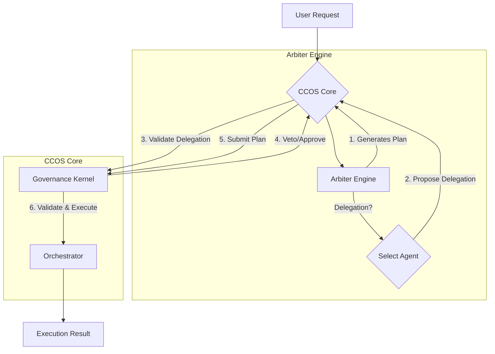

# Governance Kernel Integration Plan

**Status:** Draft  
**Date:** 2025-11-06  
**Author:** GitHub Copilot

## 1. Overview

This document outlines the plan to fully integrate the CCOS `GovernanceKernel` with the `Arbiter` layer, ensuring that all plans and delegation decisions are subject to governance before execution. This addresses a critical gap in the current architecture where the security and policy enforcement layer is bypassed.

## 2. Problem Statement

The `GovernanceKernel` is designed to be the root of trust, but it is not currently connected to the components that make decisions:

1.  **No Plan Validation**: Plans generated by `Arbiter` and `DelegatingArbiter` are not passed through `GovernanceKernel::validate_and_execute`.
2.  **No Delegation Veto**: The `DelegatingArbiter` does not use `GovernanceKernel::validate_delegation` to get its agent selections approved, bypassing policy checks.

## 3. Proposed Architectural Changes

We will introduce a central request-processing pipeline, likely within `ccos_core` or a similar top-level component, that enforces the correct sequence of operations.

### High-Level Flow

### Implementation Steps

#### Step 1: Modify `DelegatingArbiter` to Support Veto

The `DelegatingArbiter` needs to be aware of the `GovernanceKernel` so its decisions can be validated.

-   **File to Edit**: `ccos/src/arbiter/delegating_arbiter.rs`
-   **Changes**:
    1.  Add a `governance_kernel: Arc<GovernanceKernel>` field to the `DelegatingArbiter` struct.
    2.  Update its `new()` function to accept the kernel.
    3.  In `generate_delegated_plan` (or a similar method), after an agent is selected, call `governance_kernel.validate_delegation()`.
    4.  If the kernel returns an `Err`, the arbiter must handle the veto by falling back to a different strategy (e.g., select a different agent or generate a direct plan).

#### Step 2: Create the Central `process_request` Pipeline

A new public function on `CCOSCore` (or a similar struct) will orchestrate the components.

-   **File to Edit**: `ccos/src/ccos_core.rs` (or a new file `ccos/src/request_processor.rs`)
-   **Changes**:
    1.  Define a `process_request(natural_language: &str)` function.
    2.  This function will hold references to the `ArbiterFactory`, `GovernanceKernel`, and `Orchestrator`.
    3.  It will call the arbiter to produce a plan.
    4.  It will then pass the resulting plan to `governance_kernel.validate_and_execute()`.
    5.  The final `ExecutionResult` will be returned.

This ensures the `Arbiter` and `GovernanceKernel` are decoupled, with the core pipeline enforcing their interaction.

## 4. Advanced Governance: Governing the Arbiter Itself

To achieve full architectural purity, the Arbiter's own use of external LLMs should also be subject to governance. This treats the cognitive process itself as a governable action, bringing cost, data privacy, and provider choice under policy control.

### Implementation

#### Step 3: Model LLM Calls as Governed Capabilities

-   **File to Edit**: `ccos/src/capability_marketplace/mod.rs` and `ccos/src/arbiter/delegating_arbiter.rs`
-   **Changes**:
    1.  **Register LLM Providers as Capabilities**: In the `CapabilityMarketplace`, register different LLM providers (e.g., Claude, OpenAI, local models) as distinct capabilities (e.g., `:llm.claude.generate-plan`, `:llm.local.generate-plan`).
    2.  **Refactor `DelegatingArbiter`**: Instead of directly calling an `LlmProvider`, the arbiter will construct a "meta-plan" to request a planning operation from an LLM capability.
    3.  **Submit Meta-Plan for Governance**: This simple plan (e.g., `(plan (step "Generate Plan" (call :llm.claude.generate-plan ...)))`) is submitted to the `GovernanceKernel` *before* the main plan is even generated.
    4.  **Handle Result**: If the GK approves, the `Orchestrator` executes the meta-plan, and the result (the user-facing plan) is returned to the Arbiter. The Arbiter then proceeds to submit this final plan for its own validation, as described in Step 2.

## 5. Rationale

-   **Security**: This change enforces the "secure by default" principle of CCOS by ensuring no action is taken without governance oversight.
-   **Decoupling**: It keeps the `Arbiter`'s role focused on reasoning and planning, while the `GovernanceKernel` remains the single point of policy enforcement.
-   **Clarity**: It establishes a clear, auditable flow for every request processed by the system.
