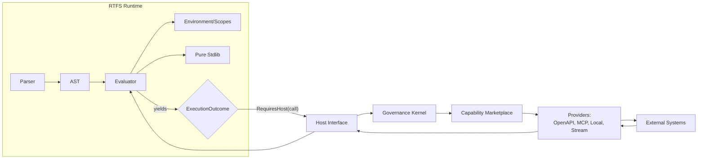
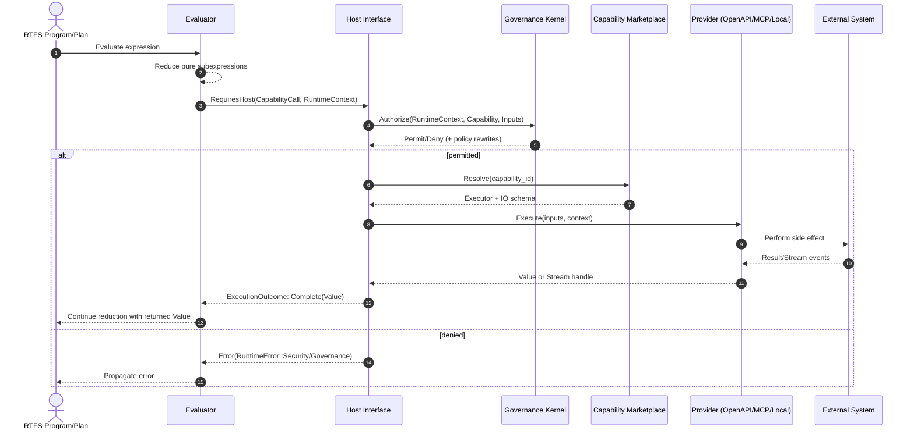

# RTFS 2.0 Specifications (New)

This directory contains the **rewritten RTFS 2.0 language specifications** based on the actual implemented codebase after the CCOS-RTFS decoupling migration.

## Purpose

The original specifications in `../specs/` were written before the decoupling and did not accurately reflect the final architecture. These new specifications are derived from:

- **Codebase Analysis**: Direct examination of AST, runtime, and grammar files
- **Architectural Clarity**: Understanding gained from CCOS-RTFS decoupling
- **Implementation Truth**: Specifications match what was actually built

## Philosophy

RTFS 2.0 is a **pure functional language** designed to be securely hosted by a governing runtime like CCOS. It operates on a principle of a **strict host boundary**:

- **Pure Kernel**: All RTFS code is referentially transparent. It computes values and has no direct access to the outside world.
- **Host Interaction**: Side effects and external actions are handled by the host (e.g., CCOS) through a formal `ExecutionOutcome::RequiresHost` mechanism. RTFS yields control, and the host executes the requested action.
- **Governed Execution**: The host is responsible for security, governance, and auditing of all external effects requested by RTFS code.
- **Minimal & Extensible**: The language has a small core, but its homoiconic nature allows it to be extended with powerful metaprogramming features.

## Design Purpose: LLM-Native Task Execution

RTFS 2.0 is architected as a **language designed for LLMs to generate data structures and execution logic** that represents **task fulfillment workflows for user intents**:

### LLM-Driven Code Generation
- **Pure Kernel**: Safe environment for LLM-generated logic without side effect concerns
- **S-Expression Syntax**: Uniform, programmable structure that LLMs can reliably parse and generate
- **Type System**: Safety guardrails that catch LLM generation errors while remaining optional
- **Homoiconic Design**: Code-as-data enables LLMs to analyze and transform their own outputs

### Enabling Governed Task Execution
RTFS is designed to be a safe execution target for LLM-generated code. Its architecture enables a host system like CCOS to provide:
- **Clear Host Boundary**: A formal separation between pure computation (RTFS) and external actions (host).
- **Governed Capabilities**: RTFS code requests actions from the host, which is responsible for governing access to external services.
- **Auditable Execution**: The host can build a complete audit trail (like CCOS's Causal Chain) of the workflow, as every effectful step is an explicit request from RTFS.
- **Security Validation**: The host can validate every requested action against security policies before execution.

### Human-LLM-System Synergy
- **Humans Specify**: High-level intents in natural language
- **LLMs Generate**: Executable RTFS workflows that fulfill those intents
- **CCOS Governs**: All external interactions with security and auditability
- **Systems Execute**: Verifiable autonomy through pure functional execution

This creates a **conversational programming paradigm** where LLMs can be "programmed by conversation" to generate trustworthy, autonomous task execution logic.

## Specification Structure

### 00-philosophy.md
Core principles and architectural foundations of RTFS 2.0.

### 01-syntax-and-grammar.md
Complete syntax reference, grammar rules, and language constructs.

### 02-evaluation-and-runtime.md
Evaluation model, scoping rules, and runtime architecture.

### 13-type-system.md (UPDATED - Formal Specification)
**Complete formal type system** with subtyping, bidirectional type checking, soundness proofs, and theoretical foundations. Includes:
- Formal type grammar and inference rules
- Subtyping relation with 12 axioms
- Progress and Preservation theorems
- Algorithmic type checking specification
- References to Pierce, Cardelli, Davies & Pfenning

### 04-host-boundary.md
Host interaction mechanisms and the formal model for requesting external actions.

### 05-macro-system.md
Compile-time metaprogramming, quasiquote, and hygienic macros.

### 06-standard-library.md
Comprehensive function reference for pure and impure operations.

### 07-architecture-analysis.md
Critical analysis of strengths, weaknesses, and future directions.

## Key Architectural Insights

### Pure Kernel Design
RTFS maintains **referential transparency** by yielding control to CCOS for all side effects. This enables:
- Deterministic testing and reasoning
- Safe composition of pure and effectful code
- Mandatory security governance

### LLM-Native Architecture
The design prioritizes **LLM comprehension and generation**:
- **S-Expression Syntax**: Reduces generation errors through uniform structure
- **Host Boundary Clarity**: Makes intent fulfillment logic explicit and auditable
- **Type System Safety**: Provides guardrails for LLM-generated code
- **Macro Extensibility**: Enables LLMs to create domain-specific constructs

### Host Boundary Mechanism
The `ExecutionOutcome` enum implements **control flow inversion**:
- `Complete(value)`: Pure computation finished
- `RequiresHost(call)`: Host intervention needed

### Security by Design
Every host call includes:
- **Capability ID**: Fully qualified operation identifier
- **Security Context**: Agent, intent, and permission information
- **Causal Context**: Audit trail for governance
- **Metadata**: Performance and reliability hints

### Type System Approach
**Structural typing** with **runtime validation**:
- Optional type annotations
- Refinement types with logical predicates
- Union/intersection types for composition
- Gradual adoption without breaking changes

## Relationship to CCOS

RTFS serves as CCOS's **computational substrate**:

- **Pure Logic Layer**: Deterministic computation
- **Capability Marketplace**: Service discovery and invocation
- **Governance Kernel**: Security and audit infrastructure
- **Causal Chain**: Immutable audit trails

## Implementation Status

These specifications reflect the **implemented architecture** as of the decoupling migration. Key components:

- ✅ **AST**: Comprehensive expression types
- ✅ **Runtime**: Yield-based host boundary
- ✅ **Type System**: Structural types with predicates
- ✅ **Macro System**: Basic compile-time transformation
- ✅ **Standard Library**: Pure and impure function categories
- ✅ **Host Integration**: CCOS capability invocation

## Future Directions

The architecture analysis identifies areas for improvement:

### LLM-Driven Development Priorities
- **Type System Simplification**: Reduce complexity for reliable LLM generation
- **Host Call Optimization**: Streamline governance for common task patterns
- **Error Handling Standardization**: Predictable patterns for LLM-generated code
- **Intent-Aware Modules**: Code organization around task boundaries

### Performance & Usability
- **Host Boundary Optimization**: Reduce latency for LLM-generated workflows
- **Evaluation Speed**: Fast feedback for interactive LLM development
- **Memory Efficiency**: Optimize for LLM context window constraints

### Ecosystem Growth
- **LLM Integration Tools**: Code generation assistance and validation
- **Task Templates**: Reusable patterns for common intent types
- **Workflow Composition**: High-level constructs for combining task steps

## Reading Order

For new readers:
1. Start with **00-philosophy.md** for conceptual foundation
2. Read **01-language-overview.md** for language basics
3. Study **04-evaluation-and-runtime.md** for execution model
4. Read **13-type-system.md** for the formal type system specification
5. Explore **07-host-boundary-and-capabilities.md** for CCOS integration
6. Review **11-architecture-analysis.md** for LLM-driven development insights

For LLM developers:
- Focus on **02-syntax-and-grammar.md** for generation patterns
- Study **07-host-boundary-and-capabilities.md** for task execution
- Review **10-standard-library.md** for available operations
- See **[Type Checking Guide](../guides/type-checking-guide.md)** for practical type usage

## Contributing

When modifying RTFS:
1. Update these specifications to reflect changes
2. Ensure specifications match implementation
3. Add rationale for architectural decisions
4. Include performance and security implications

## Migration from RTFS 1.x

RTFS 2.0 represents a significant evolution:
- **Purity Enforcement**: All side effects must go through host
- **Type System**: Structural typing replaces nominal typing
- **Security**: Mandatory governance for all external operations
- **Simplicity**: Reduced core language with host extensibility

Migration tools and compatibility layers should be developed to ease transition.

## RTFS 2.0 architecture (precise view)

This section gives a precise, implementation-grounded view of RTFS 2.0, focusing on runtime architecture, purity, and the Host interaction that mediates all effects and mutations.

### Core components

- Parser and Grammar
	- Grammar: `rtfs_compiler/src/rtfs.pest`
	- Produces a well-typed AST for S-expressions, symbols, literals, lists, maps, lambdas, application, conditionals, and capability calls.
- AST and Values
	- AST: canonical representation of parsed RTFS forms
	- Values: runtime representation (`rtfs::runtime::values::Value`) for numbers, strings, lists, maps, closures, and typed records
- Type System (optional, structural)
	- Type expressions (`rtfs::ast::TypeExpr`) annotate inputs/outputs (capabilities, plans)
	- Bidirectional checking; runtime guards for safety when annotations are present
- Evaluator
	- Pure evaluator that reduces expressions to values
	- Does not perform side effects; yields to Host via control values
- Environment/Scopes
	- Lexically scoped frames for symbol resolution
	- Immutable-by-default evaluation; definitions introduce bindings without mutating external systems
- Standard Libraries
	- Secure stdlib: pure, deterministic functions (math, logic, data)
	- Insecure/effectful ops are not executed by the evaluator directly; they route through Host
- Host Boundary
	- A strict interface that performs all effects on behalf of RTFS (I/O, network, filesystem, capability calls, state)
	- Gatekept by Governance + Marketplace

### Runtime component diagram



Key property: the evaluator is pure. Any effectful intent (HTTP call, file write, model inference, tool use, long-running stream) is represented as an explicit Host request. The Host performs the action under policy and feeds results back into evaluation.

### Execution flow (sequence)



### Effect and mutation discipline

- Purity
	- RTFS evaluation is referentially transparent: given the same inputs, pure computation yields the same outputs.
	- No hidden I/O or mutation; effects are first-class requests to the Host.
- Mutations
	- Language-level mutations (e.g., updating a map, building a new list) create new values; original values remain unchanged (persistent data structures).
	- External mutations (filesystem, network, databases, agent state) are performed only by the Host after governance approval.
- State
	- Long-lived or cross-invocation state is hosted by capabilities (e.g., a stateful agent or session) and accessed through governed Host calls.
	- The evaluator itself holds only ephemeral evaluation state (environments/frames).

### Contracts: input/output schemas

- Capabilities and plans may declare `input_schema`/`output_schema` using `TypeExpr`.
- At runtime, the Host and/or executor can validate inputs/outputs, providing strong contracts for tool use and safety.

### Streaming, progress, cancellation

- RTFS supports streaming capabilities via the marketplace (duplex/bidirectional configs).
- The Host mediates:
	- Progress events: surfaced to the orchestrator/UI
	- Cancellation: propagated to providers safely
	- Backpressure and resource limits

### Error semantics (concise)

- Categories
	- Parse/Type errors (compile-time)
	- Runtime errors (arith, arity, unknown symbol)
	- Governance denials (policy/security)
	- Provider errors (network, protocol)
- Behavior
	- Errors are values that short-circuit to the caller unless captured
	- Host returns structured errors; evaluator preserves purity by not partially applying effects

### Minimal examples

Pure computation:

```clojure
;; Add two numbers
(+ 1 2) ;=> 3
```

Capability definition (conceptual RTFS form):

```clojure
(capability "http/example.get"
	:name "Example GET"
	:input-schema {:url :string}
	:output-schema {:status :int :body :string}
	:implementation
	(fn [input] (host/call :http.get {:url (. input :url)})))
```

Invocation:

```clojure
(http/example.get {:url "https://example.com"})
; Evaluator yields RequiresHost(capability_call)
; Host authorizes and calls provider; returns {:status 200 :body "..."}
```

Plan-as-capability (using `:implementation` plan body):

```clojure
(capability "demo/pipeline"
	:name "Demo pipeline"
	:input-schema {:x :int}
	:output-schema :int
	:implementation
	(fn [input]
		(let [a (+ (. input :x) 1)
			  b (* a 2)]
			b)))
```

This registers a local capability whose handler evaluates the pure RTFS plan body with an `input` binding; any effects inside would route through the Host.

### Security and governance

- Every Host call is accompanied by a `RuntimeContext` (agent identity, intent, plan, permissions, provenance) used by the Governance Kernel.
- Policies can:
	- Allow/deny
	- Require human approval (interactive)
	- Rewrite/limit inputs (rate limits, redactions)
	- Elevate only under attestation
- The Causal Chain records capability calls/results for audit.

### Practical implications

- Deterministic core enables reliable testing and replay of LLM-generated programs.
- Capability contracts (schemas) and governance policies form strong guardrails for autonomous workflows.
- The Host boundary creates a clean seam to integrate new providers (OpenAPI, MCP, A2A, streaming) without changing the language core.

### Performance trade-offs and mitigations

Introducing the Host boundary adds deliberate indirections (value marshaling, authorization checks, marketplace resolution, provider dispatch, and often an external network hop). This increases latency compared to calling an effect directly from the evaluator. We accept this overhead to prioritize auditability, security, reproducibility, and centralized policy control. The result is a runtime where every effect is observable, governable, and attributable in the Causal Chain.

Mitigations (when performance matters):
- Reduce crossings: fuse pure logic on the evaluator side; group related effects into a single capability; prefer bulk endpoints.
- Stream instead of polling: use streaming providers to reduce round-trips and enable backpressure-aware progress.
- Cache smartly: cache capability discovery and policy decisions with short TTLs; reuse authenticated sessions/clients.
- Co-locate components: run Host and providers in-process for low-latency paths; minimize (de)serialization where safe.
- Push down filters: move filtering/aggregation to providers when permissible to shrink payloads.
- Asynchrony and batching: pipeline independent host calls; batch small calls into a single governed action.

---

If you want deeper internals, see also:
- `rtfs_compiler/src/runtime/secure_stdlib.rs` (pure functions)
- `rtfs_compiler/src/runtime/stdlib.rs` (extended library)
- `rtfs_compiler/src/runtime/security.rs` (RuntimeContext)
- `ccos/src/capability_marketplace/types.rs` (providers, streaming)
- `ccos/src/environment.rs` (plan-to-capability registration and Host wiring)
</content>
<parameter name="filePath">/home/mandubian/workspaces/mandubian/ccos/docs/rtfs-2.0/specs-new/README.md