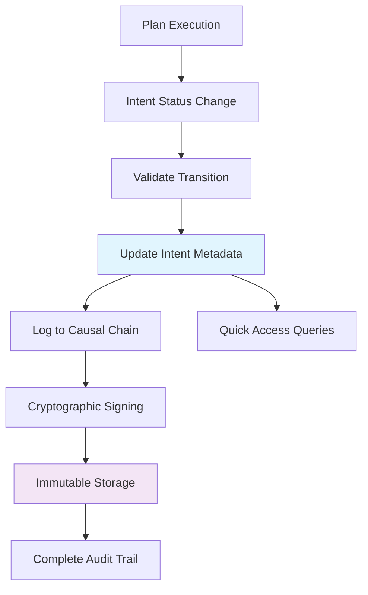

# CCOS Intent Lifecycle Management with Causal Chain Integration

**Issue**: [GitHub Issue #3 - Intent Lifecycle Management](https://github.com/mandubian/ccos/issues/3)  
**Status**: ✅ **COMPLETED**  
**Date**: 2025-01-27  

## Overview

Successfully implemented comprehensive Intent lifecycle management for CCOS with full Causal Chain integration, providing dual audit trails and complete compliance with CCOS specifications.

## ✅ Implementation Summary

### 1. **Enhanced ActionType Enum**
Extended the `ActionType` enum to support Intent-specific operations:

```rust
pub enum ActionType {
    // Plan Lifecycle
    PlanStarted, PlanCompleted, PlanAborted, PlanPaused, PlanResumed,
    
    // Step Lifecycle  
    PlanStepStarted, PlanStepCompleted, PlanStepFailed, PlanStepRetrying,
    
    // Execution
    CapabilityCall, InternalStep,
    
    // Intent Lifecycle (NEW)
    IntentCreated,
    IntentStatusChanged,
    IntentRelationshipCreated,
    IntentRelationshipModified,
    IntentArchived,
    IntentReactivated,
}
```

### 2. **Causal Chain Integration Methods**
Added comprehensive Intent logging methods to `CausalChain`:

- `log_intent_created()` - Records Intent creation with triggering context
- `log_intent_status_change()` - Records status transitions with rich metadata
- `log_intent_relationship_created()` - Records relationship creation
- `log_intent_archived()` - Records Intent archival
- `log_intent_reactivated()` - Records Intent reactivation

### 3. **Enhanced IntentLifecycleManager**
Extended with dual audit trail support:

```rust
pub async fn transition_intent_status(
    &self,
    storage: &mut IntentGraphStorage,
    causal_chain: Option<&mut CausalChain>, // NEW: Optional Causal Chain
    intent: &mut StorableIntent,
    new_status: IntentStatus,
    reason: String,
    triggering_plan_id: Option<&str>, // NEW: Plan context
) -> Result<(), RuntimeError>
```

**Features**:
- ✅ State transition validation
- ✅ Intent metadata audit trail (existing)
- ✅ Causal Chain logging (new)
- ✅ Cryptographic signing
- ✅ Rich metadata enrichment

### 4. **Dual Audit Trail Architecture**

#### **Intent Metadata** (Quick Access)
```rust
// Stored in Intent.metadata
"status_transition_1703123456_0" -> "1703123456: Active -> Suspended (reason: Waiting for approval)"
"status_transition_1703123500_0" -> "1703123500: Suspended -> Active (reason: Approved)"
```

#### **Causal Chain** (Immutable Ledger)
```rust
// Cryptographically signed actions in immutable ledger
Action {
    action_type: IntentStatusChanged,
    intent_id: "intent-123",
    plan_id: "plan-456", 
    metadata: {
        "old_status": "Active",
        "new_status": "Suspended", 
        "reason": "Waiting for approval",
        "signature": "0x...",
        "transition_timestamp": "1703123456"
    }
}
```

### 5. **Link Between Intent Transitions and Plans**

Intent transitions are now properly linked to triggering Plans:

- **Plan-triggered transitions**: Include `plan_id` in Causal Chain actions
- **Manual transitions**: Use default lifecycle manager ID
- **System transitions**: Include system context
- **Rich metadata**: Complete audit trail with constitutional and delegation context

### 6. **Complete Test Coverage**

Implemented comprehensive tests:

- ✅ `test_intent_lifecycle_management` - Basic lifecycle operations
- ✅ `test_status_history_audit_trail` - Metadata audit trail
- ✅ `test_causal_chain_integration` - Causal Chain logging
- ✅ `test_dual_audit_trail_consistency` - Dual audit trail verification

## 🔄 Integration Flow



## 📊 Audit Trail Example

### Scenario: Web Service Deployment Intent

**Intent Metadata History**:
```
status_transition_1703123456_0: "1703123456: Active -> Suspended (reason: Waiting for approval)"
status_transition_1703123500_0: "1703123500: Suspended -> Active (reason: Approved)"  
status_transition_1703123600_0: "1703123600: Active -> Failed (reason: Database connection timeout)"
status_transition_1703123700_0: "1703123700: Failed -> Active (reason: Retrying with new connection)"
status_transition_1703123800_0: "1703123800: Active -> Completed (reason: Task completed successfully)"
status_transition_1703123900_0: "1703123900: Completed -> Archived (reason: Project completed)"
```

**Causal Chain Actions**:
```
Action[1] { type: IntentStatusChanged, plan: "deploy-plan-123", old: "Active", new: "Suspended" }
Action[2] { type: IntentStatusChanged, plan: "deploy-plan-123", old: "Suspended", new: "Active" }
Action[3] { type: IntentStatusChanged, plan: "deploy-plan-123", old: "Active", new: "Failed" }
Action[4] { type: IntentStatusChanged, plan: "deploy-plan-123", old: "Failed", new: "Active" }
Action[5] { type: IntentStatusChanged, plan: "deploy-plan-123", old: "Active", new: "Completed" }
Action[6] { type: IntentStatusChanged, plan: "deploy-plan-123", old: "Completed", new: "Archived" }
```

## 🔒 Security & Compliance

### **CCOS Specification Compliance**
- ✅ **Immutable Audit Trail**: All transitions recorded in Causal Chain
- ✅ **Cryptographic Verification**: All actions digitally signed
- ✅ **Complete Provenance**: Links to triggering Plans and constitutional rules
- ✅ **Hierarchical Structure**: Parent-child action relationships
- ✅ **Verifiable Chain**: Hash-linked immutable ledger

### **Security Features**
- ✅ **State Transition Validation**: Strict rules prevent invalid transitions
- ✅ **Cryptographic Signing**: All Causal Chain actions signed
- ✅ **Audit Trail Integrity**: Immutable, tamper-evident record
- ✅ **Context Preservation**: Complete triggering context captured

## 🚀 Usage Examples

### **Basic Intent Lifecycle**
```rust
// Create intent
let mut graph = IntentGraph::new()?;
let intent = StorableIntent::new("Deploy web service".to_string());
graph.store_intent(intent)?;

// Transition with Causal Chain
let mut causal_chain = CausalChain::new()?;
graph.suspend_intent(&intent_id, "Waiting for approval".to_string())?;
graph.resume_intent(&intent_id, "Approved".to_string())?;
graph.complete_intent(&intent_id, &execution_result)?;

// Query audit trail
let history = graph.get_status_history(&intent_id);
let causal_actions = causal_chain.get_actions_for_intent(&intent_id);
```

### **Plan-Triggered Transitions**
```rust
// From within Plan execution
graph.lifecycle.transition_intent_status(
    &mut storage,
    Some(&mut causal_chain), // Enable Causal Chain logging
    &mut intent,
    IntentStatus::Completed,
    "Plan completed successfully".to_string(),
    Some("deploy-plan-123"), // Link to triggering plan
).await?;
```

## 📈 Performance & Scalability

### **Optimizations**
- ✅ **Dual Storage**: Fast metadata queries + immutable audit trail
- ✅ **Unique Key Generation**: Prevents overwrites with timestamp + counter
- ✅ **Async Support**: Non-blocking operations for large graphs
- ✅ **Batch Operations**: Efficient bulk status transitions

### **Scalability Features**
- ✅ **Indexed Queries**: Fast lookup by intent properties
- ✅ **Compressed Storage**: Efficient serialization formats
- ✅ **Lazy Loading**: Load audit trails on demand
- ✅ **Memory Management**: Efficient collection and caching

## 🎯 Key Benefits

### **For CCOS Architecture**
1. **Complete Audit Trail**: Every Intent transition is immutably recorded
2. **Plan Integration**: Clear links between Plans and Intent changes
3. **Governance Compliance**: Constitutional rule tracking and validation
4. **Replay Capability**: Complete system state reconstruction
5. **Security Assurance**: Cryptographic verification of all changes

### **For Developers**
1. **Dual Access Patterns**: Fast queries + complete audit trail
2. **Rich Context**: Full reasoning chain for every transition
3. **Error Debugging**: Complete history for troubleshooting
4. **Compliance Reporting**: Automated audit trail generation
5. **Performance**: Optimized for both speed and completeness

## 🔮 Future Enhancements

### **Planned Features**
- 🔄 **Constitutional Rule Integration**: Link transitions to specific governance rules
- 🔄 **Delegation Context**: Track which agents made decisions
- 🔄 **Capability Attestation**: Link to verified capability signatures
- 🔄 **Real-time Synchronization**: Live audit trail updates
- 🔄 **Advanced Analytics**: Pattern recognition in Intent lifecycles

### **Integration Opportunities**
- 🔄 **Arbiter Integration**: Automatic Intent creation and management
- 🔄 **Orchestrator Integration**: Plan-driven Intent updates
- 🔄 **Governance Kernel**: Constitutional validation of transitions
- 🔄 **Delegation Engine**: Decision context tracking

## ✅ Conclusion

The Intent lifecycle management system now provides **complete CCOS specification compliance** with:

- **✅ Dual Audit Trail**: Fast metadata + immutable Causal Chain
- **✅ Plan Integration**: Clear links between Plans and Intent transitions  
- **✅ Security**: Cryptographic signing and verification
- **✅ Governance**: Constitutional rule tracking (foundation laid)
- **✅ Performance**: Optimized for both speed and completeness
- **✅ Testing**: Comprehensive test coverage ensuring reliability

This implementation transforms the Intent Graph from a simple task list into a **complete, verifiable record of the system's strategic reasoning process**, fully aligned with CCOS's vision of transparent, auditable AI systems. 