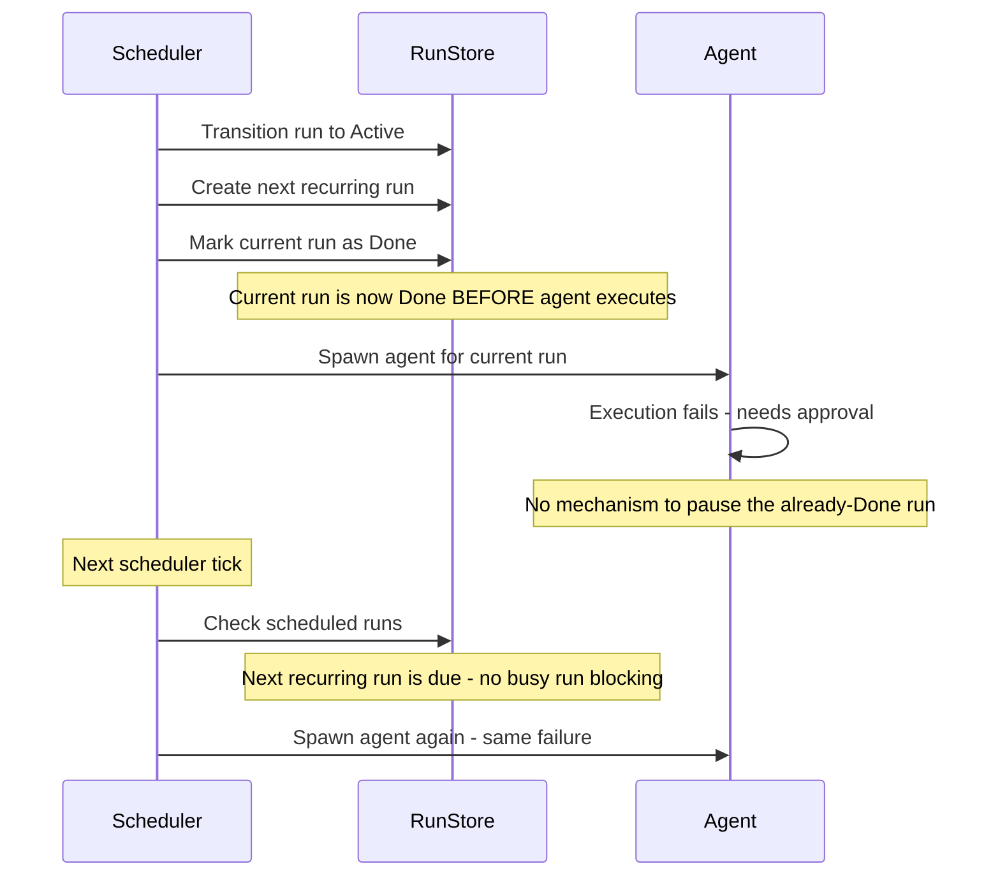
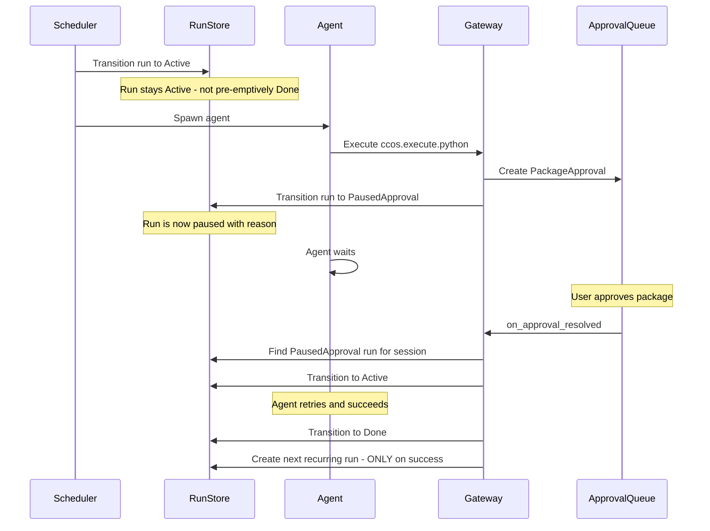

# Scheduled Task Approval Handling Fix Plan

## Problem Statement

When a new scheduled task is launched in ccos-chat-gateway spawning ccos-agent, and the first execution fails due to a dependency issue requiring approval (e.g., `ccos.python.execute` package approval), two issues occur:

1. **Issue 1:** The system continues to schedule the next retry before the approval is resolved
2. **Issue 2:** The approval is not visible in the queue for resolution

## Root Cause Analysis

### Issue 1: Premature Next Run Scheduling

**Location:** [`scheduler.rs:73-98`](ccos/src/chat/scheduler.rs:73)

The scheduler uses a "fire-and-forget" model for recurring tasks:



**The flaw:** Lines 77-98 create the next scheduled run and mark the current run as `Done` **BEFORE** the agent executes. This assumes success, so when the agent fails due to an approval requirement:
- The current run is already `Done`
- The next run is already `Scheduled`
- There's no mechanism to pause or block the next run

### Issue 2: Missing Approval in Queue

**Location:** [`mod.rs:1973-2025`](ccos/src/chat/mod.rs:1973) (ccos.execute.python)

The approval IS being created correctly:

```rust
if err_msg.contains("requires approval") {
    if let Some(pkg) = err_msg.split('\'').nth(1) {
        if let Some(queue) = &approval_queue {
            match queue.add_package_approval(pkg.to_string(), "python".to_string(), session_id).await {
                Ok(approval_id) => {
                    return Err(RuntimeError::Generic(format!(
                        "Package '{}' requires approval. Approval ID: {}\n\nUse: /approve {}",
                        pkg, approval_id, approval_id
                    )));
                }
                // ...
            }
        }
    }
}
```

**The problem:** The approval is created, but:
1. The run state is never transitioned to `PausedApproval` - the error is just returned
2. The scheduler has already marked the run as `Done` (for recurring tasks)
3. The gateway's [`on_approval_resolved()`](ccos/src/chat/gateway.rs:122) handler looks for `get_latest_paused_approval_run_id_for_session()` to resume, but finds nothing

**Why the approval seems invisible:**
- The approval exists in storage (`storage/approvals/pending/`)
- But there's no `PausedApproval` run to correlate it with the session
- The `on_approval_resolved()` handler can't find a run to resume
- The user sees the approval ID in the error message, but the system can't auto-resume

## Proposed Fix

### Fix Strategy: Defer Recurring Run Creation + Add Approval Pausing

The fix requires two coordinated changes:

#### Change 1: Scheduler - Defer Next Run Creation

**File:** [`ccos/src/chat/scheduler.rs`](ccos/src/chat/scheduler.rs)

**Current behavior:**
```rust
// 2. If this is a recurring schedule, create a NEW scheduled run for next iteration
//    and mark the current run as Done (fire-and-forget model for recurring tasks)
if is_recurring {
    if let Some(ref sched) = schedule {
        if let Some(next_time) = Self::calculate_next_run(sched) {
            let new_run = Run::new_scheduled(...);
            store.create_run(new_run);
            store.update_run_state(&run_id, RunState::Done); // PROBLEM: Too early
        }
    }
}
```

**Proposed fix:**
```rust
// 2. For recurring schedules, keep the run Active until completion
//    The next run will be created when the current run completes successfully
//    or when a paused run is resumed and completes
if is_recurring {
    // Store the schedule info for later use
    // Don't create next run yet, don't mark as Done
}
```

The next run creation should happen in one of these places:
1. **On successful completion:** When the run transitions to `Done` after successful execution
2. **On approval resolution:** When a paused run resumes and completes successfully

#### Change 2: Gateway - Detect Approval Errors and Pause Run

**File:** [`ccos/src/chat/gateway.rs`](ccos/src/chat/gateway.rs) - `execute_handler()`

**Current behavior:**
The execute handler returns the error to the agent but doesn't transition the run state.

**Proposed fix:**
Detect when a capability execution returns an approval-related error and transition the run to `PausedApproval`:

```rust
// In execute_handler, after capability execution fails:
if !success {
    let err_str = result.get("error")
        .and_then(|v| v.as_str())
        .unwrap_or("");
    
    // Check if this is an approval-related error
    if err_str.contains("requires approval") || err_str.contains("Approval ID:") {
        // Extract approval ID if present
        let approval_id = extract_approval_id_from_error(err_str);
        
        // Transition run to PausedApproval
        if let Some(run_id) = &correlated_run_id {
            let mut store = state.run_store.lock().unwrap();
            store.update_run_state(run_id, RunState::PausedApproval {
                reason: format!("Waiting for approval: {}", approval_id.unwrap_or_default()),
            });
        }
    }
}
```

#### Change 3: Gateway - Enhanced Approval Resolution

**File:** [`ccos/src/chat/gateway.rs`](ccos/src/chat/gateway.rs) - `on_approval_resolved()`

**Current behavior:**
For `PackageApproval`, only pushes a retry hint to the agent inbox.

**Proposed fix:**
1. Find the `PausedApproval` run for the session
2. Resume it by transitioning to `Active`
3. Create the next recurring run (if applicable) ONLY after successful completion



## Implementation Details

### Phase 1: Scheduler Changes

1. **Remove premature Done transition:**
   - Remove lines 94-95 in `scheduler.rs` that mark the run as `Done`
   - Keep the run as `Active` after spawning the agent

2. **Add run completion handler:**
   - Create a new method `on_run_completed()` that:
     - Transitions run to `Done`
     - Creates the next recurring run (if applicable)
   - Call this from `evaluate_run_completion()` when predicate is satisfied

### Phase 2: Gateway Execute Handler Changes

1. **Detect approval-required errors:**
   - Add error pattern detection in `execute_handler()`
   - Look for "requires approval" or "Approval ID:" in error messages

2. **Transition to PausedApproval:**
   - When approval error detected, transition run to `PausedApproval`
   - Include the approval ID in the reason for traceability

### Phase 3: Approval Resolution Changes

1. **Enhanced PackageApproval handling:**
   - In `on_approval_resolved()`, for `PackageApproval`:
     - Find the `PausedApproval` run for the session
     - Resume it by transitioning to `Active`
     - Push retry hint to agent inbox

2. **Add run_id to approval metadata:**
   - When creating package approval, include the `run_id` in metadata
   - This allows direct correlation between approval and run

### Phase 4: Run Completion Hook

1. **Add completion hook for recurring runs:**
   - When a run transitions to `Done` successfully:
     - Check if it's a recurring run
     - Calculate next run time
     - Create the next scheduled run

## Files to Modify

| File | Changes |
|------|---------|
| [`ccos/src/chat/scheduler.rs`](ccos/src/chat/scheduler.rs) | Remove premature Done transition, add completion hook |
| [`ccos/src/chat/gateway.rs`](ccos/src/chat/gateway.rs) | Detect approval errors, transition to PausedApproval, enhanced resolution |
| [`ccos/src/chat/mod.rs`](ccos/src/chat/mod.rs) | Add run_id to package approval metadata |
| [`ccos/src/chat/run.rs`](ccos/src/chat/run.rs) | Add helper methods for recurring run management |

## Testing Plan

1. **Test Case 1: Recurring task with approval on first run**
   - Create a recurring scheduled task
   - First execution requires package approval
   - Verify: Run transitions to `PausedApproval`, next run NOT scheduled
   - Approve the package
   - Verify: Run resumes, executes successfully, THEN next run is scheduled

2. **Test Case 2: One-off task with approval**
   - Create a one-off scheduled task
   - Execution requires approval
   - Verify: Run transitions to `PausedApproval`
   - Approve and verify completion

3. **Test Case 3: Recurring task success on first run**
   - Create a recurring scheduled task
   - First execution succeeds
   - Verify: Next run is scheduled correctly

## Risk Assessment

| Risk | Mitigation |
|------|------------|
| Breaking existing scheduled task behavior | Comprehensive test coverage, backward compatibility check |
| Race conditions between scheduler and approval resolution | Proper locking, idempotent state transitions |
| Orphaned approvals if run is cancelled | Add cleanup logic for cancelled runs |

## Estimated Effort

This is a medium-complexity fix requiring changes to 4 files with coordinated logic changes. The changes are localized to the scheduler and gateway components.

## Next Steps

1. Review and approve this plan
2. Switch to Code mode for implementation
3. Implement Phase 1 (Scheduler changes)
4. Implement Phase 2 (Gateway execute handler)
5. Implement Phase 3 (Approval resolution)
6. Implement Phase 4 (Completion hook)
7. Write and run tests
8. Integration testing